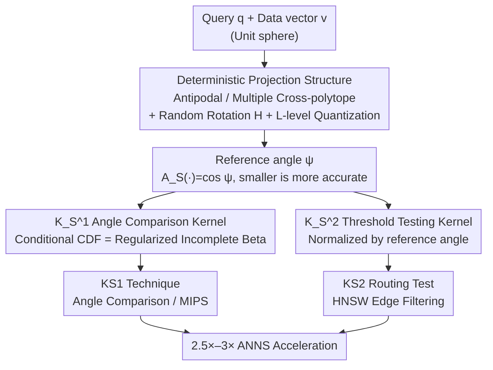

# Probabilistic Kernel Function for Fast Angle Testing

**Conference**: ICLR 2026 Oral  
**arXiv**: [2505.20274](https://arxiv.org/abs/2505.20274)  
**Code**: [GitHub](https://github.com/KejingLu-810/KS)  
**Area**: Others  
**Keywords**: Approximate Nearest Neighbor Search, Probabilistic Kernel Functions, Angle Testing, Random Projection, Similarity Search

## TL;DR

Ours investigates the angle testing problem in high-dimensional Euclidean space and proposes two deterministic probabilistic kernel functions, $K_S^1$ and $K_S^2$, based on reference angles. These are used for angle comparison and angle thresholding, respectively. Theoretical guarantees are obtained without requiring the asymptotic assumption of Gaussian distributions. The methods are applied to Approximate Nearest Neighbor Search (ANNS), achieving 2.5×–3× QPS acceleration on HNSW graphs.

## Background & Motivation

Vector similarity search is a core problem in machine learning, data mining, and information retrieval. In high-dimensional spaces, $\ell_2$ norm, cosine similarity, and inner product are the most commonly used similarity metrics, which typically reduce to calculating the angle between normalized vectors. In many practical scenarios, the exact value of the angle is not required; instead, the focus is on the relative order of angles (angle comparison) or whether an angle exceeds a threshold (angle thresholding), referred to as **angle testing**.

Existing works (e.g., CEOs, PEOs) use Gaussian distributions to generate projection vectors and rely on Lemma 1.3 (Pham, 2021) to establish the relationship between angles and projection values. However, this lemma has a significant theoretical flaw: the relationship depends on the asymptotic assumption as the number of projection vectors $m \to \infty$, failing to provide precise guarantees when $m$ is finite. Ours originates from the goal of overcoming this limitation.

The authors make two key observations: (1) Gaussian distributions are not inherently necessary; the critical factor determining estimation accuracy is the **reference angle**, i.e., the angle between the query vector and the nearest projection vector; (2) by introducing a random rotation matrix, the reference angle becomes predictable.

## Method

### Overall Architecture

The entire paper reorganizes angle testing around a core quantity—the **reference angle** $\psi$, which is the angle between the query vector and its nearest projection vector. Existing CEOs/PEOs use Gaussian random projections to establish the angle-projection relationship, but the accuracy is only guaranteed in the asymptotic limit $m \to \infty$. The two observations of Ours are: (1) Gaussian distributions are not mandatory, as the reference angle is what truly determines estimation accuracy; (2) after introducing a random rotation matrix, the reference angle depends only on the structure of the projection vectors, making it predictable and actively reducible.

Based on this, the method links the entire pipeline: "minimize the reference angle first, then solve angle testing with kernel functions." First, a set of structured deterministic projection vectors plus a random rotation $H$ are used to ensure the reference angle $\psi$ from the query/data vector to the nearest projection vector is as small as possible. Then, two deterministic kernel functions are constructed using the reference angle: $K_S^1$ solves the angle comparison problem (Problem 1.1) to determine "which data vector is closer to the query," and $K_S^2$ solves the angle thresholding problem (Problem 1.2) to determine "whether the angle is smaller than a threshold." Finally, $K_S^1$ is implemented as the KS1 projection technique (replacing CEOs), and $K_S^2$ is implemented as the KS2 routing test on similarity graphs (such as HNSW) to accelerate ANNS.

### Key Designs

**1. Deterministic Projection Structure: Replacing Random Gaussian with Smaller Reference Angles**

Since the reference angle determines kernel accuracy (Lemma 4.2/4.3: smaller reference angles lead to stronger probabilistic guarantees), it should be actively minimized. Gaussian random projection cannot achieve this—the reference vector with the maximum inner product it selects does not guarantee the minimum reference angle (the root cause of "Gaussian suboptimality"). The authors provide two deterministic configurations: the antipodal structure (Algorithm 1) generates $m/2$ random points in a subspace and adds their antipodal points; the multiple cross-polytope structure (Algorithm 2) utilizes the property that the cross-polytope has the smallest covering radius (minimum worst-case reference angle) when $m=2d$. By applying random rotations, the fixed cross-polytope is rotated into different directions to obtain $m$ vectors. Both structures ensure projection vectors are in antipodal pairs, halving the projection evaluation time and ensuring $A_S(\mathbf{v})>0$. On top of this, a multi-level product quantization-style structure is stacked: the space is sliced into $L$ subspaces, each containing $m$ projection vectors. Concatenation virtually generates $m^L$ projection vectors, exponentially reducing the reference angle with very low storage. $L$ serves as a knob for the trade-off between accuracy and efficiency.

**2. $K_S^1$ Angle Comparison Kernel: Turning Angle Comparison into a Deterministic CDF**

Angle comparison only requires judging which data vector is closer to the query. However, the angle-projection relationship provided by CEOs only holds as $m \to \infty$, with no way to estimate error when $m$ is finite. Ours defines the kernel function as $K_S^1(\mathbf{q}, \mathbf{v}) = \langle \mathbf{v}, Z_{HS}(\mathbf{q}) \rangle$, where $H$ is a random rotation matrix and $Z_{HS}(\mathbf{q})$ is the vector in the rotated projection set $HS$ that has the maximum inner product with query $\mathbf{q}$ (the reference vector). Lemma 4.2 proves that, given the reference angle $A_S(\mathbf{q})=\cos\psi$, the conditional CDF of $K_S^1$ can be precisely expressed using the regularized incomplete Beta function:

$$F_{K_S^1}\!\left(x \mid A_S(\mathbf{q}) = \cos\psi\right) = I_t\!\left(\tfrac{d-2}{2}, \tfrac{d-2}{2}\right)$$

This relationship contains no asymptotic terms and is deterministic; hence, a smaller reference angle $\psi$ leads to a stronger probabilistic guarantee. If $S$ is taken as a set of Gaussian points, $K_S^1$ degenerates to the indicator $\mathbf{v}^\top \mathbf{u}_{\max}$ used by CEOs, making $K_S^1$ a generalization of CEOs.

**3. $K_S^2$ Threshold Testing Kernel: Angle-Sensitive Criterion via Reference Angle Normalization**

Threshold testing answers whether an angle crosses a certain bound $\theta$. Although PEOs can perform this, they do not utilize reference angle information, resulting in loose criteria. Ours defines $K_S^2(\mathbf{q}, \mathbf{v}) = \langle H\mathbf{q}, Z_S(H\mathbf{v}) \rangle / A_S(H\mathbf{v})$. The key is the normalization by dividing by the reference vector inner product $A_S(H\mathbf{v})=\cos\psi$. Lemma 4.3 proves that the resulting $K_S^2$ is an **angle-sensitive function** (analogous to the locality sensitivity of LSH, but without introducing an approximation ratio $c$ because the threshold $\theta$ is explicitly given). It satisfies the probabilistic guarantees required by Problem 1.2 ($\epsilon_1=0.5$, $\epsilon_2<0.5$). Normalization explicitly injects reference angle information into the criterion, making the threshold decision tighter for the same confidence level.

**4. KS2 Routing Test: Applying the Kernel to Edge Filtering in Graph Search**

Integrating $K_S^2$ into the routing decision of similarity graphs (like HNSW) yields a concise test inequality:

$$\sum_{i=1}^L \mathbf{q}_i^\top \mathbf{u}_{e[i]}^i \geq A_S(\mathbf{e}) \cdot \dfrac{\|\mathbf{w}\|^2/2 - \tau - \mathbf{v}^\top\mathbf{q}}{\|\mathbf{e}\|}$$

This is used to determine whether an edge is worth traversing before expanding a neighbor (corresponding to the $(\delta,1-\epsilon)$ routing test in PEOs; Ours provides a $(\delta,0.5)$ routing test). Compared to PEOs, this inequality has a simpler form, faster single evaluation, and requires fewer stored scalars, leading to smaller indices (approx. 5% smaller than HNSW+PEOs in experiments). It is also naturally suited for SIMD to parallelize the screening of 16 edges simultaneously.

### Loss & Training

Ours does not involve neural network training; the only optimization is for the projection vector configuration $S$ itself. The objective is to maximize the coverage effect $J(S) = \mathbb{E}_{\mathbf{v} \in U(\mathbb{S}^{d-1})}\!\left[A_S(\mathbf{v})\right]$, which is the average reference angle cosine for random directions on the unit sphere (larger values indicate smaller reference angles and higher accuracy). Since the optimal configuration (related to the best covering problem) is generally hard to solve, an approximate value $\tilde{J}(S,N)$ calculated using $N$ uniformly sampled points is used in practice to evaluate and select configurations.

## Key Experimental Results

### Main Results (ANNS Performance Comparison)

| Dataset | Metric (QPS@Recall=90%) | HNSW+KS2 | HNSW+PEOs | HNSW | Gain |
|--------|----------------------|----------|-----------|------|-----------|
| SIFT | QPS | Best | Second | Baseline | **2.5×–3× vs HNSW** |
| GloVe1M | QPS | Best | Second | Baseline | **10%–30% vs PEOs** |
| GloVe2M | QPS | Best | Second | Baseline | 1.1–1.3× vs PEOs |
| Tiny | QPS | Best | Second | Baseline | Significantly better than HNSW and ScaNN |
| GIST | QPS | Best | Second | Baseline | Significantly better than HNSW |

### Ablation Study (KS1 vs CEOs, $k$-MIPS, $k=10$, $m=2048$)

| Config | Word Probe@1K | GloVe1M Probe@1K | Description |
|------|-------------|-----------------|------|
| CEOs(2048) | 90.203% | 24.166% | Gaussian random projection baseline |
| KS1($S_{sym}$) | 90.265% | 24.456% | Antipodal structure, slight improvement |
| KS1($S_{pol}$) | 90.678% | 24.556% | Multiple cross-polytope, optimal |

### Key Findings

- Smaller reference angles lead to higher kernel accuracy—this is the core insight throughout the paper.
- Gaussian distributions are not the optimal choice for projection vectors; deterministic structures (especially cross-polytopes) provide smaller reference angles.
- HNSW+KS2 achieves the best search performance when the subspace dimension $d' = d/L \approx 16$.
- The index size of KS2 is approximately 5% smaller than that of PEOs, and the test inequality is simpler and faster to evaluate.
- The improvement of KS1 over CEOs is relatively small (approx. 0.8%), as the difference lies solely in the distribution of projection vectors.

## Highlights & Insights

- **Theoretical Contribution**: Established a deterministic probabilistic relationship (Eq. 4) that does not depend on asymptotic assumptions, representing a fundamental improvement over existing theory (Lemma 1.3).
- **Practical Impact**: Achieving 2.5×–3× acceleration in ANNS with HNSW+KS2 provides direct practical value.
- **Gaussian Suboptimality**: Both theory and experiments demonstrate that Gaussian projection is not optimal for angle testing, challenging a common assumption in the field of random projection.
- **SIMD Friendly**: The KS2 test can process 16 edges in parallel via SIMD, enabling efficient hardware-level optimization.

## Limitations & Future Work

- The improvement of KS1 over CEOs is limited; the practical gains are primarily reflected in the graph search acceleration of KS2.
- The best covering problem remains open in the general case; no optimal solutions are known for $m > d+3$.
- Experiments were conducted only on CPUs; performance in GPU acceleration scenarios remains to be verified.
- Theoretical analysis focuses on Euclidean space and cosine similarity; generalizations to other metric spaces have not yet been discussed.

## Related Work & Insights

- CEOs (Pham, 2021): $K_S^1$ in Ours can be seen as a generalization of CEOs, replacing Gaussian asymptotic relations with deterministic reference angles.
- PEOs (Lu et al., 2024): $K_S^2$ adds reference angle normalization upon PEOs and simplifies the test inequality.
- Falconn (Andoni et al., 2015): Uses cross-polytopes for LSH; Ours borrows the structural idea but applies it to a different purpose.
- Insight: As the key factor controlling accuracy, the reference angle may play a similar role in other random projection applications (e.g., dimensionality reduction, sketching algorithms).

## Rating

- Novelty: ⭐⭐⭐⭐ The reference angle perspective is novel, and replacing asymptotic relations with deterministic ones is a significant theoretical advancement.
- Experimental Thoroughness: ⭐⭐⭐⭐ Comprehensive coverage across 6 datasets, thorough comparison with SOTA, and complete ablation studies.
- Writing Quality: ⭐⭐⭐⭐ Rigorous theoretical derivation, though several symbols are used; some definitions are scattered between the main text and appendices.
- Value: ⭐⭐⭐⭐ Substantial contribution to the ANNS field; 2.5×–3× acceleration has direct application value.

<!-- RELATED:START -->

## Related Papers

- [\[ICML 2026\] New Bounds for Kernel Sums via Fast Spherical Embeddings](../../ICML2026/others/new_bounds_for_kernel_sums_via_fast_spherical_embeddings.md)
- [\[ICLR 2026\] Characterizing and Optimizing the Spatial Kernel of Multi Resolution Hash Encodings](characterizing_and_optimizing_the_spatial_kernel_of_multi_resolution_hash_encodi.md)
- [\[ICLR 2026\] An Information-Theoretic Framework For Optimizing Experimental Design To Distinguish Probabilistic Neural Codes](an_information-theoretic_framework_for_optimizing_experimental_design_to_disting.md)
- [\[ICLR 2026\] Predicting Kernel Regression Learning Curves from Only Raw Data Statistics](predicting_kernel_regression_learning_curves_from_only_raw_data_statistics.md)
- [\[ICLR 2026\] Improving Set Function Approximation with Quasi-Arithmetic Neural Networks](improving_set_function_approximation_with_quasi-arithmetic_neural_networks.md)

<!-- RELATED:END -->
