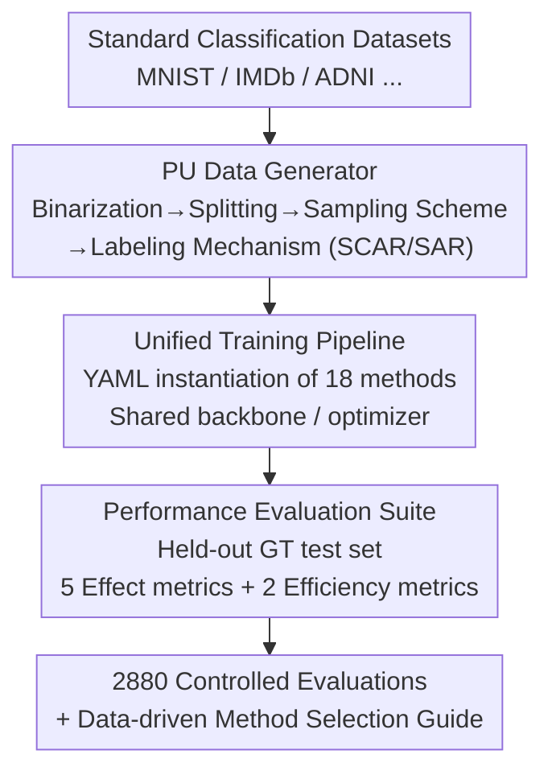

# PU-Bench: A Unified Benchmark for Rigorously Reproducible PU Learning

**Conference**: ICLR 2026  
**OpenReview**: [https://openreview.net/forum?id=tb8DabMbMq](https://openreview.net/forum?id=tb8DabMbMq)  
**Code**: https://github.com/XiXiphus/PU-Bench  
**Area**: Representation Learning / Semi-supervised Learning / Benchmarking  
**Keywords**: PU learning, Positive-Unlabeled, Benchmark, Reproducibility, Selection Bias

## TL;DR
PU-Bench is the first unified open-source PU (Positive-Unlabeled) learning benchmark. Utilizing a configurable data generator, a unified training pipeline, and a standardized evaluation suite, it re-evaluates 18 representative methods across 8 datasets with 2,880 controlled experiments. It reveals conclusions previously obscured by inconsistent experimental settings, such as "no universal winner," the continued competitiveness of the simple nnPU baseline, and a clear trade-off between performance and efficiency.

## Background & Motivation
**Background**: PU learning addresses a specific binary classification problem where training data contains only a subset of labeled positive examples, while the "unlabeled" set consists of both unidentified positive examples and actual negative examples. It is common in scenarios where "negative examples are difficult or expensive to label," such as recommendation systems (users' likes are known, dislikes are not), disease gene identification, drug interaction prediction, document retrieval, and medical imaging. Numerous algorithms have emerged, ranging from risk minimization (nnPU, Dist-PU) to pseudo-labeling/self-training (Self-PU, P3Mix) and generative distribution matching (VAE-PU, PAN).

**Limitations of Prior Work**: Despite the proliferation of algorithms, there is no standardized, unified, and comprehensive benchmark for fair comparison. This leads to two critical issues. First, experimental settings are highly inconsistent: different papers use different datasets, data sampling schemes (single-training set "ss" vs. case-control "cc"), and labeling assumptions (SCAR vs. SAR), making results incomparable. Second, PU methods are extremely sensitive to empirical factors (labeling frequency, labeling mechanism). The authors find that variations in these factors are sufficient to overturn the relative rankings of SOTA methods—and since these were not unified in prior work, many published comparisons may not reflect the true capabilities of the methods.

**Key Challenge**: The performance of PU methods depends heavily on the implicit settings of data generation and labeling, which are often the most non-transparent parts of individual papers. Consequently, determining "which is stronger" becomes a pseudo-proposition dominated by experimental configurations.

**Goal**: Standardize the entire chain of "data generation, model training, and metric calculation" to establish the comparison of PU methods on a controlled and reproducible foundation for the first time.

**Key Insight**: Instead of inventing new algorithms, this work constructs a unified benchmark—using a configurable PU data generator to fix input distributions, a configuration-driven training pipeline to eliminate confounding variables, and a unified evaluation suite to simultaneously quantify effectiveness and efficiency. The goal is to conduct the largest empirical scan to date and map the true performance landscape masked by noise.

## Method

### Overall Architecture
PU-Bench is not a single model but a modular, configuration-driven evaluation framework designed to standardize PU learning experiments from input to output. It integrates three interoperable core components into a pipeline: **Stage 1 (PU Data Generator)** systematically converts standard classification datasets into reproducible PU scenarios (binarization → splitting → sampling scheme selection → labeling mechanism selection); **Stage 2 (Unified Training Pipeline)** instantiates all 18 methods using external YAML descriptors, training them under the same backbone, optimizer, and scheduling policies to eliminate confounding variables; **Stage 3 (Performance Evaluation Suite)** uniformly calculates 5 effectiveness metrics and 2 efficiency metrics on a held-out test set with ground truth, archiving configurations, seeds, metric trajectories, and hardware info for full reproducibility. The experiments cover 8 datasets × 18 methods × 20 configurations per pair, totaling 2,880 controlled evaluations.

### Key Designs

**1. PU Data Generator: Eliminating "Data Generation Inconsistency" via a Configurable Pipeline**

Prior papers constructed PU data in various ways—differing in positive set size, unlabeled distribution assumptions, and sampling designs—which is the root of incomparability. The generator standardizes this into a multi-stage pipeline: a binarization module collapses multi-class datasets into positive-negative (PN) classes, followed by training/val/test splitting with fixed total $N$ and class prior $\pi = p(Y=1)$. A **sampling scheme** then determines the source of labeled positives $L_P$: single-training set (ss) samples from the population i.i.d. where only positives have a chance to be labeled; case-control (cc) samples $L_P$ from $p(x\mid Y=1)$ and the unlabeled set from $p(x)$. Finally, the **labeling frequency** $c$ controls the amount of $L_P$, and the **labeling mechanism** defines the selection strategy. Four mechanisms are supported: (S1) standard SCAR, where each positive has a constant labeling probability $e(x)=c$; (S2)(S3) two SAR instance-dependent samplings favoring high-posterior or boundary-vague positives; (S4) a posterior sharpening strategy for deterministic selection of high-scoring positives. This turns "sampling scheme × labeling frequency × labeling mechanism" into combinatorial knobs.

**2. Unified Training Pipeline: Nullifying "Experimental Protocol Confounding Variables" via YAML**

Disparate training protocols, hyperparameter searches, and metric choices prevent the aggregation of conclusions. This layer uses a modular, config-driven framework: all 18 algorithms are instantiated from external YAML descriptors specifying the backbone, PU loss function, and shared hyperparameters (optimizer type, learning rate schedule, weight initialization). The framework supports multi-modality via specialized encoders for text, image, and tabular data. The unified trainer handles forward/backward passes, loss computation, and checkpointing. Changing a method or hyperparameter is as simple as modifying a YAML file, ensuring all methods are evaluated under the same structural backbone.

**3. Performance Evaluation Suite: Joint Quantification of "Effectiveness and Efficiency"**

Inconsistent reporting in literature masks both the fairness of cross-method comparisons and the actual trade-offs of different solutions. This suite mandates that all metrics be calculated on a held-out ground-truth test set. Effectiveness records 5 metrics: Accuracy (Acc), Precision, Recall, macro-F1, and Area Under the ROC Curve (AUC). Efficiency records wall-clock time per epoch and peak GPU VRAM. Every time a new best macro-F1 is achieved on the validation set, a checkpoint is saved, and exhaustive logs are archived. This dual focus on "effectiveness + efficiency" provides practical trade-off insights, such as identifying methods that consume 7-8 GB of VRAM for negligible gains in F1.

### Loss & Training
As a benchmark, PU-Bench does not propose new losses but organizes the 18 methods into three categories: **Risk Minimization Estimators** (minimizing empirical risk under PU constraints, e.g., nnPU, PUSB, VPU, Dist-PU); **Disambiguation-guided Supervised ERM** (resolving unlabeled pool ambiguity via pseudo-labeling or proxy negatives, often using mixup or consistency regularization, e.g., Self-PU, P3Mix, Robust-PU); and **Generative Distribution Matching** (aligning positive and unlabeled distributions via generative or adversarial modeling, e.g., PAN, VAE-PU, CGenPU). Main experiments use the "conventional" setting: case-control sampling, SCAR labeling, and fixed $c=0.1$. Two-sided paired t-tests with Holm–Bonferroni correction are applied relative to nnPU.

## Key Experimental Results

### Main Results
The main table (conventional configuration: cc + SCAR + $c=0.1$) presents the accuracy of all 18 methods across 8 datasets, with PN (fully supervised oracle) as the performance upper bound. Selected representative figures (Accuracy %):

| Method | Category | MNIST | F-MNIST | CIFAR-10 | ADNI |
|------|------|--------|---------|----------|------|
| nnPU | Risk Minimization | 94.85 | 96.67 | 85.30 | 65.75 |
| LBE-PU | Risk Minimization | 97.23 | 98.42 | 83.98 | 65.75 |
| Dist-PU | Risk Minimization | 95.70 | 95.31 | 88.09 | 75.02 |
| P3Mix-C | Disambiguation ERM | 95.23 | 96.53 | 87.65 | 67.69 |
| LaGAM-PU | Disambiguation ERM | 95.03 | 97.69 | 86.22 | 63.64 |
| VAE-PU | Generative Matching | 76.56 | 61.29 | 49.24 | 50.38 |
| **PN (oracle)** | Supervised | 96.54 | 98.94 | 94.88 | 82.01 |

LBE-PU approaches or exceeds fully supervised PN on simple images (MNIST/F-MNIST) but degrades significantly on complex ADNI data. Generative methods generally underperform, with VAE-PU achieving only 49.24% on CIFAR-10 (near random).

### Ablation Study
Rather than traditional module ablation, this work performs a robustness scan across "configuration dimensions":

| Dimension | Configuration | Key Finding |
|---------|------|----------|
| Labeling Frequency $c$ | $0.01 \to 0.9$ | Risk Minimization and Disambiguation ERM show high labeling efficiency (saturating at $c<0.1$); generative methods show erratic curves and poor scaling. |
| Labeling Mechanism | SCAR → S2/S3/S4 (SAR) | Switching to SAR causes universal degradation. Bias-aware methods like PUSB and LBE-PU show stronger resistance at low labeling rates ($c=0.05$). |
| Efficiency | Time / VRAM | nnPU and PUSB complete epochs in seconds with <1 GB VRAM. VAE-PU requires 7-8 GB. Multi-stage architectures like PUL-CPBF and Holistic-PU are most time-consuming. |

### Key Findings
- **No Universal Winner**: The optimal method depends heavily on data modality—LBE-PU excels on simple images but fails on ADNI; VPU/P3Mix are more stable across modalities but rarely dominate.
- **nnPU Baseline Remains Competitive**: Despite its simplicity, nnPU maintains balanced performance across modalities and often outperforms newer methods, suggesting some early principles remain the most robust. New methods should benchmark against nnPU/VPU.
- **Clear Effectiveness-Efficiency Trade-off**: VPU, Self-PU, and Dist-PU achieve a good balance of high F1, short training, and low VRAM; whereas Holistic-PU, VAE-PU, and PUL-CPBF are computationally expensive with lower or unstable F1.
- **Bias-aware Benefits Peak in Low-Labeling Zones**: When labels are sufficient ($c=0.5$), robust SCAR learners (e.g., VPU) can surpass specialized SAR methods, indicating a critical interaction between labeling frequency and selection bias.

## Highlights & Insights
- **Benchmarking as a Contribution**: The authors recognized that the bottleneck in PU learning is the "inconsistency of the experimental foundation." The 2880 controlled evaluations reveal true rankings previously masked by noise.
- **Configurable Generator is Reusable**: The "sampling × frequency × mechanism" knob design is transferable to other weak supervision fields (e.g., learning with noise, semi-supervised learning).
- **Joint Evaluation Hits the Blind Spot**: While most PU papers only report F1/AUC, PU-Bench exposes methods that trade excessive VRAM for marginal F1 gains by reporting time and peak memory consumption.

## Limitations & Future Work
- The main experiments focus on "conventional" configurations. More extreme real-world constraints (extreme sparsity + heavy selection bias) still expose the vulnerability of most methods.
- The 18 selected methods are limited to those that are "domain-agnostic + publicly implemented," excluding methods without available code. Method sets need continuous updates.
- The class prior $\pi$ is treated as a known/fixed quantity in the benchmark, whereas estimating $\pi$ is a core difficulty in real-world PU learning; this dimension's robustness was not systematically scanned.
- Future work aims for more rigorous standardization protocols and the design of methods naturally robust to extremely limited and biased supervision.

## Related Work & Insights
- **vs. Individual PU Papers**: These papers claim SOTA under self-selected settings. This work demonstrates that many SOTA claims do not hold up under controlled comparisons, favoring simpler baselines.
- **vs. Unified Benchmarks in Other Fields**: While the goal is similar (standardizing inputs and protocols), the challenge in PU learning lies in the input itself being defined by sampling/labeling schemes. The core innovation is the configurable PU data generator.
- **Inspiration**: For any weak supervision area, creating a data generator that turns hidden assumptions into adjustable knobs is often more impactful than inventing a new algorithm.

## Rating
- Novelty: ⭐⭐⭐⭐ Innovation lies in the foundation rather than the algorithm. The "first unified PU benchmark + configurable generator" is a high-value infrastructure contribution.
- Experimental Thoroughness: ⭐⭐⭐⭐⭐ 2,880 controlled evaluations with t-tests, efficiency analysis, and dual robustness scans (label frequency and bias).
- Writing Quality: ⭐⭐⭐⭐ Clear structure, well-summarized findings (profiles of method categories + practical selection guides), and high-density tables/figures.
- Value: ⭐⭐⭐⭐⭐ The open-source toolkit and data-driven selection advice provide a solid foundation for the PU learning community.

<!-- RELATED:START -->

## Related Papers

- [\[CVPR 2026\] PAI-Bench: A Comprehensive Benchmark For Physical AI](../../CVPR2026/others/pai-bench_a_comprehensive_benchmark_for_physical_ai.md)
- [\[CVPR 2026\] WiTTA-Bench: Benchmarking Test-Time Adaptation for WiFi Sensing](../../CVPR2026/others/witta-bench_benchmarking_test-time_adaptation_for_wifi_sensing.md)
- [\[ICML 2026\] iWorld-Bench: A Benchmark for Interactive World Models with a Unified Action Generation Framework](../../ICML2026/others/iworld-bench_a_benchmark_for_interactive_world_models_with_a_unified_action_gene.md)
- [\[NeurIPS 2025\] RDB2G-Bench: A Comprehensive Benchmark for Automatic Graph Modeling of Relational Databases](../../NeurIPS2025/others/rdb2g-bench_a_comprehensive_benchmark_for_automatic_graph_modeling_of_relational.md)
- [\[ICLR 2026\] Measuring Uncertainty Calibration](measuring_uncertainty_calibration.md)

<!-- RELATED:END -->
