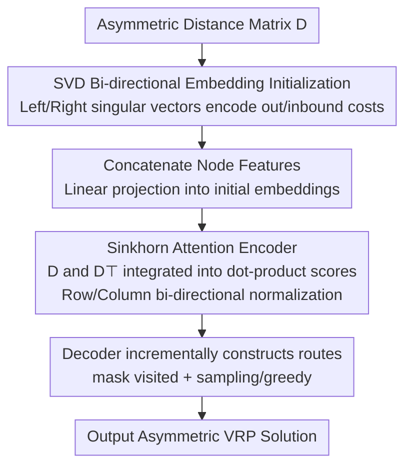

# RADAR: Learning to Route with Asymmetry-aware Distance Representations

**Conference**: ICLR 2026  
**OpenReview**: [https://openreview.net/forum?id=lWdxX5s9T1](https://openreview.net/forum?id=lWdxX5s9T1)  
**Code**: https://github.com/yihang0410/RADAR  
**Area**: Neural Combinatorial Optimization / Vehicle Routing Problem  
**Keywords**: Asymmetric VRP, Neural Solver, SVD Initialization, Sinkhorn Normalization, Generalization

## TL;DR
RADAR equips existing neural VRP solvers with a pair of "asymmetry-aware" components—using truncated SVD to decompose asymmetric distance matrices into "departure/arrival" dual-role node embeddings for initialization, and replacing the softmax in the encoder's attention with Sinkhorn normalization (balancing rows and columns). This allows solvers originally limited to symmetric Euclidean distances to generalize stably on real-world asymmetric road networks (e.g., one-way streets, directional congestion), consistently outperforming strong baselines like MatNet, ICAM, and RRNCO across 17 synthetic and 3 real-world VRP variants.

## Background & Motivation
**Background**: Neural Combinatorial Optimization (NCO) has recently utilized deep learning to train data-driven VRP solvers. "Constructive" solvers (AM, POMO, MatNet, RouteFinder, etc.) are mainstream—they mimic human route planning by selecting the next node based on the current partial solution, offering high efficiency and small optimality gaps.

**Limitations of Prior Work**: However, the vast majority of neural solvers assume **symmetric Euclidean distance**, with node coordinates as input. In reality, travel costs are influenced by road network topology, traffic directionality, and physical barriers, leading to **asymmetric** cases like one-way streets and time-variant congestion. Furthermore, often only pairwise asymmetric distance matrices are available, without coordinates. This causes coordinate-driven solvers to fail, representing a major bottleneck for the deployment of NCO.

**Key Challenge**: The key to enabling solvers to process asymmetric matrices lies in encoding the **relational structure** of the matrix into node representations, which is inherently difficult. Asymmetric costs are defined on **edges** ($D_{i,j}\neq D_{j,i}$), while mainstream architectures operate on **node-level** representations. In Euclidean settings, coordinates provide a geometric scaffold to fully recover distance structures, but asymmetric matrices lack this geometric prior, making directional patterns harder to learn. Previous attempts to directly encode matrices (e.g., MatNet's one-hot) either resulted in non-compact embeddings or suffered from generalization collapse when sizes changed.

**Goal**: The authors aim to conquer asymmetry at two levels: **static asymmetry** (directional differences in the input distance matrix itself, primarily addressed during initialization) and **dynamic asymmetry** (emergent interaction differences across encoder attention layers where $i\!\to\!j$ does not equal $j\!\to\!i$).

**Key Insight**: Existing softmax attention is **row-normalized**, meaning $A_{i,j}$ only aggregates information from the neighborhood of node $i$, while remaining "blind" to the relationship between $j$ and other nodes in the graph. This is not an issue in symmetric Euclidean settings (where coordinates imply the full graph), but it severely limits the characterization of global directional dependencies in asymmetric settings.

**Core Idea**: For the static side, SVD is used to decompose the distance matrix into left/right singular vectors, yielding compact node embeddings that simultaneously encode "source" and "sink" roles. For the dynamic side, Sinkhorn bi-directional normalization replaces softmax, forcing attention to be balanced across both rows and columns, ensuring each attention head understands the neighborhoods of both $i$ and $j$.

## Method

### Overall Architecture
RADAR is not a solver built from scratch but rather **integrates two patches** into existing constructive neural solvers to provide asymmetric input processing capabilities. The pipeline is: Input an asymmetric distance matrix $D\in\mathbb{R}^{n\times n}$ → Perform truncated SVD on $D$ to obtain bi-directional distance features → Concatenate with node features (e.g., demand) and linearly project into initial embeddings → Pass through a 5-layer encoder (each layer containing multi-head attention + two Add&Norm + Feed-forward), where attention incorporates $D$ and $D^\top$ into dot-product scores and uses Sinkhorn normalization to form doubly stochastic attention → The decoder incrementally masks visited nodes and samples or greedily selects the next node until a tour is formed. The two core patches correspond to the two types of asymmetry: SVD initialization handles **static asymmetry**, and Sinkhorn attention handles **dynamic asymmetry**.

### Key Designs

**1. SVD Bi-directional Embedding Initialization: Converting edge-level asymmetry into node-level "out/inbound" dual-role embeddings**

This addresses the pain point: asymmetric costs are defined on edges, but the architecture consumes node embeddings. If all node initial embeddings are identical, the attention output would be a convex combination of identical value vectors, preventing the model from learning anything. The authors propose a formal objective—**Asymmetry-aware Embedding (Definition 1)**: An embedding matrix $X\in\mathbb{R}^{n\times k}$ is said to "perceive" the static asymmetry of $D$ if there exist two **different** linear transformations $W_1, W_2$ such that $\lVert XW_1(XW_2)^\top - D\rVert_F^2\approx 0$. This bilinear form $XW_1(XW_2)^\top$ deliberately mimics the $QK^\top$ of attention, and $W_1\neq W_2$ is required to generate an asymmetric interaction matrix.

The construction method involves truncated SVD on $D$: $D\approx U_k\Sigma_k V_k^\top$, where the **rows of $D$ correspond to source nodes and columns to arrival nodes**. Thus, left and right singular vectors are used, each carrying half of the singular values, to form distance features:

$$X_L = U_k\sqrt{\Sigma_k},\quad X_R = V_k\sqrt{\Sigma_k},\quad X=[X_L \mid X_R]\in\mathbb{R}^{n\times 2k}.$$

Setting $W_1=[I_k\mid 0]^\top$ and $W_2=[0\mid I_k]^\top$ yields $XW_1(XW_2)^\top=U_k\Sigma_k V_k^\top\approx D$, theoretically ensuring that a single embedding matrix captures static asymmetry. The implementation (Algorithm 1) also normalizes $D$ as $(D-\mu)/\sigma$ before low-rank SVD. Compared to previous "top-k nearest neighbor distances as node features" (ICAM, RRNCO), which are merely raw distance stacks of local neighborhoods that miss global topology and tie embedding dimensions to $n$, SVD provides a compact, size-decoupled representation that preserves global directionality. Empirical tests show **top-10** singular values preserve ~85% of matrix info; this value is fixed to balance in-distribution performance and large-scale generalization.

**2. Sinkhorn Normalization Attention: Enabling each attention head to perceive global neighborhoods of both sender and receiver**

This addresses the pain point: existing methods use **row softmax** after integrating distance signals into similarity, meaning $A_{i,j}$ only perceives the neighborhood of $i$ ($D_{i,:}, D_{:,i}$) and remains ignorant of $j$’s relationship to the whole graph. RADAR replaces row softmax with **Sinkhorn normalization**: after exponentiating the distance-aware similarity scores, it iteratively alternates between column and row normalization for $T$ steps (main experiments use $T=10$, see Algorithm 2), converging to a **doubly stochastic matrix** (rows and columns sum to 1).

$$A_{i,:}=\mathrm{Softmax}\big([\mathrm{Sim}(X_i,X_j,D_{i,j},D_{j,i})]_{j=1}^N\big)\ \Longrightarrow\ A=\mathrm{Sinkhorn}\big(\exp(\mathrm{Sim})\big).$$

The doubly stochastic constraint forces balanced bi-directional flow: each $A_{i,j}$ no longer reflects only the local context of $i$, but also incorporates the complete distance relationships of both $i$ and $j$. This "dynamic" aspect is reflected in its application across every encoder layer, evolving with the context and depth. Ablations show that the gains from Sinkhorn are even more prominent than SVD, and comparison of the first and last 10 epochs on ATSP100 indicates **faster convergence** and better final values.

### Loss & Training
RADAR follows the standard REINFORCE-style training paradigm for constructive neural solvers. It is trained on size-100 instances and performs **zero-shot generalization** to sizes 200/500/1000 (without fine-tuning). In multi-task settings, it is integrated into the RouteFinder framework and trained jointly on 16 asymmetric VRP variants. The SVD step uses GPU-accelerated randomized truncated SVD, supporting batches; end-to-end runtime grows smoothly with scale, and the SVD proportion decreases as size increases. Sinkhorn iterations $T=10$ with a GPU batched implementation keep overhead modest. All experiments were conducted on a single RTX 3090 (24GB).

## Key Experimental Results

### Main Results (Synthetic ATSP / ACVRP, trained on size-100 zero-shot generalization)

| Task | Method | Obj. | Gap |
|------|------|------|-----|
| ATSP100 | RADAR | **1.5756** | **0.72%** |
| ATSP100 | ReLD | 1.5900 | 1.64% |
| ATSP100 | ELG | 1.5982 | 2.17% |
| ATSP1000 | RADAR | **1.6389** | **4.13%** |
| ATSP1000 | ELG | 1.8441 | 17.17% |
| ATSP1000 | ICAM | 2.9069 | 84.69% |
| ACVRP200 | RADAR | **2.1483** | **-0.75%** |
| ACVRP1000 | RADAR | **2.4634** | **0.96%** |

RADAR achieves the lowest gap among all learning-based methods, maintaining a small gap as scale increases to 1000 (only 4.13% for ATSP1000, whereas ICAM surges to 84.69%); it even outperforms LKH on ACVRP200. On real-world datasets (ATSP/ACVRP/ACVRPTW from RRNCO), RADAR comprehensively outperforms MatNet and RRNCO across in-distribution and two types of OOD (city / cluster), e.g., real ATSP in-distribution gap 0.74% vs RRNCO's 1.80%. In the 16-variant multi-task setting, the average gap is 1.33%, lower than RF-NN (1.99%) and RF (2.47%).

### Ablation Study (ATSP, SVD × Sinkhorn)

| SVD | Sinkhorn | ATSP100 Gap | ATSP1000 Gap |
|-----|----------|-------------|--------------|
| ✗ | ✗ | 2.08% | 38.64% |
| ✓ | ✗ | 1.82% | 22.89% |
| ✗ | ✓ | 1.19% | 7.24% |
| ✓ | ✓ | **0.72%** | **4.13%** |

### Key Findings
- **Sinkhorn's individual contribution is greater than SVD**: On ATSP1000, adding only SVD reduces the gap from 38.64% to 22.89%, while adding only Sinkhorn drops it to 7.24%; the combination reaches 4.13%—dynamic asymmetry modeling is particularly critical for large-scale generalization.
- **Coordinates are nearly useless for asymmetric tasks**: Even without coordinates (w/o coords, ATSP100 gap 1.49%), RADAR outperforms RRNCO with coordinate augmentation (1.80%), indicating SVD distance embeddings capture the structural info. Coordinates mainly serve to support data augmentation and improve diversity.
- **Robustness against asymmetry intensity**: As asymmetry intensity ($\sigma=0.1/0.2/0.3$) increases, all methods degrade, but RADAR degrades most slowly and remains optimal at all levels; at High Asymmetry with 100 nodes, MatNet's relative gap reaches 24.04%, while RADAR is the baseline.
- **Larger $k$ improves in-distribution but hurts generalization**: RADAR remains stable at low cost, hence $k=10$ is fixed. SVD also outperforms EVD/MDS/QR/RA, as it best fits the asymmetric structure of distance matrices.

## Highlights & Insights
- **Decomposing "static vs. dynamic asymmetry" into two orthogonal patches** targeted at initialization and attention—the two locations most needing asymmetry handling—leads to a clean approach that is plug-and-play for existing solvers (compatible with POMO, RouteFinder, etc.).
- **Naturally mapping the "departure/arrival" dual roles to SVD's left/right singular vectors**, supported by the bilinear reconstructability criterion in Definition 1, formalizes whether an embedding perceives asymmetry. This is a recipe transferable to other edge-feature-centric combinatorial optimization problems.
- **Sinkhorn doubly stochastic attention** is a clever transfer: porting the row-column balance constraint from optimal transport to attention perfectly addresses the "row-only" blind spot of softmax and results in faster convergence.
- The counter-intuitive finding that "coordinates provide only augmentation value in asymmetric tasks" offers valuable insights for input representation choices in the NCO community.

## Limitations & Future Work
- Positioned as "patches for existing constructive solvers," its performance ceiling is still constrained by the base solver's architecture.
- SVD initialization is deterministic, which causes POMO-style augmentation to fail in "w/o coords" settings (outputting a single unique solution per instance), limiting diversity sources.
- Using $k=10$ in truncated SVD is a compromise for in/out-of-distribution performance; whether 85% info retention is sufficient for extremely high-dimensional or extreme asymmetry remains a question.
- The authors suggest two directions: extending SVD initialization to a broader range of edge-feature-centric CO problems (improving cold-start quality); and combining with improvement-based heuristics/search solvers, where RADAR provides asymmetric, cost-aware priors to guide neighborhood selection and move acceptance.

## Related Work & Insights
- **vs MatNet / UniCO**: These use one-hot or pseudo-one-hot for "uninformed initialization," providing discriminative signals to nodes without semantics, and tying the number of nodes to the embedding dimension (causing generalization failure at N=500/1000). RADAR uses SVD for "informed initialization" derived from the matrix structure.
- **vs ICAM / RRNCO**: These use top-k nearest neighbors or distance sampling for "informed initialization," but raw distances fail to capture global topology and are entangled with size. RADAR's SVD embeddings are compact, size-decoupled, generalize better, and do not rely on coordinates.
- **vs standard distance-aware attention (MatNet etc.)**: These integrate distance into similarity but still use row softmax, perceiving only one-sided neighborhoods. RADAR’s Sinkhorn normalization ensures the attention understands global neighborhoods of both sender and receiver.

## Rating
- Novelty: ⭐⭐⭐⭐ Combining SVD bi-directional embeddings + Sinkhorn doubly stochastic attention for asymmetric VRP is clear and formally supported.
- Experimental Thoroughness: ⭐⭐⭐⭐⭐ 17 synthetic + 3 real variants, multi-task, various asymmetry intensities, multi-dimensional ablations on coordinates/initialization/decomposition; very comprehensive.
- Writing Quality: ⭐⭐⭐⭐ The dual narrative of static/dynamic asymmetry is clear; Definition 1 and SVD derivation are self-consistent.
- Value: ⭐⭐⭐⭐ Plug-and-play, directly addresses the asymmetry bottleneck in NCO deployment, highly practical.

<!-- RELATED:START -->

## Related Papers

- [\[ICLR 2026\] Learning Distributions over Permutations and Rankings with Factorized Representations](learning_distributions_over_permutations_and_rankings_with_factorized_representa.md)
- [\[CVPR 2026\] RaUF: Learning the Spatial Uncertainty Field of Radar](../../CVPR2026/others/rauf_learning_the_spatial_uncertainty_field_of_radar.md)
- [\[ICLR 2026\] Mixed-Curvature Tree-Sliced Wasserstein Distance](mixed-curvature_tree-sliced_wasserstein_distance.md)
- [\[ICML 2026\] Continual Learning of Domain-Invariant Representations](../../ICML2026/others/continual_learning_of_domain-invariant_representations.md)
- [\[ICML 2026\] DISCO: Mitigating Bias in Deep Learning with Conditional Distance Correlation](../../ICML2026/others/disco_mitigating_bias_in_deep_learning_with_conditional_distance_correlation.md)

<!-- RELATED:END -->
