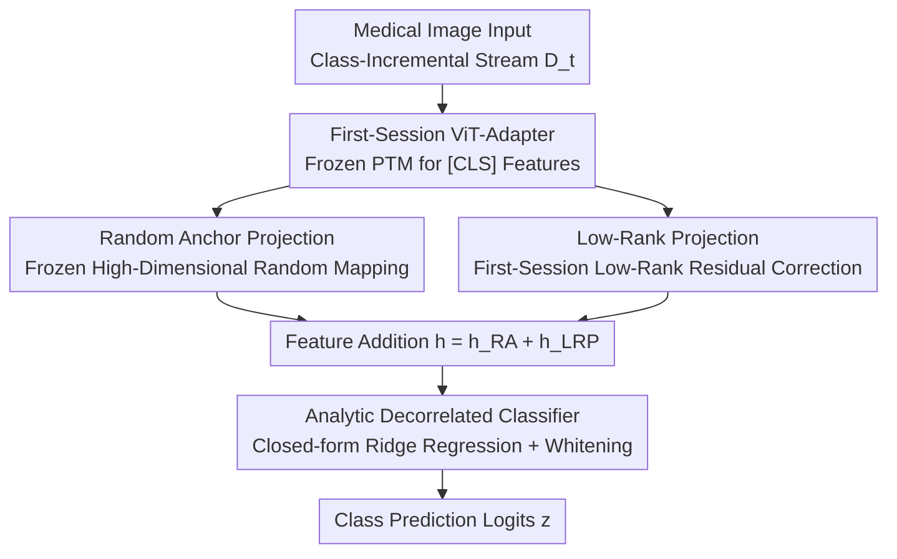

# Random Anchors with Low-rank Decorrelated Learning: A Minimalist Pipeline for Class-Incremental Medical Image Classification

**Conference**: ICLR2026  
**OpenReview**: [https://openreview.net/forum?id=mduCc7XKXH](https://openreview.net/forum?id=mduCc7XKXH)  
**Code**: [https://github.com/CUHK-BMEAI/RA-LDL](https://github.com/CUHK-BMEAI/RA-LDL)  
**Area**: Continual Learning / Medical Imaging / Class-Incremental Learning  
**Keywords**: Class-Incremental Learning, Pre-trained Models, Representation Calibration, Analytic Classifier, Medical Imaging

## TL;DR
For medical image class-incremental learning, this paper proposes RA-LDL: using "frozen random anchors + first-session low-rank residuals" to calibrate pre-trained features for better separability, combined with a set of "decorrelated" analytic classifiers constructed via closed-form ridge regression. The entire pipeline requires gradient training only in the first session, with subsequent tasks updated via recursively accumulated statistics. Despite its minimalist structure, it outperforms various complex SOTA methods across four medical datasets.

## Background & Motivation
**Background**: Medical diagnostic models must continuously learn emerging disease categories while retaining discriminative ability for old ones, which is the core problem of Class-Incremental Learning (CIL). Recent mainstream approaches build incremental adaptation upon strong generalization features of Pre-Trained Models (PTMs, e.g., ViT-B/16-IN21K), deriving three paradigms: prompt-based (L2P / DualPrompt / CodaPrompt, inserting learnable context tokens into a frozen backbone), representation-based (ADAM / EASE / SSIAT, inserting task-specific adapters + prototype classification), and model-mixture-based (LAE / MOS, ensembling multiple models to balance plasticity and stability).

**Limitations of Prior Work**: Common trends in these methods favor increasing complexity—prompt pools grow with tasks, introducing overhead in selection, routing, and compatibility; multi-adapter schemes require task retrieval during inference and maintenance of prototype mappings across evolving feature spaces; model mixtures require storing all historical models, consuming significant memory. Crucially, the authors' experiments (Table 2) reveal that these complex mechanisms, while effective on general benchmarks, frequently fail when applied to medical imaging.

**Key Challenge**: Medical imaging presents two unique difficulties—**low inter-class/intra-class variance** (highly similar visual cues across different diseases) and **large domain shifts** (differences in scanners, protocols, and institutions). Under these conditions, complex mechanisms like prompt routing, prototype reconstruction, and adapter mixing are prone to triggering representation collapse and domain mismatch. Furthermore, "domain-specific PTMs" are not necessarily superior: the authors found that while BiomedCLIP sometimes outperforms general ViT, UniMedCLIP and RAD-DINO often perform significantly worse—domain specialization does not guarantee better medical representations.

**Goal**: Whether it is possible to effectively adapt general PTMs to medical CIL only through "minimalist representation recalibration" without relying on complex architectures.

**Key Insight**: Certain lightweight feature calibration strategies (mapping features to an appropriate structured space), often considered "marginal increments" in general domains, prove exceptionally effective under extreme conditions of low variance and high shift in medical imaging.

**Core Idea**: Replace complex adapters/prompts with a three-step minimalist pipeline: "high-dimensional projection via random anchors + low-rank residual correction + closed-form decorrelated classifiers." The focus is on thorough representation calibration rather than architectural stacking.

## Method

### Overall Architecture
RA-LDL is a representation-based three-step pipeline designed to "calibrate" features extracted from a frozen PTM to be both separable and robust to domain shifts, followed by the analytic construction of classifiers. The input is a class-incremental data stream $D_t=\{(x_{i,t},y_{i,t})\}$ (sessions $t=1,\dots,T$, with non-overlapping classes), and the output is a classifier $f(x)=W^\top\phi(x)$ covering all seen classes.

The pipeline consists of three steps: (a) Extracting `[CLS]` features $\phi(x)\in\mathbb{R}^{d_0}$ using a frozen PTM, optionally training a ViT-Adapter in the **first session** to narrow the domain gap before freezing it; (b) Feeding features into two complementary branches—frozen Random Anchors (RA) project features into a higher dimension to enhance linear separability, while the first-session trained Low-Rank Projection (LRP) provides residual correction, summing both to obtain the calibrated feature $h(x)$; (c) Constructing a set of "decorrelated" analytic classifiers via closed-form ridge regression, updated by recursively accumulating second-order statistics. The entire pipeline **requires gradient optimization only in the first session**; subsequent tasks are updated via closed-form solutions using accumulated Gram matrices and class-accumulation matrices, making it deployment-friendly.

### Key Designs

**1. First-Session ViT-Adapter: One-time reduction of domain gap without destroying generalization**

Medical images differ significantly from the pre-training distribution of PTMs. However, fine-tuning the backbone in every session leads to forgetting old knowledge and destroying generalization. The authors adopt a compromise: inserting and training a lightweight ViT-Adapter (a bottleneck structure with MLP downsampling $W_{down} \to \text{activation} \to \text{upsampling } W_{up}$) only during the **first task** ($t=1$), then freezing it for all subsequent tasks ($t>1$). This makes the backbone features more compatible with medical imaging while restricting learnability to a single session to avoid catastrophic forgetting. Notably, experiments show this step is **optional**—its removal causes only minor performance fluctuations, while the RA+LRP combination remains decisive.

**2. Random Anchor: Obtaining linear separability via frozen high-dimensional random projection with zero training**

PTM features often lack discriminative power under domain shifts, but training a projection directly risks overfitting and training costs. Drawing on the conclusion that nonlinear transformations can enhance linear separability, the authors define a **frozen** random matrix $B\in\mathbb{R}^{d_0\times d_1}$ (initialized once with Gaussian $\mathcal{N}(0,\sigma^2)$ and never updated) to perform projection:

$$h_{RA}(x)=\mathrm{ReLU}(B^\top\phi(x))$$

This projects $d_0$-dimensional features into a random high-dimensional space of $d_1=5d_0$. The key lies in "freezing + up-projection": according to the Johnson–Lindenstrauss lemma, such random projections can approximately preserve the geometric and statistical structure of original features, while the high-dimensional space naturally makes class prototypes more linearly separable—enhancing separability without introducing any training parameters. The authors also observed that Gaussian initialization is more stable than Kaiming/Xavier, fitting the "minimalist" theme.

**3. Low-Rank Projection: Low-rank residuals specifically correcting domain distortions missed by RA**

While RA preserves global geometry and enhances separability, it is a data-agnostic random mapping that **cannot explicitly model domain-specific distribution distortions** in medical data. To address this, the authors parallelize a **first-session trained** low-rank residual branch, added to the RA output for the final feature:

$$h(x)=h_{RA}(x)+h_{LRP}(x),\quad h_{LRP}(x)=\mathrm{ReLU}\big(\mathrm{GELU}(\phi(x)W_1)\,W_2\big)$$

Here $W_1\in\mathbb{R}^{d_0\times r}$ and $W_2\in\mathbb{R}^{r\times d_1}$, with rank $r\ll\min(d_0,d_1)$. The low-rank constraint keeps the parameter count $(d_0+d_1)r$ far lower than a full-rank layer $d_0d_1$, saving parameters and resisting overfitting. Theoretical analysis (Appendix) further proves that this residual can **reduce intra-class variance and expand inter-class margins**. Intuitively: the frozen RA maintains the "core structure learned by the PTM," while the learnable LRP "corrects domain shifts in a compact, regularized manner." Both are complementary and essential.

**4. Analytic Decorrelated Classifier: Closed-form ridge regression for whitening and suppressing inter-class correlation**

Even with calibrated features, class prototypes in medical CIL often exhibit **strong inter-class correlation** due to domain shifts, causing prototype classifiers based on raw feature means (e.g., SimpleCIL's NCM) to suffer representation collapse. The authors adopt an "analytic learning" perspective, formulating classifier construction as ridge regression rather than iterative backpropagation:

$$\arg\min_{W_{adc}}\ \|Y-HW_{adc}\|_F^2+\beta\|W_{adc}\|_F^2$$

The closed-form solution depends only on the cross-session accumulated feature self-correlation (Gram) matrix $G=\sum_t\sum_n h_{t,n}h_{t,n}^\top$ and class-accumulation matrix $C_p=\sum_t\sum_n h_{t,n}y_{t,n}^\top$:

$$\hat{W}_{adc}=(G+\beta I)^{-1}C_p,\qquad z=h\,\hat{W}_{adc}$$

The inverse Gram matrix $(G+\beta I)^{-1}$ **reweights** each feature direction in the feature space, producing an effect similar to whitening: suppressing dominant redundant shared components (the source of inter-class correlation) while preserving intra-class variation and reducing inter-class correlation. This results in a set of "analytically derived decorrelated prototypes" that are more discriminative across tasks, better aligned with test features, and more robust to low-variance/high-shift medical scenarios. Furthermore, the pipeline only needs to accumulate second-order statistics, eliminating gradient training for subsequent sessions while naturally preserving privacy through aggregate statistics.

## Loss & Training
The only gradient training occurs in the first session: using SGD (momentum, cosine annealing, initial lr 0.01, batch 48, 20 epochs for the first session, 15 epochs for subsequent tasks) to train the optional ViT-Adapter and LRP residuals; weak augmentation includes random flips and rotations. Subsequent sessions do not use backpropagation; they only recursively update $G$ and $C_p$ and recompute the closed-form solution $\hat{W}_{adc}$. The ridge parameter $\beta$ is chosen by cross-validation; projection dimension $d_1=5d_0$, and rank $r=64$ is sufficient.

## Key Experimental Results

### Main Results
On four medical CIL datasets (COVID CT&X-ray, Blood, Skin8, MedMNIST-Sub), the primary metrics are AccLast (final session accuracy, most critical) and AccAvg (average accuracy throughout). Below is a selection of AccLast (%):

| Method | MedMNIST-Sub | Skin8 | COVID | Blood |
|------|------|------|------|------|
| SimpleCIL | 50.63 | 38.30 | 57.37 | 79.79 |
| EASE | 39.26 | 40.43 | 59.98 | 67.60 |
| SSIAT | 25.79 | 41.99 | 60.17 | 84.63 |
| MOS (Prev. SOTA) | 51.80 | 51.77 | 80.60 | 90.18 |
| **RA-LDL (Adapted, B&LRP)** | **70.60** | **62.49** | 88.04 | **97.76** |
| Joint-training (Upper bound) | 73.61 | 67.73 | 92.43 | 99.61 |

Ours comprehensively outperformed all PTM-based and traditional methods (FOSTER/iCaRL/DER, which require rehearsal and have privacy concerns), approaching the joint-training upper bound. Session-level curves show that its accuracy declines much more gracefully as categories increase, especially on Skin8 and COVID where competitors drop sharply.

### Ablation Study
Table 2 (last four rows) gradually decomposes the components (AccLast, COVID column):

| Configuration | COVID AccLast | Description |
|------|------|------|
| Original ViT + B (RA-DL) | 86.94 | Only Random Anchor + Analytic Classifier |
| Adapted ViT + B (RA-DL) | 89.55 | Plus first-session adapter |
| Original ViT + B&LRP (RA-LDL) | 90.30 | Plus LRP residual |
| Adapted ViT + B&LRP (RA-LDL) | 88.04 | Full Model |

### Key Findings
- **The first-session adapter is optional**: Its addition only causes minor fluctuations—even yielding negative results on some datasets—indicating it is not the core component.
- **The combination of RA + LRP is essential**: Random anchors provide "geometry preservation + separability enhancement," while low-rank residuals correct "domain-specific distortions." They are complementary and essential for balancing generalization and plasticity.
- **Domain-specific PTMs are not necessarily stronger**: Medical PTMs like BiomedCLIP/UniMedCLIP/RAD-DINO are not consistently better than general ViTs, but RA-LDL provides consistent gains across both types of backbones, demonstrating robustness to backbone choice.
- Increasing projection dimension $d_1$ generally improves separability, but gains are non-uniform; increasing rank $r$ from 64 to 256 yields only marginal improvements, making $r=64$ sufficient.

## Highlights & Insights
- **Counter-intuitive conclusion that "minimalist is better"**: In extreme medical scenarios with low inter-class variance and high domain shift, complex prompt/adapter/mixture mechanisms collapse, while lightweight representation recalibration approaches the joint-training upper bound—challenging the implicit assumption that "more complex is better."
- **Frozen Random Anchors + Analytic Classifiers = Near-zero training for incremental learning**: No backpropagation is needed beyond the first session; updates rely on recursively accumulated Gram and class-accumulation matrices. This "analytic CIL" approach has low deployment costs, naturally preserves privacy by only storing aggregate statistics, and can be migrated to any PTM-based incremental task.
- **Redefining classifier construction as "decorrelation whitening"**: The perspective of reweighting via the inverse Gram matrix to suppress dominant redundant directions provide a clear, interpretable solution to the prototype collapse problem, rather than relying on a black-box network.

## Limitations & Future Work
- The effectiveness heavily relies on the premise that "frozen PTM features are already sufficiently good"—if the backbone performs poorly in a specific medical sub-domain, the calibration space for RA+LRP is also limited.
- Closed-form ridge regression requires maintaining a $d_1\times d_1$ Gram matrix; when $d_1=5d_0$, the dimension is significant, and inverse matrix storage/computation could become a bottleneck in scenarios with massive classes or ultra-high dimensions.
- Parameters like projection dimension $d_1$, low-rank $r$, and ridge parameter $\beta$ still need to be tuned per dataset; while the paper emphasizes "minimalism," it is not entirely tuning-free. The benefits of projection dimension are inconsistent across datasets, lacking an adaptive selection mechanism.
- Evaluation is concentrated on classification across four medical datasets; scalability to other tasks like detection/segmentation, or extremely long-sequence increments with huge category counts, has not yet been verified.

## Related Work & Insights
- **vs SimpleCIL / NCM Prototype Classification**: Both use frozen PTM features + prototypes, but SimpleCIL uses simple class means—implicitly assuming categories are isotropic and well-separated. It collapses under inter-class correlation, whereas this work uses closed-form ridge regression for explicit decorrelated whitening, providing stronger robustness.
- **vs EASE / SSIAT / MOS (complex representation/mixture methods)**: These rely on task-specific adapters, prototype reconstruction, or model ensembles to balance stability and plasticity, incurring high inference overhead and memory costs. RA-LDL achieves superior results on medical benchmarks using only one frozen random branch + one first-session low-rank residual + an analytic classifier, with no task retrieval or historical model storage.
- **vs Prompt-based (L2P/DualPrompt/CodaPrompt)**: Prompt pools introduce routing and compatibility overhead as tasks grow and are sensitive to distribution shifts. This work avoids prompts entirely, focusing on feature space calibration rather than input-side prompting.

## Rating
- Novelty: ⭐⭐⭐⭐ Components are derived from general domain CIL, but this is the first systematic analysis of their synergy in medical CIL, providing strong empirical proof that "minimalist beats complex."
- Experimental Thoroughness: ⭐⭐⭐⭐⭐ Four medical datasets + general domain supplement + multiple PTM backbones + component ablation + sensitivity analysis for dimension/rank/initialization.
- Writing Quality: ⭐⭐⭐⭐ The narrative of "building the pipeline alongside derivation" is clear, with theoretical proofs in the appendix and formulas/intuitions in the main text.
- Value: ⭐⭐⭐⭐ Provides a deployment-friendly, near-zero-training, privacy-preserving practical baseline for medical incremental learning, easy to extend and reproduce.

<!-- RELATED:START -->

## Related Papers

- [\[ICLR 2026\] Consistent Low-Rank Approximation](consistent_low-rank_approximation.md)
- [\[ICLR 2026\] Consistency-Driven Calibration and Matching for Few-Shot Class Incremental Learning](consistency-driven_calibration_and_matching_for_few-shot_class_incremental_learn.md)
- [\[ICLR 2026\] From Fields to Random Trees](from_fields_to_random_trees.md)
- [\[ECCV 2024\] Active Generation for Image Classification](../../ECCV2024/others/active_generation_for_image_classification.md)
- [\[CVPR 2026\] Basis-Oriented Low-rank Transfer for Few-Shot and Test-Time Adaptation](../../CVPR2026/others/basis-oriented_low-rank_transfer_for_few-shot_and_test-time_adaptation.md)

<!-- RELATED:END -->
