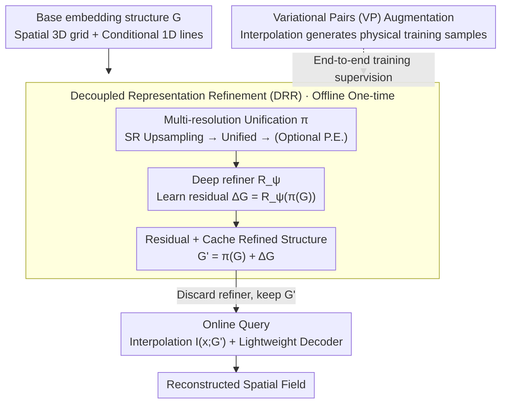

# Refine Now, Query Fast: A Decoupled Refinement Paradigm for Implicit Neural Fields

**Conference**: ICLR 2026  
**arXiv**: [2602.15155](https://arxiv.org/abs/2602.15155)  
**Code**: [GitHub](https://github.com/xtyinzz/DRR-INR)  
**Area**: Neural Fields / Surrogate Modeling  
**Keywords**: Implicit Neural Representation, Decoupled Refinement, Ensemble Surrogate, Variational Pairs, Feature Grid

## TL;DR

This paper proposes the Decoupled Representation Refinement (DRR) paradigm, which refines embedding structures and caches the results using a deep refiner network during an offline stage. This allows the inference stage to require only fast interpolation and a lightweight decoder, achieving SOTA reconstruction accuracy on ensemble simulation surrogate modeling tasks with less than 1/27 of the inference cost.

## Background & Motivation

**Background**: Implicit Neural Representations (INR) have become powerful tools for surrogate modeling of large-scale 3D scientific simulations, representing spatial and conditional fields as continuous functions. Current INR architectures are divided into two camps: **embedding-based methods** (e.g., feature grids, hash grids) achieve efficient inference via fast interpolation but have limited expressiveness; **MLP-based methods** (e.g., the MoE architecture of FA-INR) possess strong non-linear modeling capabilities but suffer from extremely high inference latency.

**Limitations of Prior Work**: Embedding-based models (e.g., K-Planes, Explorable-INR) face two dilemmas in ensemble simulations: naively extending feature structures to high-dimensional condition spaces leads to memory explosion; low-rank decomposition saves memory but creates representation bottlenecks, failing to capture complex non-linear interactions in the data. MLP-based models (e.g., FA-INR) require 287 seconds for inference on the Nyx dataset, which is unacceptable for practical applications.

**Key Challenge**: A fundamental architectural limitation exists between accuracy and speed—deep networks provide sufficient expressiveness but are slow to infer, while shallow embedding queries are fast but under-expressive. These two seem irreconcilable because inference either involves heavy network forward passes or simple interpolation lookups.

**Goal**: (1) How to obtain the expressiveness of deep networks without sacrificing inference speed? (2) How to effectively fuse features of multi-scale and multi-condition parameters? (3) How to improve model generalization under sparse ensemble training data?

**Key Insight**: The core insight is that "expensive computations required to build high-quality representations do not need to be repeated for every query." If a deep network's role is to refine the embedding structure, this refinement can be precomputed and cached—at inference time, the cached refined embedding is queried directly, and the cost degrades to that of a pure embedding-based model.

**Core Idea**: Use a deep refiner network to refine the embedding structure offline and cache the results, allowing the inference path to contain only fast interpolation and light decoding, thereby decoupling expressiveness from inference efficiency.

## Method

### Overall Architecture

DRR aims to resolve the deadlock in INR where "high accuracy implies slowness, and fast query implies under-expression" by completely separating "constructing representation" from "querying representation." The pipeline follows a single main thread: In the **offline stage**, the base embedding structure $\mathcal{G}$ (spatial 3D feature grids + conditional 1D feature lines) undergoes a non-parametric transformation $\pi$ (multi-resolution unification, structural super-resolution, optional positional encoding upsampling). Then, a deep refiner network $R_\psi$ learns a residual offset $\Delta\mathcal{G}=R_\psi(\pi(\mathcal{G}))$. The refined structure $\mathcal{G}'=\pi(\mathcal{G})+\Delta\mathcal{G}$ is obtained by adding the residual and then **cached**. During training, the base structure, refiner, and decoder are jointly optimized end-to-end, with sparse ensemble simulation data enhanced by Variational Pairs (VP). In the **online stage**, the refiner is discarded entirely. Each query only involves one interpolation on the cached $\mathcal{G}'$ and lightweight decoding, "prepaying" the deep network's expressiveness into the cache and returning the query cost to pure embedding levels.

### Key Designs

**1. Decoupled Representation Refinement (DRR): Moving expensive deep computation from the query path to offline**

The crux of the accuracy-speed trade-off in INR is that the forward pass of deep networks is tied to every single query. DRR breaks this by observing that the refiner network $R_\psi$ refines the embedding structure itself, not the dynamic query input—therefore, this computation only needs to be performed once. The specific refinement formula is $\mathcal{G}' = \pi(\mathcal{G}) + R_\psi(\pi(\mathcal{G}))$, where $\pi$ is a non-parametric transformation and $R_\psi$ learns the residual offset. Residual connections ensure the refiner learns "incremental refinement" rather than reconstructing the structure from scratch, making training more stable.

During training, all parameters are jointly optimized end-to-end. During inference, the refiner is discarded; the forward pass is run once for the spatial feature grids and conditional feature lines to cache the refined $\mathcal{G}'$. Subsequent queries degrade to $z_{DRR} = I(x; \mathcal{G}')$, mapping the computational complexity exactly to standard embedding-based models. This is fundamental to achieving deep network expressiveness at embedding query costs (27× faster than FA-INR).

**2. Multi-resolution Unification: Unify first, refine then, split after**

High-performance structures like Instant-NGP rely on multi-resolution features, but the refiner requires a unified input to perform cross-scale fusion from a global perspective. DRR-Net aligns them using a "unify → refine → split" sequence. The **Spatial Encoder** first performs structural super-resolution on $L_{sp}$ different 3D feature grids, upsampling them to the same high resolution, and then concatenates them along the channel dimension into a unified grid $\hat{\mathcal{G}}_{unified}$. Optional positional encoding upsampling can increase the embedding dimension from $L_{sp} \times d_{fs}$ to $L_{sp} \times d_{fs} \times 2K_{pe}$.

The **Conditional Encoder** maintains $L_{cond}$ multi-resolution 1D feature lines for each of the $d_c$ condition parameters. These are unified locally within each parameter and then globally across parameters to synthesize a single 1D representation $\hat{\mathcal{G}}_{cond}$. After being processed by the refiner, the representation is split back into $d_c$ feature lines—each now carrying fused features from across resolutions and parameters. This arrangement allows a single refiner to learn multi-scale interactions at once without modeling each resolution separately.

**3. Variational Pairs (VP): Creating physically plausible augmented samples under sparse ensemble data**

Ensemble simulation data is naturally sparse (simulations are expensive), and generalization relies on data augmentation. However, augmentation must respect the physical properties of the underlying fields. This is where the previous Variational Coordinates (VC) failed: VC perturbed coordinates while keeping values constant, implying a piecewise constant assumption that contradicts the continuous smoothness of simulation fields. **VP-S (Spatial Augmentation)** instead perturbs coordinates $\tilde{x} = x + \epsilon_x$ (truncated Gaussian noise) while simultaneously generating new values $\tilde{v} = I(\Phi_c, \tilde{x})$ via interpolation. This replaces the piecewise constant assumption with a local smoothness assumption, ensuring augmented samples fall within the true distribution.

**VP-SC (Joint Spatio-Conditional Augmentation)** further perturbs both coordinates and condition parameters, estimating values via two-stage interpolation—first performing spatial interpolation in fields of $K$ nearest neighbor conditions to get $v_k'$, then aggregating across conditions using inverse distance weighting:

$$\tilde{v} = \sum_{k=1}^{K} w_k(\tilde{c}) v_k'$$

Experiments show VP-S is the most robust, providing positive gains across almost all model-dataset combinations, whereas VC is inconsistent or even harmful—confirming the principle that augmented values must be generated by interpolation to align with the true distribution.

### Loss & Training

Training utilizes an L2 loss to minimize the mean squared error between predicted and ground truth values. All parameters (base embedding structure $\mathcal{G}$, refiner $R_\psi$, and decoder) are jointly optimized end-to-end. VP augmented samples participate in training alongside original samples. Before inference, one refiner forward pass is executed to cache the refined structure.

## Key Experimental Results

### Main Results: Conditional Generalization Performance

| Dataset | Model | Rel L2↓ | PSNR↑ | SSIM↑ | Inference TFLOPs ↓ | Inference Time (s) | Params |
|--------|------|---------|-------|-------|-------------|-------------|--------|
| Nyx | K-Planes | 1.96e-1 | 28.86 | 0.797 | 57.0 | 21.6 | 12.1M |
| Nyx | FA-INR | 3.95e-2 | 42.79 | 0.975 | 2569.2 | 287.2 | 9.5M |
| Nyx | Explorable-INR | 4.64e-2 | 41.39 | 0.972 | 39.6 | 9.6 | 14.7M |
| Nyx | **Ours (DRR-Net)** | **3.18e-2** | **44.69** | **0.986** | 57.2 | 10.7 | **8.9M** |
| Cloverleaf3D | FA-INR | 1.11e-1 | 47.60 | 0.991 | 422.1 | 56.2 | 1.0M |
| Cloverleaf3D | **Ours (DRR-Net)** | **9.81e-2** | **48.69** | **0.994** | 52.6 | 5.5 | **0.9M** |

DRR-Net achieves the highest PSNR on Nyx (44.69 vs FA-INR 42.79), with inference speeds **27×** faster than FA-INR.

### Ablation Study: Data Augmentation

| Model | Augmentation | Nyx PSNR↑ | Cloverleaf3D PSNR↑ |
|------|---------|-----------|---------------------|
| Ours | None | baseline | baseline |
| Ours | VC | Decrease | Decrease |
| Ours | **VP-S** | **42.04** | **+1.79 dB** |
| Ours | VP-SC | 42.79 → best for FA-INR | 47.60 |
| FA-INR | VP-SC | **42.79** (Best) | 47.60 |
| Explorable-INR | VC | 39.59 | 42.41 (Decrease) |
| Explorable-INR | VP-S | **41.30** | **44.07** |

Key finding: VC is harmful to DRR-Net, while VP-S is the most robust augmentation strategy.

### Key Findings

- **The DRR paradigm effectively solves the accuracy-speed dilemma**: It achieves the highest accuracy and near-fastest inference speeds on Nyx and Cloverleaf3D simultaneously, often with fewer parameters.
- **Unstructured grids are a weakness**: On MPAS-Ocean (unstructured Voronoi grids), FA-INR (MLP-based) is superior as grid assumptions mismatch the data geometry. However, DRR-Net still outperforms similar embedding methods by 3dB.
- **VP augmentation has strong universality**: VP-S brings positive gains to almost all model-dataset combinations, while VC results are unstable or harmful.
- **Zero-shot spatio-temporal generalization**: DRR-Net maintains optimal performance in super-resolution tests (training at 2× down-resolution → inference at full resolution).

## Highlights & Insights

- **"Refine during training, lookup during inference" philosophy**: The core insight of DRR is simple yet powerful—since refinement computation does not depend on query input, precompute it. This can be transferred to any "structured storage + query" model, such as Knowledge Graph embeddings or recommendation embedding tables.
- **Universality of the multi-resolution unification principle**: Unifying disparate resolution feature structures into a single refiner input and splitting them back after refinement solves the general problem of multi-scale feature fusion. This "unify-process-split" pattern can be applied in any scenario requiring cross-scale interaction.
- **Physical plausibility of VP augmentation**: The improvement from VC's piecewise constant assumption to VP's local smoothness assumption is small but critical—data augmentation strategies must respect the physical properties of the underlying data, otherwise introduced noise becomes harmful.

## Limitations & Future Work

- **Insufficient adaptation to unstructured grids**: DRR is built upon feature grids (Cartesian grids), leading to geometric mismatch with unstructured grids (e.g., spherical Voronoi grids in MPAS-Ocean).
- **Relatively long training time**: On Cloverleaf3D, DRR-Net takes 44 hours to train, which is higher than K-Planes (26.7h) and FA-INR (29.4h), suggesting that end-to-end refiner training increases optimization difficulty.
- **Limited exploration of refiner architectures**: The current refiner is a simple deep MLP; more advanced architectures (e.g., GNNs, Transformers) may further improve refinement quality.
- **Hyperparameter sensitivity of VP-SC**: The paper notes that VP-SC's effectiveness is highly dependent on hyperparameter tuning, requiring more adaptive perturbation strategies.

## Related Work & Insights

- **vs FA-INR (Li et al., 2025)**: FA-INR uses MoE MLPs to achieve high accuracy but is 27× slower in inference. DRR-Net provides higher accuracy and inference speeds close to embedding methods at the cost of one-time offline refinement.
- **vs Explorable-INR (Chen et al., 2025)**: Also an embedding-based method, it uses factored representations for high-dimensional conditions, but low-rank bottlenecks limit accuracy. DRR breaks this bottleneck via the refiner.
- **vs Instant-NGP (Müller et al., 2022)**: The multi-resolution hash grid of Instant-NGP is a base structure that DRR can utilize, adding refinement capabilities on top.
- **vs Knowledge Distillation**: While KD transfers knowledge from large models to small ones, DRR "distills" deep network knowledge into the embedding structure itself. These two ideas are complementary and can be combined.

## Rating

- Novelty: ⭐⭐⭐⭐ The idea of decoupling offline refinement from online queries is clean and elegant; VP augmentation has experimentally validated innovation.
- Experimental Thoroughness: ⭐⭐⭐⭐⭐ Comprehensive coverage across three datasets, four baselines, and ablation of conditional/spatio-temporal generalization and augmentation.
- Writing Quality: ⭐⭐⭐⭐ Clear structure, detailed method descriptions, and informative charts.
- Value: ⭐⭐⭐⭐ Significant contribution to the INR surrogate modeling field; the DRR paradigm provides broad architectural guidance.

<!-- RELATED:START -->

## Related Papers

- [\[ICLR 2026\] Beyond Uniformity: Regularizing Implicit Neural Representations through a Lipschitz Lens](beyond_uniformity_regularizing_implicit_neural_representations_through_a_lipschi.md)
- [\[ICLR 2026\] From Fields to Random Trees](from_fields_to_random_trees.md)
- [\[ICLR 2026\] QUEST: A Robust Attention Formulation Using Query-Modulated Spherical Attention](quest_a_robust_attention_formulation_using_query-modulated_spherical_attention.md)
- [\[CVPR 2025\] EVOS: Efficient Implicit Neural Training via EVOlutionary Selector](../../CVPR2025/others/evos_efficient_implicit_neural_training_via_evolutionary_selector.md)
- [\[ICLR 2026\] Fast and Stable Riemannian Metrics on SPD Manifolds via Cholesky Product Geometry](fast_and_stable_riemannian_metrics_on_spd_manifolds_via_cholesky_product_geometr.md)

<!-- RELATED:END -->
