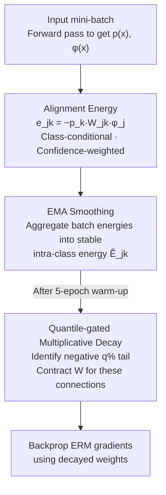

# Regulating Internal Alignment Flows for Robust Learning Under Spurious Correlations

**Conference**: ICLR 2026  
**OpenReview**: [https://openreview.net/forum?id=L2L1hi0FGj](https://openreview.net/forum?id=L2L1hi0FGj)  
**Code**: To be confirmed  
**Area**: Robust Learning / Debiasing / Fairness  
**Keywords**: Spurious correlation, Worst-group accuracy, Neuron attribution, Label-free, Plug-and-play regularization

## TL;DR
This paper proposes Alignment-Gated Suppression (AGS): it computes a "class-conditional, confidence-weighted" alignment energy for each neuron during training. By applying multiplicative decay to connections at the quantile tail—those contributing most strongly to the ground-truth class (likely shortcuts)—it simultaneously improves average and worst-group accuracy **without group labels and with < 5% additional overhead**.

## Background & Motivation
**Background**: Deep models often rely on "spurious correlations"—for instance, associating waterbirds with "water backgrounds" or females with "blond hair"—using these background attributes as shortcuts for prediction. While these shortcuts yield high accuracy on majority samples, they fail catastrophically on "minority/bias-conflicting" samples (where the background is swapped), leading to a significant drop in Worst-Group Accuracy (WGA).

**Limitations of Prior Work**: Existing robust learning methods generally fall into two categories, yet neither addresses the root cause internally. One category is **group-aware** methods (GroupDRO, IRM, V-REx, JTT, etc.), which require high-quality group/environment labels to explicitly constrain worst-group risk. Such labels are expensive and often missing or unreliable in real deployment. The other category consists of **group-agnostic** methods that re-weight samples based on heuristics like confidence or error; however, these are merely "proxy signals" for group structure and remain indirect and unstable. Both categories intervene **externally** (at the data level) or at the **loss layer**, failing to directly control which neurons and connections propagate spurious alignment energy.

**Key Challenge**: Shortcut reliance is an **internal** phenomenon occurring at specific neuron $\rightarrow$ class connections. Current methods lack a direct handle on internal shortcut pathways as they manipulate data or losses externally. Conversely, existing internal interventions (pruning, weight decay) are often global, input-independent, or post-hoc, making them unable to precisely identify and suppress shortcut paths during training dynamics.

**Goal**: To design an **in-training, internal, and label-free** mechanism that directly identifies and weakens connections carrying spurious correlations while preserving robust features and average accuracy.

**Key Insight**: The authors hypothesize that if a neuron consistently and strongly supports a ground-truth class when the model is "very confident," it is likely exploiting a shortcut. By quantifying the "confidence-weighted contribution of each neuron to each class" and mildly contracting the connections at the distribution's extremes, shortcuts can be suppressed at the source without knowing the group structure.

**Core Idea**: An "alignment energy" $e_{jk}(x)=-p_k(x)\,W_{jk}\,\phi_j(x)$ is defined in the parameter space as an attribution signal during training. After smoothing with EMA, **quantile-gated multiplicative decay** is applied to continuously contract connections in the most negative tail (strongest shortcuts). This regulates internal alignment flows instead of data/losses to achieve robustness.

## Method

### Overall Architecture
AGS is a plug-and-play regulator integrated into standard ERM with cross-entropy training. By default, it operates on the final linear classifier $W \in \mathbb{R}^{D \times C}$ (the interface is transferable to intermediate channels). The core loop involves: obtaining class probability $p(x)$ and penultimate representation $\phi_\theta(x)$ via forward pass $\rightarrow$ computing **alignment energy** for each neuron relative to the ground-truth class $\rightarrow$ smoothing batch estimates into stable intra-class energies using EMA $\rightarrow$ identifying connections in the most negative quantile tail $\rightarrow$ applying multiplicative decay to these connections before backpropagating ERM gradients. The mechanism requires no architectural changes, no group labels, and uses stop-gradient for all alignment quantities, adding < 5% training overhead and only a $D \times C$ EMA buffer.

### Key Designs

**1. Alignment Energy: Quantifying confidence-weighted class support in parameter space**
To find shortcuts internally, a metric is needed that can be calculated in real-time during training and precisely characterizes the contribution of individual connections. AGS defines the alignment energy for neuron $j$, class $k$, and input $x$ as:
$$e_{jk}(x) \triangleq -\,p_k(x)\,W_{jk}\,\phi_j(x),$$
calculated only for the ground-truth class $k=y$. Three design choices are critical: first, $W_{jk}\phi_j(x)$ is the direct contribution of the connection to the $k$-logit; second, multiplying by the softmax probability $p_k(x)$ couples the contribution with **confidence**—the more confident the model, the more a connection's contribution is amplified, while uncertain samples are naturally down-weighted; third, the negative sign aligns the direction such that "more negative = stronger alignment." Taking the expectation over samples of the same label yields the class energy $E_{jk}=\mathbb{E}_{x\sim D_k}[e_{jk}(x)]$. A highly negative $E_{jk}$ indicates that neuron $j$ provides consistent high-confidence support for class $k$, which is the signature of a shortcut connection. The authors emphasize that this is a **parameter-space** statistic (sensitivity of classifier weights), distinguishing it from the **activation-space** "evidence energy" in EvA; this perspective enables single-stage, connection-level multiplicative decay.

**2. EMA Smoothing + In-batch Estimation: Stabilizing noisy batch signals**
The batch estimate $\bar E^{(t)}_{jk}=\frac{1}{|B_k|+\epsilon}\sum_{x\in B_k}e_{jk}(x)$ is a finite-sample estimate of $E_{jk}$, and its variance is heavily affected by batch size and class balance. Small batches may push more features into the negative tail due to sampling noise, triggering over-suppression. To stabilize gating decisions, AGS maintains an Exponential Moving Average (EMA):
$$\tilde E^{(t)}_{jk} = (1-\beta)\,\bar E^{(t)}_{jk} + \beta\,\tilde E^{(t-1)}_{jk},\quad \beta=0.75,$$
This carries historical information forward, which is crucial for rare classes. The authors prove that EMA bounds step-wise drift at $2(1-\beta)R_\phi R_w$. Since subsequent gating depends only on intra-class ranking (invariant to monotonic transformations), bias correction and absolute scale normalization are unnecessary.

**3. Quantile-gated Multiplicative Decay: Budgeted and scale-invariant shortcut suppression**
With stable intra-class energy, AGS warms up for $T_w=5$ epochs to fill the EMA, then calculates an intra-class $q$-th quantile threshold ($q \in [10, 20]$):
$$\tau^{(t)}_k \triangleq \mathrm{Percentile}_q\big(\{\tilde E^{(t)}_{1k},\dots,\tilde E^{(t)}_{Dk}\}\big),$$
Connections with energy below the threshold are marked by a binary gate $s^{(t)}_{jk}=\mathbb{I}[\tilde E^{(t)}_{jk}<\tau^{(t)}_k]$. Decoupled multiplicative decay is then applied to the weights:
$$W_{jk} \leftarrow (1-\alpha\,s^{(t)}_{jk})\,(1-0.05\,\alpha)\,W_{jk},\quad \alpha\in[0.005,0.15].$$
The factor $1-\alpha s^{(t)}_{jk}$ achieves **selective** suppression, while the mild global factor $1-0.05\alpha$ prevents scale oscillations. Weights are decayed after the forward pass and before the backward pass. Since gating relies on intra-class **ranking**, it is naturally scale-invariant and specifically suppresses $\lceil q\% \rceil$ of features (budgeted).

### Loss & Training
The objective remains standard cross-entropy ERM. AGS does not introduce new explicit loss terms but inserts the "Forward alignment calculation $\rightarrow$ EMA update $\rightarrow$ Gated decay $\rightarrow$ ERM Backprop" logic into each iteration. Default hyperparameters are $(q, \beta, \alpha, T_w, \epsilon)=(20, 0.75, 0.05, 5, 10^{-8})$. The backbone is an ImageNet-pretrained ResNet-50 with end-to-end fine-tuning.

## Key Experimental Results

### Main Results
On three spurious correlation benchmarks, AGS improves both average and worst-group accuracy (ResNet-50, no group labels):

| Dataset | Metric | Ours (AGS) | Best Baseline | Description |
| :--- | :--- | :--- | :--- | :--- |
| CelebA | Unbiased / Conflicting | **95.63 / 93.95** | EvA-E 90.51 / 88.74 | Conflicting groups +5 pts; Error 11.26% $\rightarrow$ 6.05% |
| BAR | Average Acc. | **76.09** | EvA-E 73.70 | +2.39 (vs EvA-E), +15.58 (vs ERM) |
| Waterbirds | Average Acc. | **97.44** | EvA-E 96.95 | Highest average accuracy |
| Waterbirds | Worst Acc. | 80.93 | JTT 84.98 | Comparable to EvA-E (81.31) |

On COCO Gender/Object Bias, AGS achieves the best average accuracy of 84.27 (+0.73 vs GMBM, +14.77 vs Vanilla) and significantly narrows bias gaps (e.g., the Sports gap dropped from 6.20 to 0.67).

### Ablation Study
Ablations on Waterbirds (replacing core signals while keeping the pipeline intact):

| Configuration | Worst-Group Acc. (%) | Average Acc. (%) | Description |
| :--- | :--- | :--- | :--- |
| AGS (Full) | 79.4 | 97.1 | Complete model |
| w/o Confidence Weighting ($p_k(x)=1$) | 73.9 | 91.8 | -5.5 pts WGA |
| w/o EMA (Batch-only energy) | 75.2 | 91.7 | -4.2 pts WGA |
| EvA-style Activation Space Proxy | 70.1 | 90.9 | -9.3 pts WGA |

### Key Findings
- Replacing "parameter-space alignment energy" with "activation-space proxies" (like EvA) causes WGA to drop from 79.4% to 70.1%, proving that gains stem from the parameter-space formulation rather than just the gating mechanism.
- Both confidence weighting and EMA contribute ~4–5 points to WGA, indicating that focusing on confident samples and denoising are both essential.
- The decay rate $\alpha$ and batch size are stability knobs: larger $\alpha$ strengthens sparsification but can over-suppress when features are highly entangled.

## Highlights & Insights
- **Quantifying shortcuts as real-time training scalars**: The alignment energy $e_{jk}=-p_k W_{jk}\phi_j$ encodes both "contribution direction" and "confidence" in a parameter-space metric. This allows direct intervention on the same set of weights, making it more elegant than EvA's "post-hoc pruning + retraining."
- **Triple benefits of quantile gating**: By relying on intra-class ranking, gating is **scale-invariant** (invariant to reparameterization), **budgeted** (exactly $q\%$ suppressed per class), and **stable** (few gate flips when paired with EMA).
- **Strong Transferability**: The paradigm is not limited to the last layer and can be extended to convolutional channels or attention heads. Its label-free nature allows it to be stacked with group-aware methods like GroupDRO.

## Limitations & Future Work
- The method implicitly assumes that the most negative alignment energy primarily corresponds to shortcut paths; robust cues might be mistakenly suppressed if they briefly fall into the tail during early training.
- Very small or imbalanced batches can destabilize the threshold $\tau_k$, leading to over-suppression.
- Future work: Adaptive, class-aware gating budgets; layer-wise gating (channels/attention heads); and combining with group discovery to unify "sample-level + pathway-level" robustness.

## Related Work & Insights
- **vs EvA (He et al., 2025)**: EvA uses activation-space "evidence energy" to post-hoc prune channels and retrain the classifier. AGS utilizes parameter-space alignment statistics as an **in-training, connection-level** regulator via continuous multiplicative decay.
- **vs GroupDRO / JTT**: These methods focus on the "data layer" or "loss layer." AGS operates on how alignment flows **inside the model**, offering a more direct handle on internal shortcut pathways. While AGS (WGA 80.93) slightly trails JTT (84.98) on Waterbirds, it outperforms in average accuracy and requires no group labels.
- **vs Weight Decay / Pruning**: Pruning is typically post-hoc and cannot reshape training dynamics. AGS is a class-aware regulator that suppresses spurious pathways during the learning process without targeting fixed sparsity.

## Rating
- Novelty: ⭐⭐⭐⭐ The parameter-space alignment energy combined with quantile gating is a clean, well-grounded perspective.
- Experimental Thoroughness: ⭐⭐⭐⭐ Solid results across 4 benchmarks and depth in ablations, though focused primarily on vision.
- Writing Quality: ⭐⭐⭐⭐ Clear alignment between mechanism, theory, and intuition.
- Value: ⭐⭐⭐⭐ Label-free, plug-and-play, and < 5% overhead makes it highly practical for debiasing.

<!-- RELATED:START -->

<!-- RELATED:END -->

## Related Papers

- [\[ICLR 2026\] Mitigating Spurious Correlation via Distributionally Robust Learning with Hierarchical Ambiguity Sets](mitigating_spurious_correlation_via_distributionally_robust_learning_with_hierar.md)
- [\[ICLR 2026\] Spurious Correlation-Aware Embedding Regularization for Worst-Group Robustness](spurious_correlation-aware_embedding_regularization_for_worst-group_robustness.md)
- [\[ICLR 2026\] Noisy-Pair Robust Representation Alignment for Positive-Unlabeled Learning](noisy-pair_robust_representation_alignment_for_positive-unlabeled_learning.md)
- [\[NeurIPS 2025\] Aggregation Hides OOD Generalization Failures from Spurious Correlations](../../NeurIPS2025/others/aggregation_hides_out-of-distribution_generalization_failures_from_spurious_corr.md)
- [\[ICLR 2026\] Adaptive Conformal Guidance for Learning under Uncertainty](adaptive_conformal_guidance_for_learning_under_uncertainty.md)

<!-- RELATED:END -->
