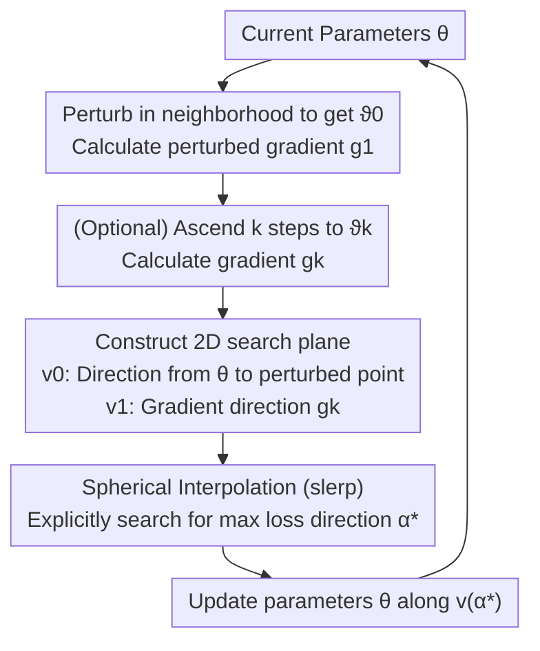

# Revisiting Sharpness-Aware Minimization: A More Faithful and Effective Implementation

## Meta Information
- **Conference**: ICLR 2026
- **arXiv**: [2603.10048](https://arxiv.org/abs/2603.10048)
- **Code**: [https://github.com/Cccjl219/XSAM](https://github.com/Cccjl219/XSAM)
- **Area**: Others
- **Keywords**: sharpness-aware minimization, SAM, optimization, generalization, flat minima

## TL;DR
This paper proposes a new intuitive explanation for the underlying mechanism of SAM—interpreting the gradient at the perturbed point as an approximation of the direction toward the local maximum—and reveals its imprecision and the multi-step degradation issue. Consequently, XSAM is proposed to achieve more faithful and effective sharpness-aware minimization by explicitly searching for the maximum direction.

## Background & Motivation
- **SAM** promotes flat minima and better generalization by minimizing the maximum loss within a $\rho$-neighborhood. However, its actual implementation applies the gradient calculated at a perturbed point to the current parameters—the intuitive understanding of why this "misaligned gradient" is effective has been lacking.
- **Common Misconception**: The gradient calculated at the estimated maximum point does not directly minimize the neighborhood's maximum loss—the key lies in the fact that the gradient calculation position differs from the application position.
- **Confusion over Multi-step SAM**: Theoretically, more ascent steps should yield a better approximation of the maximum, but in practice, the performance of multi-step SAM often degrades rather than improves.

## Method

### Overall Architecture
The authors first address the "misaligned gradient" phenomenon in SAM: it calculates gradient $g_1$ at the perturbed point $\vartheta_0$ but applies it to the current parameters $\theta$. Through visualization and second-order approximation analysis, they reinterpret this gradient as a "direction estimate from the current parameters toward the neighborhood maximum." They find that this estimate is not only imprecise but also degrades as the number of ascent steps increases. Based on this insight, XSAM no longer blindly trusts a single gradient; instead, it explicitly searches for the true direction pointing to the maximum loss within the 2D plane spanned by $v_0$ and $v_1$ before performing the update.

### Key Designs

**1. Reinterpreting SAM Gradient: The perturbed gradient is the direction "towards the maximum," not the gradient at the maximum.**

The community has long understood SAM as "taking the gradient at the estimated maximum point to minimize the neighborhood maximum loss." However, the critical point is that the location of gradient calculation (perturbed point $\vartheta_0$) and application (current parameters $\theta$) are different. The authors use visualization (Fig. 1a) to show that the single-step perturbed gradient $g_1@\vartheta_0$, compared to the local gradient $g_0$ at the current parameters, better approximates the direction "from the current parameters to the neighborhood maximum." This is formalized in Proposition 1 under a second-order approximation: when $\rho_m$ is sufficiently large, $L(\vartheta_0 + \rho_m \frac{g_1}{\|g_1\|}) > L(\vartheta_0 + \rho_m \frac{g_0}{\|g_0\|})$, meaning one can climb to a higher loss along the $g_1$ direction. This transforms why SAM works from a "coincidence" into an explainable direction estimation problem, providing room for improvement.

**2. Revealing the root of multi-step degradation: Distortion of gradient direction information far from $\vartheta_0$.**

Intuitively, more ascent steps should lead closer to the true maximum, but in practice, multi-step SAM results in performance drops. The authors point out (Fig. 1b) that the gradient $g_k@\vartheta_k$ at the $k$-th step may point toward the maximum more poorly than the single-step $g_1@\vartheta_0$—the further the ascent steps go, the more the direction information carried by the gradient is distorted. Furthermore, the second part of Proposition 1 identifies another gap: there always exists some linear combination $g_\alpha = \alpha g_1 + (1-\alpha) g_0$ that is better than $g_1$ itself, suggesting that even in the single-step setting, SAM's direct use of $g_1$ is suboptimal. These two points form the motivation for XSAM: since a single gradient is unreliable, one should explicitly select from a set of directions.

**3. XSAM: Spherical Interpolated Search for the Maximum Direction on a 2D Plane**

XSAM constrains the search within a plane spanned by two meaningful directions—$v_0$ is the direction from the current parameters to the initial perturbation point, and $v_1$ is the direction of the perturbed gradient:

$$v_0 = \frac{\vartheta_k - \vartheta_0}{\|\vartheta_k - \vartheta_0\|}, \quad v_1 = \frac{g_k}{\|g_k\|}$$

Spherical linear interpolation (slerp) is used to generate continuous candidate directions between these two unit vectors, where $\psi$ is the angle between them:

$$v(\alpha) = \frac{\sin((1-\alpha)\psi)}{\sin(\psi)} v_0 + \frac{\sin(\alpha\psi)}{\sin(\psi)} v_1$$

Then, the $\alpha^*$ that maximizes the neighborhood loss is explicitly found within the interval, and parameters are updated along this direction:

$$\alpha^* = \arg\max_{\alpha \in [0, a]} L(\vartheta_0 + \rho_m \cdot v(\alpha)), \qquad \theta_{t+1} = \theta_t - \eta_t \cdot v(\alpha^*) \cdot \|g_k\|$$

This design naturally includes known high-loss points (pointed to by $v_1$) in the search space, ensuring results are at least as good as SAM. Simultaneously, it treats single-step and multi-step settings equally—regardless of which step $g_k$ comes from, it is merely one endpoint in the plane, thus unifying the multi-step degradation problem into one search framework.

**4. Epoch-level search: Compressing extra overhead to negligible levels.**

Explicitly searching for $\alpha^*$ requires multiple forward passes along $v(\alpha)$ to evaluate loss, which would be too costly if done every step. The authors observe that $\alpha^*$ changes very slowly during training (Fig. 2); therefore, it only needs to be updated during the first iteration of each epoch and reused for the rest. One update requires about 20–40 forward passes, which, when amortized over the entire epoch, results in an extra calculation overhead of less than 3%, making XSAM a plug-and-play replacement for SAM.

## Key Experimental Results

### Main Results: Single-step Classification Tasks

| Dataset/Model | SGD | SAM | GSAM | WSAM | **XSAM** |
|-----------|-----|-----|------|------|---------|
| CIFAR-10/ResNet-18 | 95.3 | 96.0 | 96.0 | 96.1 | **96.3** |
| CIFAR-100/ResNet-18 | 78.0 | 79.5 | 79.8 | 79.8 | **80.3** |
| CIFAR-100/DenseNet-121 | 79.5 | 81.0 | 81.2 | 81.2 | **81.6** |
| Tiny-ImageNet/ResNet-18 | 64.5 | 66.0 | 66.2 | 66.3 | **66.8** |

> XSAM consistently outperforms SAM and its variants across all model-dataset combinations.

### Ablation Study: Multi-step Setting

| Method | 1-step | 2-step | 5-step | 10-step |
|-----|-----|-----|-----|------|
| SAM | 79.5 | 79.2 | 78.8 | 78.3 |
| **XSAM** | **80.3** | **80.5** | **80.6** | **80.7** |

> SAM performance decreases as the number of steps increases, while XSAM continues to improve—verifying the multi-step degradation phenomenon and XSAM's fix.

### Training Time Comparison (Hours/200 epochs)

| Model/Dataset | SAM | XSAM | Overhead |
|-----------|-----|------|---------|
| VGG-11/CIFAR-10 | 0.93 | 0.96 | +3.2% |
| ResNet-18/CIFAR-100 | 2.40 | 2.43 | +1.3% |
| DenseNet-121/CIFAR-100 | 8.05 | 8.07 | +0.2% |

> XSAM adds almost no extra computational time.

### Key Findings
1. SAM gradients better approximate the direction toward the maximum than SGD gradients, but they are still inaccurate.
2. Multi-step SAM degrades because the direction information of $g_k$ becomes distorted after moving far from $\vartheta_0$.
3. $\alpha^*$ is stable during training; epoch-wise updates are sufficient.
4. Combining XSAM with ASAM can further enhance performance.

## Highlights & Insights
- **Intuitive Explanation**: Provides the first intuitive and visual explanation of why SAM's "misaligned gradient" is effective.
- **Multi-step Degradation Puzzle**: Elegantly explains the phenomenon that confused the community—why more ascent steps do not equal better performance.
- **Minimal Overhead Improvement**: Only 20-40 forward passes per epoch are needed, with overhead < 3%.
- **Unified Framework**: A unified improvement scheme for both single-step and multi-step SAM.

## Limitations
- The search is restricted to a 2D hyperplane, potentially missing the true maximum direction in high-dimensional space.
- It assumes the maximum lies on the neighborhood boundary, which might not hold for complex loss landscapes.
- Introduces the $\rho_m$ hyperparameter, which has a different meaning than SAM's $\rho$.
- Effectiveness on ultra-large-scale models (e.g., LLMs) has not been verified.

## Related Work
- **SAM Variants**: ASAM (Kwon et al., 2021) for adaptive perturbations; GSAM (Zhuang et al., 2022) for orthogonal components of local gradients.
- **WSAM** (Yue et al., 2023) and Zhao et al. (2022a) also use linear combinations of $g_0$ and $g_1$, but with fixed weights.
- **SAM Theory**: Wen et al. (2023) and Bartlett et al. (2023) study implicit bias.
- **Multi-step SAM**: Proposed in the original Foret et al. (2020) paper but showed poor results.

## Rating
- Novelty: ⭐⭐⭐⭐ — New intuitive explanation + multi-step degradation explanation + unified method.
- Theoretical Depth: ⭐⭐⭐⭐ — Theoretical confirmation under second-order approximation, combining intuition with formal analysis.
- Experimental Thoroughness: ⭐⭐⭐⭐ — Multiple models/datasets, multi-step ablation, and computational overhead analysis.
- Value: ⭐⭐⭐⭐ — Plug-and-play replacement for SAM with almost no extra overhead.

<!-- RELATED:START -->

## Related Papers

- [\[NeurIPS 2025\] Sharpness-Aware Minimization with Z-Score Gradient Filtering](../../NeurIPS2025/others/sharpness-aware_minimization_with_z-score_gradient_filtering.md)
- [\[CVPR 2025\] ZO-SAM: Zero-Order Sharpness-Aware Minimization for Efficient Sparse Training](../../CVPR2025/others/zo-sam_zero-order_sharpness-aware_minimization_for_efficient_sparse_training.md)
- [\[ACL 2025\] Verbosity-Aware Rationale Reduction: Effective Reduction of Redundant Rationale](../../ACL2025/others/verbosity-aware_rationale_reduction_effective_reduction_of_redundant_rationale_v.md)
- [\[ICLR 2026\] Oversmoothing, Oversquashing, Heterophily, Long-Range, and More: Demystifying Common Beliefs in Graph Machine Learning](oversmoothing_oversquashing_heterophily_long-range_and_more_demystifying_common_.md)
- [\[ICLR 2026\] RADAR: Learning to Route with Asymmetry-aware Distance Representations](radar_learning_to_route_with_asymmetry-aware_distance_representations.md)

<!-- RELATED:END -->
