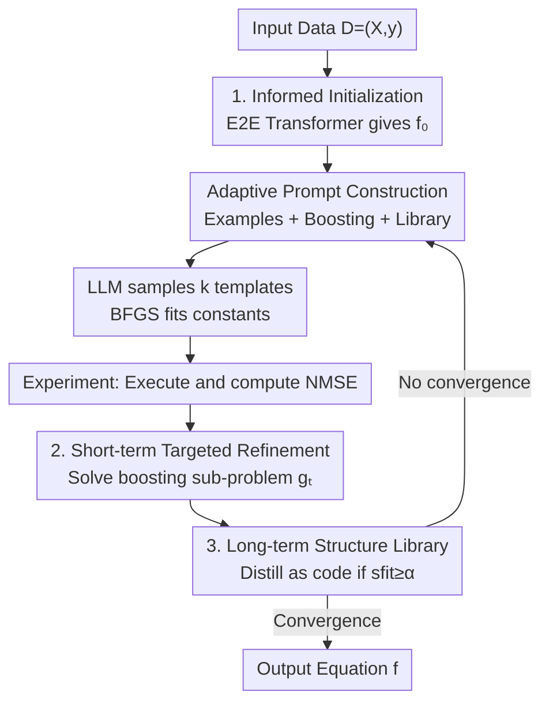

# Robust Equation Structure Learning with Adaptive Refinement (RESTART)

**Conference**: ICLR 2026  
**OpenReview**: [https://openreview.net/forum?id=z9TKJhLVKj](https://openreview.net/forum?id=z9TKJhLVKj)  
**Code**: https://github.com/Liyunlun/RESTART  
**Area**: Symbolic Regression / AI for Science / LLM Scientific Discovery  
**Keywords**: Symbolic Regression, Equation Discovery, Boosting Residuals, Structure Library, LLM

## TL;DR
RESTART fully integrates the scientific discovery closed loop of "Hypothesis—Experiment—Analysis" into symbolic regression. It employs a Transformer to provide a strong initial equation, explicitly models "unexplained" components of the current equation as boosting-style "exploration functions" for short-term targeted feedback, and distills successful refinements into a reusable code-based structure library for long-term knowledge. This approach outperforms existing SOTA on LLM-SRBench with lower error and higher recovery rates, approaching ground-truth forms on OOD data.

## Background & Motivation
**Background**: The goal of Symbolic Regression (SR) is to automatically recover human-readable mathematical expressions from data, which is core to automated scientific discovery. Existing methods are divided into two main schools: search-based (Genetic Programming GP, Reinforcement Learning DSR), which rely on mutation/crossover to evolve randomly in the expression space; and mapping-based (Transformers, e.g., E2E), which are trained on large-scale synthetic corpora to map numerical data directly to symbolic expressions in one step. Recently, LLM-based methods have emerged, leveraging the symbolic reasoning and natural language priors of large models to generate and rewrite candidate equations.

**Limitations of Prior Work**: Search-based methods suffer from combinatorial explosion, requiring the evaluation of hundreds of thousands of candidates, leading to slow convergence and overly complex expressions. Mapping-based methods offer strong single hypotheses but lack a correction mechanism based on error patterns, making them fragile to out-of-distribution (OOD) shifts. Most LLM-based methods only implement the first two steps of the scientific cycle—"Hypothesis" and "Experiment (calculating loss)"—without a **principled analysis phase** to transform observed errors into explicit guidance for the next hypothesis. Fed into LLMs is often just a scalar loss or a crude residual, which provides too weak a signal.

**Key Challenge**: The true strength of scientists lies in "analysis"—identifying which **structural components are missing** from the current model (which operator, which interaction term) and filling them in a targeted manner. Existing SR truncates this link, resulting in either blind search or "one-shot" attempts, unable to approach the truth iteratively like a human.

**Goal**: To complete the truncated "analysis" link, enabling SR to form a full "Hypothesis—Experiment—Analysis" closed loop and accumulate single-round refinement experiences into cross-round reusable knowledge.

**Key Insight**: The authors observe that errors in the current equation should not be compressed into a scalar but explicitly modeled as a **sub-problem**. By learning an exploration function $g_t$ that takes both the current prediction $f_t(x)$ and original features $x$, its symbolic form naturally describes "how the prediction should be corrected," providing a targeted and actionable analytical signal.

**Core Idea**: Use boosting-style residual sub-problems for "short-term targeted feedback" and an improvement-gated structure library for "long-term cumulative knowledge." Together, these drive the LLM via adaptive prompts to iteratively refine equations starting from a strong mapping-based initialization.

## Method

### Overall Architecture
RESTART organizes the process into a three-stage cycle: **Hypothesis → Experiment → Analysis**.

Specifically: Given a dataset $D=\{(x_i,y_i)\}$, it first uses a mapping-based estimator E2E to generate a strong initial hypothesis $f_0$ (preserving non-linear structures like polynomials, trigonometry, etc.). It then enters an iterative loop: each round starts by **adaptively constructing prompts** (fusing few-shot examples, boosting residual summaries, and structure library snippets). The generator LLM auto-regressively samples $k$ equation templates (as Python functions with placeholders for constants). After fitting constants with BFGS, NMSE is calculated (Experiment phase). Then, in the Analysis phase: a boosting sub-problem is solved to obtain the exploration function $g_t$. Both $(f_t, g_t)$ and their losses are stored in an example buffer. A comprehensive fitness score $s_{\text{fit}}$ evaluates the current refinement; if $s_{\text{fit}}\ge\alpha$, the LLM distills the "improvement-bringing structure" into a named code snippet for the structure library. This continues until convergence or the budget is exhausted.

The "Adaptive Prompt Construction" serves as the scaffolding, while the three components below represent the core innovations.

### Key Designs

**1. Informed Initialization: Strong Start with Non-linear Structures**

Many LLM-SR methods (e.g., LLMSR) start from a simple linear model, which only captures additive effects and shifts the burden of all non-linear discovery to the refinement stage. RESTART uses the E2E estimator (Kamienny et al., 2022) for initialization: it maps data to a symbolic expression $f_0$ that already encodes significant non-linearities and interactions. This ensures the loop starts from a "reasonable" hypothesis, allowing subsequent rounds to focus on local structural corrections.

**2. Short-term Targeted Refinement: Modeling "Unexplained Signals" as Boosting Sub-problems**

This is the core "Analysis" mechanism. While previous methods fed scalar losses to the LLM, RESTART maintains the current hypothesis $f_t$ and defines an exploration function class $G$. The function $g:\mathbb{R}^{d+1}\to\mathbb{R}$ takes both $f_t(x)$ and $x$ to solve:

$$g_t \leftarrow \arg\min_{g\in G} L\big(g(f_t(x), x),\, y\big).$$

This makes $g_t$ a boosting-style correction: since $g_t$ sees both the prediction and features, its symbolic form describes exactly how the prediction should be adjusted relative to the features to approach $y$. The $g_t$ is summarized in the prompt, providing the LLM with actionable cues (e.g., "you missed a $\sin$ interaction") rather than just a numerical error.

**3. Long-term Structure Library: Improvement-Gated Distillation into Code**

To prevent the library from bloating with noise, RESTART uses an improvement-gated strategy. It calculates a fitness score $s_{\text{fit}}$ for a new hypothesis $f_{\text{new}}$ compared to the best baseline $f_{\text{base}}$. It computes relative improvement $R=\frac{l_{\text{base}}-l_{\text{new}}}{l_{\text{base}}}$ and absolute improvement $\Delta=l_{\text{base}}-l_{\text{new}}$, normalized as $s_r=1-e^{-kR}$ and $s_a=1-(1+\Delta)^{-1}$:

$$s_{\text{fit}} = 100\cdot(w_r s_r + w_a s_a),\quad w_r+w_a=1.$$

This metric recognizes both significant relative gains on low-error problems and large absolute gains on high-error ones. If $s_{\text{fit}}\ge\alpha$, the LLM distills the refinement into a triplet $(\text{name}, \text{desc}, h)$, where $h$ is a Python code snippet. Storing knowledge as executable code is more direct and efficient than natural language descriptions.

### Main Results
On LLM-SRBench (LSR-Transform 111 tasks and LSR-Synth 93 tasks), using Qwen3-8B as the backbone:

| Dataset | Metric | LLMSR (SOTA) | RESTART |
|--------|------|--------------|---------|
| LSR-Transform | NMSE / ACC | 0.160 / 74.32 | **0.157 / 74.77** |
| Biology | NMSE / ACC | 0.016 / 70.83 | **0.001 / 77.08** |
| Material Science | NMSE / ACC | 0.003 / 96.00 | **0.001 / 96.00** |
| Physics | NMSE / ACC | **0.002** / 84.09 | 0.003 / **85.23** |

OOD Test Results (Table 2, NMSE capped at 100):

| Dataset | Metric | LLMSR | RESTART |
|--------|------|-------|---------|
| Biology | NMSE / ACC | 6.667 / 45.83 | **5.087 / 52.08** |
| Material Science | NMSE / ACC | 0.084 / 96.00 | **0.075 / 100.00** |
| Physics | NMSE / ACC | 14.808 / 65.91 | **8.167 / 71.59** |

### Ablation Study
On BPG12 (ID/OOD):

| Configuration | Description |
|------|------|
| Full RESTART | All three components, lowest NMSE |
| w/o Init | Removing Informed Initialization, significant degradation |
| w/o Short | Removing Short-term Refinement, significant degradation |
| w/o Long | Removing Long-term Library, significant degradation |
| Additive | $g(x)$ fits only additive residuals $y-f_t(x)$, NMSE increases sharply |

### Key Findings
- **Necessity of All Components**: Removing initialization, short-term analysis, or long-term retention lead to significant performance drops.
- **Structural vs. Numerical Refinement**: The "Additive" variant (fitting $y-f_t(x)$) performs poorly, proving that gains come from revealing **structural corrections** through $g_t(f_t(x), x)$.
- **Backbone Independence**: While stronger LLMs improve absolute performance, RESTART consistently leads regardless of the backbone used.
- **Compute Efficiency**: RESTART's NMSE drops sharply within the first 100 steps, surpassing LLMSR with only 25% of the iteration budget.

## Highlights & Insights
- **Upgrading Error from Scalar to Sub-problem**: Modeling $g_t$ to see both predictions and features ensures the "Analysis" phase outputs structural cues rather than uninformative losses.
- **Knowledge as Code**: Storing refinements as Python snippets allows the LLM to invoke and assemble structures directly, avoiding the ambiguity of natural language.
- **Dual-component Fitness**: The fusion of relative and absolute gains ensures fair identification of high-value corrections across different error scales.

## Limitations & Future Work
- Solving a boosting sub-problem and summarizing structure each round introduces computational overhead.
- There are multiple hyperparameters (fitness weights, thresholds, library capacity) whose robustness across domains needs more exploration.
- Performance on real-world scientific data with high noise and latent variables remains to be fully tested beyond a single case study.

## Related Work & Insights
- **vs. LLMSR**: LLMSR uses static/weak error signals and starts from linear models; RESTART uses strong initialization and targeted boosting signals, showing superior OOD generalization.
- **vs. Concept Libraries**: RESTART distills structures into code rather than natural language, making the guidance more actionable.
- **vs. Mapping-based (E2E)**: RESTART uses E2E as an initializer but overcomes its OOD fragility through iterative error-driven refinement.

## Rating
- Novelty: ⭐⭐⭐⭐⭐ Symbolizing boosting residuals as the "analysis phase" creates a clear scientific closed loop.
- Experimental Thoroughness: ⭐⭐⭐⭐ Covers ID/OOD, ablations, multiple backbones, and a real-world case.
- Writing Quality: ⭐⭐⭐⭐⭐ Clearly maps components to the scientific cycle; motivations are well-explained.
- Value: ⭐⭐⭐⭐ Provides a reusable paradigm for LLM-driven iterative search beyond just equations.

<!-- RELATED:START -->

## Related Papers

- [\[ICLR 2026\] Adaptive Conformal Guidance for Learning under Uncertainty](adaptive_conformal_guidance_for_learning_under_uncertainty.md)
- [\[ICLR 2026\] Learning Structure-Semantic Evolution Trajectories for Graph Domain Adaptation](learning_structure-semantic_evolution_trajectories_for_graph_domain_adaptation.md)
- [\[ICLR 2026\] Noisy-Pair Robust Representation Alignment for Positive-Unlabeled Learning](noisy-pair_robust_representation_alignment_for_positive-unlabeled_learning.md)
- [\[NeurIPS 2025\] Overfitting in Adaptive Robust Optimization](../../NeurIPS2025/others/overfitting_in_adaptive_robust_optimization.md)
- [\[ICLR 2026\] Regulating Internal Alignment Flows for Robust Learning Under Spurious Correlations](regulating_internal_alignment_flows_for_robust_learning_under_spurious_correlati.md)

<!-- RELATED:END -->
