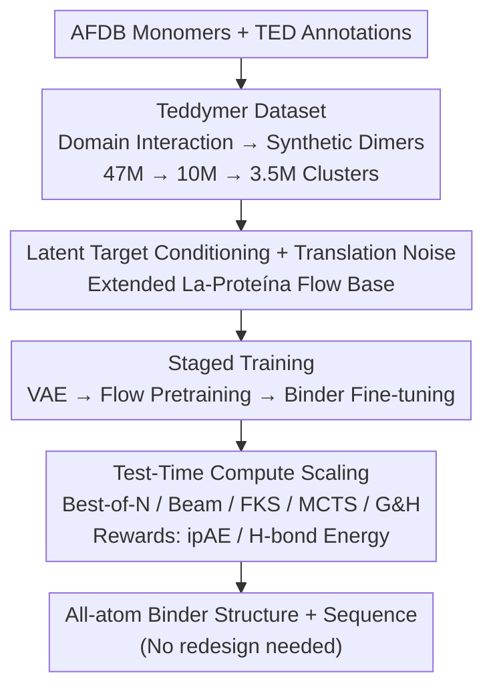

# Scaling Atomistic Protein Binder Design with Generative Pretraining and Test-Time Compute

**Conference**: ICLR 2026  
**OpenReview**: [https://openreview.net/forum?id=qmCpJtFZra](https://openreview.net/forum?id=qmCpJtFZra)  
**Project Page**: [Project page (NVIDIA GenAIR)](https://research.nvidia.com/labs/genair/proteina-complexa/)  
**Code**: To be open-sourced (Source code / Model weights / Teddymer dataset)  
**Area**: AI for Science / Protein Design / Generative Modeling  
**Keywords**: protein binder design, flow matching, test-time scaling, all-atom generation, synthetic datasets

## TL;DR
This paper proposes **Proteína-Complexa (Complexa)**, unifying the long-separated "generative modeling" and "hallucination sequence optimization" paradigms in protein binder design into a single framework. First, a large-scale synthetic dataset, **Teddymer**, derived from domain interactions in AFDB, is used to pretrain an all-atom flow-matching generative base model. During inference, test-time scaling algorithms (Best-of-N, beam search, FKS, MCTS) are adapted with structure predictor confidence as rewards to "search" for strong binders, significantly outperforming hallucination methods like BindCraft under normalized compute budgets.

## Background & Motivation
**Background**: de novo binder design is currently dominated by structural perspectives, primarily split into two camps. One is **generative methods** (e.g., RFDiffusion), which train generative models on "binder–target complex" structures to generate candidates given a target. The other is **hallucination methods** (e.g., BindCraft), which perform gradient-based sequence optimization directly using the confidence/alignment scores of structure predictors like AlphaFold2 as objectives.

**Limitations of Prior Work**: Both approaches have intrinsic flaws. Generative methods rely on experimentally resolved multimeric complexes, which are extremely scarce in the PDB (≈225k entries after filtering), creating a data bottleneck that limits the base model's expressive power; furthermore, many generate only backbones and require ProteinMPNN for sequence redesign. Hallucination methods lack generative priors, resulting in brute-force optimization in a massive sequence space that is slow, prone to local optima, and requires ad-hoc relaxations for discrete sequences.

**Key Challenge**: The authors argue this is a **false dichotomy**. Drawing parallels to language and vision domains—where a pretrained base model and test-time adaptive compute scaling (CoT, test-time scaling) are unified—binder design currently treats generative models as purely training-time optimization and hallucination as purely inference-time optimization without priors. These should be unified.

**Goal**: (1) Resolve data scarcity for generative bases; (2) Build a robust all-atom flow-matching binder generation base; (3) Implement test-time compute scaling on this base to "constrain search within generative priors," achieving both high-quality priors and optimizability.

**Core Idea**: Use the synthetic dataset **Teddymer** to strengthen the generative base, then apply test-time scaling algorithms to the flow model's denoising process using interface scores as rewards—**searching within the generative prior rather than brute-force optimization in raw sequence space.**

## Method

### Overall Architecture
Complexa is a complete pipeline of "data generation → base model pretraining → test-time search optimization." The input is a protein or small-molecule target with hotspot tokens marking the interface; the output is the all-atom binder structure and sequence generated jointly (**removing the need for ProteinMPNN redesign**).

First, the data bottleneck is addressed: using TED domain annotations on AFDB monomers, multi-domain monomers are partitioned into separate domains. "Inter-domain interactions" are treated as proxies for "inter-chain interactions," yielding the **Teddymer** synthetic dataset with 3.5M clusters of dimers. Second, the La-Proteína latent flow-matching base is extended with a **target-conditioning mechanism** and **translation noise** to force global localization. Third, the denoising trajectories of the flow model are treated as searchable objects using **Best-of-N, beam search, FKS, MCTS, and Generate-and-Hallucinate** algorithms guided by interface ipAE rewards.

### Key Designs

**1. Teddymer: Mass-scale Synthetic Data from Inter-domain Interactions**
Generative bases suffer from a lack of paired structures. The insight is that multi-domain proteins in AFDB exhibit real biophysical interactions (interfaces, H-bonds) between domains of the same chain. By splitting these into "synthetic dimers," the authors curate 3.5M clusters from an initial 47M subset. Training utilizes AFDB monomers, Teddymer dimers (filtered by pLDDT > 70, ipAE < 10), PDB multimers, and PLINDER for small molecules. Ablations show that removing Teddymer causes performance to "collapse."

**2. Latent Target Conditioning + Translation Noise**
Complexa builds on La-Proteína, which uses latent flow matching for monomers. The design **conditions only the flow model on the target while keeping the VAE frozen** (the VAE only models the monomer chain). Targets are represented using Atom37 coordinates, amino acid identities, and binary **hotspot tokens**. These features $c_{\text{target}}$ are concatenated with binder latents in the transformer denoiser.

**Translation noise** is added during training: a global random translation $d \sim \mathcal{N}(0, c_d^2)$ is applied to binder $C\alpha$ coordinates. While global position is irrelevant for monomer generation, it is critical for binders to be precisely placed at the interface. This noise **forces the model to continuously refine global localization** throughout the denoising process.

**3. Staged Training: Pretraining to Fine-tuning**
Following large-scale AI strategies, training involves: (1) Training the VAE on AFDB/PDB; (2) **Pretraining** the flow model on AFDB monomer clusters for general structural priors; (3) **Fine-tuning** on binder-target pairs (Teddymer + PDB for proteins, PLINDER with **LoRA** for small molecules).

**4. Test-Time Compute Scaling: Unified Generation and Hallucination**
The stochastic trajectories of the flow model are treated as searchable paths. Rewards are derived from structure predictor interface ipAE scores $f_{\text{ipAE}}$. Five algorithms are adapted:

- **Best-of-N**: Simple parallel sampling.
- **Beam Search**: Maintains a beam of width $N$, splitting into $L$ trajectories, rolling out all candidates to the "clean state" to calculate rewards.
- **Feynman–Kac Steering (FKS)**: Sub-sampling from a tilted distribution $p \exp\{\beta R\}$.
- **MCTS**: Treating denoising as a tree search with UCB to balance exploration/exploitation.
- **Generate-and-Hallucinate (G&H)**: Using the generative model to initialize a candidate for refinement by hallucination methods like BindCraft.

### Loss & Training
The objective is the rectified flow loss with translation noise, regressing vector fields for both $z$ (latent) and $x^{C\alpha}$ (coordinates):

$$\min_{\phi}\ \mathbb{E}\Big[\big\|v_\phi^{z}(\cdot) - (E(x)-z_0)\big\|^2 + \big\|v_\phi^{x}(\cdot) - (x^{C\alpha} - [x^{C\alpha}_0 + d\,\mathbf{1}])\big\|^2\Big]$$

where $d\sim \mathcal{N}(0, c_d^2)$ is the translation noise.

## Key Experimental Results

### Main Results
For protein targets (200 samples/target), the paper reports unique success counts (clustered successes) and novelty.

| Model | Unique Success (Self) ↑ | Unique Success (MPNN) ↑ | Best Method Count ↑ | Time [s] ↓ | Novelty ↓ |
|------|------|------|------|------|------|
| RFDiffusion | – | 4.68 | – | 70.8 | 0.87 |
| Protpardelle-1c | – | 0.73 | – | 8.13 | 0.77 |
| APM | 0.31 | 3.15 | 1 | 73.1 | 0.86 |
| **Complexa (Ours)** | **9.10** | **14.4** | **14** | **15.6** | 0.80 |

Complexa significantly outperforms baselines even without sequence redesign (Self). For small molecules, it outperforms RFDiffusion-AllAtom by factors of 2–5x.

### Ablation Study
| Configuration | Unique Success ↑ | Avg H-Bonds ↑ |
|------|------|------|
| Complexa (No Reward) | 77.00 | 5.271 |
| w/ $f_{\text{ipAE}}$ | 83.36 | 5.524 |
| w/ $f_{\text{H-Bond}}$ | 82.36 | 7.154 |
| w/ $f_{\text{ipAE}} + f_{\text{H-Bond}}$ | **86.26** | 6.518 |

### Key Findings
- **Teddymer and translation noise are essential foundations**: Removing Teddymer leads to a collapse in performance.
- **Rewards are stackable**: Adding H-bond energy rewards significantly improves physical interface properties without sacrificing structural confidence.
- **Difficulty adaptation**: Best-of-N suffices for easy targets, while structured search (Beam/MCTS) is required for hard targets. On extremely difficult targets like TNF-α, Complexa succeeds where all other baselines fail.

## Highlights & Insights
- **Breaking the False Dichotomy**: Reframing binder design as "Pretrained Base + Test-time Compute" aligns protein design with the broader generative AI paradigm.
- **"Domain-as-Chain" Approximation**: Teddymer creates a massive dataset without new experimental data by leveraging internal domain physics.
- **Fourier Interpretation of Positioning**: Identifying global translation as the low-frequency mode in generative trajectories allowed for targeted noise design to improve interface placement.
- **Search within Generative Manifolds**: Constraining search to the high-probability manifold of the generative prior is more efficient than brute-force sequence optimization.

## Limitations & Future Work
- **Purely In-Silico Evaluation**: Success criteria are based on structure predictors (AF2/RF3). While correlated with activity, wet-lab validation is missing.
- **Compute Cost for Hard Targets**: Hard targets require >100 GPU hours for a single success, indicating high absolute costs.
- **Hotspot Dependency**: The benchmark assumes known hotspots; real-world applications require an additional pre-processing step to identify them.

## Related Work & Insights
- **vs. Generative Models (RFDiffusion/APM)**: These rely on limited PDB multimer data and often require separate sequence design. Complexa uses synthetic scale and co-generates all atoms.
- **vs. Hallucination (BindCraft/AlphaDesign)**: These lack priors and optimize in discrete sequence space. Complexa uses generative priors to guide searching.
- **Insight**: The progression from "Synthetic Data → General Base → Task Fine-tuning → Test-time Search" serves as a template for other science-based generative tasks with data scarcity.

## Rating
- Novelty: ⭐⭐⭐⭐⭐ 
- Experimental Thoroughness: ⭐⭐⭐⭐⭐ 
- Writing Quality: ⭐⭐⭐⭐⭐ 
- Value: ⭐⭐⭐⭐⭐ 

<!-- RELATED:START -->

## Related Papers

- [\[ICLR 2026\] Prior-Free Tabular Test-Time Adaptation](prior-free_tabular_test-time_adaptation.md)
- [\[ICLR 2026\] PriorGuide: Test-Time Prior Adaptation for Simulation-Based Inference](priorguide_test-time_prior_adaptation_for_simulation-based_inference.md)
- [\[ICLR 2026\] Exposing Mixture and Annotating Confusion for Active Universal Test-Time Adaptation](exposing_mixture_and_annotating_confusion_for_active_universal_test-time_adaptat.md)
- [\[ICLR 2026\] Buckingham $\pi$-Invariant Test-Time Projection for Robust PDE Surrogate Modeling](buckingham_pi-invariant_testtime_projection_for_robust_pde_surrogate_modeling.md)
- [\[CVPR 2026\] Neural Collapse in Test-Time Adaptation](../../CVPR2026/others/neural_collapse_in_test-time_adaptation.md)

<!-- RELATED:END -->
