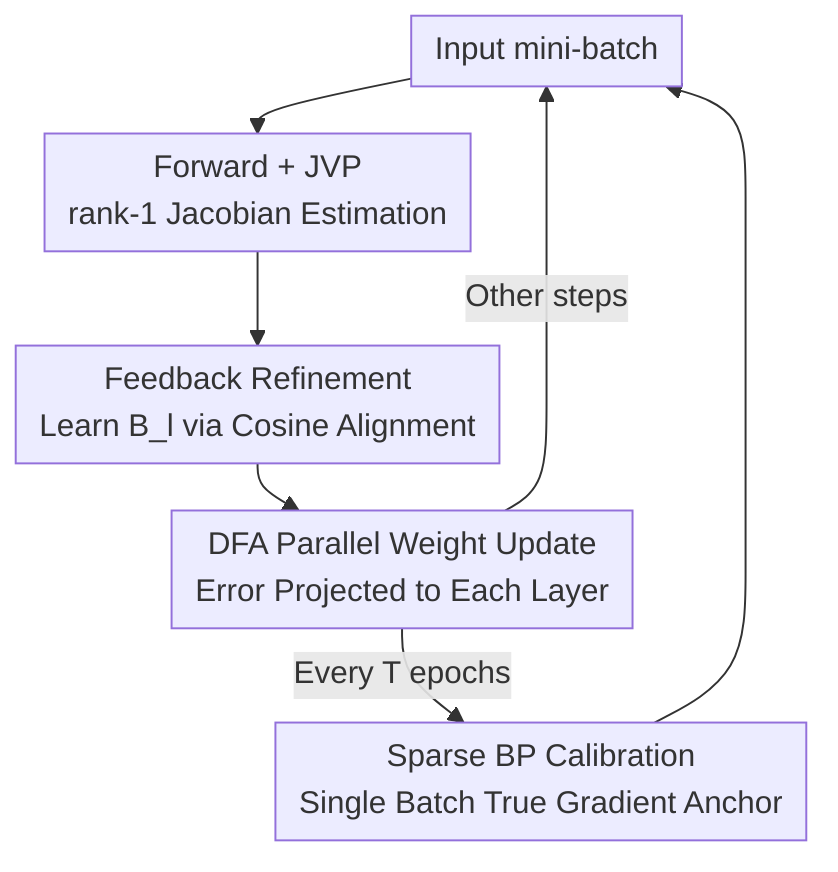

# Scaling Direct Feedback Learning with Jacobian Alignment Guarantees

**Conference**: ICLR 2026  
**OpenReview**: [https://openreview.net/forum?id=kasbbmwk3s](https://openreview.net/forum?id=kasbbmwk3s)  
**Area**: Training Algorithms / Biologically Plausible Learning / Backpropagation Alternatives  
**Keywords**: Direct Feedback Alignment (DFA), Forward Gradient, Jacobian Alignment, Parallel Training, Backpropagation Alternatives

## TL;DR
Addressing the collapse of Direct Feedback Alignment (DFA) in deep convolutional networks and Transformers, this paper proposes GrAPE. By using forward-mode JVP to estimate rank-1 Jacobians and applying a local cosine alignment loss to "correct" random feedback matrices toward the true gradient direction—supplemented by periodic sparse single-batch Backpropagation (BP) calibration—the authors successfully scale DFA-like methods to VGG-16, ResNet, and Transformers for the first time, closing a significant portion of the performance gap with BP while maintaining layer-wise parallel updates.

## Background & Motivation

**Background**: Backpropagation (BP) remains the de facto standard for training deep networks, but it poses two structural obstacles to parallelization: **weight symmetry** (using $W^\top$ in the backward pass) and the **sequential layer-wise propagation** of errors. To bypass these, the community has explored two primary routes: first, random feedback (FA/DFA), where fixed random matrices $B_l$ replace transposed weights, with DFA further projecting the output error **directly** to each layer to achieve true layer-wise parallel updates $\delta a_l = (B_l \nabla\mathcal{L}_L)\odot\sigma'_l(a_l)$; second, Forward Gradient methods, which use forward-mode automatic differentiation (FwAD) to compute Jacobian-vector products along random directions for unbiased gradient estimation, entirely eliminating the backward path.

**Limitations of Prior Work**: While DFA enables parallelism, it is **nearly unusable** on complex architectures—achieving only 1.0% accuracy on VGG-16 and 20.9% on ResNet-20/CIFAR-100 (compared to BP's 68.7%). Forward Gradient methods suffer from **variance that grows linearly with dimensionality** due to sampling in parameter space, making them difficult to scale to modern large-scale models. Both paths face critical dead ends.

**Key Challenge**: The root cause of DFA failure lies in the **lack of guaranteed cosine similarity** between the fixed random feedback direction $B_l$ and the true gradient $\nabla\mathcal{L}_l$. The linear transformation of convolutional layers is essentially a block-Toeplitz structure, which a single fixed random matrix cannot replicate, leading to severe misalignment between feedback and true gradients. The sufficient condition for descent is a Zoutendijk-style alignment: $\cos(\omega_l)=\frac{\nabla\mathcal{L}_l^\top B_l}{\|\nabla\mathcal{L}_l\|\cdot\|B_l\|}>0$. Once this cosine term turns negative, feedback fails to reduce the loss.

**Goal**: To allow feedback matrices to **adaptively align** with the true gradient direction while preserving the layer-wise parallel advantages of DFA, providing provable statistical guarantees for such alignment.

**Key Insight**: The authors observe that while forward gradients have high variance, they provide **unbiased** Jacobian information. Rather than using them directly as gradients (which leads to high variance), they can be used **solely to correct the feedback direction**. A rank-1 Jacobian estimate is sufficient to pull $B_l$ toward the correct direction, and there exists a strictly positive lower bound for the expected cosine between a rank-1 estimate and the true Jacobian.

**Core Idea**: Use forward-mode JVP to estimate a rank-1 Jacobian, learn the feedback matrix $B_l$ online via a local cosine alignment loss (making random feedback "informative"), and suppress variance drift in high dimensions through sparse single-batch BP calibration—marrying the "parallelism of random feedback" with the "alignment guarantees of forward-mode gradients."

## Method

### Overall Architecture

The core of GrAPE (Gradient-Aligned Projected Error) is transforming the "fixed $B_l$ projection" in DFA into a projection using a **$B_l$ that adaptively aligns to the true gradient**. Within each mini-batch, it follows four steps: (1) A forward pass with dual numbers to compute the JVP per layer using forward-mode AD, obtaining a rank-1 Jacobian estimate $\hat{J}_l$; (2) Feedback refinement—performing a gradient update on $B_l$ using a local cosine alignment loss to pull it toward $\hat{J}_l$, followed by column normalization; (3) Executing standard DFA-style layer-wise parallel weight updates using the refined $B_l$; (4) Inserting a true BP pass on a single random mini-batch every $T$ epochs to re-anchor all $W_l$ with exact gradients.

Crucially, steps 1–3 **require no backpropagation**, utilizing only forward-mode JVP (costing approximately one extra forward pass and independent of parameter scaling), meaning most updates are layer-wise parallel. Only step 4 is sequential BP, occurring only once per $T$ epochs on one batch (even at $T=1$, this accounts for only ~0.5% of BP backward passes). This constitutes a **dual-timescale** scheme: high-frequency parallel GrAPE steps + low-frequency sparse BP synchronization.

### Key Designs

**1. Forward rank-1 Jacobian Estimation: Cheap directional signals via JVP**

DFA's fatal flaw is its "blindness" to feedback misalignment. GrAPE uses forward-mode JVP to provide a measuring stick. For the Jacobian of the $l$-th layer $J_l=\frac{\partial\hat{y}}{\partial h_l}$, a perturbation $p\sim\mathcal{N}(0,I_{n_l})$ is taken to compute the JVP $J_l p$, constructing an unbiased rank-1 estimate $\hat{J}_l = (J_l p)\,p^\top$. This step requires only one forward pass with dual numbers, and its cost **does not scale with the number of parameters**.

This is effective because the Frobenius cosine between this rank-1 estimate and the true Jacobian has a **strictly positive expected lower bound**. Substituting $p=r\,s$ (where $s$ is uniform on the unit sphere), one obtains $\cos_F(J_l,\hat{J}_l)=\frac{\|J_l s\|}{\|J_l\|_F}$. Projecting onto the primary singular direction of $J_l$ and using standard bounds for unit sphere coordinates yields:

$$\mathbb{E}\!\left[\cos_F\!\big(J_l,\hat{J}_l\big)\right]\;\ge\;\sqrt{\frac{2}{\pi n_l}}\,\frac{\|J_l\|_2}{\|J_l\|_F},$$

which is strictly positive for any $J_l\neq 0$. Batch estimates (averaging $B$ independent rank-1 estimates) concentrate toward this bound at a rate of $O(1/\sqrt{B})$. This theoretical guarantee supports the alignment objective—aligning toward $\hat{J}_l$ is, in expectation, aligning toward the true Jacobian.

**2. Local Cosine Alignment Loss for Feedback Matrices: Online correction of fixed $B_l$**

With the directional signal $\hat{J}_l$, GrAPE allows $B_l$ to evolve. A **local alignment loss** is used per batch to pull $B_l$ toward the estimate. Defining $\cos(\omega_l):=\cos_F(B_l,\hat{J}_l)=\frac{\langle B_l,\hat{J}_l\rangle_F}{\|B_l\|_F\,\|\hat{J}_l\|_F}$, the alignment loss is:

$$\mathcal{L}_{\text{align}}(B_l)=1-\cos(\omega_l),$$

A single gradient descent step $B_l \leftarrow B_l-\eta_{B_l}\nabla_{B_l}\mathcal{L}_{\text{align}}(B_l)$ is performed, followed by column normalization $B_l[:,k]\leftarrow B_l[:,k]/(\|B_l[:,k]\|+\varepsilon)$ to ensure only direction is adjusted. In practice, the **empirical average of column-wise cosines** $\bar{c}_l$ is used as a proxy for $\cos_F$. This step also avoids BP and only requires forward JVP.

The validity stems from the Zoutendijk perspective and a Frobenius cosine composition lemma: if both $\cos_F(B_l,\hat{J}_l)$ and $\cos_F(\hat{J}_l,J_l)$ have positive lower bounds, a lower bound for $\cos_F(B_l,J_l)$ can be induced. This aligns with standard stochastic approximation results where updates with positive expected cosine to the true gradient converge.

**3. Sparse Single-Batch BP Calibration: Controlling variance drift with minimal sequential cost**

Forward gradient variance grows **linearly with hidden dimensions**. In deep and wide models like VGG-16 or ResNet, pure GrAPE alignment may be distracted by noise, leading to drift. GrAPE counters this by periodic "re-anchoring": every $T$ epochs, a full BP is performed on **only one random mini-batch** to compute exact gradients and update all $W_l$.

The cost is kept minimal—for ResNet-20 on CIFAR-100 with a batch size of 256, there are ~195 batches per epoch. At $T=1$, calibration accounts for only ~0.5% of the backward passes required by BP. The amortized complexity is $O(N_b + 1/T)$ compared to BP's $O(N_b)$. This prevents cumulative variance drift through a two-timescale stable training process.

### Loss & Training
- **Alignment Loss**: $\mathcal{L}_{\text{align}}(B_l)=1-\bar{c}_l$, one step per layer per batch, followed by column normalization.
- **DFA Update**: $\delta a_l=(B_l\nabla\mathcal{L}_L)\odot\sigma'_l(a_l)$ and $\delta W_l=-\eta\,\delta a_l\,h_{l-1}^\top$, layer-wise parallel.
- **Adaptive Perturbation Space**: Perturbations are sampled in whichever space (weight or activation) has **fewer dimensions** per layer to minimize estimation variance.
- **BP Calibration**: Standard BP on one batch every $T$ epochs; Transformers utilize internal BP for attention layers following Launay et al. (2020).

## Key Experimental Results

### Main Results

Shallow networks (no BP calibration required), CIFAR-100 Accuracy:

| Method | Parallelizable | MNIST-CNN | CIFAR10-CNN | CIFAR100-CNN |
|------|--------|-----------|-------------|--------------|
| BP | No | 99.03 | 74.66 | 44.22 |
| FA | No | 98.7 | 71.05 | 35.0 |
| DFA | Yes | 98.6 | 69.34 | 34.53 |
| **GrAPE (Ours)** | **Yes** | **98.8** | **73.1** | **38.0** |

Deep Convolutional Networks + BP Calibration ($T=1$), CIFAR-100:

| Method | AlexNet | VGG-16 |
|------|---------|--------|
| BP | 64.61 | 70.33 |
| DFA | 42.59 | **1.00** |
| DFA + Calib | 49.37 | 29.40 |
| GrAPE | 45.45 | 32.40 |
| **GrAPE + Calib** | **62.63** | **56.93** |

ResNet (CIFAR-100) and Transformer (WikiText-103) Perplexity (lower is better):

| Set-up | BP | DFA | GrAPE | DFA+Calib (T=1) | GrAPE+Calib (T=1) |
|------|----|----|-------|---------------|-----------------|
| ResNet-20 acc | 68.72 | 20.94 | 24.28 | 59.80 | **64.82** |
| ResNet-56 acc | 71.42 | 24.29 | 29.33 | 62.43 | **66.92** |
| Transformer Macro ppl | 29.8 | 52.0 | 42.3 | 42.7 | **33.1** |

### Ablation Study

| Configuration | Key Observation |
|------|---------|
| Pure GrAPE (No Calib) | Outperforms FA/DFA/PEPITA in shallow nets; forward gradients sufficiently accurate in low dimensions. |
| Pure GrAPE vs. Pure DFA | 24.3 vs 20.9 on ResNet-20; adaptive feedback is inherently stronger than fixed random feedback. |
| GrAPE No Calib vs. DFA w/ Calib | GrAPE alone outperforms DFA even when DFA has calibration on VGG-16/Transformer. |
| Calibration Frequency $T$ | Accuracy monotonically decreases as $T$ increases; deeper models rely more on frequent calibration. |

### Key Findings
- **Adaptive feedback is the core driver**: Even without BP calibration, GrAPE consistently outperforms DFA. On VGG-16 and Transformers, "pure GrAPE" even exceeds "DFA with calibration," proving the alignment rule itself is superior.
- **BP calibration is critical for deep models**: On VGG-16, DFA accuracy rises from 1.0% to 29.4% with one calibration/epoch, while GrAPE hits 56.9%. This confirms the hypothesis regarding high-dimensional variance in forward gradients.
- **Parallelism potential**: In mid-sized Transformer prototypes using CUDA streams, GrAPE batch time is ~1/3 of BP, with the advantage increasing with depth.

## Highlights & Insights
- **"Using forward gradients as a compass, not the engine"**: While forward gradients are too noisy for direct updates, their directional signal (positive expected cosine) is perfect for correcting feedback matrices.
- **Coherent theory-to-algorithm chain**: Zoutendijk conditions $\rightarrow$ rank-1 expected cosine bounds $\rightarrow$ cosine composition lemma $\rightarrow$ single alignment loss. This provides a rigorous foundation for why aligning to $\hat{J}_l$ works.
- **Dual-timescale compromise**: The combination of high-frequency parallel approximate steps and extremely sparse exact steps (0.5% backward passes) is a powerful paradigm for "anchoring" cheap approximations.
- **Scaling DFA to modern architectures**: GrAPE is the first DFA-based method to approach BP performance on VGG-16, ResNet-20/56, and Transformer-Base.

## Limitations & Future Work
- **Parallel acceleration not yet fully realized**: Current implementations are serial prototypes; true wall-clock gains require specialized parallel kernels.
- **Dependency on BP calibration for deep nets**: Pure GrAPE still lags behind BP on very deep networks without frequent $T=1$ calibration, meaning the "zero BP" promise is partially compromised for scale.
- **Calibration scheduling**: Fixed-interval calibration could be replaced by event-driven or adaptive calibration triggered by alignment metrics.
- **Transformer internal BP**: Feedback only replaces inter-block communication; attention mechanisms still utilize local internal BP.

## Related Work & Insights
- **vs. DFA (Nøkland, 2016)**: DFA collapses on CNNs/Transformers due to fixed $B_l$; GrAPE learns $B_l$ online via forward JVP, restoring alignment.
- **vs. Forward Gradient (Baydin et al., 2022)**: These use JVP as a gradient directly, suffering from high variance; GrAPE treats it as a low-dimensional alignment signal.
- **vs. Weight Mirroring / SVD methods**: These are often sequential or rely on complex SVD/multi-loss mechanisms; GrAPE uses a single simple cosine loss.

## Rating
- **Novelty**: ⭐⭐⭐⭐⭐ Using rank-1 JVP direction to correct DFA feedback with theoretical cosine bounds is a highly original synthesis.
- **Experimental Thoroughness**: ⭐⭐⭐⭐ Covers various architectures (MLP/CNN/VGG/ResNet/Transformer); however, real-world parallel wall-clock speedup needs more extensive scaling.
- **Writing Quality**: ⭐⭐⭐⭐ Logical chain is very clear, though terms are dense for those unfamiliar with DFA.
- **Value**: ⭐⭐⭐⭐ Provides a theoretically grounded and realistic path toward parallelizing deep network training.

<!-- RELATED:START -->

## Related Papers

- [\[ICLR 2026\] Active Learning for Decision Trees with Provable Guarantees](active_learning_for_decision_trees_with_provable_guarantees.md)
- [\[ICLR 2026\] Noisy-Pair Robust Representation Alignment for Positive-Unlabeled Learning](noisy-pair_robust_representation_alignment_for_positive-unlabeled_learning.md)
- [\[ICLR 2026\] Regulating Internal Alignment Flows for Robust Learning Under Spurious Correlations](regulating_internal_alignment_flows_for_robust_learning_under_spurious_correlati.md)
- [\[ICLR 2026\] Learning Adaptive Distribution Alignment with Neural Characteristic Function for Graph Domain Adaptation](learning_adaptive_distribution_alignment_with_neural_characteristic_function_for.md)
- [\[ACL 2025\] HelpSteer3: Human-Annotated Feedback and Edit Data to Empower Inference-Time Scaling](../../ACL2025/others/helpsteer3_human-annotated_feedback_and_edit_data_to_empower_inference-time_scal.md)

<!-- RELATED:END -->
