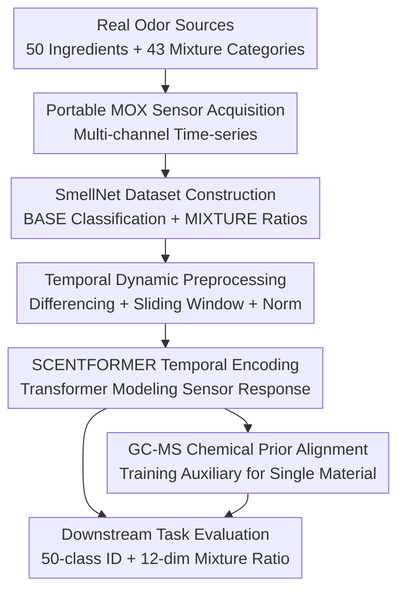

# SmellNet: A Large-scale Dataset for Real-world Smell Recognition

**Conference**: ICLR2026  
**OpenReview**: [https://openreview.net/forum?id=aUnheo6zFD](https://openreview.net/forum?id=aUnheo6zFD)  
**Code**: https://github.com/MIT-MI/SmellNet  
**Area**: Others  
**Keywords**: Machine Olfaction, Gas Sensors, Time-series Modeling, GC-MS, Mixture Recognition  

## TL;DR
SmellNet establishes a machine olfaction benchmark using low-cost portable gas sensors to collect real-world temporal signals from 50 natural ingredients and 43 categories of odor mixtures, proposes SCENTFORMER which integrates temporal differencing, sliding windows, and GC-MS chemical priors.

## Background & Motivation
**Background**: While AI has reached maturity in vision, text, and speech with large-scale data and evaluation protocols, "smelling" remains in its early stages. Existing olfactory data are generally split into two types: human semantic ratings of single-molecule or mixed odors, and readings from electronic noses/gas sensors for a small number of samples. The former is closer to human perception labels, while the latter is closer to deployable hardware, but both are limited in scale, coverage, and standardization.

**Limitations of Prior Work**: Real-world applications require portable, real-time, and deployable olfactory AI—such as food allergen detection, manufacturing monitoring, environmental sensing, or identification of volatiles related to disease/stress. Past work often relied on GC-MS data from bulky chemical equipment or used manual features and simple classifiers on small datasets. These approaches are either non-portable or lack the dynamic signals captured by sensors over time under environmental perturbations.

**Key Challenge**: Odors are complex chemical mixtures. Single channels in low-cost MOX (Metal-Oxide) sensors are not "precision instruments" for measuring specific compounds. They exhibit cross-sensitivity to multiple volatiles, and readings are affected by drift, baseline shifts, and ambient conditions. Therefore, the key to machine olfaction is not interpreting a single channel as an absolute concentration, but learning relative changes, short-term dynamics, and compositional patterns in multi-channel temporal responses.

**Goal**: The authors aim to provide the missing infrastructure for this field: a sufficiently large, realistic, and reproducible sensor-side machine olfaction dataset. It must support both 50-class classification of single substances and component ratio prediction for mixtures. Additionally, the paper provides a temporal model baseline to evaluate the gains from temporal dynamics, GC-MS chemical priors, and mixture modeling.

**Key Insight**: Rather than starting from human olfactory descriptors or expensive chemical instruments, the authors directly construct a portable gas sensor array. The model is trained on multi-channel time series seen by real devices. This engineering-centric approach ensures that if low-cost sensor readings contain enough discriminative information, olfactory AI can eventually become real-time, low-power, and deployable.

**Core Idea**: Using large-scale real-world sensor temporal data as the fundamental machine olfaction benchmark, and converting low-resolution gas readings into learnable odor representations via temporal differencing, sliding windows, and GC-MS alignment.

## Method

### Overall Architecture
The SmellNet workflow follows two main paths: data construction and modeling/evaluation. Data is collected using portable MOX sensors in controlled containers for natural ingredients and mixed materials. For modeling, signals are segmented into windows, processed via temporal differencing and normalization, and then encoded by SCENTFORMER to predict substance categories or mixture ratios. In single-substance tasks, GC-MS embeddings are used for cross-modal supervision. The focus is on standardizing the pipeline: how odor signals are collected, preprocessed, and evaluated.

On the data side, SMELLNET-BASE includes 50 basic substances covering nuts, spices, herbs, fruits, and vegetables. Each substance is sampled 6 times for 10 minutes each at 1 Hz across 6 sensor channels, totaling ~50 hours and 180,000 timesteps. SMELLNET-MIXTURE selects 12 base odors to construct binary and ternary mixtures with fixed volume ratios. Due to the acquisition environment, mixtures use 4 channels at 10 Hz, totaling 18 hours and 648,000 timesteps. The combined dataset comprises 68 hours and 828,000 timesteps.

On the modeling side, SCENTFORMER treats each sample as a multi-channel time series $x=(x_1,\ldots,x_T)\in\mathbb{R}^{T\times d}$. An encoder $f_\theta$ outputs a fixed-dimensional representation $h=f_\theta(x)$. For BASE, the task is 50-class classification; for MIXTURE, the task is predicting a 12-dimensional recipe ratio vector $\pi\in[0,1]^{12}$ where $\sum_i\pi_i=1$.

### Key Designs
**1. Sensor-side Large-scale Benchmark: Moving Olfaction from Small Demos to Reproducible Experiments**

The core contribution is the dataset. Authors use an array of MQ-3, MQ-5, and Grove Multichannel Gas Sensor V2 to record channels labeled by manufacturers as CO, NO2, VOC, Alcohol, etc. The paper emphasizes these labels are not precise concentration measurements of pure compounds; MOX sensors are cross-sensitive. Thus, the dataset focuses on multi-channel joint temporal patterns rather than interpreting each channel as a single chemical substance.

The acquisition protocol ensures "learnability." Each base substance is repeated across 6 sessions on different days in controlled containers for 10 minutes, followed by ventilation to minimize residue. The mixture part includes 126 recipe instances across 12 materials, distinguishing between "test-seen" (seen ratios/combinations in different sessions) and "test-unseen" (unseen combinations or ratios) to test compositional generalization.

**2. Temporal Dynamic Preprocessing: Using Differencing and Windows to Expose Odor Response**

Absolute MOX sensor readings are prone to drift and background bias. To move away from static features, authors use first-order temporal differencing: for a fixed lag $p$, they calculate $\Delta x_t=x_t-x_{t-p}$. This shifts model attention from "absolute reading" to "recent rate of change," which better represents MOX sensor responses to the accumulation and diffusion of volatiles.

Sliding windows balance sample size and temporal context. Each 10-minute record is cut into windows of length $w$ with a stride of $w/2$. For BASE at 1 Hz ($T=600$), $w=100$ yields 11 windows. Experiments show $w=100$ and a lag of $p=25$ are key to improving single-substance recognition.

**3. SCENTFORMER Temporal Encoding: Treating Sensor Readings as Sequences**

SCENTFORMER uses a pre-norm Transformer encoder. Multi-channel readings at each timestep within a window are linearly projected, supplemented with positional encodings and a learnable `[CLS]` token, and passed through multiple Transformer layers. Output is aggregated via mean or `[CLS]` pooling. This captures patterns of how different channels rise, lag, saturate, or fall together over time.

**4. GC-MS Chemical Priors: Calibrating Low-Res Sensor Representations with High-Res Chemical Info**

Food and odor material volatiles can be obtained from GC-MS descriptions in databases like FooDB. Authors construct a fixed GC-MS embedding for each base ingredient (Xspec version) by binning EI mass spectra (40-500 m/z) at 1 Da resolution.

During training, sensor window embeddings and corresponding ingredient GC-MS embeddings are aligned via symmetric contrastive learning. This provides a chemical structural anchor for low-cost sensor representations. GC-MS is used only during training; inference requires only the portable sensor readings.

### Loss & Training
BASE single-substance recognition uses softmax cross-entropy. With GC-MS supervision, a symmetric contrastive loss is added to minimize the distance between sensor embeddings $z_i^{(s)}$ and GC-MS embeddings $z_i^{(g)}$.

MIXTURE tasks predict a 12-dimensional normalized ratio vector. The training loss is a combination of KL divergence to constrain the distribution, hinge-$\ell_1$ to penalize ratio errors on present components beyond tolerance $\epsilon$, and focal BCE to handle the class imbalance of component presence/absence.

## Key Experimental Results

### Main Results
| Task | Setting | Best Model | Key Metrics | Conclusion |
|------|------|---------------|----------|------|
| SMELLNET-BASE | Sensor-only, $w=100,p=25$ | SCENTFORMER | Acc@1 56.1 / F1 55.5 | Diff + long windows significantly improve recognition |
| SMELLNET-BASE | GC-MS contrastive, $w=100,p=25$ | SCENTFORMER | Acc@1 63.3 / F1 61.7 | GC-MS supervision boosts Top-1 by 7.2 points |
| SMELLNET-MIXTURE seen | $w=50$ | SCENTFORMER | MAE 0.0395 / Top-1@0.1 50.2 | Cross-session generalization for seen mixes is effective |
| SMELLNET-MIXTURE unseen | $w=50$ | SCENTFORMER | Top-1@0.1 16.0 / Top-K 38.9 | Generalization to unseen mixes remains challenging |

### Ablation Study
- **Temporal Differencing**: Average improvement of ~16.1% Acc@1 across models. Relative changes are more discriminative than absolute readings.
- **Window Length**: $w=100$ provides more stable context than $w=50$ in leave-one-day-out tests.
- **GC-MS Encoding**: Xspec (mass spectra) performs better than Xatom (elemental composition).
- **Single Channel Mask**: Masking the LPG channel caused a 28ndrop in Acc@1, showing the importance of individual gas sensitivity.

### Key Findings
- Temporal differencing mitigates slow drift and baseline bias, focusing the model on the rate of change as odor enters the container.
- Fruits and spices are easier to separate; nuts and vegetables show significant overlap under current sensor resolution.
- GC-MS alignment is more beneficial for weaker models or raw signals; it sometimes conflicts with short-term temporal features in strong models.
- Compositional generalization in mixtures (unseen split) is significantly harder than seen sessions, exposing a major frontier in machine olfaction.

## Highlights & Insights
- The value lies in returning olfactory AI to a standard benchmark. SmellNet provides a reproducible foundation for portable sensor machine olfaction.
- The interpretation of MOX sensors is restrained; the authors acknowledge cross-sensitivity rather than claiming precise chemical concentration measurements.
- The use of GC-MS is pragmatic: high-cost modal supervision during training, low-cost modal inference.
- SCENTFORMER is computationally efficient, with inference taking <0.05 ms per window, suggesting the bottleneck lies in data acquisition and sensor reliability rather than model speed.

## Limitations & Future Work
- Data collection is in controlled containers, lacking background noise, airflow variations, and long-term drift tests in open environments.
- SMELLNET-MIXTURE materials are oils/extracts, which may not fully represent the complexity of natural food mixtures.
- GC-MS priors come from public databases, not synchronous measurements of the specific samples used, failing to account for session-specific volatility or humidity.
- Future work needs more categories, finer concentrations, and cross-hardware generalization.

## Related Work & Insights
- **vs Human Odor Datasets**: Unlike DREAM Challenge or Dravnieks Atlas which focus on semantic ratings, SmellNet focuses on sensor readings for deployable hardware.
- **vs GC-MS/Molecular Models**: While DeepNose uses chemical structures, SmellNet handles low-resolution, noisy, real-time sensor sequences.
- **vs Electronic Noses**: Traditional datasets are often small or task-specific (e.g., beef quality); SmellNet is a unified, larger-scale natural ingredient benchmark.

## Rating
- Novelty: ⭐⭐⭐⭐☆ Large-scale sensor-side benchmark is rare; contribution is foundational.
- Experimental Thoroughness: ⭐⭐⭐⭐☆ Covers BASE/MIXTURE, GC-MS, and temporal ablations; open-world generalization is pending.
- Writing Quality: ⭐⭐⭐⭐☆ Clear pipeline; supplementary material is necessary for technical nuances.
- Value: ⭐⭐⭐⭐⭐ Vital infrastructure for machine olfaction and portable sensing.

## Related Papers

- [\[CVPR 2026\] ImmerIris: A Large-Scale Dataset and Benchmark for Off-Axis and Unconstrained Iris Recognition in Immersive Applications](../../CVPR2026/others/immeriris_a_large-scale_dataset_and_benchmark_for_off-axis_and_unconstrained_iri.md)
- [\[CVPR 2026\] UniMERNet: A Universal Network for Real-World Mathematical Expression Recognition](../../CVPR2026/others/unimernet_a_universal_network_for_real-world_mathematical_expression_recognition.md)
- [\[CVPR 2026\] MSPT: Efficient Large-Scale Physical Modeling via Parallelized Multi-Scale Attention](../../CVPR2026/others/mspt_efficient_large-scale_physical_modeling_via_parallelized_multi-scale_attent.md)
- [\[CVPR 2026\] Multi-view Crowd Tracking Transformer with View-Ground Interactions Under Large Real-World Scenes](../../CVPR2026/others/multi-view_crowd_tracking_transformer_with_view-ground_interactions_under_large_.md)
- [\[ICML 2026\] Torus Graphs for Large-Scale Neural Phase Analysis](../../ICML2026/others/torus_graphs_for_large_scale_neural_phase_analysis.md)

<!-- RELATED:END -->

<!-- RELATED:START -->

## Related Papers

- [\[CVPR 2026\] ImmerIris: A Large-Scale Dataset and Benchmark for Off-Axis and Unconstrained Iris Recognition in Immersive Applications](../../CVPR2026/others/immeriris_a_large-scale_dataset_and_benchmark_for_off-axis_and_unconstrained_iri.md)
- [\[CVPR 2026\] UniMERNet: A Universal Network for Real-World Mathematical Expression Recognition](../../CVPR2026/others/unimernet_a_universal_network_for_real-world_mathematical_expression_recognition.md)
- [\[CVPR 2026\] MSPT: Efficient Large-Scale Physical Modeling via Parallelized Multi-Scale Attention](../../CVPR2026/others/mspt_efficient_large-scale_physical_modeling_via_parallelized_multi-scale_attent.md)
- [\[CVPR 2026\] Multi-view Crowd Tracking Transformer with View-Ground Interactions Under Large Real-World Scenes](../../CVPR2026/others/multi-view_crowd_tracking_transformer_with_view-ground_interactions_under_large_.md)
- [\[ICML 2026\] Torus Graphs for Large-Scale Neural Phase Analysis](../../ICML2026/others/torus_graphs_for_large_scale_neural_phase_analysis.md)

<!-- RELATED:END -->
