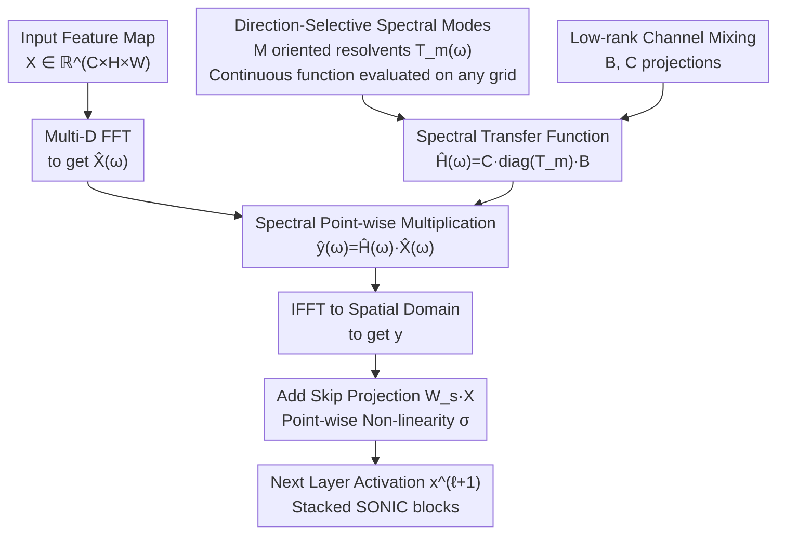

# SONIC: Spectral Oriented Neural Invariant Convolutions

**Conference**: ICLR 2026  
**arXiv**: [2601.19884](https://arxiv.org/abs/2601.19884)  
**Code**: None  
**Area**: Others / Computer Vision  
**Keywords**: Spectral Convolution, Directional Invariance, Continuous Parameterization, Global Receptive Field, Resolution Adaptation

## TL;DR

SONIC transfers the core concepts of State Space Models (SSMs) to the multi-dimensional frequency domain. By defining a set of direction-selective spectral transfer functions with 6 continuous parameters (amplitude, direction, damping, oscillation, etc.) and mixing across channels via low-rank matrices $B$ and $C$, it achieves a convolutional replacement operator with inherent global receptive fields and resolution invariance. It matches nnU-Net on 3D medical segmentation with nearly two orders of magnitude fewer parameters and remains competitive on ImageNet.

## Background & Motivation

**Background**: The two dominant paradigms for image feature extraction are CNNs and ViTs. CNNs scan local patches with fixed-size kernels, requiring extremely deep networks to indirectly capture global context. ViTs provide global connectivity through self-attention but lack structured spatial inductive biases, depend on explicit positional encodings, and suffer from quadratic computational complexity relative to resolution. Spectral methods like GFNet and FNO attempt direct operations in the Fourier domain but still face significant limitations.

**Limitations of Prior Work**: Filter parameters in GFNet are tied to a discrete FFT grid—the filter size equal to the input spatial resolution—requiring retraining or interpolation for resolution changes. While FNO handles continuous functions, it lacks directional awareness, treating all frequency directions equally and making it difficult to efficiently capture edges and textures in natural images. Furthermore, the parameter count of existing spectral methods is typically tied to the frequency domain dimensions, which is unacceptable in high-resolution 3D medical imaging scenarios.

**Key Challenge**: There is an inherent tension between global receptive fields and resolution independence—traditional spatial convolutions are local but resolution-friendly, while frequency-domain methods are global but restricted to discrete grids. Moreover, directional selectivity is crucial for visual tasks (akin to direction-selective neurons in the V1 cortex), yet widely ignored by current spectral methods.

**Goal**: (1) How to design a truly continuous frequency-domain convolutional parameterization independent of discrete grids? (2) How to introduce directional awareness priors while maintaining an extremely low parameter count? (3) How to enable a single architecture to switch seamlessly between 2D/3D and different resolutions?

**Key Insight**: The authors observe that the core of State Space Models (e.g., S4, Mamba)—generating global kernels through a few continuous parameters—can be generalized from 1D sequences to the multi-dimensional frequency domain. Each "mode" defines a directional transfer function in frequency space using an oriented analytic function (resolvent). A small number of modes combined via low-rank matrices can cover a rich variety of frequency responses.

**Core Idea**: Parameterize direction-selective global convolutional kernels in the frequency domain using SSM-style continuous resolvent functions, achieving extreme parameter efficiency and global receptive fields via low-rank decomposition.

## Method

### Overall Architecture

SONIC aims to replace traditional spatial convolutions with an operator that possesses a global receptive field in a single layer and remains independent of input resolution. The approach moves convolution to the frequency domain: an input feature map $X \in \mathbb{R}^{C \times H \times W}$ (or 3D volume) is transformed via multi-dimensional FFT to $\hat{X}(\omega)$, multiplied point-wise by a transfer function $\hat{H}(\omega)$ (equivalent to global convolution in the spatial domain), and then transformed back via IFFT. The core lies in the parameterization of $\hat{H}(\omega)$: rather than a learnable tensor tied to the FFT grid size, it is a continuous function derived on-the-fly from a small set of oriented resolvents at arbitrary frequency coordinates, mixed across channels by low-rank matrices $B$ and $C$. Since spectral multiplication is linear, each SONIC block adds a learnable skip projection $W_s X$ and a point-wise non-linearity $\sigma$ after the IFFT to build depth.

### Key Designs

**1. Direction-Selective Spectral Modes: Helping filters "recognize" edge orientations**

A common flaw in existing spectral methods is isotropy—operators like FNO respond only to the frequency magnitude $\|\omega\|$. However, natural image energy is unevenly distributed across directions; an edge corresponds to high frequencies in a specific orientation. SONIC addresses this by defining the spectral operator as a superposition of $M$ oriented "modes," where each mode $m$ is a continuous transfer function in resolvent form:

$$T_m(\omega) = \frac{1}{i\,s_m(\omega \cdot v_m) - a_m + \gamma_m \,\lVert (I - v_m v_m^\top)\,\omega \rVert_2^2}$$

It is characterized by a few continuous parameters: a unit direction vector $v_m$ (a "compass" in frequency space), a scale $s_m > 0$, a complex number $a_m$ (where $\mathrm{Re}(a_m)$ acts as damping and $\mathrm{Im}(a_m)$ controls oscillation), and a transverse penalty $\gamma_m \ge 0$. The term $\omega \cdot v_m$ projects frequency onto the mode's direction, while $(I - v_m v_m^\top)\omega$ represents the orthogonal component. Consequently, only frequency components aligned with $v_m$ are amplified, while others are suppressed by the $\gamma_m$ term, naturally yielding anisotropic directional filtering.

**2. Low-rank Channel Mixing Matrices $B, C$: Covering many channels with few modes**

Sharing $M$ modes is insufficient; they must be mapped to $C$ input and $K$ output channels. Instead of learning a separate response for every channel pair, SONIC uses a pair of matrices: $B \in \mathbb{C}^{M \times C}$ projects input channels into the $M$-dimensional mode space, and $C \in \mathbb{C}^{K \times M}$ maps them back. The frequency response for any channel pair $(c \to k)$ is:

$$\hat{H}_{k,c}(\omega) = \sum_{m=1}^{M} C_{km}\, T_m(\omega)\, B_{mc}$$

Since typically $M \ll C, K$, this is essentially a low-rank decomposition. The parameter count is $O(M(C+K))$ plus a few parameters per mode, which is 1–2 orders of magnitude smaller than traditional $O(C_{in} \cdot C_{out} \cdot k^d)$ convolutions.

**3. Continuous Resolution Invariance: Using the same parameters for any resolution**

In medical imaging, resolutions often vary by machine (e.g., MRI slices from 1mm to 5mm). SONIC decouples resolution from parameters: because each mode $T_m(\omega)$ is a continuous analytic function, changing resolution simply samples the same function on a denser or sparser FFT grid. No parameters need to change. This contrasts with GFNet (grid-fixed masks) or FNO (fixed low-frequency coefficients), which are tied to specific frequency indices.

### Loss & Training

- Classification tasks use standard Cross-Entropy; 3D medical segmentation uses a combined Dice + CE loss.
- SONIC blocks can directly replace convolutional layers in architectures like ResNet or U-Net, compatible with original training protocols.
- Medical experiments follow nnU-Net standard protocols for fair comparison.
- ImageNet experiments were limited to 200k steps due to compute constraints but demonstrate competitive results.

## Key Experimental Results

### Main Results — 3D Medical Image Segmentation

SonicNet (replacing spatial convolutions in nnU-Net with SONIC blocks) was benchmarked against standard methods:

| Method | Dataset | Dice Score | Parameters | Note |
|------|--------|-----------|--------|------|
| nnU-Net (3×3×3 conv) | PROMIS / Prostate158 | Baseline | ~31M | De facto standard |
| SonicNet | PROMIS / Prostate158 | Match/Exceed | **~0.4M** | **~80x fewer** |
| ViT baseline | PROMIS / Prostate158 | Lower | ~25M | Lack of spatial priors |

### Synthetic Benchmarks and ImageNet

| Experiment | Method | Key Result | Note |
|------|------|---------|------|
| SynthShape (Robustness) | CNN/ViT/SONIC | SONIC has minimal decay under rotation/noise | Geometric robustness |
| HalliGalli (Global Field) | CNN/ViT/GFNet/SONIC | **Only SONIC succeeds** | Requires distance sensing |
| ImageNet (200k steps) | Various | Competitive with 10x fewer parameters | Limited budget comparison |
| ImageNet Downsampling | Various | SONIC shows least performance decay | Resolution invariance |

### Ablation Study

| Configuration | Key Change | Note |
|------|---------|------|
| Full SonicNet | Baseline | Full model |
| Remove Directionality | Significant performance drop | Directional awareness is core |
| Discrete Learnable Spectrum | Loss of resolution generalization | Continuous params are key |

### Key Findings

- **Directional Selectivity is Vital**: Removing directional parameters leads to a significant performance drop, proving that anisotropic frequency priors are more effective than isotropic ones.
- **HalliGalli Demonstrates "Effective" Receptive Field**: CNNs fail due to local fields; ViT and GFNet collapse under noise. SONIC remains robust, proving its global connectivity is practically effective.
- **Extreme Efficiency**: Matching 31M-parameter performance with 0.4M parameters suggests massive redundancy in traditional 3D kernels.

## Highlights & Insights

- **Bridge from SSM to Multi-D Frequency Domain**: SONIC generalizes the concept of "generating global kernels from continuous parameters" to the frequency domain for multi-dimensional signals, creating a new path for sequence-modeling advances in vision.
- **Effective Receptive Field via HalliGalli**: The HalliGalli task serves as a "litmus test" to verify if a model's theoretical global field is practically usable for distant information coordination.
- **Deployment Advantage**: The ability to train once and deploy across various resolutions is highly valuable for medical imaging where scanning protocols vary.

## Limitations & Future Work

- **Linearity of SONIC Block**: Spectral multiplication is inherently linear. Frequent FFT/IFFT operations between blocks carry overhead, and frequency-domain non-linearity remains an open question.
- **Under-trained ImageNet**: Due to constraints, ImageNet results only show "competitiveness" rather than "superiority." Full training is required for a final verdict.
- **Hybrid Architectures**: The paper focuses on "pure" SONIC; mixing it with spatial convs (local for low levels, SONIC for global) might be optimal.

## Related Work & Insights

- **vs GFNet**: GFNet uses masks tied to the FFT grid; SONIC uses continuous parameterization to solve resolution changes while reducing parameters from $O(HW)$ to $O(K)$.
- **vs FNO**: FNO lacks directional selectivity; SONIC’s oriented resolvents provide anisotropic responses essential for vision.
- **vs nnU-Net**: Matches performance with 1/80th of the parameters, highlighting the inefficiency of 3D spatial kernels.

## Rating

- Novelty: ⭐⭐⭐⭐
- Experimental Thoroughness: ⭐⭐⭐
- Writing Quality: ⭐⭐⭐
- Value: ⭐⭐⭐⭐

<!-- RELATED:START -->

## Related Papers

- [\[ICLR 2026\] Adaptive Canonicalization with Application to Invariant Anisotropic Geometric Networks](adaptive_canonicalization_with_application_to_invariant_anisotropic_geometric_ne.md)
- [\[ICLR 2026\] Buckingham $\pi$-Invariant Test-Time Projection for Robust PDE Surrogate Modeling](buckingham_pi-invariant_testtime_projection_for_robust_pde_surrogate_modeling.md)
- [\[ICML 2026\] Continual Learning of Domain-Invariant Representations](../../ICML2026/others/continual_learning_of_domain-invariant_representations.md)
- [\[ICML 2026\] Learning Permutation-Invariant Macroscopic Dynamics](../../ICML2026/others/learning_permutation-invariant_macroscopic_dynamics.md)
- [\[ICLR 2026\] CircuitNet 3.0: A Multi-Modal Dataset with Task-Oriented Augmentation for AI-Driven Circuit Design](circuitnet_30_a_multi-modal_dataset_with_task-oriented_augmentation_for_ai-drive.md)

<!-- RELATED:END -->
