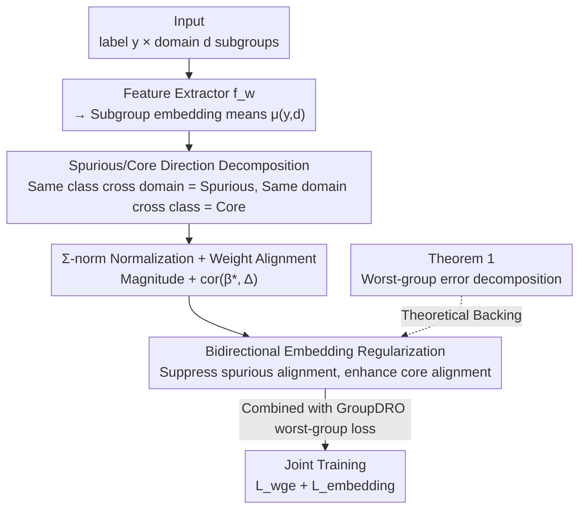

# Spurious Correlation-Aware Embedding Regularization for Worst-Group Robustness

**Conference**: ICLR 2026  
**OpenReview**: [https://openreview.net/forum?id=Grb5AOs7WC](https://openreview.net/forum?id=Grb5AOs7WC)  
**Code**: https://github.com/MLAI-Yonsei/SCER  
**Area**: Robustness / Spurious Correlation / Worst-Group Generalization  
**Keywords**: Spurious correlation, Worst-group accuracy, Embedding regularization, Subpopulation shift, GroupDRO

## TL;DR
SCER provides the first theoretical decomposition of "worst-group error = classifier dependence on spurious directions − dependence on core directions." Based on this, a regularization term is added directly in the embedding space to suppress the alignment of classifier weights with "spurious directions" and enhance alignment with "core directions," achieving SOTA worst-group accuracy across six benchmarks: Waterbirds, CelebA, MetaShift, ColorMNIST, CivilComments, and MultiNLI.

## Background & Motivation

**Background**: Deep models often rely on spurious correlations in the training set—patterns like "waterbirds always appearing against water backgrounds" that are statistically correlated with labels but lack causal relationships. When subpopulation shifts occur at test time, models predicting via these shortcut features fail on underrepresented minority groups, leading to extremely low worst-group accuracy. This is a common failure of ERM, which minimizes average loss while ignoring subpopulation imbalances.

**Limitations of Prior Work**: Methods for mitigating spurious correlations generally fall into four categories: subpopulation robustness (GroupDRO, LISA, PDE via reweighting/multi-stage training/special losses), domain invariance (IRM, CORAL via feature distribution alignment), data augmentation, and class imbalance. However, these methods almost all influence the model **indirectly**: either by reweighting samples or aligning distributions at the output layer. **None explicitly constrain "how exactly spurious features are encoded within the embedding space."** Consequently, spurious correlations persist in the representations, limiting robustness gains.

**Key Challenge**: Current methods lack a theory that directly links the "representational structure of the embedding space" to "worst-group error." Without knowing which parts of the embedding correspond to spurious versus core features, it is impossible to precisely suppress the former while strengthening the latter.

**Goal**: (1) Theoretically decompose worst-group error into measurable structures within the embedding space; (2) Design a regularization term acting directly on the embedding layer to force the model to focus on core features and reduce sensitivity to spurious patterns.

**Key Insight**: Under the setting where subpopulations are formed by "label $y$ × domain $d$," the difference between embedding means of the same class across different domains naturally characterizes "domain-driven spurious variations." Conversely, the difference between embedding means within the same domain across different classes characterizes "label-driven core variations." By decoupling these two directions, they can be measured and intervened upon separately.

**Core Idea**: Rewrite the worst-group error in terms of the "alignment between classifier weights and spurious/core directions," then add regularization in the embedding space to decrease spurious alignment and increase core alignment.

## Method

### Overall Architecture

SCER (Spurious Correlation-Aware Embedding Regularization) aims to directly and explicitly weaken spurious correlations at the embedding layer. The overall workflow is: input data is encoded into embeddings $x_{emb}$ by a feature extractor $f_w$; embedding means $\mu_{(y,d)}$ are calculated for each "label-domain" subpopulation $(y,d)$; these means are used to differentiate **spurious directions** $\Delta_{spur}$ (same-class across-domain difference) and **core directions** $\Delta_{core}$ (same-domain across-class difference); these are normalized using the $\Sigma$-norm to obtain spurious/core magnitudes, and the alignment between current classifier weights $\beta^*$ and both directions is measured to form spurious and core losses; finally, this embedding regularization is added to the GroupDRO worst-group classification loss for joint training. The validity of this design is backed by Theorem 1 (Worst-group error decomposition).

### Key Designs

**1. Differentiating "Spurious Directions" and "Core Directions" via Mean Differences: Turning abstract spurious correlations into two computable vectors**

Existing methods cannot pinpoint "where spurious features are hidden in the embeddings." The first step of SCER is to explicitly locate them. For each subgroup $(y,d)$, the mean embedding $\mu_{(y,d)} = \mathbb{E}_{x\sim P_{y,d}}[f_w(x)]$ is calculated as a representative vector. Two types of differences are then taken: the mean difference of the same class $y$ across different domains $d_i, d_j$, $\Delta^{(y,d_{i,j})}_{spur} = \mu_{(y,d_i)} - \mu_{(y,d_j)}$, captures variations where "the domain changes but the label does not," which are the **spurious** variations that should be neutralized. The mean difference within the same domain $d$ across different classes $y_i, y_j$, $\Delta^{(y_{i,j},d)}_{core} = \mu_{(y_i,d)} - \mu_{(y_j,d)}$, captures true discriminative signals where "the label changes," which are the **core** variations that should be strengthened. Aggregating these differences via expectations over classes/domains yields global spurious directions $\Delta_{spur} = \mathbb{E}_{y}[\Delta^{(y,d_{i,j})}_{spur}]$ and core directions $\Delta_{core} = \mathbb{E}_{d}[\Delta^{(y_{i,j},d)}_{core}]$. The ingenuity of this step lies in identifying spurious/core components purely from the geometry of the "label × domain" grid without requiring extra spurious attribute annotations.

**2. $\Sigma$-norm Normalization and Weight Alignment: Measuring "how much the model relies on spuriousness" using the correlation between classifier weights and directions**

Directions alone are insufficient; a scalar is needed to quantify the classifier's dependency. SCER uses the $\Sigma$-norm $\|v\|_\Sigma = \sqrt{v^\top \Sigma v}$ (where $\Sigma$ is the empirical covariance matrix of embedding vectors) to normalize directions, obtaining spurious magnitude $\|\Delta_{spur}\|_\Sigma$ and core magnitude $\|\Delta_{core}\|_\Sigma$. The $\Sigma$-norm is chosen over the Euclidean norm to account for the geometric structure of the embedding space (varying variance across dimensions), directly corresponding to the Gaussian assumptions in Theorem 1. Subsequently, the per-class average correlation between the classifier weight matrix $\beta^* = [\beta_1^*,\dots,\beta_m^*]$ and both directions is calculated:

$$\mathrm{cor}(\beta^*, \Delta_{spur}) = \frac{1}{m}\sum_{j=1}^{m} \frac{\langle \beta_j^*, \Delta_{spur}\rangle}{\|\beta_j^*\|_\Sigma \cdot \|\Delta_{spur}\|_\Sigma}, \quad \mathrm{cor}(\beta^*, \Delta_{core}) = \frac{1}{m}\sum_{j=1}^{m} \frac{\langle \beta_j^*, \Delta_{core}\rangle}{\|\beta_j^*\|_\Sigma \cdot \|\Delta_{core}\|_\Sigma}$$

A larger weight-spurious alignment $\mathrm{cor}(\beta^*,\Delta_{spur})$ indicates the decision boundary relies more on domain-specific shortcuts; a larger weight-core alignment indicates greater reliance on domain-consistent discriminative directions. These two scalars serve as direct targets for regularization.

**3. Bidirectional Spurious/Core Regularization Loss: Suppressing one and enhancing the other, derived from theoretical decomposition**

With alignment and magnitude defined, SCER defines spurious loss $L_{spur} = \mathrm{cor}(\beta^*, \Delta_{spur})\|\Delta_{spur}\|_\Sigma$ and core loss $L_{core} = \mathrm{cor}(\beta^*, \Delta_{core})\|\Delta_{core}\|_\Sigma$, combined into an embedding loss using control parameters:

$$L_{embedding} = \lambda_{spur} L_{spur} - \lambda_{core} L_{core}$$

Note the **negative sign** before the core term—when minimizing $L_{embedding}$, the model actively lowers spurious alignment (minimizing the subtracted term) and raises core alignment (maximizing the subtracted term's magnitude). The final objective adds this to the GroupDRO worst-group classification loss: $L_{total} = L_{wge} + L_{embedding}$. This loss is not heuristic but corresponds directly to **Theorem 1 (Worst-group error decomposition)**: under Gaussian subpopulation assumptions, the worst-group error can be expressed as $E_{wge} = \Phi\!\big(\pm\frac{1}{2}\mathrm{cor}(\beta^*,\Delta_{spur})\|\Delta_{spur}\|_\Sigma - \frac{1}{2}\mathrm{cor}(\beta^*,\Delta_{core})\|\Delta_{core}\|_\Sigma\big)$ (where $\Phi$ is the standard normal CDF). Since $\Phi$ is monotonically increasing, minimizing $E_{wge}$ is equivalent to "decreasing the spurious term + increasing the core term," which is exactly what $L_{embedding}$ optimizes. Unlike GroupDRO, which relies on indirect reweighting, SCER reads directly from the error expression what to optimize, giving the alignment terms clear theoretical meaning. ⚠️ Full proof is in Appendix A.2 of the original paper.

### Loss & Training
For image data, a pre-trained ResNet-50 with SGD with momentum is used; for text data, a pre-trained BERT with AdamW is used. Training steps: 5,000 for Waterbirds / MetaShift / ColorMNIST and 30,000 for CelebA / CivilComments / MultiNLI. $\lambda_{spur}$ and $\lambda_{core}$ are key hyperparameters (ablation in Table 6 shows both contribute independently, with the combination being optimal). SCER can also serve as a modular component, interfacing with the EIIL (Environment Inference) framework by replacing its second-stage IRM objective without requiring explicit bias labels.

## Key Experimental Results

### Main Results

| Dataset | Metric | SCER | Prev. SOTA | Description |
|--------|------|------|----------|------|
| Waterbirds | Worst Acc | **91.2** | 90.3 (PDE) | Highest worst-group |
| CelebA | Worst Acc | **91.4** | 91.4 (ElRep) | Tied for highest, smaller variance (±0.1) |
| MetaShift | Worst Acc | **86.7** | 85.6 (GroupDRO/ReSample) | Highest worst-group |
| ColorMNIST (ρ=80%) | Worst Acc | **73.6** | 73.2 (LISA) | Highest worst-group |
| CivilComments | Worst Acc | **74.0** | 73.7 (LISA) | Text multi-domain, highest |
| MultiNLI | Worst Acc | **76.8** | 76.0 (GroupDRO) | Text multi-class, highest |

SCER takes first place in worst-group accuracy across all six benchmarks while maintaining competitive average accuracy, indicating that embedding-level decoupling indeed narrows the gap between "average" and "worst" performance.

### Strong Spurious Correlation & Extreme Missing Group Experiments

| Setting | Metric | SCER | Second Best | Description |
|------|------|------|------|------|
| ColorMNIST ρ=95% | Worst Acc | **72.8** | 71.4 (LISA) | Stable despite increased bias |
| ColorMNIST ρ=99% | Worst Acc | **56.0** | 47.5 (PDE) | Substantial lead under extreme bias |
| ColorMNIST Missing Group | Worst Acc | **59.6** | 44.1 (GroupDRO) | Lead of 15+ points when a whole group is missing in training |
| EIIL+SCER (No bias labels) | Avg Acc | **72.6** | 68.2 (EIIL+DRO) | Robust using inferred environments |

### Ablation Study

| Configuration | Worst Acc (ColorMNIST ρ=95%) | Description |
|------|------|------|
| $\lambda_{spur}=\lambda_{core}=0$ | 70.7 | Degenerates to GroupDRO baseline |
| $\lambda_{core}=1.0$ only | 72.0 | Core-only regularization improves performance |
| $\lambda_{spur}=1.0$ only | 72.8 | Spurious-only regularization improves performance |
| Dual combined | **72.8+** | Complementary, joint optimization is best |

### Key Findings
- **Spurious and core terms are complementary**: Ablation shows that enabling either term improves upon the GroupDRO baseline, with the joint optimization yielding the highest results, confirming the theoretical guidance of Theorem 1 to "simultaneously suppress spurious and enhance core."
- **Greater advantage in extreme scenarios**: In extreme spurious scenarios like ρ=99% and "training with missing groups," reweighting methods (GroupDRO/LISA/ReSample) and progress-based PDE fail because they cannot extrapolate to unseen subpopulations. SCER, by directly regularizing the representation space, generalizes to entirely unseen combinations, showing the largest lead.
- **Works without bias labels**: When interfaced with EIIL (using inferred environments with >95% consistency as pseudo-labels), SCER remains robust, while GroupDRO degrades significantly under environment mismatch.
- **Visualization Evidence**: t-SNE on Waterbirds shows that while ERM clusters by background and GroupDRO leaves background clusters residual, SCER aligns by labels with invariance to background, qualitatively proving suppressed spurious correlations.

## Highlights & Insights
- **Deriving worst-group error as an optimizable closed-form expression**: Theorem 1 is the most elegant contribution—it breaks down the abstract robustness goal into two scalars ("spurious alignment − core alignment") that can be directly calculated and differentiated. The loss function is essentially "copied" from the error formula, ensuring no gap between theory and implementation.
- **Decoupling without spurious attribute labels**: Using only the mean geometry of the "label × domain" grid (same-class cross-domain = spurious, same-domain cross-class = core) to separate directions is a clean and universal trick applicable to any subpopulation robustness task.
- **$\Sigma$-norm over Euclidean norm**: Using embedding covariance to normalize directions accounts for spatial anisotropy and aligns with Gaussian assumptions, a theoretically grounded detail often overlooked.
- **Modular and Plug-and-Play**: Can be stacked onto GroupDRO or used to replace the IRM stage in EIIL, offering low migration costs.

## Limitations & Future Work
- **Strong theoretical assumptions**: Theorem 1 is built on binary classification, two domains, group-conditional Gaussian distributions, equal cross-domain covariance, and uniform priors. Whether the decomposition remains tight in real-world multi-class, multi-domain, and heterogeneous covariance scenarios is not fully addressed.
- **Dependency on subpopulation (label × domain) definition**: The method requires domain/environment info to calculate mean differences; although EIIL can infer environments, the performance when environment inference is inaccurate requires more validation.
- **Stability of embedding mean estimation**: When a minority group has very few or no samples, the estimation variance of $\mu_{(y,d)}$ is high. While experiments show a lead in missing-group scenarios, the robustness of mean differentiation under few-shot conditions is a potential risk.
- **Hyperparameter sensitivity**: The choice of $\lambda_{spur}/\lambda_{core}$ impacts results; whether a self-adaptive scheme exists or if they need re-tuning across datasets remains to be explored.

## Related Work & Insights
- **vs GroupDRO**: GroupDRO indirectly improves the worst group by dynamically upweighting high-loss groups; SCER directly regularizes spurious/core alignment in embedding space. SCER uses GroupDRO's loss as a backbone but significantly outperforms it in extreme missing-group scenarios (59.6 vs 44.1).
- **vs LISA / PDE (Data Augmentation / Progressive Expansion)**: These rely on interpolation or expanding seen samples to improve robustness, meaning they can only leverage seen domains. They fail when groups are entirely missing from training, whereas SCER constrains the representation directly.
- **vs ElRep**: ElRep penalizes norms on the last representation layer—an embedding-level method but lacking the theoretical link to worst-group error. SCER provides an explicit error decomposition and theoretical meaning for its regularization, proving more stable on MetaShift / ColorMNIST (where ElRep drops to 46.5).
- **vs IRM / Domain Invariance**: IRM learns cross-environment invariant features but suffers from optimization difficulties. SCER uses embedding mean geometry to directly locate spurious directions, which is more direct and shows gains when replacing IRM in the EIIL framework (72.6 vs 68.2).

## Rating
- Novelty: ⭐⭐⭐⭐⭐ Decouples worst-group error into spurious/core alignment with loss directly derived from theory.
- Experimental Thoroughness: ⭐⭐⭐⭐ Six benchmarks + pressure tests (extreme bias/missing groups/no labels) + t-SNE; comprehensive coverage, though the gap between theory and practice could be deeper.
- Writing Quality: ⭐⭐⭐⭐ Clear mapping between theory and method; good integration of figures and text.
- Value: ⭐⭐⭐⭐⭐ Provides a reusable theoretical framework and plug-and-play regularization for embedding-level anti-spurious correlation.

<!-- RELATED:START -->

## Related Papers

- [\[ICLR 2026\] Mitigating Spurious Correlation via Distributionally Robust Learning with Hierarchical Ambiguity Sets](mitigating_spurious_correlation_via_distributionally_robust_learning_with_hierar.md)
- [\[ICLR 2026\] Regulating Internal Alignment Flows for Robust Learning Under Spurious Correlations](regulating_internal_alignment_flows_for_robust_learning_under_spurious_correlati.md)
- [\[ICLR 2026\] Noise-Aware Generalization: Robustness to In-Domain Noise and Out-of-Domain Generalization](noise-aware_generalization_robustness_to_in-domain_noise_and_out-of-domain_gener.md)
- [\[AAAI 2026\] DECOR: Deep Embedding Clustering with Orientation Robustness](../../AAAI2026/others/decor_deep_embedding_clustering_with_orientation_robustness.md)
- [\[ICLR 2026\] A Single Architecture for Representing Invariance Under Any Space Group](a_single_architecture_for_representing_invariance_under_any_space_group.md)

<!-- RELATED:END -->
