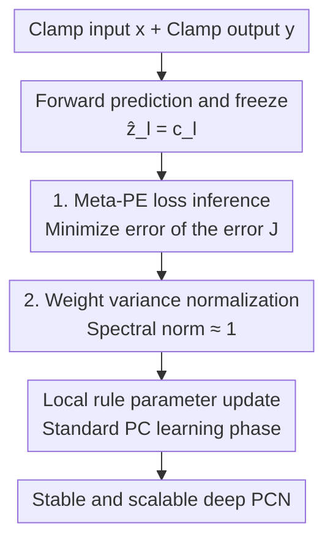

# Stable and Scalable Deep Predictive Coding Networks with Meta-Prediction Errors

**Conference**: ICLR 2026  
**OpenReview**: [https://openreview.net/forum?id=kE5jJUHl9i](https://openreview.net/forum?id=kE5jJUHl9i)  
**Code**: None  
**Area**: Brain-inspired learning / Predictive coding / Local learning rules  
**Keywords**: Predictive coding networks, Meta-prediction errors, Dynamical mean-field theory, Backpropagation alternative, Local learning

## TL;DR
This paper diagnoses two root causes of instability in training deep Predictive Coding Networks (PCNs) using Dynamical Mean-Field Theory (DMFT)—prediction error imbalance and prediction error explosion/vanishing (EVPE). It proposes Meta-PCN: linearizing nonlinear inference via a "prediction error of the error" (meta-PE) loss and suppressing weight spectral norms near 1 via variance normalization. Meta-PCN outperforms backpropagation in 29 out of 30 configurations on CIFAR-10/100 and TinyImageNet using purely local rules.

## Background & Motivation

**Background**: Predictive Coding (PC) is a theoretical framework originating from cortical information processing, suggesting the brain continuously generates environment predictions and updates internal representations by minimizing prediction errors (PE). Implementing this as neural networks results in PCNs: a hierarchical chain of local PC modules where each layer updates parameters using **purely local learning rules**, bypassing the global error chains of backpropagation (BP). Due to being local, massively parallelizable, and biologically constrained, PCN is a strong candidate for neuromorphic computing and a principled alternative to BP.

**Limitations of Prior Work**: PCN suffers from a critical weakness: **training becomes increasingly unstable as network depth increases**. While shallow networks perform adequately, accuracy collapses sharply as layers are added (e.g., vanilla PCN achieves only 10–20% accuracy on most deep architectures for CIFAR-10). The **underlying mechanisms** of this instability remained unclear, leading to ad-hoc fixes like schedulers and normalizers that lack depth-independent stability guarantees.

**Key Challenge**: The execution of PCN involves two phases—the inference phase (iterating latent states to equilibrium) and the learning phase (updating weights). The authors performed rigorous statistical analysis using DMFT to uncover two intertwined pathologies:

- **PE Imbalance**: Errors accumulate at the input/output boundary layers and vanish in intermediate layers, following a "U-shaped" distribution. Information propagates from layers $k$ apart at a rate of only $O(\nu^k)$ ($\nu=\eta\sigma_w$). Since typically $\nu\le 1$, exponential decay causes inference to terminate before information reaches the middle layers. When $\delta_{l+1}\approx 0$ in middle layers, the weight gradient $\nabla_{W_l}F=-D(h_{l+1})\delta_{l+1}z_l^\top\approx 0$, leading to **gradient starvation**—the interruption of the learning signal. This presents a paradox: PE is the objective to be minimized, yet driving it near 0 cuts off the learning signal.
- **EVPE (Explosion/Vanishing of Prediction Errors)**: During inference, latent states and PEs undergo multiplicative scaling $\|\delta_l^{t+1}\|\approx\tau_t(\sigma_w)\|\delta_l^t\|$, where $\tau_t>1$ leads to geometric growth and $\tau_t<1$ to geometric decay. The stability region ($\tau\approx 1$) exists only in a **narrow band** where $\sigma_w$ is near 1, which shrinks with depth, making initialization difficult. This is **distinct** from classic BP gradient explosion/vanishing: it occurs during the inference phase before parameters are updated, but directly infects parameter update magnitudes since $\|\text{vec}(\Delta W_l^t)\|\propto\|\delta_{l+1}^t\|\|z_l^t\|$.

**Goal**: Treat stability as the primary design objective to provide a theory-guided, architecture-agnostic solution while **preserving the global advantage of PCN—purely local learning rules**.

**Key Insight**: Since the root of PE imbalance is that "direct PE minimization cuts the learning signal," direct minimization should be replaced by approximating the delta relationship $\delta_l=g_l(\delta_{l+1},h_{l+1})$ satisfied at equilibrium. Since the root of EVPE is weight variance $\sigma_w^2$ causing spectral norms to deviate from 1, the spectral norm should be normalized directly toward 1.

**Core Idea**: Linearize nonlinear inference to solve gradient starvation using a surrogate loss that "minimizes the error of the error" (meta-PE), combined with variance normalization to solve EVPE by pinning the spectral norm near 1. These complementary mechanisms allow deep PCNs to be stable and scalable for the first time.

## Method

### Overall Architecture

Meta-PCN does not modify the architecture of PCN or its dual-phase skeleton (inference phase for latent iteration and learning phase for local parameter updates). Modifications are made in two areas: **the objective used during inference** and **weight constraints**. It addresses the two pathologies diagnosed in Section 3 with synergistic solutions: meta-PE loss treats PE imbalance (improving convergence), and variance normalization treats EVPE (also suppressing PE imbalance). The workflow is: Input $x$ and output $y$ are clamped at the boundaries → A forward pass calculates predictions and **freezes** them as reference points → The inference phase iterates latents to minimize the meta-PE loss $J$ (linearizing the nonlinear equilibrium) → Weights undergo variance normalization (spectral norm $\approx 1$) → The learning phase updates parameters using standard PC local rules → A stable and scalable deep PCN is achieved.

### Key Designs

**1. Meta-Prediction Error (meta-PE) Loss: Approximating the delta relationship instead of direct suppression**

This design targets the paradox where direct PE minimization causes gradient starvation, while also addressing the often-ignored training-test mismatch: the model relies on latent iteration during inference but performs only a single forward pass during testing. Meta-PCN **freezes** the forward prediction as the initialization point $\hat z_l^{(t)}=f_{l-1}(\hat z_{l-1}^{(0)})=c_l$ ($c_l:=\phi(h_l^{(0)})$), thereby **linearizing** the nonlinear equilibrium system $F(z)=\nabla_z F(z)=0$ around the forward initialization. Introducing the error $\tilde\delta_l:=z_l-c_l$, one obtains the layer-wise linear fixed-point relationship $\tilde F_l(z)=\tilde\delta_l-g_l(\tilde\delta_{l+1},h_{l+1}^{(0)})$. The loss is defined as:

$$J(\tilde\delta)=\frac{1}{2}\sum_{l=2}^{L-1}\big\|\tilde\delta_l-g_l(\tilde\delta^{*}_{l+1},h_{l+1}^{(0)})\big\|_2^2.$$

Here, $\tilde\delta^{*}_{l+1}$ represents the "top-down error at equilibrium," approximated in practice by the current estimate $\tilde\delta_{l+1}^{(t)}$ (analogous to bootstrapping in temporal difference learning). Conceptually, $g_l(\cdot)$ is treated as a function that "uses the stabilized error signal to predict the current layer's forward PE $\tilde\delta_l$"—thus $J$ minimizes the **prediction error of the prediction error**, hence the name "meta-PE." Crucially, since $\partial\tilde\delta_l/\partial z_l=I$, the gradient $\nabla_{z_l}J=\tilde\delta_l-g_l(\tilde\delta^{*}_{l+1},h_{l+1}^{(0)})$ exactly equals the linearized stationary mapping. Minimizing $J$ drives the linear equilibrium residual to 0. Consequently: ① PE is no longer suppressed to 0 directly but follows a delta relationship, balancing error propagation across layers and bypassing gradient starvation; ② Frozen forward predictions alleviate the training-test mismatch. Note that only the **prediction $c_l$ is frozen**; the latent $z_l$ continues to evolve ($\tilde\delta_l=z_l-c_l$), preserving the iterative inference essence of PC. Parameter updates still follow the standard PC loss $L(\theta)=\frac12\sum_l\|z_l^{(T)}-f_{l-1}(z_{l-1}^{(0)};\theta)\|_2^2$, allowing the meta-objective to handle inference stability while the local learning rules remain unchanged.

**2. Weight Regularization via Variance Normalization: Pinning the spectral norm near 1 to stop exponential scaling**

This design directly addresses the root of EVPE—the multiplicative factor $\tau_t(\sigma_w)$ dominated by weight variance $\sigma_w^2$, which leads to exponential explosion/vanishing if outside the narrow stability band. Since computing the spectral norm is expensive, the authors use a cheap proxy from random matrix theory: for a weight matrix of shape $(m,n)$ with variance $\sigma_w^2=\mathrm{Var}(W)$, the spectral norm satisfies $\|W\|_2\approx(\sqrt m+\sqrt n)\sigma_w$. Thus, applying the normalization:

$$W \leftarrow \frac{W}{(\sqrt m+\sqrt n)\,\sigma_w},$$

ensures $\|W_{\text{normalized}}\|_2\approx 1$. Dimensions are chosen based on layer type: $m=d_{\text{out}},n=d_{\text{in}}$ for linear layers; $m=C_{\text{out}},n=C_{\text{in}}\cdot k_H\cdot k_W$ for convolutional layers. This method costs almost nothing (parallelizable, no extra parameters), applies uniformly to all layer types, and by maintaining spectral norms near 1, it **simultaneously** suppresses EVPE (trajectories from different initial $\sigma_w$ converge to a single stable path) and PE imbalance (by regulating the scale of the operator $W_l^\top D(h_{l+1}^{(0)})$ to flatten the U-shaped decay). The authors acknowledge that the i.i.d. assumption does not fully capture the structural properties of conv-filters or evolving weight distributions, leaving a full theory for structured operators to future work.

### Loss & Training
The inference phase minimizes the meta-PE loss $J(\tilde\delta)$ (predictions $c_l$ frozen, latents iterative). The learning phase uses standard PC loss $L(\theta)$ with local rules to update weights, followed by variance normalization at each step. For classification, the squared error at the output layer is replaced with cross-entropy. Meta-PCN **does not introduce** new hyperparameters beyond conventional PCN (inference rate, steps, and optimizer settings are preserved), ensuring a fair comparison.

## Key Experimental Results

### Main Results
On CIFAR-10/100 and TinyImageNet, a three-way comparison was conducted using VGG (5/7/9/11/13 layers) and ResNet-18 architectures: Backpropagation (BP), conventional PCN with forward initialization, and the full Meta-PCN. Architectures and shared hyperparameters were identical across methods.

| Configuration | Conventional PCN | BP | Meta-PCN |
|--------|---------|------|----------|
| CIFAR-10 VGG-13 Top-1 | ≈12% | 87.85% | **89.53%** |
| CIFAR-10 Across Depths | 10–20% (collapses with depth) | — | 80–90% (depth stable) |
| 30 cases (Data×Arch×Metric) | Generally inferior to BP | Baseline | **Wins 29/30, Avg. Gain +2.15%** |

The only case where Meta-PCN trailed was CIFAR-100 ResNet-18 Top-1, where BP led by a negligible 0.02% ($p=0.84$, not significant). Compared to conventional PCN, Meta-PCN improved performance by 12–79% across all architectures.

### Ablation Study

| Configuration | Accuracy | Description |
|------|--------|------|
| Full Meta-PCN | 89.5% | meta-PE loss + Variance Normalization |
| w/o meta-PE loss | 10.0% | Complete collapse; proves it is the indispensable core |
| w/o Weight Normalization | −1.3% | Statistically significant but modest impact |

### Key Findings
- **Meta-PE loss is the linchpin**: Accuracy drops from 89.5% to 10.0% (near random) without it, proving that linearizing inference to bypass gradient starvation is critical for training deep PCNs. Variance normalization provides a significant but modest "cherry on top" (~1.3%).
- **Root causes are repaired**: Under Meta-PCN, PE distribution across layers becomes uniform (no longer U-shaped). Trajectories for latents, PE, and weight updates overlap and stabilize across three different $\sigma_w$ initializations ($\sigma_w\in\{0.185,1.0,5.4\}$), indicating the disappearance of EVPE. The meta-objective $J$ converges rapidly.
- **Training Dynamics**: On VGG-13/CIFAR-10, conventional PCN stays at ≈12% (gradient starvation), while Meta-PCN rises monotonically, tracking the BP trajectory and eventually surpassing it (89.53% vs 87.85%).
- **Advantage scales with depth**: For deeper architectures like VGG-13 and ResNet-18, Meta-PCN matches or exceeds BP without architecture-specific tuning.

## Highlights & Insights
- **"Error of the Error" is an elegant perspective shift**: Direct PE minimization kills the signal (PE acts as both objective and carrier). By changing the objective to "enforcing the equilibrium delta relationship," the model uses $g_l$ to predict the current layer's PE and minimizes this second-order residual. This preserves error propagation while linearizing the equilibrium, bypassing the paradox. This strategy of "optimizing the relationship the quantity should satisfy" rather than the quantity itself is transferable to other equilibrium/fixed-point training issues (e.g., DEQ, Hopfield-type networks).
- **Seamless integration of diagnosis and solution**: The DMFT analysis identifies root causes (PE imbalance from boundary conditions and spectral decay; EVPE from variance control), and the solutions address them directly. Theory and method are tightly coupled.
- **Variance normalization is a cheap and effective trick**: Using the random matrix theory result $\|W\|_2\approx(\sqrt m+\sqrt n)\sigma_w$ for spectral control introduces zero extra parameters and is parallelizable. It is far more efficient than explicit spectral norm computation and is worth adopting in any scenario requiring spectral constraints.

## Limitations & Future Work
- **Gap between theory and practice**: DMFT analysis assumes i.i.d. Gaussian weights, linear(ized) mappings, equal layer widths, and the large-width limit, which do not fully reflect the deep nonlinear convolutional networks used in experiments. The authors acknowledge this as an "inherent gap."
- **Lack of full theory for structured operators**: Variance normalization's i.i.d. assumption ignores the structural nature of conv-filters and does not account for the evolution of weight distributions during training.
- **Limited scale**: Experiments were limited to CIFAR/TinyImageNet and VGG/ResNet-18. Performance on ImageNet-scale or significantly deeper networks remains to be verified.
- **Forward initialization is not a novel contribution**: The authors clarify that feed-forward initialization is standard in PCN literature. The novelty lies solely in the DMFT diagnosis, meta-PE, and variance normalization.

## Related Work & Insights
- **vs Conventional PCN (Whittington & Bogacz, 2017; Millidge et al., 2022a)**: These works establish approximate equivalence between PC and BP under specific conditions but do not solve deep instability. Ours doesn't aim for "BP equivalence" but treats stability as the priority using meta-PE to combat EVPE/imbalance.
- **vs Ad-hoc fixes (iPC from Salvatori et al., 2023b; nudging variants from Pinchetti et al., 2024)**: These rely on staggered updates, schedulers, or normalizers for robustness but lack depth-independent stability guarantees and often depend on auxiliary tricks like GELU or disabling weight decay. Ours provides structural diagnosis and uses a standard protocol.
- **vs Depth-focused methods (DPC from Qi et al., 2025; Goemaere et al., 2025)**: These methods reduce error distortion or use deep-aware parameterization but still lack architecture-agnostic stability guarantees. Ours differs by providing a unified pathological diagnosis via DMFT and designing solutions based on contraction and scale separation.

## Rating
- Novelty: ⭐⭐⭐⭐⭐ The "error of the error" to linearize inference is a truly novel objective reformulation with integrated diagnosis.
- Experimental Thoroughness: ⭐⭐⭐⭐ Solid testing across 3 datasets, multiple depths, and statistical significance, though limited to CIFAR/TinyImageNet scale.
- Writing Quality: ⭐⭐⭐⭐⭐ Clear progression from DMFT diagnosis to solution; theory and method are closely linked, with honest disclosure of theoretical gaps.
- Value: ⭐⭐⭐⭐ Enables deep PCNs to stably outperform BP while maintaining local rules, representing a substantive advance for neuromorphic/brain-inspired learning.

<!-- RELATED:START -->

## Related Papers

- [\[NeurIPS 2025\] Sheaf Cohomology of Linear Predictive Coding Networks](../../NeurIPS2025/others/sheaf_cohomology_of_linear_predictive_coding_networks.md)
- [\[ICLR 2026\] A Scalable Inter-edge Correlation Modeling in CopulaGNN for Link Sign Prediction](a_scalable_inter-edge_correlation_modeling_in_copulagnn_for_link_sign_prediction.md)
- [\[ICML 2026\] Possibilistic Predictive Uncertainty for Deep Learning](../../ICML2026/others/possibilistic_predictive_uncertainty_for_deep_learning.md)
- [\[ICLR 2026\] Evaluating GFlowNet from Partial Episodes for Stable and Flexible Policy-Based Training](evaluating_gflownet_from_partial_episodes_for_stable_and_flexible_policy-based_t.md)
- [\[ICLR 2026\] Fast and Stable Riemannian Metrics on SPD Manifolds via Cholesky Product Geometry](fast_and_stable_riemannian_metrics_on_spd_manifolds_via_cholesky_product_geometr.md)

<!-- RELATED:END -->
