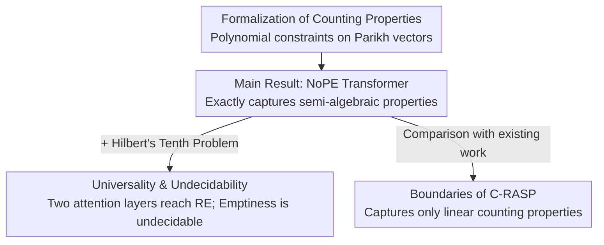

# The Counting Power of Transformers

**Conference**: ICLR 2026  
**arXiv**: [2505.11199](https://arxiv.org/abs/2505.11199)  
**Code**: None  
**Area**: Transformer Theory / Formal Languages  
**Keywords**: Transformer expressivity, counting properties, semi-algebraic properties, undecidability, formal languages

## TL;DR

It is proved that Transformers can capture not only (semi-)linear counting properties but also all **semi-algebraic counting properties** (i.e., Boolean combinations of multivariate polynomial inequalities). This generalizes previous results regarding the counting capabilities of Transformers and derives new undecidability conclusions.

## Background & Motivation

- **Centrality of counting properties**: Determining if certain tokens appear more frequently than others (e.g., MAJORITY: $|w|_a > |w|_b$) is a standard test for Transformer expressivity.
- **Prior work limited to linear properties**: Existing results (C-RASP, logical languages, etc.) only handle linear expressions such as $|w|_a + |w|_b > 2 \cdot |w|_c$.
- **Need for non-linear counting**: In tasks like information retrieval, co-occurrence features such as $\#(\text{nvidia}) \cdot \#(\text{intel}) \cdot \#(\text{deal})$ require polynomial expressions.
- **Core Problem**: Which counting properties can Transformers express? Can they transcend the linear boundary?

## Method

### Overall Architecture

This is a pure theoretical work that extends the characterization of Transformer counting capabilities from linear to arbitrary polynomials. The paper first **formalizes** counting properties as polynomial constraints on Parikh vectors. Then, it proves a **Main Result**: NoPE Transformers (without positional encodings) not only express but exactly capture all semi-algebraic counting properties. Building on this "expressivity benchmark," it extends to **universality and undecidability** via Hilbert's Tenth Problem while simultaneously defining the boundary of **C-RASP**, which only covers linear properties. The logical dependencies are summarized below:

### Key Designs

**1. Formalization of Counting Properties: Translating "Token Counting" to Polynomial Constraints**

To study counting power, "counting properties" are defined mathematically independent of specific networks. For an alphabet $\Sigma = \{a_1, \ldots, a_m\}$, the Parikh mapping $\Psi(w) = (|w|_{a_1}, \ldots, |w|_{a_m}) \in \mathbb{N}^m$ compresses any string $w$ into a vector of counts, discarding order. In this space, **semi-linear properties** are defined by Boolean combinations of linear inequalities (e.g., MAJORITY). This paper focuses on **semi-algebraic properties**, which allow Boolean combinations of any multivariate polynomial inequalities, such as $7|w|_a \cdot |w|_b \cdot |w| _c + 2|w|_d - 8|w|_e > 10$. This formalization serves as the foundation for the subsequent results.

**2. Main Result: NoPE Transformers Exactly Capture Semi-Algebraic Properties**

This core result is established by two theorems. Theorem 1.1 provides the lower bound: Softmax Transformers can express Boolean combinations of arbitrary polynomial inequalities (semi-algebraic properties) without positional encodings or masking. The key lies in the uniform attention mechanism: a layer without positional encoding (NoPE) can apply uniform weights to the sequence to calculate the mean $|w|_{a_i}/|w|$, representing normalized ratios. By passing these ratios to an FFN, the network can approximate any polynomial function (via the Weierstrass Theorem) to determine if an inequality holds. Multiple layers then combine these using Boolean operations. Theorem 1.2 provides the upper bound: NoPE-AHAT (Hard Attention) and its uniform variant NoPE-AHAT[U] express counting properties **exactly equal** to semi-algebraic properties.

**3. Universality & Undecidability: Two Attention Layers Reach Recursively Enumerable**

By pushing expressivity to the limit, the paper leverages number theory. Theorem 1.3 states that every recursively enumerable (r.e.) counting property is a projection of a language recognized by a NoPE-AHAT[U] (and thus SMAT) using **only two attention layers**. This utilizes Matiyasevich's solution to Hilbert's Tenth Problem: every r.e. set is a projection of the set of zeros of an integer polynomial. Consequently, Theorem 1.4 proves that determining if the language of a 2-layer NoPE-AHAT[U] or SMAT is empty is undecidable. This achieves undecidability with a simpler architecture than prior work.

**4. Boundaries of C-RASP: The Linear Layer**

The paper re-evaluates the C-RASP characterization, proving it can only capture **linear** counting properties. Empirical evidence shows that non-linear properties like $L_k: |w|_a^k \geq |w|_b$ (for $k \geq 2$) can be learned by trained Transformers, yet they fall outside the expressivity of C-RASP. Thus, C-RASP is an incomplete characterization of "efficiently learnable properties."

## Key Experimental Results

### Trainability of Non-linear Counting Properties

| Language $L_k$ | Definition | Accuracy | Length Gen |
|-----------|------|--------|----------|
| $L_1$ (Linear) | $\|w\|_a \geq \|w\|_b$ | 100% | ✓ |
| $L_2$ (Quadratic) | $\|w\|_a^2 \geq \|w\|_b$ | ~100% | ✓ |
| $L_3$ (Cubic) | $\|w\|_a^3 \geq \|w\|_b$ | ~100% | ✓ |

### Comparison with PARITY

| Property | Trainability | Length Gen |
|------|----------|----------|
| MAJORITY | ✓ Efficient | ✓ Generalizable |
| Semi-algebraic ($L_k$, $k \geq 2$) | ✓ Efficient | ✓ Generalizable |
| PARITY | ✗ Difficult | ✗ Non-generalizable |

- The trainability of semi-algebraic properties (including non-linear ones) is similar to linear MAJORITY.
- This contrast with PARITY suggests that the difficulty of PARITY does not stem from non-linearity.

## Highlights & Insights

1.  **Breaking Linear Limits**: Extends Transformer counting capability from linear to arbitrary polynomial degrees.
2.  **Surprising Expressivity of NoPE**: Semi-algebraic counting is achievable without positional encodings or masks.
3.  **Complete Characterization**: NoPE-AHAT corresponds exactly to semi-algebraic counting properties.
4.  **Deep Mathematical Links**: Connects algebraic geometry to Transformer theory via Hilbert's Tenth Problem.
5.  **Limitations of C-RASP**: Rigorously proves that C-RASP only "sees" the linear fragment.

## Limitations & Future Work

- Theoretical constructions may require a large number of parameters or layers, differing from practical training scenarios.
- Results focus strictly on counting properties and do not cover sequence-order-dependent properties.
- Experimental scale is relatively small, primarily serving to verify trainability.
- Constructive proofs may generate non-natural network weights.

## Related Work & Insights

- **Transformer Expressivity**: Hahn 2020 (Communication complexity lower bounds), Pérez et al. 2021 (Turing completeness).
- **C-RASP**: Huang et al. 2025 (Formalizing RASP-L conjectures).
- **Formal Languages & NN**: RASP, limit transformers.
- **Hilbert's Tenth Problem**: Matiyasevich 1993.

## Rating

- **Novelty**: ⭐⭐⭐⭐⭐ — Pionering expansion of Transformer counting capability to semi-algebraic properties.
- **Technical Depth**: ⭐⭐⭐⭐⭐ — Rigorous theoretical proofs connecting algebraic geometry and computation theory.
- **Experimental Thoroughness**: ⭐⭐⭐ — Experiments focus on verifying trainability with limited scale.
- **Value**: ⭐⭐⭐ — Primarily a theoretical contribution, but significant for understanding Transformer boundaries.

<!-- RELATED:START -->

## Related Papers

- [\[ICLR 2026\] Neural Dynamics Self-Attention for Spiking Transformers](neural_dynamics_self-attention_for_spiking_transformers.md)
- [\[ICLR 2026\] Hippoformer: Integrating Hippocampus-inspired Spatial Memory with Transformers](hippoformer_integrating_hippocampus-inspired_spatial_memory_with_transformers.md)
- [\[AAAI 2026\] The Limitations and Power of NP-Oracle-Based Functional Synthesis Techniques](../../AAAI2026/others/the_limitations_and_power_of_np-oracle-based_functional_synthesis_techniques.md)
- [\[AAAI 2026\] Model Counting for Dependency Quantified Boolean Formulas](../../AAAI2026/others/model_counting_for_dependency_quantified_boolean_formulas.md)
- [\[AAAI 2026\] Tab-PET: Graph-Based Positional Encodings for Tabular Transformers](../../AAAI2026/others/tab-pet_graph-based_positional_encodings_for_tabular_transformers.md)

<!-- RELATED:END -->
