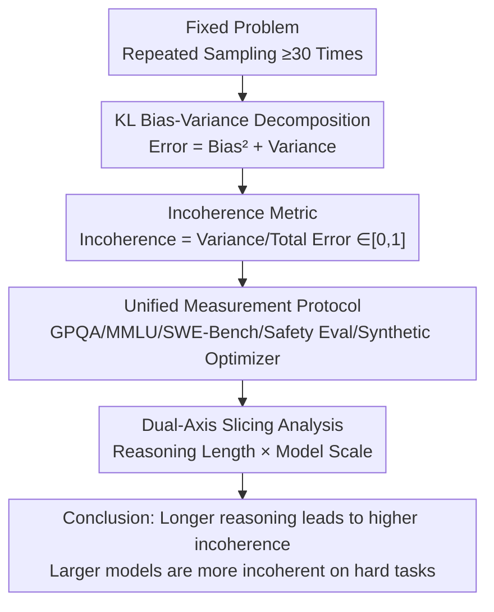

# The Hot Mess of AI: How Does Misalignment Scale With Model Intelligence and Task Complexity?

**Conference**: ICLR 2026  
**arXiv**: [2601.23045](https://arxiv.org/abs/2601.23045)  
**Code**: Yes  
**Area**: Others / AI Safety  
**Keywords**: Bias-variance decomposition, AI incoherence, reasoning length, model scale, AI alignment

## TL;DR
By decomposing AI model errors into bias (systematic misalignment) and variance (incoherent behavior), this study finds that: longer reasoning leads to higher incoherence; larger models become more incoherent on difficult tasks. This suggests that future super-intelligent AI is more likely to manifest "industrial accident" style unpredictable failures rather than consistently pursuing incorrect goals.

## Background & Motivation
The core concern of AI alignment is that models might consistently pursue wrong goals (misalignment). However, in practice, AI failures are often random and incoherent—acting like a "hot mess" rather than a shrewd adversary. A key question is: as AI capabilities and task complexity increase, will failures resemble systematic pursuit of wrong goals (bias-dominated) or unpredictable chaotic behavior (variance-dominated)?

The "Hot mess theory of intelligence" (Sohl-Dickstein, 2023) posits that as entities become more intelligent, their behavior tends to become more incoherent and harder to describe by a single goal. If this holds for AI, it would fundamentally shift the likelihood and focus of misalignment risks. This paper quantifies this issue through the Error = Bias² + Variance decomposition and systematically validates it across multiple tasks and models.

## Method

### Overall Architecture
This paper does not propose a new model but rather provides a metric to measure "how AI fails." The approach involves repeated sampling (e.g., dozens of times) for a fixed problem to decompose the total cross-entropy error of the model's answers into two components: one is "systematic deviation from the target" (Bias), corresponding to the misalignment of consistently pursuing a wrong goal; the other is "self-inconsistency" (Variance), corresponding to chaotic failures like a "hot mess." Based on this decomposition, an "Incoherence" metric is defined by normalizing the variance proportion, allowing models with different error rates to be compared horizontally regarding their "failure patterns." Finally, this unified metric is applied to five classes of failure scenarios and analyzed across two axes: reasoning length and model scale.

### Key Designs

**1. KL Bias-Variance Decomposition: Splitting Cross-Entropy Error**

The challenge lies in the fact that "systematic errors" and "random errors" are mixed within a total error rate and cannot be measured separately. For an input $x$, the outputs $f_\varepsilon$ of the same model under different randomness $\varepsilon$ (sampling seeds, few-shot contexts) are treated as a family of predictions. Letting $\bar{f}$ be the average prediction and $y$ be the one-hot target, the expected cross-entropy decomposes exactly into:

$$\underbrace{\mathbb{E}_\varepsilon[\text{CE}(y, f_\varepsilon)]}_{\text{Error}} = \underbrace{D_{KL}(y \| \bar{f})}_{\text{Bias}^2} + \underbrace{\mathbb{E}_\varepsilon[D_{KL}(\bar{f} \| f_\varepsilon)]}_{\text{Variance}}$$

The first term, KL-Bias², measures how far the "average answer" is from the ground truth, while the second term, KL-Variance, measures how scattered the individual answers are. Unlike classic bias-variance, the expectation here is taken over test-time randomness (multiple samplings of the same fixed model) rather than traditional training randomness (retraining with different seeds)—because the research object is a pre-trained frontier model, not a learning algorithm. Each question is sampled at least 30 times to estimate this distribution, a frequency verified by the authors as sufficient for stable estimation.

**2. Incoherence Metric: Comparing Models of Different Capabilities**

Looking directly at the magnitude of variance is confounded by the total error rate—strong models err less, and thus naturally have smaller variance, making it unclear if they are "more coherent" or "just more correct." Thus, the proportion of variance within the total error over a set of questions $Q$ is normalized:

$$\text{Incoherence}(Q, f_\varepsilon) = \frac{\sum_i \text{Variance}(q_i, f_\varepsilon)}{\sum_i \text{Error}(q_i, f_\varepsilon)} \in [0, 1]$$

A value of 0 indicates pure bias (consistent whether right or wrong, like a persistent optimizer), while 1 indicates pure variance (a completely random hot mess). This ratio decouples the absolute error rate; even if the total error rate decreases with capability, one can still compare whether the "failure pattern" leans toward systematic or chaotic—this is the key to the cross-scale comparisons in later sections.

**3. Unified Measurement Protocol: Applying the Same Metric to Diverse Scenarios**

To demonstrate that the conclusions are not accidental to a specific task, the authors implement bias/variance estimations across five settings. Multiple-choice questions use GPQA (scientific reasoning) and MMLU (general knowledge), sampling ≥30 times per question with different seeds and few-shot contexts. Agentic coding uses SWE-Bench, using unit test passes as a binary indicator for decomposition. Safety evaluations use Model Written Evals, with direct decomposition for multiple-choice and embedding variance to approximate "answer inconsistency" for open-ended questions. A synthetic setup trains a transformer to autoregressively simulate an optimizer descending on a pathological quadratic function (condition number=50) to act as a control with fully observable confounding factors. Finally, a human subjective survey is conducted to rank intelligence and coherence for AI, humans, and organizations.

**4. Slicing Analysis on Explanatory Variables: Expanding Incoherence against Reasoning Length and Model Scale**

Instead of a single global figure, the authors slice the data along two axes. For reasoning length, samples are grouped by average reasoning token count to observe incoherence changes, with natural variation control—splitting samples within the same question by median reasoning length into "short reasoning" and "long reasoning" groups to isolate the effect of length itself under identical difficulty. For model scale, the Qwen3 series (0.6B–32B) is used, grouping by task difficulty first; this is because the direction of the scale effect depends on task difficulty.

## Key Experimental Results

### Finding 1: Longer Reasoning → Higher Incoherence

| Setting | Trend | Explanation |
|------|------|------|
| GPQA (Sonnet 4/o3-mini/o4-mini) | Long reasoning → More incoherent | Consistent trend across all models |
| SWE-Bench (o3-mini/o4-mini) | More actions → More incoherent | Consistent across agentic tasks |
| MWE Safety | embedding variance ↑ with length | Holds for open-ended tasks |
| Synthetic Optimizer | More steps → Higher variance | Controlled verification |

The effect persists even after controlling for task difficulty: for each problem, grouping by median reasoning length shows that the group with naturally longer reasoning has significantly higher incoherence, despite minimal differences in accuracy. The impact of natural reasoning variation is much stronger than that of the reasoning budget.

### Finding 2: Model Scale Impact Depends on Task Difficulty

| Task Difficulty | Qwen3 0.6B→32B Incoherence Change | Explanation |
|---------|-------------------------------|------|
| Easy | ↓ (More coherent) | Capability gain reduces random errors |
| Medium | ≈ (Stable) | Transition zone |
| **Hard** | **↑ (More incoherent)** | Bias decreases faster than variance |

Key mechanism: Both bias and variance decrease as models grow, but the slope of bias decrease is similar across difficulty groups, while the slope of variance decrease is lower (slower) on difficult problems. On the hardest problems, the variance slope is lower than the bias slope, making variance the limiting factor.

### Finding 3: Synthetic Optimizer Verification
Training transformers of various sizes to simulate optimization of a quadratic function:
- Training loss follows a clear power law.
- In autoregressive rollouts, bias decreases with model size much faster than variance.
- Result: Models learn the correct target (bias ↓ fast) but find it harder to maintain long-term coherent behavior (variance ↓ slow).

### Finding 4: Ensembling and Reasoning Budget
- **Ensembling**: Using an ensemble of $E$ samples reduces variance at a $1/E$ rate, effectively lowering incoherence.
- **Larger Reasoning Budget**: Slightly reduces incoherence, but the effect is much weaker than that of natural reasoning length.
- Hypothesis: Improvement from reasoning budgets may come from better backtracking and error correction.

## Discussion & Insights

### Why do more capable models become more incoherent?
1. **LLMs are Dynamical Systems, Not Optimizers**: In the space of all dynamical systems, the set of optimizers for a specific fixed loss is measure zero. As capabilities and state spaces expand, constraining them to function as optimizers becomes harder.
2. **Variance Accumulates in Trajectories**: Unless there is an active error correction mechanism (like ensembling), longer sequences of actions result in larger variance. In the real world, actions are typically irreversible, unlike the ability to reset and correct in experiments.

### Further Decomposition of Bias
Bias = Bias_mesa + Bias_spec, where the former is the model behavior deviating from the training target, and the latter is the training target deviating from the true objective (reward misspecification). In the tasks of this paper, Bias_spec is negligible, but in real-world deployment, Bias_spec may dominate errors as capabilities increase. This emphasizes the importance of precise training objective specification.

### Impact on AI Safety
- If incoherence grows with capability and task complexity, future advanced AI failures will likely resemble "industrial accidents" rather than "malicious adversaries."
- This shifts the focus of AI safety from defending against coherent scheming to preventing unpredictable accidents.
- It increases the relative importance of reward hacking / goal misspecification research.
- However, this does not mean misalignment is unimportant—Bias_spec may still dominate.

## Highlights & Insights
- Proposes a new quantitative framework for AI safety discussions (bias-variance decomposition), converting vague "how AI will fail" questions into measurable problems.
- The "Hot mess theory" perspective is novel and empirically supported: higher intelligence does not equal higher coherence.
- The synthetic optimizer experiment elegantly controls for confounding factors, directly verifying that learning the correct target is easier than maintaining coherence.
- The human subjective survey aligns with LLM experimental results, increasing cross-domain credibility.
- Substantial implications for AI governance: prepare for industrial accidents or adversarial attacks?

## Limitations & Future Work
- Bias is only defined relative to a target; in open-ended tasks (e.g., creativity, dialogue) where the target is unclear, the applicability of the decomposition is limited.
- Although 30 samples were verified as sufficient, estimates in high-dimensional output spaces may still be noisy.
- Extrapolating from current frontier models to future super-AI is risky—future training methods might change the bias-variance structure.
- Variance can be mitigated in deployment via ensembling/multiple sampling, which may limit the practical severity of the "industrial accident" conclusion.
- The specific mechanisms for why incoherence increases (the "why") were not analyzed deeply; the results are primarily descriptive.

## Related Work & Insights
- Complements reasoning scaling law literature (Gema et al. 2025: inverse scaling)—not only does performance drop, but errors also become more inconsistent.
- Connects to evaluation variance literature (Biderman et al. 2024: the high variance of evaluations).
- Self-consistency (Wang et al. 2023) can be reinterpreted as a means of reducing incoherence.
- Provides an interesting contrast to the Platonic Representation Hypothesis (Huh et al. 2024: representation convergence)—representations may converge while behavior remains incoherent.

## Rating
- Novelty: ⭐⭐⭐⭐⭐ The problem formulation and methodology are highly original, opening a new dimension of analysis.
- Experimental Thoroughness: ⭐⭐⭐⭐ Broad coverage across multi-task, synthetic validation, and human surveys.
- Writing Quality: ⭐⭐⭐⭐⭐ Engaging, appropriate metaphors, and excellent visualizations.
- Value: ⭐⭐⭐⭐⭐ Significant guiding implications for the direction of AI safety research.

<!-- RELATED:START -->

## Related Papers

- [\[ICLR 2026\] CircuitNet 3.0: A Multi-Modal Dataset with Task-Oriented Augmentation for AI-Driven Circuit Design](circuitnet_30_a_multi-modal_dataset_with_task-oriented_augmentation_for_ai-drive.md)
- [\[ICLR 2026\] Ensemble Prediction of Task Affinity for Efficient Multi-Task Learning](ensemble_prediction_of_task_affinity_for_efficient_multi-task_learning.md)
- [\[ICLR 2026\] Non-Clashing Teaching in Graphs: Algorithms, Complexity, and Bounds](non-clashing_teaching_in_graphs_algorithms_complexity_and_bounds.md)
- [\[ICML 2026\] Comprehensive AI Governance Requires Addressing Non-Model Gains](../../ICML2026/others/comprehensive_ai_governance_requires_addressing_non-model_gains.md)
- [\[ICML 2025\] Cross-regularization: Adaptive Model Complexity through Validation Gradients](../../ICML2025/others/cross-regularization_adaptive_model_complexity_through_validation_gradients.md)

<!-- RELATED:END -->
