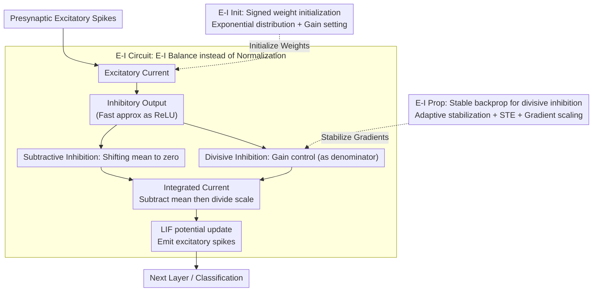

# Training Deep Normalization-Free Spiking Neural Networks with Lateral Inhibition

## Paper Information
- **Conference**: ICLR 2026
- **arXiv**: [2509.23253](https://arxiv.org/abs/2509.23253)
- **Code**: [https://github.com/vwOvOwv/DeepEISNN](https://github.com/vwOvOwv/DeepEISNN)
- **Area**: Spiking Neural Networks / Neuromorphic Computing / Bio-inspired Computing
- **Keywords**: SNN, Lateral Inhibition, Excitatory-Inhibitory Circuit, Normalization-free Training, Biological Plausibility

## TL;DR
The paper proposes DeepEISNN, a normalization-free learning framework based on cortical excitatory-inhibitory (E-I) circuits. By implementing E-I Init and E-I Prop, it achieves stable end-to-end training of deep SNNs, balancing performance and biological plausibility.

## Background & Motivation

### Key Challenge
SNN training faces a trade-off between **performance and biological plausibility**:
- **High-performance methods** (Backpropagation + Batch Normalization): Treat SNNs as standard deep learning components, sacrificing fundamental biological properties.
- **High biological plausibility methods** (e.g., STDP): Suffer from training instability and are typically limited to shallow networks.

### Why Why normalization-free?
Normalization schemes like BatchNorm collect statistics from the entire batch of inputs, which **has no known analog in biological systems**. This makes SNNs using normalization problematic as computational platforms for large-scale cortical simulations.

### The Importance of E-I Circuits
Approximately 80% of neurons in the cortex are excitatory, and 20% are inhibitory. E-I interactions play a critical role in gain control, neural oscillation, and selective attention, yet existing deep SNNs often overlook this fundamental principle.

## Method

### Overall Architecture

DeepEISNN restructures each network layer into a cortical-style excitatory-inhibitory (E-I) circuit: excitatory neurons transmit information using standard LIF dynamics, while inhibitory neurons provide lateral inhibition via both "subtractive" and "divisive" mechanisms to offset and scale excitatory currents. This automatically stabilizes activation magnitudes without relying on batch statistics. Two engineering components complement this circuit: E-I Init provides weight initialization satisfying E-I constraints to keep initial activations within a reasonable range, and E-I Prop addresses numerical and gradient issues introduced by divisive inhibition to enable end-to-end training of deep networks. The entire framework can be viewed as "Initialization $\rightarrow$ Forward E-I stability $\rightarrow$ Stable Backpropagation."

### Key Designs

**1. E-I Circuit: Replacing Normalization with E-I Balance**

Normalization is biologically implausible because it requires collecting statistics from an entire batch; this design ensures amplitude stabilization occurs entirely within a single layer using only its own current spikes. Each layer contains $n_E^{[l]}$ excitatory and $n_I^{[l]}$ inhibitory neurons, fixed at a 4:1 ratio to mirror the ~80% excitatory and ~20% inhibitory statistics in the cortex. Excitatory neurons follow LIF membrane potential updates $\mathbf{u}_E^{[l]}[t+1] = (1-\tfrac{1}{\tau_E})(\mathbf{u}_E^{[l]}[t] - \theta_E \mathbf{s}_E^{[l]}[t]) + \mathbf{I}_E^{[l]}[t]$. Since the inhibitory time constant $\tau_I \ll \tau_E$, they are approximated as transiently steady, with output simplified to $\mathbf{s}_I^{[l]}[t] \approx \max(0, \mathbf{I}_I^{[l]}[t])$, similar to a ReLU. Crucially, lateral inhibition is split into two pathways: subtractive inhibition $\mathbf{I}_{EI,\text{sub}}^{[l]}[t] = \boldsymbol{W}_{EI}^{[l]} \mathbf{s}_I^{[l]}[t]$ shifts the mean of excitatory current toward zero (E-I balance), while divisive inhibition $\mathbf{I}_{EI,\text{div}}^{[l]}[t] = \boldsymbol{W}_{EI}^{[l]}(\mathbf{g}_I^{[l]} \odot \mathbf{s}_I^{[l]}[t])$ acts as the denominator for gain control. These are integrated into the input current:

$$\mathbf{I}_{\text{int}}^{[l]}[t] = \mathbf{g}_E^{[l]} \odot \frac{\mathbf{I}_{EE}^{[l]}[t] - \mathbf{I}_{EI,\text{sub}}^{[l]}[t]}{\mathbf{I}_{EI,\text{div}}^{[l]}[t]} + \mathbf{b}_E^{[l]}$$

This "mean-subtraction, scale-division" structure functionally corresponds to the centering and scaling of BatchNorm, but all quantities derive from the layer's own spikes without cross-batch statistics, maintaining biological feasibility.

**2. E-I Init: Tailored Initialization for Signed Weight Constraints**

E-I constraints require excitatory weights to be strictly positive and inhibitory weights to be strictly negative. Standard Xavier/Kaiming initializations assume zero-mean symmetric distributions and fail here—if used, initial activations would immediately drift, causing deep training to diverge. This work sets initialization targets based on the circuit functions. First, subtractive inhibition should, in expectation, cancel the mean excitatory current: $\mathbb{E}[\mathbf{I}_{EE,i}^{[l]}] \approx \mathbb{E}[\mathbf{I}_{EI,\text{sub},i}^{[l]}]$. This is achieved by initializing excitatory weights with an exponential distribution and setting inhibitory weights to $1/n_I^{[l]}$. Second, divisive inhibition should, in expectation, equal the standard deviation of the excitatory current: $\mathbb{E}[\mathbf{I}_{EI,\text{div},i}^{[l]}] = \text{std}(\mathbf{I}_{EE,i}^{[l]})$. This involves setting each element of gain $\mathbf{g}_I^{[l]}$ to $\sqrt{\tfrac{2-p}{dp}}$ to replicate normalization effects at initialization. The average firing probability $p$ is dynamically estimated using the first batch of the training set rather than being a fixed constant.

**3. E-I Prop: Stable Gradient Propagation for Divisive Inhibition**

Divisive inhibition introduces a denominator into forward computation. If the denominator approaches zero, it causes numerical explosion and gradient distortion, presenting a major hurdle for end-to-end training. E-I Prop solves this with three techniques. First, **adaptive stabilization**: instead of adding a fixed small constant $\epsilon$, zero divisors are dynamically replaced with the minimum positive value within the same sample to avoid issues with $\epsilon$ being too small or too large across different scales. Second, **straight-through estimator (STE)**: the replacement is performed in the forward pass, but backpropagation treats it as an identity mapping, allowing gradients to flow through the non-differentiable operation. Third, **gradient scaling**: the gradient of lateral weights $\boldsymbol{W}_{EI}^{[l]}$ is multiplied by $1/d$ to balance updates between the forward and lateral inhibition paths, preventing the inhibitory path from overwhelming the backbone. Ablations show all three are essential for stability.

## Key Experimental Results

### Main Results

| Dataset | Method | Architecture | E-I | BN-free | Accuracy (%) |
|--------|------|------|-----|---------|----------|
| CIFAR-10 | Vanilla BN | ResNet-18 | ✗ | ✗ | 95.37 |
| CIFAR-10 | TEBN | ResNet-19 | ✗ | ✗ | 94.70 |
| CIFAR-10 | **Ours** | **ResNet-18** | **✓** | **✓** | **92.05** |
| CIFAR-10 | DANN (ANN) | VGG-16 | ✓ | ✓ | 88.54 |
| CIFAR-10 | BackEISNN | 5-layer CNN | ✓ | ✓ | 90.93 |
| DVS-Gesture | **Ours** | VGG-8 | ✓ | ✓ | **94.86** |
| CIFAR10-DVS | **Ours** | VGG-8 | ✓ | ✓ | **77.66** |

### Key Findings

1. DeepEISNN (ResNet-18) reached 92.05% on CIFAR-10, **outperforming all normalization-free baselines**.
2. On neuromorphic datasets (DVS-Gesture, CIFAR10-DVS), it **outperformed several methods using BN**.
3. It achieved 50.29% on TinyImageNet, proving scalability to larger datasets.
4. Every component of E-I Init and E-I Prop is necessary—training collapses if any are removed.

### Ablation Study

- Without E-I Init $\rightarrow$ Training failure (firing rate collapse).
- Without adaptive stabilization $\rightarrow$ Numerical explosion.
- Without STE $\rightarrow$ Incorrect gradient direction.
- Without gradient scaling $\rightarrow$ Excessive gradients in the inhibitory path.

## Highlights & Insights

1. **First successful implementation of normalization-free training in deep SNNs** while maintaining competitive performance.
2. **Balance of biological plausibility and engineering performance**: The E-I circuit acts as both a regularization technique and a biological model.
3. **Comprehensive theoretical analysis**: From exponential distribution derivations to gain control conditions.
4. **Platform for large-scale cortical simulations**: Provides a framework for modeling complex neural dynamics.

## Limitations & Future Work

1. A ~3% accuracy gap remains compared to SNNs using BatchNorm.
2. Whether the fixed 4:1 E-I ratio is optimal has not been explored.
3. The fast spike approximation for inhibitory neurons (ReLU-like) may be an oversimplification.
4. Validated only on classification; generative or sequential modeling tasks remain untested.

## Related Work & Insights
- **SNN Normalization**: BNTT, tdBN, TEBN, TAB — SNN variants of BN.
- **E-I Networks**: Cornford et al. (2021) — E-I networks in ANNs.
- **SNN Training**: STBP, TEBN — Surrogate gradients and normalization techniques.

## Rating
- **Novelty**: ⭐⭐⭐⭐ — Innovative use of E-I circuits to replace normalization with biological grounding.
- **Experimental Thoroughness**: ⭐⭐⭐⭐ — Validated across multiple datasets and architectures.
- **Writing Quality**: ⭐⭐⭐⭐ — Clear derivation from biological principles to engineering implementation.
- **Value**: ⭐⭐⭐ — Important foundation for NeuroAI, despite the remaining performance gap.

<!-- RELATED:START -->

## Related Papers

- [\[ICLR 2026\] Online Pseudo-Zeroth-Order Training of Neuromorphic Spiking Neural Networks](online_pseudo-zeroth-order_training_of_neuromorphic_spiking_neural_networks.md)
- [\[ICML 2026\] Bullet Trains: Parallelizing Training of Temporally Precise Spiking Neural Networks](../../ICML2026/others/bullet_trains_parallelizing_training_of_temporally_precise_spiking_neural_networ.md)
- [\[AAAI 2026\] TDSNNs: Competitive Topographic Deep Spiking Neural Networks for Visual Cortex Modeling](../../AAAI2026/others/tdsnns_competitive_topographic_deep_spiking_neural_networks_for_visual_cortex_mo.md)
- [\[ICLR 2026\] Breaking Gradient Temporal Collinearity for Robust Spiking Neural Networks](breaking_gradient_temporal_collinearity_for_robust_spiking_neural_networks.md)
- [\[ICLR 2026\] Beyond Linear Processing: Dendritic Bilinear Integration in Spiking Neural Networks](beyond_linear_processing_dendritic_bilinear_integration_in_spiking_neural_networ.md)

<!-- RELATED:END -->
