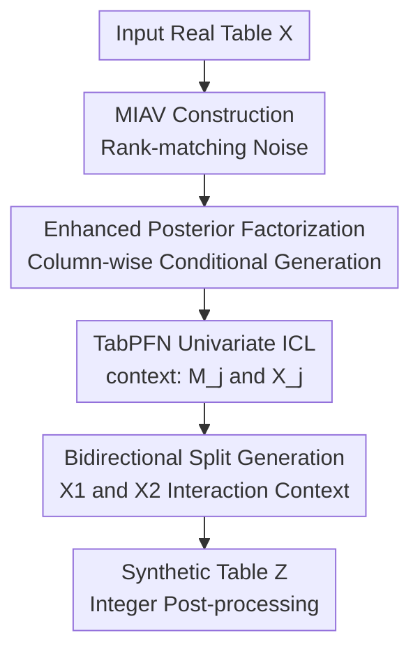

# Using maximal information auxiliary variables to improve synthetic data generation based on TabPFN foundation models

**Conference**: ICLR2026  
**OpenReview**: [https://openreview.net/forum?id=6PkiUAcTWF](https://openreview.net/forum?id=6PkiUAcTWF)  
**Code**: https://github.com/echaibub/MIAV  
**Area**: Tabular Synthetic Data Generation  
**Keywords**: TabPFN, Tabular Synthetic Data Generation, Maximal Information Auxiliary Variables, Privacy Protection, In-context Learning

## TL;DR
This paper identifies that direct use of TabPFN for tabular synthetic data generation fails on weakly correlated variables. It proposes Maximal Information Auxiliary Variables (MIAV): by rank-matching random noise to real variables as auxiliary inputs, TabPFN only needs to learn the univariate relationship between $X_j$ and $M_j$, enabling stable and efficient generation of synthetic data that preserves marginal distributions and association structures.

## Background & Motivation
**Background**: Tabular synthetic data generation typically serves privacy-preserving data sharing. Researchers aim to publish a data replica that resembles real data, preserves statistical patterns and downstream modeling value, but does not directly expose original records. Traditional approaches rely on generative or statistical models trained on specific datasets, such as SMOTE, CTGAN, TVAE, TabDDPM, ARF, or Bayesian networks. These methods often require per-dataset hyperparameter tuning or training, limiting their transferability.

**Limitations of Prior Work**: Tabular foundation models like TabPFN offer an attractive alternative. TabPFN is pre-trained on a massive number of synthetic tasks. During inference, it uses training samples as context and target samples as queries to approximate the posterior predictive distribution via a single forward pass. Theoretically, it can generate synthetic tables column-by-column by treating one column as the target and others as conditional variables without retraining a generator for every small table.

**Key Challenge**: The tolerance for "uninformative features" differs drastically between supervised prediction and data synthesis. In supervised learning, if a feature is irrelevant to the target, a reasonable model can simply output a distribution close to a random guess. In synthesis, however, every variable must be generated. If a variable $X_j$ is weakly correlated or independent of others, TabPFN receives almost no signal from the context features, leading to marginal distribution drift and distorted association structures.

**Goal**: Instead of retraining TabPFN, the authors aim to reformulate the synthetic data generation problem into a form more suitable for in-context learning (ICL) without modifying the existing foundation model. Specifically, the method must preserve marginal distributions for weakly correlated variables while maintaining association structures, reducing computational costs, and avoiding sensitivity to column ordering inherent in joint factorization.

**Key Insight**: The root cause of TabPFN's failure is not an inherent inability to generate a variable, but rather that the conditional context carries insufficient information. The paper artificially constructs an auxiliary variable $M_j$ with a monotonic correspondence to each real variable $X_j$. While $M_j$ originates from random noise, it maintains the same order as $X_j$ via rank matching, thus carrying maximal information about $X_j$ in a non-parametric sense.

**Core Idea**: Replace "other real columns" with "rank-matched random noise auxiliary variables" as the in-context condition for TabPFN. By allowing each variable to be generated via its own MIAV, the challenge of weakly correlated variables is transformed into a well-informed univariate conditional generation problem.

## Method

### Overall Architecture
The proposed method follows a process of "creating predictable auxiliary coordinates, then generating columns via TabPFN." Given a real table $X=(X_1,\ldots,x_p)$, the method first constructs a maximal information auxiliary variable $M_j$ for each column $X_j$. Subsequently, the original data is split into two halves. In the ICL framework of TabPFN, $(m_j^{tr}, x_j^{tr})$ serves as the context and $m_j^{ts}$ as the query to generate $\hat{x}_j^{ts}$; the process is then reversed for the other half, and the results are concatenated into a complete synthetic table.

The paper discusses two baseline strategies. Joint factorization (JF) decomposes the posterior predictive distribution column-wise as $P(X^{ts}|X^{tr})=\prod_j P(X_j^{ts}|X_{<j}^{ts},X^{tr})$, approximated by TabPFN. This has two issues: the first column requires artificial noise $X_0$ for context, and subsequent columns depend only on preceding ones, making the result sensitive to column ordering. Full conditional (FC) uses all other columns $X_{-j}$ as conditions for each column; while order-independent, it does not correspond to a strict joint PPD decomposition and incurs significantly higher computational costs as each TabPFN call involves $p-1$ features.

MIAV provides a cleaner formulation: instead of asking if "other columns can predict $X_j$," it assigns a dedicated information carrier $M_j$ to each column. The augmented posterior predictive distribution is written as $P(X^{ts}|X^{tr},M^{ts},M^{tr})$. Leveraging the property that $X_j$ is conditionally independent of other variables given $M_j$, each term simplifies to $P(X_j^{ts}|M_j^{ts},M_j^{tr},X_j^{tr})$. Consequently, TabPFN only requires a single feature column $M_j$ to generate its corresponding $X_j$.

### Key Designs
**1. Maximal Information Auxiliary Variables: Turning random noise into column-specific context via rank matching**

The weakness of direct TabPFN synthesis is the lack of signal in the context when $X_j$ is weakly correlated with other columns. MIAV instead constructs an auxiliary variable guaranteed to have signal. Specifically, a random noise vector of length $n$ is generated and sorted. For continuous variables, the rank of $X_j$ is calculated (with ties broken randomly). For categorical variables, samples are assigned numerical ranks based on category frequencies, and the sorted noise is rearranged according to these ranks. The resulting $m_j$ and $x_j$ share the same ordering.

The key lies not in the noise distribution, but in the rank matching. The paper defaults to a uniform distribution $[0,1]$, emphasizing that the choice is insensitive because MIAV carries the rank structure between samples. For continuous variables, $m_j$ and $x_j$ are strictly monotonic; for categorical variables, numeric rank encoding ensures random permutations within categories while maintaining distinct rank intervals between categories. Thus, $M_j$ does not directly copy $X_j$ values but provides enough information to determine the relative positions of samples.

**2. Information Theoretic Properties: Reframing "unpredictable weak correlations" as "conditional independence given MIAV"**

Theorem 1 explains why this construction is effective. Let $Y$ be any variable other than $X_j$ and $M_j$. MIAV satisfies two properties: $I(X_j;Y|M_j)=0$ and $H(X_j|M_j)=0$. The former implies that $X_j$ has no additional conditional mutual information with other variables once $M_j$ is given; the latter indicates that $M_j$ contains full information about $X_j$ in a non-parametric sense.

These properties address the root cause of TabPFN's failure. While JF and FC struggle when $X_j$ is independent of other columns, MIAV changes the generation condition for $X_j$ to its own $M_j$. Therefore, even if a column is weakly correlated in the original table, TabPFN sees a high-information context $(m_j^{tr},x_j^{tr})$. MIAV does not make the original variables more correlated; it explicitly places the information needed to generate each column into its own auxiliary coordinate.

**3. Enhanced Posterior Factorization: Order-insensitive probabilistic interpretation for synthesis**

After augmenting the set of variables with $M=(M_1,\ldots,M_p)$, the posterior predictive distribution is formulated as $P(X^{ts}|X^{tr},M^{ts},M^{tr})$. Since $X_j$ no longer depends on other variables given $M_j$, the $j$-th term simplifies from $P(X_j^{ts}|X_{<j}^{ts},X^{tr},M^{ts},M^{tr})$ to $P(X_j^{ts}|M_j^{ts},M_j^{tr},X_j^{tr})$, leading to:

$$
P(X^{ts}|X^{tr},M^{ts},M^{tr})=\prod_{j=1}^{p}P(X_j^{ts}|M_j^{ts},M_j^{tr},X_j^{tr}).
$$

TabPFN approximates each term: $q_\theta(x_j^{ts}|m_j^{ts},m_j^{tr},x_j^{tr})$. This is more stable than JF (order-independent) and cheaper than FC (one feature per ICL call). Importantly, while columns appear to be generated independently after decomposition, the association structure is not lost; since ranks of $M$ reproduce the rank structure of $X$, the generated $Z$ is indirectly constrained by the MIAV correlations.

**4. Computation and Generalization: Scaling and portability to TabICL**

TabPFN complexity is approximately $O(n^2+p^2)$. JF and FC require multiple calls with multi-column features, resulting in complexities summarized by $O(pn^2+p^3)$. MIAV provides only one feature $M_j$ per call, yielding $O(pn^2)$ after iterating over $p$ variables. Thus, MIAV becomes more advantageous as the number of columns increases and avoids the need for column-permutation aggregation used in JF.

This design also makes the method applicable beyond TabPFN. Any tabular foundation model that approximates conditional predictive distributions via PFN/ICL can use $(m_j^{tr},x_j^{tr})$ and $m_j^{ts}$. Experiments with TabICL on categorical datasets show that MIAV-TabICL performs similarly to MIAV-TabPFN and generally outperforms JF/FC, suggesting MIAV serves as a general "interface" for tabular foundation models.

### Example
Consider a 5-column table where $X_2$ is randomly shuffled, making it nearly independent of others. JF generates $X_1$ using random noise $X_0$ and generates $X_2$ using previously generated columns; FC uses all other columns to predict $X_2$, but these columns provide no information. Both results exhibit significant marginal drift for $X_2$.

MIAV constructs $M_2$ by sorting random noise and then reordering it according to $X_2$'s rank. In ICL, TabPFN's context is $(m_2^{tr},x_2^{tr})$ and the query is $m_2^{ts}$ to predict $x_2^{ts}$. Even if $X_2$ is independent of $X_1,X_3,X_4,X_5$, $M_2$ remains strongly monotonic to $X_2$, allowing the generated $\hat{x}_2$ to accurately match the original marginal distribution. Simultaneously, the inter-column correlations of $M$ recreate the pattern of $X$, ensuring the synthetic table maintains the overall structure.

### Loss & Training
The study does not retrain TabPFN or TabICL nor introduces new neural loss functions. The strategy is an inference-time generation strategy: given a pre-trained TabPFN, original data is partitioned into two subsets $X_1$ and $X_2$. MIAV values and ground truth from $X_2$ are used as context to generate synthetic $X_1$, and vice-versa, which are then concatenated.

For integer variables, the synthetic columns are rounded to the nearest integer post-generation. The authors also propose a "noisy-MIAV" variant, adding Gaussian noise with mean 0 and standard deviation $\text{percent}\cdot sd(m_j)$ to $m_j^{tr}$ and $m_j^{ts}$. This is used to enhance privacy in sensitive scenarios at the cost of data fidelity.

## Key Experimental Results

### Main Results
Three sets of experiments were conducted: 1) Correlated beta simulated data with varying correlation strengths; 2) 36 real datasets from OpenML-CC18; 3) 7 real datasets for comparison against traditional/deep generators like DDPM, CTGAN, TVAE, ARF, and Bayesian networks. Metrics cover fidelity, utility, and privacy: KS for marginals, L2D for correlation matrices, DT for distinguishability, MLE for downstream utility, and DCR/SDBRL/SSDID for privacy risk.

| Setting | Methods | Key Fidelity Findings | Privacy Findings |
|--------|----------|------------------|----------|
| Correlated beta simulated data, $|\rho|\in\{0,0.25,0.5,0.75,0.95\}$ | MIAV, JF, FC, SMOTE, holdout | Ours significantly outperforms JF/FC in low or zero correlation settings; SMOTE shows strong fidelity. | MIAV DCR is generally better than SMOTE; JF/FC appear "private" due to poor quality. |
| 36 OpenML-CC18 datasets | MIAV, JF, FC, SMOTE, holdout | Ours consistently outperforms JF/FC on KS, L2D, DT, and is comparable to SMOTE. | MIAV shows better privacy (DCR, SDBRL, SSDID) compared to SMOTE. |
| 7 comparison real datasets | MIAV, JF, FC, SMOTE, DDPM, CTGAN, TVAE, ARF, BN | Ours outperforms most generators; DDPM only beats ours on DT, while Ours leads in other fidelity metrics. | MIAV DCR is often superior; it is not always better than all traditional baselines on SDBRL/SSDID. |

Pooled results indicate that while SMOTE often has slightly higher fidelity, its privacy risk is higher. MIAV is significantly stronger in fidelity than JF/FC and more stable than most deep/traditional baselines. The authors emphasize that no single metric determines ranking, as Bayesian networks perform well on WD/ED but poorly on MLE, L2D, and DT.

### Ablation Study
Rather than traditional "module removal," the authors validate MIAV through different correlation strengths, runtime benchmarks, and the noisy-MIAV variant.

| Configuration | Key Observation | Explanation |
|------|----------------|------|
| JF: Joint Factorization | KS/density degrades on weakly correlated variables; sensitive to column order. | Proves column-wise decomposition alone is insufficient for uninformative contexts. |
| FC: Full Conditional | Fixes some strong correlations but fails for independent variables; expensive. | Proves "more real columns as context" cannot solve the lack of information for target variables. |
| MIAV | Stable across simulated $\rho$ from 0.95 to 0; preserves marginals in weak correlations. | Confirms rank-matched auxiliary variables are the key factor. |
| Noisy-MIAV | Privacy increases with noise; fidelity decreases accordingly. | Demonstrates privacy-fidelity trade-off control. |
| MIAV-TabICL | Similar performance to MIAV-TabPFN on 8 categorical datasets. | Proves the framework is portable to other PFN-based models. |

### Key Findings
- The advantage of MIAV is most prominent in weak correlation scenarios. In simulations where $|\rho|$ drops to 0, JF and FC performance degrades, whereas MIAV remains stable.
- MIAV is not simple memorization. It provides strong fidelity via rank-matched noise, but privacy metrics show a trade-off (similar to SMOTE), which can be tuned using noisy-MIAV.
- Runtime experiments support the complexity analysis: as column counts grow, FC and JF runtimes escalate, while MIAV grows linearly.
- TabICL experiments confirm MIAV is a general framework. While currently limited to categorical data by TabICL's scope, it can naturally extend to mixed tables once regression is supported.

## Highlights & Insights
- MIAV's elegance lies in respecting TabPFN’s ICL conditional prediction form rather than treating it as a universal joint distribution model.
- Rank matching is a lightweight but powerful bridge. Random noise is transformed into a coordinate that carries structural sample information without directly copying values.
- The paper provides a clear probabilistic explanation for an engineering trick. Theorem 1 and the enhanced PPD decomposition justify why $M_j$ eliminates the need for other columns.
- The method is future-proof for tabular foundation models. Developments like TabPFN-2.5 or new TabICL versions can act as "plug-and-play" engines for the MIAV adapter.
- Evaluation requires considering both fidelity and privacy; MIAV provides a controlled middle ground between the high-fidelity/high-risk SMOTE and the low-fidelity/low-risk direct TabPFN approaches.

## Limitations & Future Work
- MIAV inherits the scale constraints of the underlying TabPFN, including limits on row counts, memory, and inference speed.
- The method requires access to the full original data to construct $M^{tr}$ and $M^{ts}$. While appropriate for synthesis, this cannot be used for standard supervised test-set augmentation as it would leak target information.
- Privacy is not yet a perfect solution. MIAV's high fidelity means rank-matched noise carries significant structure; noisy-MIAV is a first step toward systematic privacy regulation.
- Categorical numeric rank encoding relies on category order and random tie-breaking, which may need refinement for high-cardinality or rare categories.
- Scaling to large-scale industrial datasets remains to be verified as newer foundation models support larger contexts.

## Related Work & Insights
- **vs. TabPFN Direct / JF**: Direct generation is sensitive to column order and weak correlations; MIAV uses per-column auxiliary variables to solve the "uninformative context" problem.
- **vs. Full Conditional (FC)**: FC is computationally expensive and fails on independent variables; MIAV is cheaper and robust to independent columns.
- **vs. SMOTE**: SMOTE has high fidelity but higher privacy risks; MIAV achieves comparable fidelity with improved privacy metrics.
- **vs. CTGAN/TVAE/DDPM/ARF/BN**: These require training per dataset; MIAV leverages pre-trained foundation models to avoid per-dataset training while remaining competitive.
- **Insight**: When adapting foundation models for generation, retraining is not always necessary. Reformulating the problem to match the model's interface (ICL) can be highly effective.

## Rating
- Novelty: ⭐⭐⭐⭐☆ Using rank-matched variables to adapt TabPFN is elegant, though the core construction draws on existing non-parametric synthesis ideas.
- Experimental Thoroughness: ⭐⭐⭐⭐☆ Extensive coverage of simulated and real datasets with various metrics; could benefit from more systematic privacy attack analysis.
- Writing Quality: ⭐⭐⭐⭐☆ Clear logic and theoretical framing, although some quantitative details are primarily in the appendix or plots.
- Value: ⭐⭐⭐⭐☆ Significant reference for using foundation models for synthesis, especially in small-data and privacy-preserving scenarios.

<!-- RELATED:START -->

## Related Papers

- [\[ACL 2025\] TARGA: Targeted Synthetic Data Generation for Practical Reasoning over Structured Data](../../ACL2025/others/targa_targeted_synthetic_data_generation_for_practical_reasoning_over_structured.md)
- [\[ICML 2026\] GOTabPFN: From Feature Ordering to Compact Tokenization for Tabular Foundation Models on High-Dimensional Data](../../ICML2026/others/gotabpfn_from_feature_ordering_to_compact_tokenization_for_tabular_foundation_mo.md)
- [\[AAAI 2026\] Faster Certified Symmetry Breaking Using Orders With Auxiliary Variables](../../AAAI2026/others/faster_certified_symmetry_breaking_using_orders_with_auxiliary_variables.md)
- [\[ICML 2026\] TabMGP: Martingale Posterior with TabPFN](../../ICML2026/others/tabmgp_martingale_posterior_with_tabpfn.md)
- [\[ACL 2025\] Generating Synthetic Relational Tabular Data via Structural Causal Models](../../ACL2025/others/generating_synthetic_relational_tabular_data_via_structural_causal_models.md)

<!-- RELATED:END -->
