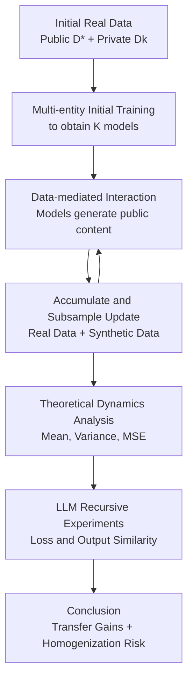

# What happens when generative AI models train recursively on each others' outputs?

**Conference**: ICLR2026  
**OpenReview**: [https://openreview.net/forum?id=JEU4PBaX85](https://openreview.net/forum?id=JEU4PBaX85)  
**Code**: https://github.com/arguslab-duke/multi_models_interaction  
**Area**: Others / Recursive Training of Generative Models  
**Keywords**: Model collapse, recursive training, synthetic data, data-mediated interaction, model homogenization  

## TL;DR
Ours formalizes the question of whether "multiple generative AI models will consume each other's generated content in the future" as a data-mediated interaction training problem. Theory and LLM experiments demonstrate that mixing an appropriate amount of real data with synthetic data from other models can bring cross-task transfer, but excessive reliance on synthetic data damages original tasks and leads to the gradual homogenization of model outputs.

## Background & Motivation
**Background**: Large-scale generative models typically rely on internet corpora for training and updates. Although the disclosure levels of public materials for models like GPT, Llama, Phi, Claude, and Gemini vary, a common fact is that early training extensively used public web or text sources such as Common Crawl, Wikipedia, Books, ArXiv, and StackExchange. Models continue to be updated after launch, and the update data is often not started from scratch but involves reusing a portion of historical data combined with newly crawled web content, licensed data, or product-side data.

**Limitations of Prior Work**: The internet is being rapidly filled with AI-generated content. Prior work has discussed how "training a model on its own previous generation's output" leads to model collapse and suggested that retaining real data can mitigate this. However, the real internet is not a single-model closed loop; models like ChatGPT, Claude, Gemini, Llama, and Phi are being used to generate webpages, Q&A, articles, and social media content. In future updates, training sets are more likely to contain a mix of outputs from many different models rather than just the previous generation of the model itself.

**Key Challenge**: Synthetic data from other models can be either noise or a carrier of unshared private knowledge. If a model repeatedly learns only from synthetic data, it loses tail details of the real distribution, leading to collapse or decreased generalization. However, if synthetic outputs from another model originate from its own private data or task capabilities, these outputs might indirectly propagate new concepts and task patterns to other models. That is, cross-model synthetic data serves as both a source of pollution and an information channel.

**Goal**: Authors aim to answer three specific questions. First, whether the realistic training pipeline truly supports the assumption that "multiple models consume each other's outputs." Second, in an analytical recursive training framework, how the proportions of public real data, private real data, and synthetic data affect long-term error and inter-model variance. Third, whether the "transfer gains" and "behavioral homogenization" predicted by theory occur simultaneously in real language model fine-tuning experiments.

**Key Insight**: Instead of focusing on AI-generated content detection, the paper views the internet as an implicit communication medium between multiple models. Each entity retains its private data, generated content flows publicly into the internet, and subsequent model updates crawl this content back into training sets. This perspective turns the "data pollution" problem into a multi-agent dynamic system, enabling analysis of how private knowledge propagates via leakage, how models converge, and when traditional collapse can still be avoided.

**Core Idea**: A recursive training framework composed of real public data, entity-private data, and cross-model synthetic data is used to explain why "learning what others know" and "gradually becoming the same" occur simultaneously during generative model mutual training.

## Method

### Overall Architecture
Ours starts from a realistic model update process: each model is initially trained on public real data $D^*$ and its own private real data $\tilde{D}_k$. Each subsequent generation of models generates public content $D_{t,k}$, which is mixed into the next round of web-crawled data and collected by all entities as part of the update data. Two proportions control the dynamics: $\beta$ controls the relative weight of public versus private data in the initial/reused real data, and $\alpha$ controls the proportion of new synthetic data relative to reused real data in each update. The authors derive the mean, variance, and asymptotic MSE in a linear regression setting, then validate these trends using multi-model recursive fine-tuning experiments with OPT and Llama 3.2.

The closed loop in this diagram is not a training trick but the realistic mechanism under study. As long as model updates depend on new web crawls containing content from multiple generative models, models will interact via data. Thus, the concern is not how "one model explicitly distills another," but rather "what long-term impact occurs when model outputs enter a common data pool without collaborative protocols."

### Key Designs
**1. Data-mediated Interaction: Turning intuition into controllable variables**

Traditional model collapse settings simplify recursive training to a single model consuming its own previous output. Ours deconstructs this loop into $K$ entities: the $k$-th entity possesses its own model $\hat{\theta}_{t,k}$ and private real data $\tilde{D}_k$, while sharing public real data $D^*$. Each generation generates synthetic data $D_{t,k}$ based on current parameters, and synthetic data from all models are merged into a public update pool $D_t=\{D_{t,1},\ldots,D_{t,K}\}$. In the next training generation, an entity does not know the source of a synthetic sample, treating it as part of new crawled data.

**2. Linear Dynamics Derivation: Characterizing transfer and homogenization via mean and variance**

To obtain interpretable formulas, authors analyze interactive training in a linear regression setting. Each data point is $(x,y)$, models are trained with squared loss, and synthetic labels are generated by the previous generation: $y\mid x\sim N(x^\top\hat{\theta}_{t-1,k},\sigma^2)$. Under this setting, the estimator at each generation $\hat{\theta}_t=\mathrm{vec}(\hat{\theta}_{t,1},\ldots,\hat{\theta}_{t,K})$ can be written as a linear dynamic system:

$$
\hat{\theta}_t = P_t
\begin{bmatrix}
\tilde{X}^+\tilde{y} \\
X_*^+y_*
\end{bmatrix}
+ Q_t\hat{\theta}_{t-1} + Q_tX_t^+w_t.
$$

Here $P_t$ represents the direct contribution of current-round real private/public data, and $Q_t$ represents the strength of information transfer from the previous generation via synthetic data. If cross-entity blocks of $Q_t$ are non-zero, the parameter mean of model $k$ will include linear combinations of other entities' private data estimates; if row blocks correspond to different entities becoming more similar, homogenization occurs.

**3. Relative Efficiency Analysis: Explaining why moderate synthetic data might be optimal**

The paper does not simply conclude "the less synthetic data, the better." Authors use theoretical formulas to calculate the MSE for each entity after long-term training and compare it with an ideal estimator that possesses all real public and all private data. This ratio is defined as relative efficiency. Theoretical plots indicate that for $K=4$ in a low-rank setting, $\alpha=0.5, \beta=0.5$ often yields better global performance. The intuition is that if $\alpha$ is too small, entities barely exchange info; if $\alpha$ is too large, the lack of real data anchors and recursive noise harms the original tasks.

**4. LLM Recursive Fine-tuning Validation: Measuring performance transfer and output homogenization**

The experimental section simulates the process using language models. Instead of training from scratch, multiple instances of the same pre-trained architecture are fine-tuned on different tasks as $t=0$ entities. Public data $D^*$ is approximated using BookCorpus, and private tasks include SciQ, GSM8K, and ARC. Evaluation involves two paths: task loss (token-level cross entropy) and output representation similarity (using SentenceTransformers embeddings).

### Loss & Training
The theoretical training objective is weighted squared loss. In the initial phase, the $k$-th entity minimizes weighted empirical risk on private data (weight $\beta$) and public data (weight $1-\beta$). In the update phase, the $k$-th entity minimizes the sum of three loss components: reused private real data $\bar{\alpha}\beta L$, reused public real data $\bar{\alpha}\bar{\beta}L$, and new synthetic public data $\alpha L/K$, where $\bar{\alpha}=1-\alpha$ and $\bar{\beta}=1-\beta$.

In LLM experiments, the training set size per generation is fixed at $n=12{,}500$. Samples are drawn according to these weights to simulate an accumulate-and-subsample update. Each model is fine-tuned for 100 steps per generation using AdamW with a learning rate of $8\times10^{-6}$, a warmup ratio of 0.025, a max sequence length of 512, and mixed-precision training.

## Key Experimental Results

### Main Results
The main results focus on $\beta=0.5$. The table below summarizes initial to final loss changes for $K=2, \beta=0.5$ across different $\alpha$ values.

| Architecture | Setting | Own Task Perf | Other's Task Perf | Main Conclusion |
|:---|:---|:---|:---|:---|
| OPT-350M | $\alpha=0$ | M1: 3.3→3.3; M2: 1.8→1.7 | M1 on T2: 3.1→3.5; M2 on T1: 5.1→5.1 | Stable own task, no cross-task gain |
| OPT-350M | $\alpha=0.5$ | M1: 3.3→3.3; M2: 1.8→1.7 | M1 on T2: 3.1→1.8; M2 on T1: 5.1→3.5 | Significant transfer from synthetic data |
| Llama 3.2 1B | $\alpha=0.5$ | M1: 2.8→2.9; M2: 1.2→1.3 | M1 on T2: 2.0→1.4; M2 on T1: 3.7→3.0 | Optimal balance predicted by theory |
| Llama 3.2 1B | $\alpha=1.0$ | M1: 2.8→3.0; M2: 1.2→1.9 | M1 on T2: 2.0→1.8; M2 on T1: 3.7→3.0 | Pure synthetic harms original task |

### Ablation Study
Ablations varied $K$, $\alpha$, $\beta$, and architecture, while analyzing output similarity.
- **Homogenization**: For Llama 1B with $\alpha=0.5, \beta=0.5$, the cosine similarity of outputs on $D^*$ increased from 0.50 to 0.64, and on private tasks from ~0.7-0.8 to ~0.9.
- **Task Scaling**: With $K=3, \alpha=0.5$, multiple cross-task losses still dropped significantly (e.g., M1 on T2: 3.1→1.9), indicating info propagation holds for higher task counts.

### Key Findings
- **Moderate synthetic data acts as a transfer channel**: At $\alpha=0.5$, models significantly improve on others' tasks while maintaining their own.
- **Purely synthetic updates re-expose collapse risks**: At $\alpha=1.0$, absence of real data leads to degradation of original task performance.
- **Homogenization and transfer gains coexist**: Embedding similarity increases when $\alpha > 0$, suggesting models converge in the output space.
- **Theoretical and empirical trends align**: Real-world LLM trends follow the "relative efficiency" predictions of the low-dimensional linear model.

## Highlights & Insights
- Ours expands model collapse from "single-model self-consumption" to "multi-model co-evolution via the internet."
- It avoids the simple conclusion that AI-generated data is inherently harmful, highlighting its value as a reservoir of private task knowledge when used at appropriate ratios.
- The $P_t, Q_t$ dynamic system provides strong explanatory power for how models learn from others vs. how they become identical.
- It highlights a critical data governance insight: filtering low-quality synthetic content is insufficient; one must also consider long-term behavioral convergence across the model ecosystem.

## Limitations & Future Work
- **Linear Assumptions**: Theory is restricted to linear regression with Gaussian noise, which does not cover non-convex optimization, RLHF, or long-context memory.
- **Scale**: Experiments use controlled fine-tuning rather than internet-scale pre-training.
- **Data Composition**: New data is simplified as purely synthetic. Real-world updates include a complex mix of human/AI/hybrid content.
- **Social Impact**: While embedding similarity measures homogenization, the resulting consensus on bias or factual errors remains unmeasured.

## Related Work & Insights
- **vs. Model Collapse**: Unlike Shumailov et al., who emphasize tails being forgotten, ours shows that "others' synthetic data" can carry new info, leading to a trade-off between gains and homogenization.
- **vs. Transfer Learning**: While transfer learning is often explicit, ours studies implicit interaction through a data medium where providers may not know they are sharing knowledge.

## Rating
- **Novelty**: ⭐⭐⭐⭐⭐ The "data-mediated interaction" view is highly realistic for the future internet.
- **Experimental Thoroughness**: ⭐⭐⭐⭐ Covers various architectures and settings, though scale is limited.
- **Writing Quality**: ⭐⭐⭐⭐ Clear narrative, though some math sections are dense.
- **Value**: ⭐⭐⭐⭐⭐ Crucial reminder that synthetic data impacts model diversity and cross-model leakage.

<!-- RELATED:START -->

## Related Papers

- [\[AAAI 2026\] STEM Faculty Perspectives on Generative AI in Higher Education](../../AAAI2026/others/stem_faculty_perspectives_on_generative_ai_in_higher_education.md)
- [\[AAAI 2026\] Beyond World Models: Rethinking Understanding in AI Models](../../AAAI2026/others/beyond_world_models_rethinking_understanding_in_ai_models.md)
- [\[AAAI 2026\] Align When They Want, Complement When They Need! Human-Centered Ensembles for Adaptive Human-AI Collaboration](../../AAAI2026/others/align_when_they_want_complement_when_they_need_human-centere.md)
- [\[AAAI 2026\] Bridging the Skills Gap: A Course Model for Modern Generative AI Education](../../AAAI2026/others/bridging_the_skills_gap_a_course_model_for_modern_generative_ai_education.md)
- [\[ICLR 2026\] Frozen Priors, Fluid Forecasts: Prequential Uncertainty for Low-Data Deployment with Pretrained Generative Models](frozen_priors_fluid_forecasts_prequential_uncertainty_for_low-data_deployment_wi.md)

<!-- RELATED:END -->
