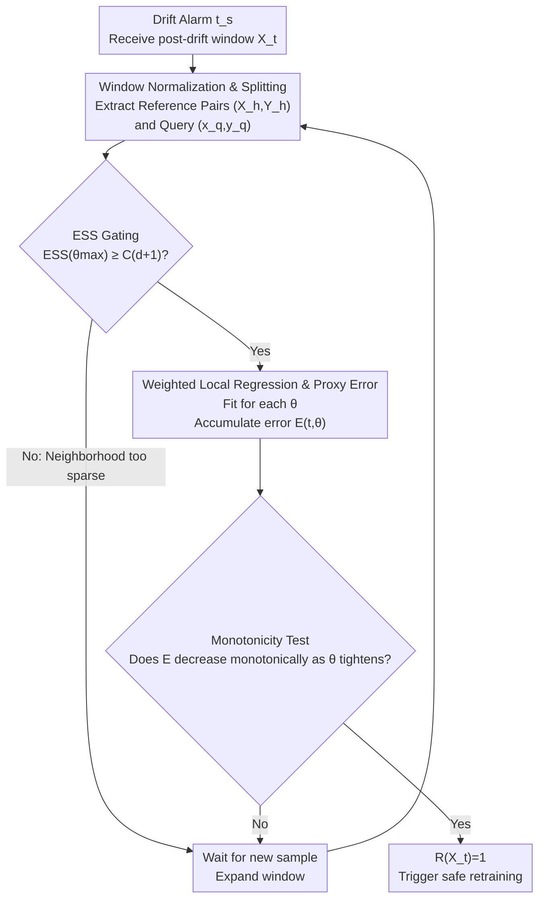

# When to Retrain after Drift: A Data-Only Test of Post-Drift Data Size Sufficiency

**Conference**: ICLR 2026  
**arXiv**: [2603.09024](https://arxiv.org/abs/2603.09024)  
**Code**: Not mentioned  
**Area**: Others / Stream Data Learning  
**Keywords**: Concept Drift, Retraining Timing, Data Sufficiency, Stream Learning, Weighted Local Regression, State Dependence

## TL;DR
CALIPER proposes a detector- and model-agnostic, data-only test that tracks the monotonicity of proxy errors from weighted local regression with respect to the locality parameter $\theta$. This method estimates the minimum data volume required for safe retraining after abrupt concept drift without the need to actually retrain downstream models.

## Background & Motivation

**Background**: Maintaining predictor performance in non-stationary data streams necessitates rapid adaptation to concept drift. While window-based detectors such as ADWIN and KSWIN can identify whether and when drift occurs, they cannot determine how much post-drift data is sufficient for safe retraining.

**Limitations of Prior Work**: (1) The gap between detection and retraining—drift detectors signal that "a change occurred" but not that "sufficient data has been collected." (2) Premature retraining (insufficient data) leads to overfitting and destabilization. (3) Delayed retraining (excessive waiting) keeps outdated models online too long, causing sustained performance degradation. (4) Repeatedly retraining deep networks to evaluate readiness is computationally prohibitive in streaming scenarios.

**Key Challenge**: How to determine if a post-drift window is large enough based solely on data-side signals, without accessing internal model states or performing actual retraining?

**Goal**: Design a model-agnostic stopping criterion $R(\mathbf{X}_t) \in \{0,1\}$ that utilizes pure data-side signals to determine the earliest safe timing for retraining.

**Key Insight**: Exploiting **state dependence** in data streams generated by dynamical systems—where nearby states exhibit similar one-step transitions. If a post-drift window demonstrates sufficient local consistency, safe retraining can proceed.

**Core Idea**: Trace the monotonic non-increasing trend of proxy errors as the locality parameter $\theta$ increases using single-pass weighted local regression. Combined with Effective Sample Size (ESS) gating, this determines data sufficiency without retraining models.

## Method

### Overall Architecture
CALIPER addresses a step overlooked by drift detectors: while detectors "shout" that a change has occurred, they do not indicate when enough data has been accumulated. The approach translates "data sufficiency" into a pure data-side, single-pass computable signal that never accesses the internal state of the downstream model or performs trial retraining. Upon a drift alarm, CALIPER takes the current post-drift window, performs normalization, and extracts "reference sets + query pairs." It uses an Effective Sample Size (ESS) gate to filter out sparse sample scenarios, then fits lightweight weighted regressions across a range of locality granularities (from coarse to fine) and records proxy errors. Finally, it checks if the error curve decreases monotonically as locality tightens—if so, it outputs $R(\mathbf{X}_t)=1$, triggering safe retraining; otherwise, it waits for new samples and repeats the process.

### Key Designs

**1. Window Normalization and Splitting: Converting the post-drift window into a self-supervised "state $\rightarrow$ next state" prediction task**

Data originates from a dynamical system $\mathbf{x}(t+1) = f(\mathbf{x}(t)) + \xi_t$, where adjacent states naturally possess a one-step transition structure. CALIPER leverages this structure to create self-supervised labels, allowing window quality evaluation without external annotations. Specifically, the normalized post-drift window $\mathbf{Z} \in \mathbb{R}^{n_t \times d}$ is split into reference pairs $(\mathbf{X}_h, \mathbf{Y}_h)$—sequences of continuous state transitions—and the current query $(\mathbf{x}_q, \mathbf{y}_q)$. All subsequent judgments are based on the task of "predicting the next state of the query using the reference pairs."

**2. ESS Gating: Confirming sample sufficiency at the tightest locality before further computation**

Weighted regression relies on few neighbors when $\theta$ is large (narrow neighborhood). If the effective sample size is too low, the error curve becomes distorted by noise, leading to premature triggers. CALIPER defines effective sample size using kernel weights $w_i(\theta) = \exp(-\theta r_i)$ as $\text{ESS}(\theta) = \frac{(\sum_i w_i)^2}{\sum_i w_i^2}$. It performs a check only at the tightest $\theta_{\max}$, requiring $\text{ESS}(\theta_{\max}) \geq C(d+1)$. Checking this single point is sufficient because ESS is monotonically non-increasing concerning $\theta$; if the narrowest neighborhood passes, wider neighborhoods will also pass.

**3. Weighted Local Regression and Proxy Error: Fitting across a grid from coarse to fine to measure "tighter focus, lower error"**

For each $\theta \in \Theta$, the weighted normal equation $\boldsymbol{\beta}_\theta = \mathbf{A}_\theta^{-1}\mathbf{B}_\theta$ is solved to obtain regression coefficients. These are used to predict the query and calculate the proxy error $e_{(t,\theta)} = \|\mathbf{y}_q - \hat{\mathbf{y}}_\theta\|$, which is then accumulated over time as $E_{(t,\theta)} = E_{(t-1,\theta)} + e_{(t,\theta)}$. Here, $\theta$ acts as a "proximity knob": small $\theta$ represents a more global average, while large $\theta$ focuses on closer neighbors. The key intuition is that if the window truly possesses state dependence (where nearby state transitions are similar), the error should decrease as the neighborhood tightens and $\theta$ increases.

**4. Monotonicity Test and Trigger: Treating "error reduction as locality tightens" as the criterion for data sufficiency**

The accumulated error is checked for monotonic non-increase across an ordered grid $\Theta = \{\theta_k\}$, specifically $E_{(t,\theta_k)} \geq E_{(t,\theta_{k+1})}\ \forall k$. Once this holds across all segments, $R(\mathbf{X}_t) = 1$ is set, and retraining is triggered. This monotonicity serves as a sufficiency criterion because it demonstrates that the "closer lookup, better prediction" regularity has stabilized within the window—meaning the data exhibits enough state dependence and local regularity that retraining will not overfit to transient noise.

### Loss & Training
CALIPER itself does not require training. Theoretical analysis indicates that windows passing the CALIPER monotonicity test exhibit stronger state dependence (Proposition 1), which correlates with better generalization bounds (explained via data-dependent generalization bounds). The algorithmic time complexity is $O(d^2 K)$ per update ($K$ being the locality grid size), with $O(d^2)$ memory.

## Key Experimental Results

### Main Results (Four Datasets × Three Learners × Two Detectors)

| Method | MoCap | TEP | Automobile | Dysts |
|------|-------|-----|-----------|-------|
| Fixed-small | Poor | Poor | Poor | Poor |
| Fixed-large | High Latency | High Latency | High Latency | High Latency |
| Incremental | Inconsistent | Unstable | Unstable | Unstable |
| **CALIPER** | **≈Optimal** | **≈Optimal** | **≈Optimal** | **≈Optimal** |

CALIPER consistently matches or exceeds the performance of the best fixed-window retraining strategy across all combinations.

### Ablation Study

| Configuration | Effect |
|------|------|
| Full CALIPER | Best |
| No ESS Gating | Premature triggering leads to instability |
| Fixed Small Window | Overfitting / Oscillation |
| Fixed Large Window | Excessive latency |
| Incremental Update | Fails to handle abrupt drift |

### Key Findings
- CALIPER is effective across different learner families (KRR, MLP, Transformer), proving its model-agnostic nature.
- It performs well with both ADWIN and KSWIN, proving its detector-agnostic nature.
- Performance degrades if data volume is too large (due to late adoption of outdated models), proving "more data is not always better."
- The data volume selected by CALIPER is usually close to the posterior optimal point (the point of minimum error).
- Computational overhead is negligible (microsecond scale per step).

## Highlights & Insights
- **Value of Problem Definition**: Formalizing "when to retrain after drift" as an independent problem fills the gap between drift detection and model adaptation. This issue is critical in practical deployments but has been largely under-studied.
- **State Dependence Insight**: Translating the data sufficiency problem into a monotonicity test for local regression offers a self-supervised metric that is both elegant and practical.
- **Theory-Practice Alignment**: Proposition 1 provides a formal link between the monotonicity test and state dependence, while data-dependent generalization bounds provide theoretical support for the algorithm.
- **Minimal Overhead**: CALIPER strictly performs small-scale weighted regressions, avoiding the overhead of repeated model retraining.

## Limitations & Future Work
- Assumes data originates from a dynamical system $\mathbf{x}(t+1) = f(\mathbf{x}(t)) + \xi_t$; may not apply to non-temporal or non-state-dependent data.
- Selection of the locality grid $\Theta$ (though claimed to be parameter-free) may affect sensitivity to different types of drift.
- Only handles abrupt drift; gradual drift scenarios require alternative approaches.
- Selection of the ESS gating constant $C$ might require adjustment based on problem dimensionality.
- Theoretical analysis has certain limitations regarding mixing conditions and noise assumptions.

## Related Work & Insights
- **vs ADWIN/KSWIN**: These only detect if drift has occurred; CALIPER determines when data is sufficient. They are complementary—use a detector for the alarm, then CALIPER to time the retraining.
- **vs Incremental Learning (FSNet/OneNet, etc.)**: Incremental methods attempt continuous adaptation but are often inferior to full retraining during abrupt drifts. CALIPER provides the signal for when full retraining is appropriate.
- **vs D-Tracker/RegimeCast**: These handle regime shifts but do not solve the post-drift retraining data volume problem.

## Rating
- Novelty: ⭐⭐⭐⭐⭐ Proposes an important and under-studied problem with a concise, elegant solution.
- Experimental Thoroughness: ⭐⭐⭐⭐ Comprehensive evaluation across four datasets, three models, and two detectors.
- Writing Quality: ⭐⭐⭐⭐ Clear motivation with complete theoretical analysis.
- Value: ⭐⭐⭐⭐ High direct value for the practical deployment of streaming ML systems.

<!-- RELATED:START -->

## Related Papers

- [\[AAAI 2026\] Autonomous Concept Drift Threshold Determination](../../AAAI2026/others/autonomous_concept_drift_threshold_determination.md)
- [\[ICLR 2026\] Predicting Kernel Regression Learning Curves from Only Raw Data Statistics](predicting_kernel_regression_learning_curves_from_only_raw_data_statistics.md)
- [\[ICLR 2026\] On the Impact of the Utility in Semivalue-based Data Valuation](on_the_impact_of_the_utility_in_semivalue-based_data_valuation.md)
- [\[ICLR 2026\] Bayesian Influence Functions for Hessian-Free Data Attribution](bayesian_influence_functions_for_hessian-free_data_attribution.md)
- [\[ICLR 2026\] Exploring State-Space Models for Data-Specific Neural Representations](exploring_state-space_models_for_data-specific_neural_representations.md)

<!-- RELATED:END -->
