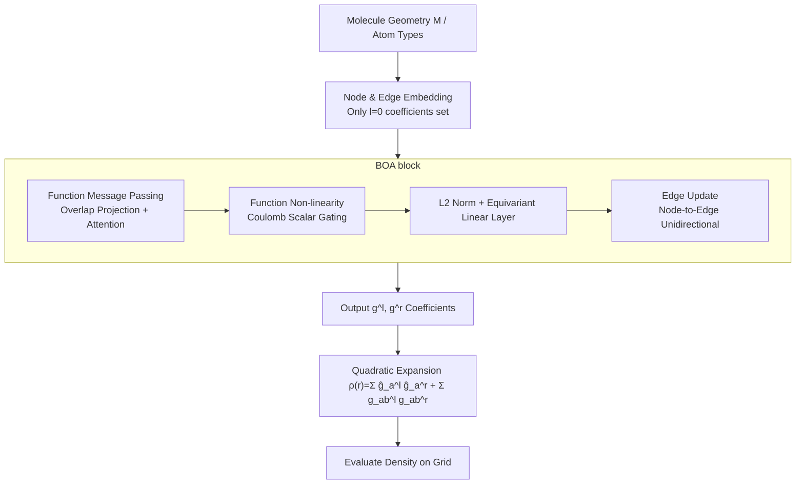

# A Function-Centric Graph Neural Network Approach for Predicting Electron Densities

**Conference**: ICLR 2026  
**OpenReview**: [https://openreview.net/forum?id=HDdkFjFEZd](https://openreview.net/forum?id=HDdkFjFEZd)  
**Code**: [https://github.com/sciai-lab/boa](https://github.com/sciai-lab/boa)  
**Area**: Machine Learning for Quantum Chemistry / Equivariant Graph Neural Networks  
**Keywords**: Electron Density Prediction, KS-DFT Surrogate Model, Equivariant Message Passing, Overlap Matrix, Density Matrix, Gaussian Basis Functions  

## TL;DR
This paper proposes **Basis Overlap Architecture (BOA)**—an equivariant GNN that interprets internal features as "spatial functions expanded in a basis" and passes messages using overlap integrals between atomic basis functions. It represents electron density via a quadratic expansion of basis function products (i.e., density matrix). BOA achieves new SOTA results on QM9 and MD density datasets and generalizes from small molecules (9 heavy atoms) to large systems with nearly 200 atoms.

## Background & Motivation
- **Background**: Electron structure prediction (especially Kohn-Sham DFT) is a core tool for catalysis, battery, and drug design, but its high computational cost limits applications in large systems and high-throughput scenarios. Machine learning surrogate models have emerged, where "direct prediction of ground-state electron density" serves as an intermediate between property prediction and Hamiltonian prediction—density theoretically determines all ground-state properties and can accelerate DFT self-consistent iterations.
- **Limitations of Prior Work**: Methods for direct density prediction fall into two categories. **Basis expansion methods** express density as a linear combination of atom-centered basis functions $\rho(r)=\sum_a\sum_\mu p_{a\mu}\omega^{Z_a}_\mu(r-r_a)$. These are scalable, but accuracy depends heavily on the basis choice, often requiring a massive number of basis functions. To mitigate this, prior work introduced "virtual nodes" (extra basis functions at bond midpoints) or "floating orbitals" (predicting basis positions per molecule). **Grid-based methods** represent density on a voxel grid, avoiding basis errors but incurring massive memory overhead.
- **Key Challenge**: Models either suffer from the insufficient expressivity of fixed atom-centered bases, increase complexity with extra nodes/floating orbitals, or face memory explosions from grids. How can atom-centered bases precisely capture density in bonding and inter-atomic regions without introducing virtual nodes or floating orbitals?
- **Goal**: Design an architecture that retains the scalability of basis expansion, naturally covers inter-atomic space, and embeds the physical structure of quantum chemistry (basis sets, overlaps, density matrices) as a strong inductive bias.
- **Core Idea**: **[Quadratic Expansion of Density]** Instead of linear expansion, the model mimics how density is formed by the sum of squared orbital functions in DFT, using **products** of basis functions. The product of two atom-centered Gaussians is naturally centered between the atoms, covering bonding regions without virtual nodes. **[Function-Centric Message Passing]** Internal features are consistently interpreted as "functions under a specific basis." During message passing, the **overlap matrix** of inter-atomic basis functions is used to project the sender's function onto the receiver's basis via least-squares, injecting geometric information (overlap depends on relative positions) and basis information into the network.

## Method

### Overall Architecture
BOA is a fully equivariant ($SO(3)$ rotation + translation) message-passing network. The core convention is that all internal features are interpreted as "spatial functions expanded under given atom-centered Gaussian bases"—node features $h_{am\mu}$ correspond to a function $h_m(r)=\sum_a\sum_\mu h_{am\mu}\omega^{Z_a}_\mu(r-r_a)$, and edge features follow similarly. The backbone consists of stacked BOA blocks: each block performs **function message passing** to update node features, followed by **edge updates**, interspersed with functional non-linearities, L2 normalization, and equivariant linear layers. The backbone outputs a set of coefficients used in the quadratic expansion (Eq. 2) to compute electron density on a grid. Node features handle the primary computation, while edge features receive information unidirectionally to avoid high overhead.

### Key Designs
**1. Quadratic (Low-rank Density Matrix) Expansion: Allowing atom-centered bases to cover inter-atomic regions.** BOA does not write density as a linear combination of basis functions but as a sum of paired function products:
$$\rho(r)=\sum_{a\in N}\hat g^{(l)}_a(r)\hat g^{(r)}_a(r)+\sum_{(a,b)\in E^e}\sum_o^{N^o} g^{(l)}_{abo}(r)\,g^{(r)}_{abo}(r),$$
where each $g^{(l)}_{abo}, g^{(r)}_{abo}$ is still expanded only on local bases of their respective atoms. Rewriting this as $\rho(r)=\sum_{\mu\nu}\Gamma_{\mu\nu}\bar\omega_\mu(r)\bar\omega_\nu(r)$ reveals that $\Gamma_{\mu\nu}$ is precisely the **density matrix** used in KS-DFT. BOA provides a **low-rank approximation** for each block $\Gamma_{ab\mu\nu}$ of the density matrix via $N^o$ function pairs per edge, without explicitly constructing the full matrix. Physical intuition is key: the product of two atom-centered Gaussians centers between the two atoms (Fig. 1C showing product centers in benzene distributed in bonding regions), allowing atom-centered bases to describe bonding density without virtual nodes. Self-loop terms $\hat g^{(l)}_a\hat g^{(r)}_a$ act as an initial density guess (pre-trained on atom types for 1000 steps), with the model learning the delta.

**2. Basis Overlap Message Passing: "Translating" messages via the overlap matrix.** Since every channel is a function, sending a message from node $b$ to $a$ requires a basis transformation. First, the overlap integral of node $b$'s features with node $a$'s basis functions is computed: $o_{abm\mu}=\sum_\nu W^{ab}_{\mu\nu}h_{bm\nu}$, where $W^{ab}_{\mu\nu}=\int dr\,\omega^{Z_a}_\mu(r-r_a)\omega^{Z_b}_\nu(r-r_b)$ is the overlap matrix. Multiplying by the inverse of the receiver's own overlap matrix yields the message $m_{abm\mu}=\sum_\nu (W^{aa})^{-1}_{\mu\nu}o_{abm\nu}$—this is the **optimal least-squares representation** of node $b$'s function in node $a$'s basis. As $W^{ab}$ depends on relative positions, geometric information is naturally injected. Messages are weighted by **attention**: derived from the overlap of two node feature functions $\alpha_{abmn}=\int dr\,h_{am}(r)h_{bn}(r)=\sum_\mu h_{am\mu}o_{abn\mu}$, passed through an MLP to get weights $\tilde\alpha_{abmn}$, and aggregated as $\tilde h_{am\mu}=\sum_{b}\sum_n \tilde\alpha_{abmn}m_{abn\mu}$.

**3. Function-aware Non-linearity and Normalization.** Standard element-wise non-linearities destroy the feature semantics as functions and their rotational tensor structure. BOA constructs scalar gates: $SO(3)$-invariant scalar features are calculated using the Coulomb matrix $l_{amn}=\int dr\,dr'\,h_{am}(r)h_{an}(r')/\lVert r-r'\rVert=\sum_{\mu\nu}h_{am\mu}C^{aa}_{\mu\nu}h_{an\nu}$ ($C$ generated by PySCF for Gaussian bases). These are passed through an MLP to linearly mix channel functions $\tilde h_{am\mu}=\sum_n w_{amn}h_{an\mu}$. Normalization follows function semantics: using the L2 norm of each channel function $n_{am}=\sqrt{\int dr\,(h_{am}(r))^2}=\sqrt{\sum_{\mu\nu}h_{am\mu}W^{aa}_{\mu\nu}h_{am\nu}}$. Linear layers use standard e3nn equivariant layers (mixing only same-type tensors).

**4. Node/Edge Separation and Unidirectional Updates.** Primary computation is placed on node features to control cost. Edge features play an auxiliary role and receive information **unidirectionally** (node $\to$ edge). Each directed edge has $(l)$ and $(r)$ feature sets located at the endpoints. Edge updates calculate invariant overlap integrals $o^{(n)}_{abmn}, o^{(e)}_{abmn}$, pass them through an MLP to get weights normalized by Frobenius norm, and linearly mix old edge features with node features. BOA uses two cutoff radii: a smaller $r^e$ for edge features and a larger $r^{mp}$ for message passing.

## Key Experimental Results

### Main Results (QM9 Electron Density, NMAE ↓ [%])

| Method | VASP Ground Truth | PySCF Ground Truth |
|---|---|---|
| eqDeepDFT | 0.284 | n/a |
| InfGCN | 0.869 | n/a |
| ChargE3Net | 0.196 | n/a |
| SCDP | 0.178 | n/a |
| ELECTRA | 0.177 | n/a |
| ResNet (Li et al. 2025) | n/a | 0.14 |
| **BOA small** | 0.1381 ± 0.0003 | 0.13 ± 0.01 |
| **BOA large** | **0.1339 ± 0.0005** | **0.116 ± 0.006** |

### MD Dataset (NMAE ↓ [%], comparison with strongest baseline)

| Method | ethanol | benzene | phenol | resorcinol | ethane | malonaldehyde |
|---|---|---|---|---|---|---|
| SCDP | 2.34 | 1.13 | 1.29 | 1.35 | 2.05 | 2.71 |
| ELECTRA | 1.02 | 0.45 | 0.56 | 0.62 | 0.91 | 0.80 |
| **BOA small** | **0.710** | **0.361** | 0.56 | **0.371** | **0.772** | **0.61** |

### Key Findings
- **Cross-scale Generalization (QMugs, ~200 atoms)**: Trained only on QM9 ($\leq 9$ heavy atoms), BOA extrapolates to molecules with nearly 200 atoms. **Receptive field is critical**—BOA with standard cutoffs ($r^{mp}=6$Å, $r^e=3$Å) underperforms ResNet, but reducing cutoffs to $r^{mp}=3$Å, $r^e=2$Å keeps NMAE **constant** across sizes and outperforms ResNet. Large fields introduce distribution shifts between small and large molecules.
- **Efficiency**: The small-cutoff version generalizes better and is significantly faster than standard BOA and ResNet.
- **Effectiveness of Physical Bias**: The quadratic expansion + overlap message passing embeds the DFT density matrix structure directly into the network, leading to superior accuracy.

## Highlights & Insights
- **Density Matrix as Output Structure**: Using the quadratic product of basis functions corresponds to a low-rank block approximation of the density matrix. This inherits the physical representation of KS-DFT and eliminates the need for virtual nodes or floating orbitals.
- **Message as Least-Squares Basis Projection**: "Translating" functions between atomic bases via the overlap matrix allows message passing to carry both basis-specific and geometric information.
- **Analytical Integrals**: Overlap, Coulomb, and L2 norms are computed via analytical integrals of Gaussian bases (PySCF/e3nn), maintaining function semantics and equivariance throughout.
- **Counter-intuitive Generalization**: A smaller receptive field leads to better cross-scale generalization and faster inference, a lesson applicable to other "train small, test large" molecular ML models.

## Limitations & Future Work
- **Narrow Elemental Coverage**: QM9/MD only contain small organic molecules. Current independent parameters per atom type would lead to parameter explosion for the full periodic table; universal shared basis sets are suggested.
- **Data Scaling**: Training on larger and more diverse datasets is required for practical deployment.
- **Fixed Basis Sets**: Currently uses fixed non-contracted Gaussian bases + learned radial factors. Future work could learn Gaussian exponents or use differentiable chemistry packages (PySCFAD) to adapt overlap/Coulomb matrices during training.
- **Stability of Functional Linear Layers**: Theoretically more consistent functional-kernel integral layers were unstable in training, forcing a return to e3nn equivariant linear layers.

## Related Work & Insights
- **Basis Expansion Density Prediction**: SCDP (virtual nodes) and ELECTRA (floating orbitals) are direct comparisons—BOA replaces their extra degrees of freedom with the geometric centering of basis function products.
- **Grid-based Methods**: ChargE3Net and ResNet (Li et al. 2025) avoid basis errors but require large memory; BOA surpasses them in accuracy with high memory efficiency.
- **Equivariant GNNs**: MACE and e3nn provide the equivariant framework; BOA replaces heuristic gating with physical quantities derived from the Coulomb matrix.
- **Inspiration**: Directly designing "internal representations" from the domain (the density matrix) as the network structure is more powerful than generalized geometric GNNs.

## Rating
- **Novelty**: ⭐⭐⭐⭐⭐ High originality in fusing density matrix quadratic expansion with least-squares projection message passing.
- **Experimental Thoroughness**: ⭐⭐⭐⭐ Strong results on QM9 and MD with cross-scale analysis, though more ablation on individual modules would be beneficial.
- **Writing Quality**: ⭐⭐⭐⭐ Clear physical motivation and rigorous derivation, though the barrier for readers without a quantum chemistry background is high.
- **Value**: ⭐⭐⭐⭐⭐ Sets new SOTA for density prediction with strong generalization capabilities essential for practical DFT surrogate models.

<!-- RELATED:START -->

## Related Papers

- [\[ICLR 2026\] Generalized Spherical Neural Operators: Green's Function Formulation](generalized_spherical_neural_operators_greens_function_formulation.md)
- [\[ICLR 2026\] Orbital Transformers for Predicting Wavefunctions in Time-Dependent Density Functional Theory](orbital_transformers_for_predicting_wavefunctions_in_time-dependent_density_func.md)
- [\[ICLR 2026\] Feedback-driven Recurrent Quantum Neural Network Universality](feedback-driven_recurrent_quantum_neural_network_universality.md)
- [\[ICLR 2026\] Incomplete Data, Complete Dynamics: A Diffusion Approach](incomplete_data_complete_dynamics_a_diffusion_approach.md)
- [\[AAAI 2026\] PhysicsCorrect: A Training-Free Approach for Stable Neural PDE Simulations](../../AAAI2026/physics/physicscorrect_a_training-free_approach_for_stable_neural_pde_simulations.md)

<!-- RELATED:END -->
