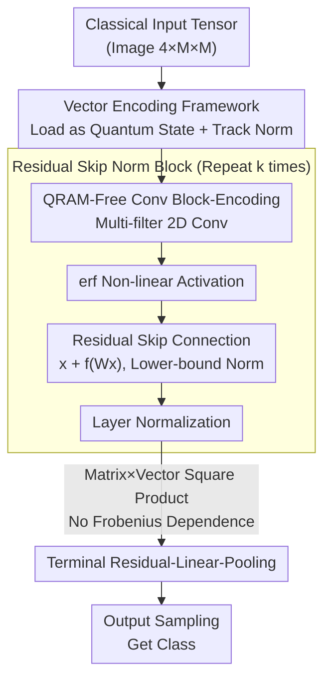

# Accelerating Inference for Multilayer Neural Networks with Quantum Computers

**Conference**: ICLR2026  
**OpenReview**: [https://openreview.net/forum?id=QcRto0GjxC](https://openreview.net/forum?id=QcRto0GjxC)  
**Code**: To be confirmed  
**Area**: Quantum Machine Learning / Quantum Algorithms  
**Keywords**: Quantum computing, Neural network inference, Block encoding, Residual networks, Complexity proof

## TL;DR
This paper presents the **first fully-coherent** quantum implementation of multilayer neural networks—transferring ResNet-style multi-filter 2D convolutions, non-linear activations, skip connections, and layer normalization entirely onto quantum circuits without intermediate measurements. Under three quantum data access assumptions, it proves end-to-end inference complexities ranging from quadratic and quartic speedups to $O(\mathrm{polylog}(N/\epsilon)^k)$ relative to input dimension $N$.

## Background & Motivation

**Background**: Deep learning relies on parallel matrix operations on GPUs, but Moore’s Law is approaching physical limits, potentially capping the expansion of GPUs/CPUs. A natural question arises: can Fault-Tolerant Quantum Processors (QPUs) provide further acceleration? Quantum Machine Learning (QML) is generally divided into two branches: Variational Quantum Circuits (VQA/PQC) tailored for near-term hardware, and **quantum subroutines** providing provable asymptotic speedups for underlying linear algebra (matrix inversion, matrix-vector products, sampling) in classical models. This work belongs to the latter.

**Limitations of Prior Work**: The first branch (variational networks) suffers from barren plateaus, poor local minima, and vanishing gradients, with mitigation techniques often rendering circuits classically simulable. While the second branch offers provable speedups, its **fatal flaw is "decoherence"**: prior attempts to accelerate Feedforward Networks (Allcock et al. 2020), CNNs (Kerenidis et al. 2020), and Transformers (Guo et al. 2024) required either intermediate measurements of inner products or quantum state tomography to read results back to classical machines before re-encoding for the next layer. This "readout-re-encoding" breaks quantum coherence and eliminates potential exponential speedups.

**Key Challenge**: Implementing multilayer networks requires inter-layer non-linearities, which naturally demand "measurement/readout." However, readout destroys the advantages of quantum parallelism. A more subtle issue is **norm decay**: the norm of vectors may diminish arbitrarily during multi-layer forward propagation. Since quantum algorithm complexity is typically inversely proportional to the norm of the encoded vector, the runtime for a $k$-layer network could explode to $\approx N^k$ or even become unbounded—making even constant-depth networks unsolvable.

**Goal**: Construct a fully-coherent multilayer network implementation that requires **no measurement/readout between layers**, modularizing convolutions, activations, skip connections, and normalization into concatenable quantum blocks with bounded and minimal inference complexity for constant-depth networks.

**Key Insight**: Using classical ResNet as a template, the authors observe that **residual skip connections are not only essential for training deep classical networks but are the fundamental mechanism for norm stability and conservation in quantum implementations**. Centered on "effectively lower-bounding the forward norm before each normalization layer," the authors build a complete set of vector-encoding (VE) tools to precisely track norms.

**Core Idea**: Utilize "block-encoding + vector-encoding" to represent each network module as a quantum circuit without readout. Rely on residual skip connections to ensure norms do not decay, allowing the entire multi-layer forward pass to be executed coherently, with a single sampling at the output to obtain classification results.

## Method

### Overall Architecture

The problem is formalized as **approximate sampling-based classification** (Definition 1): Given a trained network $h:\mathbb{R}^D\mapsto\mathbb{R}^C$, an input $x$ yields a probability distribution $y=h(x)$ ($\|y\|_1=1$). The goal is to **sample once** (i.e., classify an image) from a distribution $\hat y$ satisfying $\|y-\hat y\|_2\le\epsilon$. The objective is sampling rather than full distribution readout, which aligns with the natural strengths of quantum machines and is key to bypassing tomography.

The pipeline is as follows: The input tensor is loaded into a quantum state via Vector Encoding (VE) → $k$ residual convolutional blocks are concatenated (internal to each block: 2D convolution block-encoding → erf activation → skip connection addition → layer normalization, all without readout) → a terminal residual-linear-pooling block → sampling at the output to obtain the class. The three data access regimes share the same "$k$ residual convolutional blocks" but differ in **input loading** and **terminal processing**.

### Key Designs

**1. Vector Encoding (VE) Framework and Four Primitives: Modular Norm Tracking Tools**

Quantum algorithm complexity is almost always inversely proportional to the norm of the encoded vector. Therefore, "norm evolution" in multilayer networks must be precisely accounted for. The authors extend the VE definition: a unitary $U_\psi$ is an $(\alpha,a,\epsilon)$-VE of $|\psi\rangle_n$ if $\big\||\psi\rangle_n-\alpha(\langle 0|^a\otimes I_n)U_\psi|0\rangle^{a+n}\big\|_2\le\epsilon$, where $\alpha$ encodes norm information (the encoded state norm is $1/\alpha$ when $\epsilon=0$). This abstraction, alongside "block-encoding" (embedding matrix $A/\alpha$ into the top-left block of a unitary), allows **norm factors to multiply and accumulate by rule** during matrix-vector operations rather than becoming a black box.

Building on this, the authors complete four primitives on vectors (Lemmas 1–4): vector sum, matrix-vector product, vector tensor product, and vector concatenation. Each lemma explicitly provides the new $(\alpha,a,\epsilon)$ parameters for the output VE (e.g., matrix-vector products transform the error to $(\epsilon_0+\alpha\epsilon_1)/\mathcal{N}$ and the norm factor to $\alpha\beta/\mathcal{N}$). While these primitives leverage existing techniques, their integration into the VE framework allows for analytical tracking of norms at every step—providing the foundation for the complexity proofs.

**2. Matrix-Vector Element-wise Square Product: Speeding up without Frobenius Norm (Rank) Dependence**

To perform non-linearities on quantum computers, a core operation involves applying a matrix $W$ to the **element-wise square** $g(x)=|x|^2$ of a vector. A direct approach uses block-encoding of $W$, but block-coding for dense, full-rank matrices requires either low rank or sparsity; otherwise, complexity scales with the Frobenius norm $\|W\|_F$ (which grows with dimension, negating speedups).

Theorem 1 provides a workaround: **instead of block-encoding $W$ globally**, $W$ is decomposed by columns $W=(w_0,\dots,w_{N-1})$, normalized as $|w_j\rangle=w_j/\|w_j\|_2$, with $a_j=\|w_j\|_2$. Utilizing three objects—the block-encoding of $\mathrm{diag}(a_0,\dots)$, a column oracle $U_W|0\rangle|j\rangle=|w_j\rangle|j\rangle$, and the VE of $|\psi\rangle$—"importance weighting" coherently combines columns of $W$ based on input elements. Applied to a modified input vector, this yields the VE of $Wg(|\psi\rangle_n)/\mathcal{N}$ with circuit depth $O(T_\psi+n^2)$. This is claimed as the **first quantum algorithm using arbitrary full-rank dense matrices without Frobenius norm dependence**, enabling speedup for the terminal $N\times N$ full-rank linear layer.

**3. QRAM-Free 2D Multi-filter Convolution Block-Encoding: Avoiding QRAM for Few Parameters**

Convolutional layers have significantly fewer parameters than the dimension of the vectorized tensors they process. Based on this, the authors propose (Lemma 5) the **first QRAM-free** 2-D multi-filter convolution block-encoding. For each parameter in the kernel, they construct a block-encoding for its highly structured matrix form, then use linear combinations to obtain the $(1,\cdot,0)$-block-encoding of the entire convolution matrix $C/(2\|C\|_2)$. The circuit depth is $O(m^2C^3D^4\log C\log D)$.

Crucially, this depth has **polylog dependence on dimension $N$ but polynomial dependence on parameter counts** (channels $C$, kernel width $D$). This contrasts with classical exact convolution algorithms' polynomial dependence on dimension, explaining why "Regime 3" (No QRAM) still achieves speedup: convolutions are naturally suited for QRAM-free implementation. The authors also suggest further optimization using Fourier transforms for circulant convolutions.

**4. Residual Skip Norm Blocks and Norm Conservation: Preventing k-layer Explosion**

This is the core insight of the paper. A single residual block (Lemma 6, General Skip Norm Block) follows the structure in Figure 2: Input $|\psi\rangle$ → Linear $W$ (Block-encoding) → Non-linear $f(x)=\mathrm{erf}(4x/5)$ → Residual addition $|\psi_f\rangle=|\psi\rangle+f(W|\psi\rangle)$ → Normalization. This internally concatenates the primitives for matrix-vector products, vector addition, activation, and normalization.

Why skip connections? **Without skip connections, the vector norm before normalization could decay arbitrarily**, causing quantum complexity to scale inversely and leading to runtimes of $\approx N^k$ or unbounded behavior over $k$ layers. The residual structure $x+f(Wx)$ ensures the "original signal $x$ is always added back," thereby **effectively lower-bounding** the forward norm before each normalization layer. The authors specifically prove norm conservation across these architecture blocks. Repeating the single block $k$ times yields the $k$-layer residual block (Lemma 7).

An additional profound observation: **applying a non-linear transformation via linear operators (unitaries) requires the definition to depend on the vector being acted upon** (e.g., if $A=\mathrm{diag}(x)$, then $Ax=x^2$). Thus, the algorithm must **dynamically construct a new circuit online** for every new input. This explains the $2^k$ factor in complexity (each non-linearity requires "re-construction"), which the authors suggest is a **fundamental limit** for any quantum algorithm performing deep non-linearities. Consequently, quantum computers are better suited for "wide and shallow" networks (complementary to classical systems which handle depth well but width via parallelism).

### Loss & Training

This is a **theoretical work focused purely on inference acceleration and does not involve training**. It assumes a pre-trained classical network where each convolutional layer is regularized such that the spectral norm is $\le 1$. The goal is to prove the complexity of migrating the forward inference to a quantum machine.

## Key Experimental Results

There are no numerical experiments; "experiments" consist of **complexity theorems** in three regimes and capability comparisons with prior work.

### Main Results: Inference Complexity Across Three Data Access Regimes

| Regime | Data Access Assumption | Architecture (Fig 1) | Inference Complexity | Relative Classical Speedup |
|--------|------------------------|----------------------|----------------------|----------------------------|
| 1 | Inputs & Weights via QRAM | (a) Residual CNN | $O(\mathrm{polylog}(N/\epsilon)^k)$ | Exponential (polylog) in $N$ |
| 2 | Weights via QRAM, Input via loading | (b) Bilinear Residual CNN | $\tilde O(N\log(1/\epsilon)^{2k})$ | **Quartic speedup** ($d=2$) via terminal $N^2\times N^2$ layer |
| 3 | Completely QRAM-Free | (c) Bilinear Residual CNN (no terminal linear) | $O(N\log(1/\epsilon)^{2k})$ | **Quadratic speedup** for $\Omega(N^2)$ convolution |

Where $N$ is input dimension, $k$ is layer count (constant), and $d$ is the number of parallel classical paths in Regimes 2/3 (Kronecker products increase dimension to $O(N^d)$ to amplify speedup).

### Comparison with Prior Work (Table 1 Abridged)

| Method | Architecture | Coherent Multilayer | Coherent Non-linearity | QRAM-Free | Norm Conservation | polylog $1/\epsilon$ | polylog $N$ |
|------|------|:---:|:---:|:---:|:---:|:---:|:---:|
| Allcock et al. 2020 | Feedforward | ✗ | ✗ | ✗ | ✗ | ✗ | ✗ |
| Kerenidis et al. 2020 | CNN | ✗ | ✗ | ✗ | ✗ | ✗ | ✗ |
| Guo et al. 2024 | Transformer | ✗ | ✓ | ✗ | ✗ | ✗ | ✗ |
| **Ours (Regime 1)** | Residual CNN | ✓ | ✓ | ✗ | ✓ | ✓ | ✓ |
| **Ours (Regime 2)** | Bilinear Res CNN | ✓ | ✓ | ✗ | ✓ | ✓ | ✗ |
| **Ours (Regime 3)** | Bilinear Res CNN | ✓ | ✓ | ✓ | ✓ | ✓ | ✗ |

### Key Findings
- **"Coherent Multilayer + Coherent Non-linearity"** represents the fundamental divergence from prior work. Previous methods required inter-layer measurements/tomography, whereas this method maintains the forward pass without readout to preserve speedup.
- **Norm conservation is critical for bounded complexity**: Removing skip connections degrades $k$-layer complexity from polylog to $\approx N^k$. Skip connections lower-bound the norm to ensure provable runtime.
- **First architecture in this category (accelerating classical DL) that does not rely on QRAM** (Regime 3), at the cost of reducing exponential (polylog $N$) speedup to quadratic speedup.
- The $2^k$ factor arises because non-linearities require input-dependent circuit construction. The authors conclude quantum is best for **wide and shallow** inference scenarios.

## Highlights & Insights
- **Reinterpreting "Residual Skip Connections"**: Skillfully shifts the perspective of ResNets from a classical training aid (gradient flow) to a quantum norm stabilizer (bounded runtime).
- **Matrix-Vector Square Product without Frobenius Dependence** (Theorem 1): Using "column-wise importance weighting" rather than global block-encoding allows quantum use of arbitrary dense matrices without paying a rank/Frobenius penalty—a primitive with independent value in quantum linear algebra.
- **QRAM-free Convolutional Block-Encoding Criterion**: Establishes that when parameter count $\ll$ dimension, one should use structured block-encoding of parameters rather than QRAM.
- **Strategic Sampling-based Formulation**: Choosing sampling over full distribution readout avoids the high cost of tomography and naturally fits auto-regressive next-token prediction tasks.

## Limitations & Future Work
- **Dependence on Fault-Tolerant Quantum Computers**: Results rely on FT-QPUs and (in some regimes) QRAM, the physical viability of which remains debated. This is theoretical acceleration far from current hardware reality.
- **Depth Penalty of $2^k$**: The need to reconstruct circuits for non-linearities causes complexity to grow exponentially with layers, limiting the approach to constant-depth, wide-and-shallow networks.
- **Polynomial Parameter Overhead**: Convolutional depth is polynomial in channel count ($C^3$) and kernel width ($D^4$). While optimizable, current forms are inefficient for large filters.
- **Inference Only**: Does not address training and requires pre-processing of weights (spectral norm regularization $\le 1$).

## Related Work & Insights
- **Vs. Variational Quantum Neural Networks (VQA/PQC)**: Those use parameterized circuits as network analogues but suffer from barren plateaus; this work coherently "simulates" the forward pass of a classical ResNet with provable speedup.
- **Vs. Allcock et al. 2020 / Kerenidis et al. 2020 / Guo et al. 2024**: These require inter-layer readout or tomography, breaking coherence and limiting speedup. This work achieves full coherence and norm conservation, including a QRAM-free version.
- **Vs. Bilinear Networks (Lin et al. 2015)**: The multi-path Kronecker architectures in Regimes 2/3 are inspired by bilinear CNNs, leveraging high-dimensional terminal linear layers to amplify speedups.

## Rating
- Novelty: ⭐⭐⭐⭐⭐ First fully coherent multilayer realization; ResNet-as-norm-stabilizer and Frobenius-free matrix products are significant.
- Experimental Thoroughness: ⭐⭐⭐⭐ Purely theoretical with no numerical simulation, but end-to-end complexity proofs are rigorous across three regimes.
- Writing Quality: ⭐⭐⭐⭐⭐ Successfully narrates complex quantum linear algebra; comparative tables make contributions clear.
- Value: ⭐⭐⭐⭐ Establishes a paradigm for coherence and norm conservation in QML, though constrained by hardware and $2^k$ depth penalties.

<!-- RELATED:START -->

## Related Papers

- [\[ICLR 2026\] AQER: A Scalable and Efficient Data Loader for Digital Quantum Computers](aqer_a_scalable_and_efficient_data_loader_for_digital_quantum_computers.md)
- [\[ICCV 2025\] ResQ: A Novel Framework to Implement Residual Neural Networks on Analog Rydberg Atom Quantum Computers](../../ICCV2025/physics/resq_a_novel_framework_to_implement_residual_neural_networks_on_analog_rydberg_a.md)
- [\[ICLR 2026\] Sublinear Time Quantum Algorithm for Attention Approximation](sublinear_time_quantum_algorithm_for_attention_approximation.md)
- [\[ICLR 2026\] Feedback-driven Recurrent Quantum Neural Network Universality](feedback-driven_recurrent_quantum_neural_network_universality.md)
- [\[NeurIPS 2025\] Exoplanet Formation Inference Using Conditional Invertible Neural Networks](../../NeurIPS2025/physics/exoplanet_formation_inference_using_conditional_invertible_neural_networks.md)

<!-- RELATED:END -->
