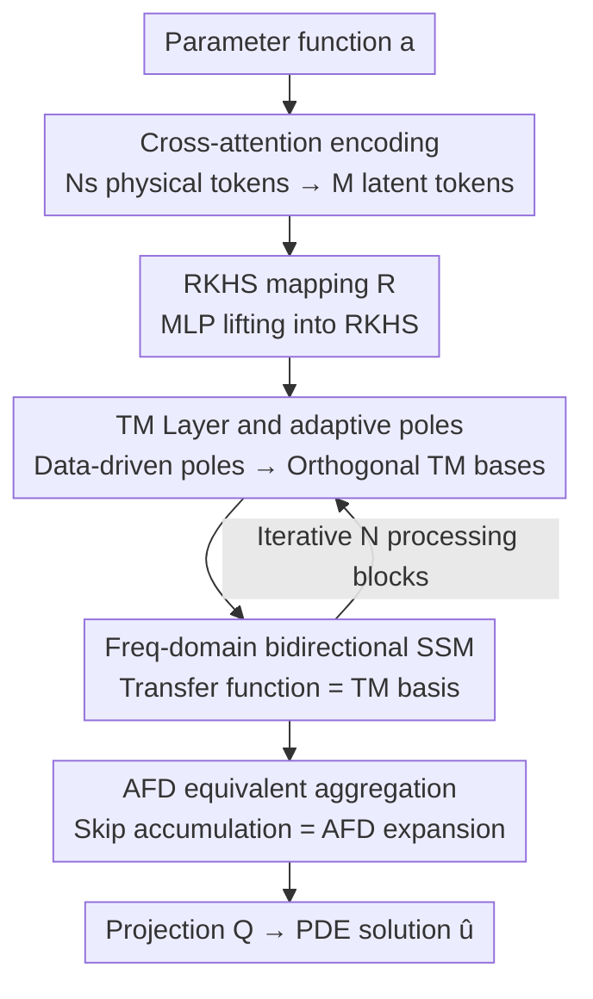

# Adaptive Mamba Neural Operators

**Conference**: ICLR2026  
**OpenReview**: [https://openreview.net/forum?id=OenyzvFZPs](https://openreview.net/forum?id=OenyzvFZPs)  
**Code**: https://github.com/checlams/AMO  
**Area**: applications to physical sciences (physics, chemistry, biology, etc.)  
**Keywords**: neural operators, partial differential equations, state space models, adaptive Fourier decomposition, frequency-domain interpretability

## TL;DR
AMO explicitly parameterizes the transfer function of Mamba/SSM as orthogonal kernels of the Takenaka-Malmquist (TM) system within a Reproducing Kernel Hilbert Space (RKHS), making the entire network equivalent to an "Adaptive Fourier Decomposition" (AFD). This approach reduces the average relative L2 error by approximately 28% across regular grids, point clouds, irregular domains, and financial PDEs with singularities.

## Background & Motivation
**Background**: Learning the "solution operator" of PDEs via neural networks has become a popular research direction. After learning an infinite-dimensional mapping $G_\theta$ from parameter functions $a$ (boundary/initial values/coefficients) to solutions $u(x,t)$, the network becomes mesh-independent—trainable on coarse grids and applicable to fine grids. Among these, frequency-domain operators (FNO, WNO, multi-wavelet MWT, LSM, etc.) are particularly favored because PDE solutions can naturally be expanded using spectral bases, where non-linear terms become convolutions in the frequency domain.

**Limitations of Prior Work**: Frequency-domain operators degrade on irregular geometries. Fourier/wavelet bases lose orthogonality and eigenfunction properties in irregular domains, leading to "spectral mixing." Recent latent Mamba operators (LaMO) introduce SSM efficiency into latent spaces to handle irregular domains, and while they show progress, their selective convolution kernels **lack orthogonality**. Furthermore, SSM kernels are essentially finite-order linear dynamical filters with a **low-pass filter bias**, which tends to smooth out high-frequency and singular features (e.g., propagation of high-frequency perturbations in 1-D convection equations or singularities in fractal permeability fields in 2-D Darcy flow).

**Key Challenge**: Achieving accurate solutions on irregular geometries requires maintaining kernel/basis orthogonality (to avoid spectral mixing), while computational efficiency requires linear-time structures like SSM. Existing SSM operators like LaMO lack frequency-domain implementations, making it difficult to simultaneously achieve "orthogonality + frequency-domain representation + efficiency."

**Goal**: Design an operator capable of solving PDEs on arbitrary geometries/meshes while preserving high-frequency and singular features, maintaining linear SSM complexity, and ensuring every architectural step has a mathematical interpretation.

**Key Insight**: It is observed that Adaptive Fourier Decomposition (AFD) in signal processing provides a triad of "data-adaptation + orthogonal bases + provable convergence." It constructs orthogonal bases from adaptively selected poles using the Takenaka-Malmquist system. If the SSM transfer function is designed as a TM basis, the SSM calculation corresponds exactly to the AFD coefficients.

**Core Idea**: Replace the non-orthogonal kernel integration of LaMO by constructing TM orthogonal kernels in RKHS and setting the SSM transfer function as these kernels. This ensures the forward propagation of the network is strictly equivalent to an AFD expansion, thereby achieving orthogonality, frequency-domain representation, and theoretical guarantees simultaneously.

## Method

### Overall Architecture
AMO aims to solve the solution operator $G_\theta: a \mapsto u$ for a family of parameterized PDEs $L_a[u(x,t)]=f(x,t)$. The pipeline begins by compressing $N_s$ physical tokens (coordinates + features) into $M \ll N_s$ latent tokens, which are mapped into a Reproducing Kernel Hilbert Space (RKHS). These then pass through $N$ **processing blocks** for iterative refinement before being projected back to physical space. Each processing block consists of two parts: a **TM Layer** that adaptively predicts poles from data to construct orthogonal kernels (TM bases), and a **Frequency-domain Bidirectional SSM** that sets its transfer function to the TM basis to perform correlation operations in the frequency domain. **Aggregation Layers** with skip connections accumulate intermediate outputs so that the overall output is exactly an AFD expansion.

Formally, $\hat u_{N,\theta} = (Q \circ S_N \circ L_N \circ \cdots \circ S_1 \circ L_1 \circ R \circ P)(a)$, where $P$ is lifting (cross-attention using a learnable query array to compress physical tokens into $M$ latent tokens $z_0$), $R$ maps $z_0$ into the RKHS using an MLP, $L_i = \text{SSM}_i \circ \text{TM}_i$ are the processing blocks, $S_i$ are aggregation layers, and $Q$ is a local decoder projecting back to physical space.

### Key Designs

**1. TM Layer and Adaptive Poles: Constructing orthogonal kernels using data-driven poles**

The limitation of LaMO is that its kernels lack orthogonality, leading to spectral mixing on irregular geometries. AMO's approach in the $i$-th processing block is to use a small MLP to predict $i$ complex "poles" $a_{1:i}$ falling within the unit disk $\mathbb{D}=\{z:|z|<1\}$ from the token $z_i$. Each pole first defines a reproducing kernel $K_a(z)=\frac{1}{1-az}$ ($|a|<1$). The poles act like "tuning knobs": their positions in the complex plane control the localization of the selected spatial modes. Poles are placed in regions with high parameter variation for fine-grained modeling, while fewer are placed in smooth regions; shallow-layer poles correspond to coarse modes, while deep-layer poles to fine, problem-specific modes.

To handle irregular domains, these $K_a$ are orthonormalized via Gram-Schmidt to obtain the TM basis:

$$B_i(z; a_{1:i}) = \frac{\sqrt{1-|a_i|^2}}{1-a_i z}\prod_{j=1}^{i-1}\frac{z-a_j}{1-a_j z}.$$

This is the Takenaka-Malmquist system. The "data-adaptive" nature of the poles is critical: fixing 32 poles to random static values significantly increases error, while using only 4 adaptive poles is more accurate than 32 static ones (see ablation table). This suggests that performance stems from "adaptively placing kernels where they are needed."

**2. Frequency-domain Bidirectional SSM: State-free inference with TM bases**

LaMO's SSM kernels are finite-order linear filters with a low-pass bias that erases high-frequency/singular features. AMO trains the SSM from a **transfer function** perspective: the transfer function $H_i(e^{i\omega}) = B_i(e^{i\omega}; a_{1:i})$ is set directly as the TM basis calculated in the previous step. Thus, the frequency-domain output is $Y_i(e^{i\omega})=B_i(e^{i\omega};a_{1:i})X(e^{i\omega})$. In the time domain, the zero-delay sample yields the inner product:

$$\hat z_{i+1}[0] = (h_i * z_i)[0] = \sum_{n=0}^{M-1} z_i[n]\,B_i(e^{i2\pi n/M}; a_{1:i}) = \langle z_i, B_i\rangle,$$

which is an AFD coefficient. Compared to Rational Transfer Functions (RTF) which require learning $2n+1$ coefficients for the numerator and denominator, AMO learns only $n$ poles. It is "state-free" as it avoids maintaining state matrices $A, B, C$. Bidirectional scanning further improves accuracy on irregular geometries compared to unidirectional or multi-directional SSMs.

**3. AFD Equivalent Aggregation: Provable convergence and interpretability**

To ensure the "network = AFD" identity holds, inner product coefficients from each block must be aggregated correctly. The aggregation layer $S_i$ uses skip connections to combine the current token $z_i$, the intermediate output $\hat z_{i+1}[0]=L_i(z_i)$, and the TM basis $B_i$: for $i=1$, $z_2=\hat z_2[0]\odot B_1$; for $i>1$, $z_{i+1}=z_i+(\hat z_{i+1}[0]\odot B_i)$ (where $\odot$ is the Hadamard product). Thus, $z_{i+1}=\sum_{k=1}^{i}\langle z_k,B_k\rangle B_k$ is the AFD partial sum. The final output $\hat u_{N,\theta}=Q\big(\sum_{i=1}^{N+1}\langle z_i,B_i\rangle B_i\big)$ approximates a complete AFD expansion.

This is beneficial because AFD theory guarantees convergence $s=\sum_{i=1}^{\infty}\langle s,B_i\rangle B_i$ for any $s\in H$, allowing AMO to inherit convergence properties and error bounds. This demonstrates a design philosophy where AFD guides the architecture rather than just explaining it post-hoc. Computational complexity is $O\big(N(M\log M+MD)\big)+O(N_s MD)$, which becomes approximately linear $O(N_s D)+O(NM\log M)$ relative to the number of grid points $N_s$ when $M\ll N_s$.

## Key Experimental Results

### Main Results
On six benchmark PDEs (including regular grids, point clouds, structured grids, and irregular domains), measuring relative L2 error (lower is better), AMO achieves an average improvement of 28.42% over the second-best model, with reductions exceeding 30% on Airfoil, Darcy, and N-S datasets.

| Dataset | Geometry | Prev. SOTA (mostly LaMO) | Ours | Gain |
|--------|------|----------------------|------|------|
| Elasticity | Point Cloud | 0.0050 | 0.0043 | 14.0% |
| Plasticity | Structured Grid | 0.0007 | 0.0006 | 14.3% |
| Airfoil | Structured Grid | 0.0041 | 0.0020 | 51.2% |
| Pipe | Structured Grid | 0.0026 | 0.0023 | 11.5% |
| N-S | Regular Grid | 0.0460 | 0.0278 | 33.3% |
| Darcy | Regular Grid | 0.0039 | 0.0021 | 46.2% |

In financial scenarios (European option pricing via Black-Scholes with terminal payoff corners and small $S$ degeneracy singularities), AMO reduces relative L2 error from LaMO's 0.0008 to 0.0006 with the shortest training time and only 1.21M parameters (vs. LaMO's 3.52M and Transolver's 5.91M).

### Ablation Study

| Configuration | Key Finding | Description |
|------|---------|------|
| Adaptive vs. Static Kernels | 4 Adaptive Poles < 32 Static Poles | Performance comes from "adaptive placement" rather than kernel count. |
| Pole Count 4→...→64 | 32 is optimal for most; 64 rebounds | Too many poles lead to overfitting or instability. |
| Removing Orthogonality | Airfoil 0.0020→0.0083; Elasticity 0.0043→0.0094 | Lack of orthogonality causes severe degradation on irregular domains and increases training time by 50.3%. |
| Bidirectional vs. Others | Bidirectional is optimal across all datasets | Bidirectional scanning is best suited for PDE solutions. |

### Key Findings
- **Orthogonality is critical for irregular geometries**: Removing orthogonal kernels causes errors on Airfoil/Elasticity to increase by 2-4x, while having less impact on regular grids, confirming that spectral mixing is the primary cause of degradation on irregular domains.
- **Pole distribution has physical meaning**: In Darcy flow, where boundaries are challenging, learned poles tend toward the unit disk boundary. In Brusselator, where internal non-linear reactions dominate, poles stay inside the disk, showing poles "understand" problem structures.
- **Near-linear scalability**: Increasing grid size 64→128 ($4\times N_s$) increases training/inference time by approximately $4\times$ while memory usage remains nearly constant (2.3→2.4 GB) because major computation is decoupled from input resolution.
- **Robustness to noisy real-world data**: On experimental DIC data from latex gloves, AMO outperforms IFNO and FNO across various hidden layer depths.

## Highlights & Insights
- **"Theory-first, Architecture-follows" Paradigm**: By deciding to implement AFD and deriving the TM layers and SSM blocks from it, the network's convergence and error bounds are built-in elements rather than side effects, providing a model for interpretable neural operators.
- **Transfer function perspective unifies SSM and Spectral methods**: Setting $H_i$ directly as orthogonal basis $B_i$ integrates linear-time SSM scanning with spectral expansion, while remaining state-free. This technique is transferable to other SSM tasks requiring frequency-domain control.
- **Adaptive poles as learnable spectral samplers**: Pole positions encode where fine versus coarse modeling is needed. Since 4 adaptive poles can outperform 32 static ones, this "sparse but accurate" adaptive basis approach is valuable for tasks like signal denoising or compressed sensing.

## Limitations & Future Work
- **Pole count sweet spot**: 64 poles caused error increases in most datasets, implying pole count is a hyperparameter requiring manual tuning rather than having an automatic determination mechanism.
- **Engineering hurdles of complex poles and RKHS**: The TM system involves complex operations on the unit disk and orthonormalization, posing higher implementation costs than standard FNO. Numerical stability near the unit circle border needs further discussion.
- **Theoretical guarantees rely on "sufficient layers"**: Convergence is asymptotic ($\sum_{i=1}^\infty$), while practical applications use few blocks (e.g., 4), leaving approximation quality during finite layers to empirical verification.
- **Comparison at L=24**: Full comparisons at $L=24$ were not completed for DIC data due to time constraints, leaving room for further horizontal benchmarking.

## Related Work & Insights
- **vs FNO / WNO / LSM**: These use fixed Fourier/wavelet/spectral bases that lose orthogonality on irregular domains. AMO uses data-adaptive TM orthogonal bases, reducing Airfoil errors from the $0.0078$ range (F-FNO) to $0.0020$.
- **vs LaMO**: LaMO uses non-orthogonal selective kernels, lacks frequency implementation, and has a low-pass bias. AMO explicitly operates in the frequency domain with orthogonal TM bases, capturing high-frequency features while being 1.2x faster and 2.5x lighter.
- **vs ONO (Orthogonal Attention)**: ONO ensures orthogonality through attention and explicit orthonormalization, which is expensive. AMO's bases are inherently orthogonal, saving 2.7x in training time and 3x in memory.

## Rating
- Novelty: ⭐⭐⭐⭐⭐ First to embed TM systems/AFD explicitly into Mamba with provable AFD equivalence.
- Experimental Thoroughness: ⭐⭐⭐⭐⭐ Covers six benchmarks, financial PDEs, and real-world noisy data with extensive ablation.
- Writing Quality: ⭐⭐⭐⭐ Solid theoretical derivation, though RKHS/TM sections have a high entry barrier.
- Value: ⭐⭐⭐⭐⭐ Provides a theoretically grounded paradigm for interpretable, efficient, and geometry-agnostic neural operators.

<!-- RELATED:START -->

## Related Papers

- [\[ICLR 2026\] CFO: Learning Continuous-Time PDE Dynamics via Flow-Matched Neural Operators](cfo_learning_continuous-time_pde_dynamics_via_flow-matched_neural_operators.md)
- [\[ICML 2026\] ANTIC: Adaptive Neural Temporal In-situ Compressor](../../ICML2026/physics/antic_adaptive_neural_temporal_in-situ_compressor.md)
- [\[ICLR 2026\] Learning Data-Efficient and Generalizable Neural Operators via Fundamental Physics Knowledge](learning_data-efficient_and_generalizable_neural_operators_via_fundamental_physi.md)
- [\[ICLR 2026\] From Cheap Geometry to Expensive Physics: A Physics-agnostic Pretraining Framework for Neural Operators](from_cheap_geometry_to_expensive_physics_a_physics-agnostic_pretraining_framewor.md)
- [\[ICML 2026\] EqGINO: Equivariant Geometry-Informed Fourier Neural Operators for 3D PDEs](../../ICML2026/physics/eqgino_equivariant_geometry-informed_fourier_neural_operators_for_3d_pdes.md)

<!-- RELATED:END -->
