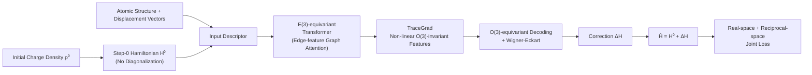

# Advancing Universal Deep Learning for Electronic-Structure Hamiltonian Prediction of Materials

**Conference**: ICLR 2026  
**OpenReview**: [https://openreview.net/forum?id=YvmR4vNai2](https://openreview.net/forum?id=YvmR4vNai2)  
**Code**: [https://github.com/DavidYin94/NextHAM](https://github.com/DavidYin94/NextHAM)  
**Area**: AI for Science / Electronic Structure Calculation / Equivariant Graph Neural Networks  
**Keywords**: Hamiltonian Prediction, E(3)-equivariant, DFT, Spin-Orbit Coupling (SOC), Delta-learning, Ghost States  

## TL;DR
NextHAM utilizes a "Step-0 Hamiltonian" as a physical-prior-informed input descriptor, combined with an E(3)-equivariant Transformer and a joint real-space + reciprocal-space training loss. It achieves DFT-level accuracy for electronic structure Hamiltonian prediction across 60+ elements (overall Gauge MAE 1.417 meV, SOC blocks at sub-µeV) and releases Materials-HAM-SOC, a benchmark containing 17,000 structures with spin-orbit coupling.

## Background & Motivation
**Background**: The core of electronic structure calculation is solving the Hamiltonian matrix, whose eigenvalues and eigenstates yield critical physical properties such as band structures and wave functions. Traditional Density Functional Theory (DFT) relies on self-consistent (SC) iterations, requiring $O(N^3)$ diagonalization of large matrices in each round, which is extremely expensive for large systems. Recently, deep learning has been used to directly regress Hamiltonians from atomic configurations, bypassing SC loops and reducing costs to near-linear complexity.

**Limitations of Prior Work**: Existing deep learning methods attempt to learn an extremely complex "atomic configuration → Hamiltonian" mapping, which struggles with generalization. To achieve convergence, current works typically "limit the scope" by restricting supported elements, ignoring spin-orbit coupling (SOC), or reducing the number of orbitals. This prevents models from covering the diversity of real-world materials. Furthermore, open-source training data with broad coverage, SOC, and fine-grained orbitals is scarce.

**Key Challenge**: Models often face a trade-off between generalization (covering the whole periodic table) and accuracy (reaching DFT-level precision to derive correct band structures). Even when real-space Hamiltonian MAE is small, "ghost states" can appear in reciprocal-space band structures due to the ill-conditioned nature of the overlap matrix.

**Goal**: Advance "universal" Hamiltonian deep learning from both methodological and data perspectives—aiming for both generalization across chemical/structural diversity and high accuracy for reliable downstream property derivation.

**Core Idea**:
- **Physical Prior Input**: Introduce a "Step-0 Hamiltonian" $H^{(0)}$, constructed from initial charge densities without diagonalization, as an input descriptor, allowing the network to learn only the residual correction $\Delta H$.
- **Equivariant and Expressive Architecture**: Extend the TraceGrad non-linear mechanism into an E(3)-equivariant Transformer to strengthen edge-feature modeling.
- **Joint Real-Space + Reciprocal-Space Loss**: Explicitly decouple energy subspaces in k-space to eliminate ghost states and fix gauge degrees of freedom.

## Method

### Overall Architecture
NextHAM reformulates the task from "directly predicting the self-consistent Hamiltonian $H^{(T)}$" to delta-learning: predicting the correction $\Delta H = H^{(T)} - H^{(0)}$ between the physical prior $H^{(0)}$ and the ground truth, outputting $\hat{H} = H^{(0)} + \widehat{\Delta H}$. The pipeline consists of three parts: an input descriptor with physical priors, an E(3)-equivariant Transformer with TraceGrad non-linear decoding, and a training objective supervised by both real-space and reciprocal-space losses.

### Key Designs

**1. Step-0 Hamiltonian $H^{(0)}$ as Physical Prior: Downgrading "Reconstruction" to "Residual Fitting".** Unlike existing methods that use randomly initialized, physically meaningless, and sparse atomic/edge embeddings, this work constructs $H^{(0)}$ from the initial charge density $\rho^{(0)}(\mathbf{r})$ (the sum of isolated neutral atom charge densities). It encodes the electron-ion interaction (pseudopotential) strength and preliminary estimates of electron-electron interactions, embedding features of different elements into a unified representation space. This enables generalization to chemically complex or even unseen elements. Crucially, $H^{(0)}$ requires no matrix diagonalization; its cost scales with the number of non-zero elements (approximately $O(N^2)$ for small systems, tending toward $O(N)$ for large systems), which is at the same order as GNN message passing. Its on-site submatrices naturally serve as node descriptors, while off-site submatrices serve as edge descriptors. Inspired by delta-learning, regressing only $\Delta H = H^{(T)} - H^{(0)}$ significantly narrows the dimensionality and numerical range of the target—reducing the regression range for ↑↑ real blocks by 96% in practice.

**2. E(3)-equivariant Transformer + TraceGrad: Edge-level Target Strengthening and Expressivity under Symmetry.** The Hamiltonian is inherently an "edge-level" quantity defined on atom pairs, whereas equivariant Transformers like Equiformer were originally designed for node-level atomic properties. This work rewrites the attention mechanism to explicitly maintain and update edge features across layers. Inspired by the physical decay of Hamiltonian matrix elements with atomic distance, distance embeddings are included in attention weights. Furthermore, node-to-node attention weights are applied multiplicatively to edge feature updates. To maintain strong non-linearity under strict E(3)-symmetry, the authors extend TraceGrad into the Transformer: updated equivariant edge features $f'^{(edge)}_{ab}$ are passed to TraceGrad to generate O(3)-invariant features $z^{(edge)}_{ab}$, supervised by the invariant trace $T = \mathrm{tr}(\Delta H \cdot \Delta H^{\dagger})$. These non-linearities are re-injected via $o^{(edge)}_{ab} = f'^{(edge)}_{ab} + \frac{\partial z^{(edge)}_{ab}}{\partial f'^{(edge)}_{ab}}$, followed by a Wigner–Eckart transformer to regress $\Delta H$. An ensemble strategy is also used to train multiple sub-models for different distance intervals.

**3. Real-space + Reciprocal-space Joint Loss: Eliminating Ghost States and Locking Gauge Freedom.** Most methods only regress the real-space Hamiltonian, but a high condition number in the overlap matrix $S$ can amplify small errors into eigenvalues/eigenstates, leading to non-physical jumps (ghost states) in band structures. This work supervises both the Hamiltonian and its trace in real space:
$$\mathrm{loss}^{(R)} = \mathbb{E}_R\big[\lambda_R((1-\lambda_C)\cdot \mathrm{loss}_H(R) + \gamma\cdot \mathrm{loss}_T(R))\big]$$
In reciprocal space, the spectrum is partitioned into a low-energy subspace $P$ (dominant for properties) and a high-energy complementary space $Q$. Differential weights and an explicit PQ penalty are applied to suppress spurious coupling between subspaces:
$$\mathrm{loss}^{(k)} = \mathbb{E}_k[\lambda_P \mathrm{loss}_P(k) + \lambda_Q \mathrm{loss}_Q(k) + \lambda_{PQ}\mathrm{loss}_{PQ}(k)]$$
The total loss is $\mathrm{loss}_{all} = \mathrm{loss}^{(R)} + \mathrm{loss}^{(k)}$. Additionally, the loss function resolves gauge ambiguity (where adding $\mu S$ does not change downstream properties) by analytically determining the optimal gauge parameter $\mu$, ensuring the regression target is unique and physically consistent.

## Key Experimental Results

### Main Results: Gauge MAE (meV) on Materials-HAM-SOC Test Set

| Block | Gauge MAE(0, H^T) Real/Imag | Gauge MAE(H⁰, H^T) Real/Imag | Gauge MAE(H⁰+ΔH, H^T) Real/Imag |
|------|------|------|------|
| ↑↑ | 149.145 / 0.293 | 5.213 / <0.001 | **2.834 / <0.001** |
| ↑↓ | 0.301 / 0.299 | <0.001 / <0.001 | <0.001 / <0.001 |
| ↓↑ | 0.301 / 0.299 | <0.001 / <0.001 | <0.001 / <0.001 |
| ↓↓ | 149.145 / 0.293 | 5.213 / <0.001 | **2.834 / <0.001** |
| Overall | 74.914 | — | **1.417** |

- Introducing $H^{(0)}$ reduces the regression range for the ↑↑ real block by **96%** compared to learning from scratch; spin-flip blocks (↑↓/↓↑) and imaginary parts of spin-conserved blocks reach **sub-µeV** levels.

### Ablation Study (Appendix L/M)

| Component | Function / Impact |
|------|------|
| Removing $H^{(0)}$ physical input | Significant increase in error |
| Removing delta-learning (direct H^T regression) | Increased error |
| Removing TraceGrad non-linearity | Decreased expressivity |
| Removing ensemble strategy | Decreased precision |
| Removing k-space loss | Ghost states appear in band structures |
| vs DeepH-E3 / Original TraceGrad | NextHAM leads significantly |

### Key Findings
- **Evidence of Ghost States**: When using only real-space loss, the MAE of $H(R)$ is only 0.53 meV, yet ghost states appear at certain k-points. Adding k-space loss keeps $H(R)$ MAE at ~0.49 meV but reduces k-space loss by >50%, resulting in band structures nearly identical to DFT and more accurate optical conductivity.
- **OOD Generalization**: The training set does not contain Ne. Testing on Ne-containing structures yielded an R-space MAE of only 0.1 meV, indicating that the $H^{(0)}$ descriptor allows the model to extrapolate to unseen elements.
- Element-wise analysis shows that most elements have prediction errors < 1.5 meV, covering the first six rows of the periodic table.

## Highlights & Insights
- **"Truncating" Physical Processes into Priors**: $H^{(0)}$ is the result of the zeroth step of DFT SC iteration. At zero diagonalization cost, it carries element-level electronic structure information—using "half-step physical calculation" to buy generalization and accuracy for deep learning is a clever inductive bias.
- **Addressing the "Small MAE ≠ Good Band" Pain Point**: The study explicitly identifies error amplification and ghost states caused by ill-conditioned overlap matrices, choosing k-space subspace decoupling and PQ penalties over blindly minimizing real-space MAE.
- **Method + Data Contribution**: The work fills a gap by providing a large-scale open-source benchmark (Materials-HAM-SOC) featuring SOC, fine-grained orbitals (up to 4s2p2d1f), and coverage of 60+ elements, which is of high value to the community.

## Limitations & Future Work
- OOD generalization is demonstrated only through single cases (Ne); a more systematic element-level OOD quantitative evaluation is needed.
- The ensemble of sub-models for different distance ranges increases training/inference overhead; the trade-off between scalability and single-model solutions is not fully discussed.
- Depth learning interpretability remains limited; how physical knowledge is represented remains a black box.
- Data generation is based on specific ABACUS/PYATB pseudopotentials and basis sets; transferability across different DFT codes or basis sets remains to be verified.

## Related Work & Insights
- **Hamiltonian Prediction Lineage**: Directly preceded by DeepH series, DeepH-E3, TraceGrad, and WANet (gauge freedom); this work integrates and extends E(3)-equivariance (Equiformer/NequIP/MACE) and expressivity (TraceGrad).
- **Delta-learning**: Borrowing the "learn only the correction" idea from potential energy surface fitting for matrix regression offers insights for other scientific tasks with "cheap physical priors + expensive ground truths" (e.g., force fields, density functionals).
- **Insight**: When deep learning metrics (MAE) decouple from actual physical properties of interest, downstream physics (here, band structures/k-space) should be explicitly incorporated into the loss function rather than optimizing proxy metrics alone.

## Rating
- Novelty: ⭐⭐⭐⭐ — The combination of $H^{(0)}$ physical prior input and k-space ghost state suppression loss is an insightful innovation, though individual components draw from existing methods.
- Experimental Thoroughness: ⭐⭐⭐⭐ — Main experiments, element-wise analysis, ablations, OOD cases, and band/optical conductivity studies are comprehensive, though OOD evaluation could be broader.
- Writing Quality: ⭐⭐⭐⭐ — Clear logic from motivation to pain points and methodology; Figures 1 and 2 effectively explain the paradigm shifts and framework.
- Value: ⭐⭐⭐⭐⭐ — Achieving DFT-level accuracy with significant acceleration and providing a large-scale open-source SOC benchmark offers high practical value to the materials electronic structure community.

<!-- RELATED:START -->

## Related Papers

- [\[ICLR 2026\] Learning from the Electronic Structure of Molecules across the Periodic Table](learning_from_the_electronic_structure_of_molecules_across_the_periodic_table.md)
- [\[ICLR 2026\] OXtal: An All-Atom Diffusion Model for Organic Crystal Structure Prediction](oxtal_an_all-atom_diffusion_model_for_organic_crystal_structure_prediction.md)
- [\[ICLR 2026\] Deep Learning for Subspace Regression](deep_learning_for_subspace_regression.md)
- [\[ICLR 2026\] Beyond Structure: Invariant Crystal Property Prediction with Pseudo-Particle Ray Diffraction](beyond_structure_invariant_crystal_property_prediction_with_pseudo-particle_ray_.md)
- [\[NeurIPS 2025\] High-order Equivariant Flow Matching for Density Functional Theory Hamiltonian Prediction](../../NeurIPS2025/physics/high-order_equivariant_flow_matching_for_density_functional_theory_hamiltonian_p.md)

<!-- RELATED:END -->
