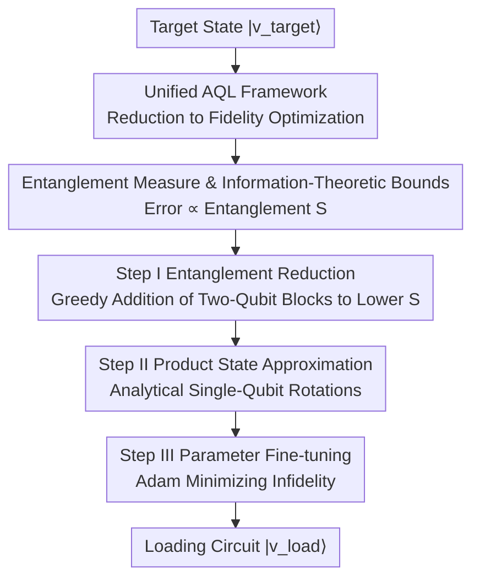

# AQER: A Scalable and Efficient Data Loader for Digital Quantum Computers

**Conference**: ICLR2026  
**OpenReview**: [https://openreview.net/forum?id=0zKfU1rsXd](https://openreview.net/forum?id=0zKfU1rsXd)  
**Code**: Yes (The paper claims it is open-sourced on GitHub; ⚠️ refer to the original text for the specific repository address)  
**Area**: Quantum Computing / Quantum Machine Learning  
**Keywords**: Approximate Quantum Loader, Quantum State Preparation, Entanglement Measurement, Information-Theoretic Bounds, Variational Quantum Circuits

## TL;DR
This paper unifies various Approximate Quantum Loaders (AQL) into a single optimization problem of "minimizing the distance between the target state and the circuit output state." It proves that the approximate loading error is linearly dominated by a newly proposed entanglement measure $S$. Based on this, it designs AQER—a method that gradually reduces entanglement by greedily appending two-qubit gate blocks to the circuit, followed by analytical single-qubit rotations and parameter fine-tuning. AQER achieves lower infidelity with fewer two-qubit gates on classical data (MNIST/CIFAR-10/SST-2) and quantum many-body states up to 50 qubits.

## Background & Motivation

**Background**: The three fundamental modules of digital quantum computing are state preparation, processing, and readout. State preparation, which "loads classical/quantum data into quantum circuits," serves as the entry point for all quantum algorithms. In the worst case, exact preparation of an arbitrary $N$-qubit state requires an exponential number of gates or auxiliary qubits, which is impractical for near-term noisy, qubit-scarce hardware. Consequently, the concept of **Approximate Quantum Loader (AQL)** has emerged: instead of provably exact preparation, it seeks a trade-off between "fidelity" and "circuit complexity." Many quantum algorithms (especially in quantum machine learning) are not sensitive to small perturbations in the input state, making it cost-effective to trade an acceptable error for a reduced gate count.

**Limitations of Prior Work**: Existing AQL methods are divided into two main streams: tensor network-based methods (TN, such as MPS representation) and circuit-based methods that directly optimize gate sequences (further divided into variational and non-variational). However, these methods are either heuristic without theoretical guarantees or only provide guarantees for specific input types (such as low-entanglement classical data), failing for quantum or high-entanglement data. More critically, **the field lacks a unified theoretical framework**: it remains unclear which fundamental quantity governs the approximate error of AQL, preventing principled algorithm design.

**Key Challenge**: While the resource cost of exact state preparation is exponential, the "good enough" approach of AQL has long remained in the empirical tuning stage. No one has answered "what determines the theoretical limit of the error and where it lies." This gap forces AQL design to rely on trial and error.

**Goal**: (1) Provide a unified optimization framework that accommodates almost all existing AQL methods; (2) Derive algorithm-independent upper and lower bounds for approximate error within this framework; (3) Design a scalable, easy-to-train, and practical AQL guided by the key quantities identified by the theory.

**Key Insight**: The authors observe that both TN and circuit methods essentially "find a sequence of gates that, when applied to an easily prepared product state, approximates the target state as closely as possible." By formulating this as a unified fidelity optimization problem, an algorithm-independent information-theoretic analysis can be performed. The analysis reveals that **the error is linearly determined by the "residual entanglement after the circuit inversely acts on the target state"**—the more thoroughly entanglement is reduced, the more accurate the loading.

**Core Idea**: Use "maximizing entanglement reduction" instead of "blindly optimizing fidelity" to construct the loading circuit. The entanglement measure $S$ serves as both a theoretical proxy for error and an optimization target that is easy to measure locally and resistant to barren plateaus.

## Method

### Overall Architecture

The paper provides two layers of contribution: the **theoretical layer** first reduces all AQLs to the same optimization problem and provides information-theoretic error bounds; the **algorithmic layer** (AQER) treats the "entanglement measure $S$" from the theory as the practical optimization target to construct the loading circuit in three steps.

The unified framework defines AQL as an optimization problem (Eq. 1): given a gate set $\mathcal{U}$, find a circuit $U(\theta;A)$ composed of $m$ gates ($\theta$ are tunable parameters, $A$ is the circuit architecture) such that

$$\arg\min_{\theta,A}\Big[1-|\langle v_{\text{target}}|U(\theta;A)|\psi_{\text{product}}\rangle|^2\Big],$$

which makes the circuit output starting from an easy-to-prepare product state $|\psi_{\text{product}}\rangle$ closely approximate the target state $|v_{\text{target}}\rangle$. The differences between TN, variational circuit, and non-variational methods lie only in "how $\theta$ is updated and how $A$ is designed," all falling under this same formula.

Within this framework, the authors prove that the approximate error is dominated by a new entanglement measure (see Key Design 2). AQER then uses "reducing this entanglement measure" as a guide to construct the loading circuit in three steps: **Step I Entanglement Reduction** → **Step II Product State Approximation** → **Step III Parameter Fine-tuning**. The complete pipeline is shown below.

### Key Designs

**1. Unified AQL Framework: Consolidating Disparate Methods into One Fidelity Optimization Problem**

Existing AQL methods use different terminologies—TN methods progressively stitch local unitary gates, variational methods train parameterized circuits with fixed structures, and non-variational methods update two-qubit gates via "zigzag" scheduling. Lack of common ground makes cross-comparison or unified analysis impossible. The first step of this paper is to point out that they are all solving the same optimization problem in Eq. (1), differing only in "updating $\theta$, changing $A$, or both": TN methods grow the circuit as $U(\theta;A)\to U(\theta\cup\theta_{\text{new}};A\cup A_{\text{new}})$ while freezing old parameters; variational methods fix $A$ and optimize $\theta$; non-variational methods adjust both $\theta$ and $A$ along a zigzag path. The value of this unified perspective is that once the problem is formulated as "distance between target state and product state after circuit evolution," an **algorithm-independent** error analysis can be performed.

**2. Entanglement Measure and Information-Theoretic Bounds: Framing Error with a Measurable Entanglement Quantity**

After unifying AQL, the authors ask: What determines the theoretical limit of the error? They define the entanglement measure of an $N$-qubit state $|\psi\rangle$ as the sum of individual single-qubit entanglement entropies $S(|\psi\rangle)=\sum_{i=1}^{N} S_{\{i\}}(|\psi\rangle)$ (where single-qubit entropy is based on Renyi-2 entropy $S_A=-\log_2\mathrm{Tr}[\rho_A^2]$). Theorem 3.1 proves that for a target state $|v_{\text{target}}\rangle$ and a circuit $U$ satisfying $S(U^\dagger|v_{\text{target}}\rangle)=S$, the infidelity is bounded by two algorithm-independent bounds: lower bound $f_1(S)=\tfrac12\big(1-\sqrt{2^{\,1-S/N}-1}\big)$ and upper bound $f_2(S)=\tfrac12\big(1-\sqrt{2^{\,1-S+\lfloor S\rfloor-1}}+\lfloor S\rfloor\big)$ (⚠️ refer to original text for exact formulas). As $S\to0$, both bounds become linear: $f_1(S)\to\tfrac{\ln 2}{2N}S$ and $f_2(S)\to\tfrac{\ln 2}{2}S$. The conclusion is straightforward: **approximate error varies linearly with the "residual entanglement $S$ after the circuit inversely acts on the target state."** Smaller $S$ yields more accurate loading. This translates abstract "fidelity optimization" into concrete, operable "entanglement reduction."

**3. Step I Entanglement Reduction: Greedily Accumulating Two-Qubit Gate Blocks to "Disentangle" the Target State**

Since the error is dominated by $S$, the first step of AQER constructs the gate sequence with the objective of minimizing $S$. It iteratively appends identically structured two-qubit gate blocks $V_{I_t}(\alpha_t)$ (each block consisting of $R_{ZZ}R_Y R_Z$ plus single-qubit rotations on both sides). At the $t$-th iteration, it greedily selects the qubit pair $I_t=(j_t,k_t)$ and parameters $\alpha_t$ acting on the current state $|v_{t-1}\rangle=V_{t-1}(\alpha_{1:t-1})|v_{\text{target}}\rangle$ such that

$$I_t,\alpha_t=\arg\min_{\tilde I,\tilde\alpha} S\big(V_{\tilde I}(\tilde\alpha)|v_{t-1}\rangle\big),$$

meaning each gate block added reduces the entanglement measure the most. After $T$ repetitions, a low-entanglement state $|v_T\rangle=V_T(\alpha)|v_{\text{target}}\rangle$ is obtained. This step addresses two long-standing issues: it directly approaches the theoretical error limit, and by targeting $S$ (locally measurable with sufficient gradient information), **it avoids the barren plateaus common in variational circuits**, allowing convergence on large-qubit systems. The number of iterations $T$ also directly controls the number of two-qubit gates $G$ (one gate block per iteration), providing a tunable knob for the precision-resource trade-off.

**4. Step II Product State Approximation + Step III Parameter Fine-tuning: Analytical Finishing and Global Polishing**

After Step I reduces the state to low entanglement, Theorem 3.1 guarantees it can be well-approximated by a product state. Accordingly, Step II starts from the standard initial state $|0\rangle^{\otimes N}$ and applies single-qubit rotations $W(\beta,\gamma)=\otimes_{i=1}^N(R_Z(\beta_i)R_Y(\gamma_i))$ to approximate $|v_T\rangle$. Crucially, Corollary 3.2 provides **analytical closed-form** solutions for $(\beta,\gamma)$, eliminating the need for numerical optimization in this step. Step III then combines the previous steps into a complete circuit $U_{\text{AQER}}(\theta)=V_T(\alpha)^\dagger W(\beta,\gamma)$ (where $\theta=(\alpha,\beta,\gamma)$) and uses Adam to fine-tune all parameters to minimize the final infidelity:

$$\theta^*=\arg\min_\theta\big(1-|\langle v_{\text{target}}|U_{\text{AQER}}(\theta)|0\rangle^{\otimes N}|^2\big),$$

resulting in the loaded state $|v_{\text{load}}\rangle=e^{-ig}U_{\text{AQER}}(\theta^*)|0\rangle^{\otimes N}$ ($g$ is a global phase that does not affect measurement). The combination of "analytical single-qubit rotation foundation + global fine-tuning" is both fast and accurate. For quantum data, $S$ and gradients can be estimated via local measurements; for classical data, the entire AQER can be simulated classically.

### A Complete Example

Example: Loading an MNIST image ($N=10$ qubits, amplitude encoding). The $28\times28$ grayscale image is normalized into a 1024-dimensional vector and encoded as the target state $|v_{\text{target}}\rangle$. **Step I**: Starting from $T=5$ two-qubit gate blocks, each iteration tests all qubit pairs and adds the one that reduces $S$ most. As $T$ increases from 5 to 100, $S$ drops by about 4 times, making the state increasingly "separable." **Step II**: For the reduced $|v_T\rangle$, closed-form solutions are used to calculate 10 sets of $(\beta_i,\gamma_i)$ single-qubit rotations to pull $|0\rangle^{\otimes10}$ close to $|v_T\rangle$ without training. **Step III**: The entire circuit is fine-tuned with Adam for 2000 steps, showing infidelity decreasing significantly with $T$. Finally, with $G=80$ two-qubit gates, the infidelity on MNIST is ~0.034, outperforming MPS/HEC/AQCE with similar gate counts.

### Loss & Training

Each iteration in Step I uses the Nelder–Mead method to optimize $\alpha_t$ (convergence tolerance $10^{-4}$, parameters initialized to zero), with the qubit pair $I_t$ chosen to minimize $S$. Step III uses Adam (learning rate $10^{-2}$, $T_3=2000$ steps). Iteration counts default to $T\in\{5,10,20,40,60,80,100\}$, extended up to 200 for large-qubit GS-TFIM ($N\ge20$). For quantum data, $S$ and gradients are estimated using $10^5$ simulated measurement shots by default.

## Key Experimental Results

### Main Results

On five datasets—MNIST, CIFAR-10, SST-2 (classical) and S-RQC, GS-TFIM (quantum, $N=10$)—AQER ($G\in\{20,40,80\}$) is compared against three representative baselines: MPS, HEC, and AQCE. AQER consistently achieves the lowest infidelity with equal or fewer two-qubit gates.

| Dataset | Metric(↓) | AQER (G=80) | Runner-up | Note |
|--------|---------|-------------|----------|------|
| MNIST | Infidelity | 0.034 | AQCE 0.051 | Lower at same G |
| CIFAR-10 | Infidelity | 0.018 | AQCE 0.024 | Lower at same G |
| SST-2 | Infidelity | 0.406 | AQCE 0.518 | High-dim embedding more difficult |
| S-RQC | Infidelity | 0.067 | AQCE 0.267 | >60% reduction vs runner-up |
| GS-TFIM | Infidelity | 0.003 | MPS 0.041 / AQCE 0.056 | Clear advantage on many-body states |

The most significant results are on S-RQC (Random Quantum Circuit states): AQER reduces infidelity by **more than 60%** relative to the next best method (AQCE) at $G\in\{40,80\}$, and can achieve lower error even with **50% fewer two-qubit gates**.

### Ablation Study

Analyses focused on the "entanglement reduction" core mechanism (Figs. 3, 4).

| Configuration / Variable | Key Observation | Explanation |
|------|---------|------|
| Increasing Step I iterations $T$ | Simultaneous drop in $S$ and infidelity | On MNIST, $T:5\to100$ reduces $S$ ~4x, error drops accordingly |
| Error vs $S$ Scatter plot | Falls between Theorem 3.1 bounds | Validates the linear "Error ∝ Entanglement $S$" relationship |
| GS-TFIM with increasing $T$ | Error drops from $>2^{-2}$ to $<2^{-8}$ | More gates lead to cleaner entanglement reduction |
| Increased measurement shots | Further reduction in error | At $T=100$, gain is >16x; at $T=10$, gain is <4x |
| Qubit count $N:20\to50$ | Consistently converges | No barren plateau, scalable to 50 qubits |

### Key Findings
- **Entanglement measure $S$ is an effective proxy for error**: Measured errors are always sandwiched between the Theorem 3.1 bounds and decrease linearly with $S$, showing consistency between theory and experiments.
- **Gate count $G$ (controlled by $T$) is the core knob**: Larger $T$ results in more thorough entanglement reduction and lower error at the cost of more two-qubit gates, providing a clear precision-resource trade-off.
- **Scalability stems from avoiding barren plateaus**: Targeting the locally measurable $S$ allows AQER to train effectively on 50-qubit quantum many-body states, where circuit methods that optimize fidelity directly would fail.
- **Greater advantage on quantum data**: On high-entanglement or structured quantum states like S-RQC and GS-TFIM, AQER's lead over baselines is significantly larger than on classical image data.

## Highlights & Insights
- **Translating "Fidelity Optimization" to "Entanglement Reduction"**: Information-theoretic bounds (Theorem 3.1) prove error is linearly dominated by the sum of single-qubit entanglement entropies $S$. Changing the optimization target from hard-to-train global fidelity to locally measurable $S$ solves both the "theoretical limit" and "barren plateau" problems simultaneously.
- **Methodological Value of the Unified Framework**: Reducing heterogeneous methods to a single optimization problem before conducting algorithm-independent analysis is a robust research template that could be applied to other quantum primitives.
- **Two-Stage Finishing (Analytical + Fine-tuning)**: Step II uses closed-form solutions for single-qubit rotations without training, then Step III fine-tunes the whole. This practical trade-off saves significant optimization time without sacrificing accuracy.
- **Adjustable Resource Knob**: The iteration count $T$ maps one-to-one to the two-qubit gate count $G$, allowing users to trade precision for hardware budget directly—a feature very friendly to near-term noisy hardware.

## Limitations & Future Work
- **Heuristic Nature**: The authors acknowledge that AQER is generally a heuristic. Optimal polynomial resource guarantees only exist for specific structured state families (e.g., IQP states, see Appendix H), not for arbitrary states.
- **Greedy Search Cost in Step I**: Each iteration requires testing all qubit pairs to find the one that minimizes $S$, a combinatorial search cost that may be significant as the qubit count grows.
- **Simulation-based Experiments**: Results are based on classical simulations (up to 50 qubits) and have yet to be validated end-to-end on real noisy quantum hardware. Performance under noisy channels is only theoretically analyzed in the appendix.
- **Future Directions**: Replacing greedy pair selection with more efficient search/pruning; validating the robustness of entanglement measurement on real quantum devices; exploring provable guarantees for broader state families.

## Related Work & Insights
- **vs MPS / Tensor Network methods**: TN methods have controlled error guarantees for low-entanglement classical data but fail for quantum or high-entanglement data. AQER does not rely on explicit low-entanglement representation and is universal for both classical and unknown quantum states.
- **vs HEC (Hardware-Efficient Variational Circuits)**: HEC uses fixed structures and direct fidelity optimization, which is prone to barren plateaus and lacks theoretical guarantees. AQER targets $S$, mitigating barren plateaus with theoretical grounding.
- **vs AQCE (Automatic Quantum Circuit Encoding)**: AQCE updates two-qubit gates in a zigzag pattern without explicit parameter training. AQER reduces error by over 60% compared to AQCE on S-RQC, suggesting "entanglement guidance" is more efficient than "blind gate-by-gate optimization."

## Rating
- Novelty: ⭐⭐⭐⭐⭐ Establishes the first information-theoretic error limit for AQL and translates it into an actionable entanglement reduction algorithm.
- Experimental Thoroughness: ⭐⭐⭐⭐ Covers classical/quantum data up to 50 qubits with multiple baselines, but relies entirely on numerical simulations without real hardware validation.
- Writing Quality: ⭐⭐⭐⭐ Clear connection between theory and algorithm; the framework diagram effectively explains the three-step process.
- Value: ⭐⭐⭐⭐⭐ Provides a theoretically-grounded, universal approach for scalable quantum data loading, a critical pre-processing module for quantum machine learning.

<!-- RELATED:START -->

## Related Papers

- [\[ICLR 2026\] Accelerating Inference for Multilayer Neural Networks with Quantum Computers](accelerating_inference_for_multilayer_neural_networks_with_quantum_computers.md)
- [\[ICLR 2026\] DGNet: Discrete Green Networks for Data-Efficient Learning of Spatiotemporal PDEs](dgnet_discrete_green_networks_for_data-efficient_learning_of_spatiotemporal_pdes.md)
- [\[ICLR 2026\] Learning Data-Efficient and Generalizable Neural Operators via Fundamental Physics Knowledge](learning_data-efficient_and_generalizable_neural_operators_via_fundamental_physi.md)
- [\[CVPR 2025\] ATP: Adaptive Threshold Pruning for Efficient Data Encoding in Quantum Neural Networks](../../CVPR2025/physics/atp_adaptive_threshold_pruning_for_efficient_data_encoding_in_quantum_neural_net.md)
- [\[AAAI 2026\] Data Verification is the Future of Quantum Computing Copilots](../../AAAI2026/physics/data_verification_is_the_future_of_quantum_computing_copilots.md)

<!-- RELATED:END -->
