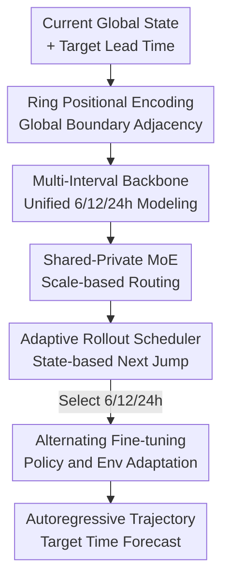

# ARROW: An Adaptive Rollout and Routing Method for Global Weather Forecasting

**Conference**: ICLR2026  
**OpenReview**: [https://openreview.net/forum?id=Qs0BieWYEN](https://openreview.net/forum?id=Qs0BieWYEN)  
**Code**: https://github.com/decisionintelligence/ARROW  
**Area**: Physical Modeling / Global Weather Forecasting / Atmospheric Dynamics  
**Keywords**: Global weather forecasting, adaptive rollout, multi-time scale modeling, Mixture-of-Experts, RL scheduling  

## TL;DR
ARROW redesigns both the "next-step prediction model" and the "long-term autoregressive rollout strategy" in global weather forecasting: it unifies 6/12/24-hour scales using a multi-interval prediction model and employs a DQN scheduler to adaptively select the next jump based on current weather states, simultaneously reducing error accumulation and preserving fine-grained atmospheric variations in mid-to-long-term forecasts.

## Background & Motivation
**Background**: Data-driven global weather forecasting usually does not directly predict states ten days ahead. Instead, it trains a short-interval one-step prediction model and calls it repeatedly in an autoregressive manner. For example, a 6-hour model can be repeated 23 times to obtain a 138-hour forecast. Methods like Pangu-Weather train multiple models for 6/12/24-hour intervals and use a fixed greedy strategy to assemble the target lead time during inference.

**Limitations of Prior Work**: The first issue lies in the model side. Atmospheric systems are not independent across different time scales: the same weather system may appear as a local perturbation within 6 hours and as a larger-scale geopotential height or temperature field migration within 24 hours. Training separate models for each interval prevents the sharing of these cross-scale patterns and increases training and maintenance costs. The second issue lies in the rollout side. A fixed 6-hour rollout allows for detailed short-term changes but involves more steps, leading to continuous error accumulation. Fixed or greedy large-interval rollouts reduce the number of steps but easily skip over rapid weather transitions.

**Key Challenge**: Long-term inference in global weather forecasting must satisfy two goals simultaneously: using larger time steps during stable periods to reduce autoregressive calls, while using smaller time steps during periods of drastic change to capture rapid evolution. Traditional fixed strategies hardcode this choice, effectively assuming that all initial weather states, seasons, and regions are suited to the same temporal trajectory.

**Goal**: The authors decompose the problem into two layers: first, training a unified predictor that accepts different time intervals $\delta$ to output weather increments at 6/12/24-hour scales; second, learning a rollout scheduler that decides the next step (6h, 12h, or 24h) based on the current predicted weather state, target lead time, and remaining time.

**Key Insight**: The intuition is similar to adaptive time-steering in numerical weather prediction (NWP): the solver can take larger steps when the system evolves smoothly and must shrink the step size during transition phases. ARROW transfers this concept to data-driven weather models, where the "step choice" is no longer given by manual rules or CFL conditions but is learned from historical forecast errors using reinforcement learning.

**Core Idea**: Replace the fixed autoregressive trajectory with a "multi-interval weather prediction model + state-aware rollout scheduler," allowing the model to decide when to focus on details and when to take large strides.

## Method

### Overall Architecture
The training of ARROW consists of two phases. The first phase pre-trains the Multi-Interval Forecasting Model (MIFM): given the current global weather state $X_0$ and a time interval $\delta \in \{6h, 12h, 24h\}$, the model predicts the weather increment $\Delta_\delta = X_\delta - X_0$, which is added to the current state for a one-step prediction. The second phase trains the Adaptive Rollout Scheduler (AR Scheduler): the scheduler observes the current predicted state, date-time info, and position relative to the target lead time to select the next time interval. The MIFM advances the weather state using that interval, looping until the target time is reached.

Overall, ARROW does not use RL as the weather model itself but places it at the rollout decision layer. Spatial and multi-scale dynamics of the weather field are modeled by MIFM, Ring Positional Encoding, and Shared-Private MoE; the DQN scheduler handles the selection of appropriate time steps on the inference trajectory, with alternating fine-tuning to adapt the prediction model to the learned trajectory.

### Key Designs
**1. Ring Positional Encoding: Letting the Global Grid Know Map Boundaries are Adjacent**

Many Transformer weather models treat the latitude-longitude grid as a standard 2D image, where the left and right boundaries are far apart in the token sequence. However, on Earth, the longitudinal boundaries represent the same adjacent region; the atmospheric fields near 180°W and 180°E should be treated as continuous neighborhoods. ARROW's Ring Positional Encoding (RPE) replaces standard 2D positional encoding with sine-cosine ring encoding, keeping boundary tokens close in terms of positional similarity and reducing the fragmentation caused by projecting a sphere onto a plane.

The positional encoding takes the general form: for grid position $k: (p_k^x, p_k^y)$, periodic representations are constructed using $\sin(\frac{p_k}{w}2\pi i)$ and $\cos(\frac{p_k}{w}2\pi i)$, ensuring high similarity between endpoints separated by one period. This design incorporates a basic spherical geometric prior into the Transformer token representation.

**2. Multi-Interval Forecasting Backbone: Learning Increments for Different Steps in One Model**

Traditional approaches either train a single 6-hour model for repeated use or train multiple Single-Interval Forecasting Models (SIFMs) for 6/12/24 hours separately. ARROW uses a conditional MIFM: given state $X_0$ and interval $\delta$, it predicts $\hat{\Delta}_\delta$, and outputs $\hat{X}_\delta = X_0 + \hat{\Delta}_\delta$. Thus, local 6-hour changes, intermediate 12-hour evolution, and longer 24-hour trends are learned within the same parameter space.

Interval conditions are injected into MIFM Transformer blocks via AdaLN, telling the model "how far to predict this time." This solves cross-scale sharing: atmospheric dynamics at different $\delta$ are not entirely distinct—wind, temperature, and geopotential height fields still follow the same physical correlations—but they cannot be crudely mixed, as error patterns, variation magnitudes, and spatial smoothness differ between 6 and 24 hours.

**3. Shared-Private MoE: Decoupling Common Dynamics from Scale-Specific Routing**

To prevent the unified MIFM from collapsing into an average model, ARROW incorporates a Shared-Private Mixture-of-Experts in the Arch Block. Each token passes through a shared FFN $E_s$ and several private FFNs $E_m^p$. The shared expert handles common dynamics required by all intervals, while private experts lean toward specific time scales via gating. The token update can be written as $z_l^{(n)} = \sum_m g'_{m,l} E_m^p(\bar z_l^{(n-1)}) + E_s(\bar z_l^{(n-1)})$.

Routing is not the standard unconditional top-k MoE. ARROW calculates a gate score $s_l$, adds a noise distribution $b_l^\delta$ related to the interval $\delta$, and selects private experts using $Top\text{-}k(s_l + b_l^\delta)$. Consequently, tokens at the same position may route to different experts under different $\delta$, allowing the model to decouple "short-term rapid changes" from "long-term smooth trends."

**4. Adaptive Rollout Scheduler and Alternating Fine-tuning: Letting Step Selection Follow Weather States**

The AR Scheduler formulates rollout as a sequential decision problem. The state includes the current predicted weather state $\hat{X}_{\tau_{t-1}}$, date-time info, elapsed time, remaining time, and target lead time; the action is a discrete interval $\{6h, 12h, 24h\}$; the reward is the negative forecast error at each step, with an additional step penalty $\omega$ to prevent excessive use of short steps.

DQN is used to estimate $q(s, a)$. Weather and temporal embeddings are concatenated and fed into self-attention to output action values. A key detail: if the policy is learned only on the pre-trained MIFM and then used to fine-tune the MIFM, the environment changes, making the original policy sub-optimal. Therefore, ARROW uses alternating optimization: updating the DQN with TD loss while generating rollout trajectories with the current scheduler to fine-tune the MIFM prediction head using multi-step rollout loss.

### Key Experimental Results

#### Main Results
Evaluated on the WeatherBench/ERA5 subset (Training: 2008-2016, Val: 2017, Test: 2018) at $128 \times 256$ resolution. Variables: T2m, U10, V10, TCC, Z500, T850.

| Variable | Lead time | ARROW RMSE / ACC | Prev. SOTA (Data-driven) RMSE / ACC | Main Difference |
|----------|-----------|------------------|------------------------------|----------|
| T2m | 5-day | 1.66 / 0.80 | Stormer 1.76 / 0.78 | More accurate short/mid-term temp |
| T2m | 14-day | 2.99 / 0.29 | Keisler 3.24 / 0.18 | Slower degradation in long-term |
| U10 | 9-day | 4.09 / 0.37 | Keisler 4.26 / 0.28 | Better spatial correlation in wind |
| Z500 | 7-day | 565.20 / 0.74 | FourCastNet 604.04 / 0.71 | More stable mid-layer dynamics |
| T850 | 14-day | 3.91 / 0.20 | Keisler 4.28 / 0.13 | Better long-term performance for T850 |

ARROW outperforms data-driven baselines across six key variables and multiple lead times, achieving an average improvement of ~9.3% in RMSE and ~10% in ACC compared to the second-best data-driven models.

#### Ablation Study
| Configuration | T2m-72h RMSE / ACC | U10-72h RMSE / ACC | V10-72h RMSE / ACC | Explanation |
|---------------|--------------------|--------------------|--------------------|-------------|
| w/o RPE | 1.12 / 0.91 | 1.76 / 0.90 | 1.82 / 0.90 | Weaker global boundary modeling |
| w/o S&P MoE | 1.13 / 0.91 | 1.77 / 0.90 | 1.81 / 0.90 | Lacks temporal scale specialization |
| w/o aux-loss1 | 1.15 / 0.89 | 1.83 / 0.88 | 1.92 / 0.88 | Experts lack differentiation |
| w/o aux-loss2 | 1.12 / 0.90 | 1.82 / 0.88 | 1.85 / 0.89 | Expert load imbalance |
| ARROW-Pretrain | 1.09 / 0.91 | 1.71 / 0.91 | 1.77 / 0.91 | Full pre-trained model is best |

| Rollout Strategy | Mechanism | Conclusion (138h) | Meaning |
|------------------|-----------|------------------|---------|
| Naive | Constant 6h | Detailed but high steps | Severe error accumulation |
| Greedy | Priority 24h | Worse than naive | Large steps bypass fine dynamics |
| Random | Random 6/12/24h| Weaker than adaptive | Mixed steps alone not enough |
| Adaptive | DQN selection | Lowest RMSE | Scheduler learns state-action value |

## Highlights & Insights
- Modeling the rollout strategy explicitly as a decision problem is the most interesting aspect. ARROW demonstrates that the trajectory itself determines error propagation and deserves separate learning.
- S&P MoE is a natural way to model multi-time scales, splitting shared physical commonalities from scale-specific traits without replicating the entire model.
- RPE serves as a reminder that Earth system data cannot perfectly mirror image Transformers. A simple spherical topological prior can significantly reduce spatial distortion.
- Alternating training is crucial. Since the policy and environment (the predictor) adapt to each other, this "policy-environment co-evolution" perspective is transferable to other long-term forecasting tasks like traffic or air quality.

## Limitations & Future Work
- The action space is limited to discrete 6/12/24 hours; real atmospheric processes might benefit from continuous or finer time-step selection.
- Experiments were conducted at $1.40625^\circ$ resolution; performance under higher resolution and more vertical levels needs verification.
- The reward currently focuses on forecast error and step count; future iterations could incorporate specific rewards for extreme weather events (e.g., typhoon paths).
- Alternating fine-tuning of MoE and DQN increases training complexity compared to standard supervised learning.

## Related Work & Insights
- **vs Pangu-Weather**: Pangu-Weather uses multiple independent models with a fixed greedy combination. ARROW unifies them into one MIFM and uses a state-aware scheduler, making it more flexible for non-uniform atmospheric evolution.
- **vs FourCastNet**: FourCastNet uses AFNO for global modeling but relies on fixed short-interval rollouts. ARROW contributes by integrating multi-interval prediction and rollout decision-making.
- **vs Stormer**: Stormer also uses multi-interval results for stability. ARROW goes further by turning the combination of time steps into a sequential decision-making process.

## Rating
- Novelty: ⭐⭐⭐⭐☆ Combined adaptive time-stepping with data-driven rollout.
- Experimental Thoroughness: ⭐⭐⭐⭐☆ Solid comparisons and ablations, though operational resolution is missing.
- Writing Quality: ⭐⭐⭐⭐☆ Clear motivation and framework.
- Value: ⭐⭐⭐⭐⭐ Highly applicable insights for rollout strategies in spatio-temporal forecasting.

<!-- RELATED:START -->

- Pangu-Weather: A 3D High-Resolution Model for Deterministic Global Weather Forecasting (Nature 2023)
- GraphCast: Learning skillful medium-range global weather forecasting (Science 2023)
- Stormer: A Poly-Time scale Transformer for Global Weather Forecasting (ArXiv 2023)

<!-- RELATED:END -->

## Related Papers

- [\[NeurIPS 2025\] A Regularized Newton Method for Nonconvex Optimization with Global and Local Complexity Guarantees](../../NeurIPS2025/physics/a_regularized_newton_method_for_nonconvex_optimization_with.md)
- [\[ICLR 2026\] Adaptive Mamba Neural Operators](adaptive_mamba_neural_operators.md)
- [\[ICLR 2026\] Towards a Transferable Acceleration Method for Density Functional Theory](towards_a_transferable_acceleration_method_for_density_functional_theory.md)
- [\[ICML 2026\] ANTIC: Adaptive Neural Temporal In-situ Compressor](../../ICML2026/physics/antic_adaptive_neural_temporal_in-situ_compressor.md)
- [\[AAAI 2026\] Adaptive Fidelity Estimation for Quantum Programs with Graph-Guided Noise Awareness](../../AAAI2026/physics/adaptive_fidelity_estimation_for_quantum_programs_with_graph.md)

<!-- RELATED:END -->
