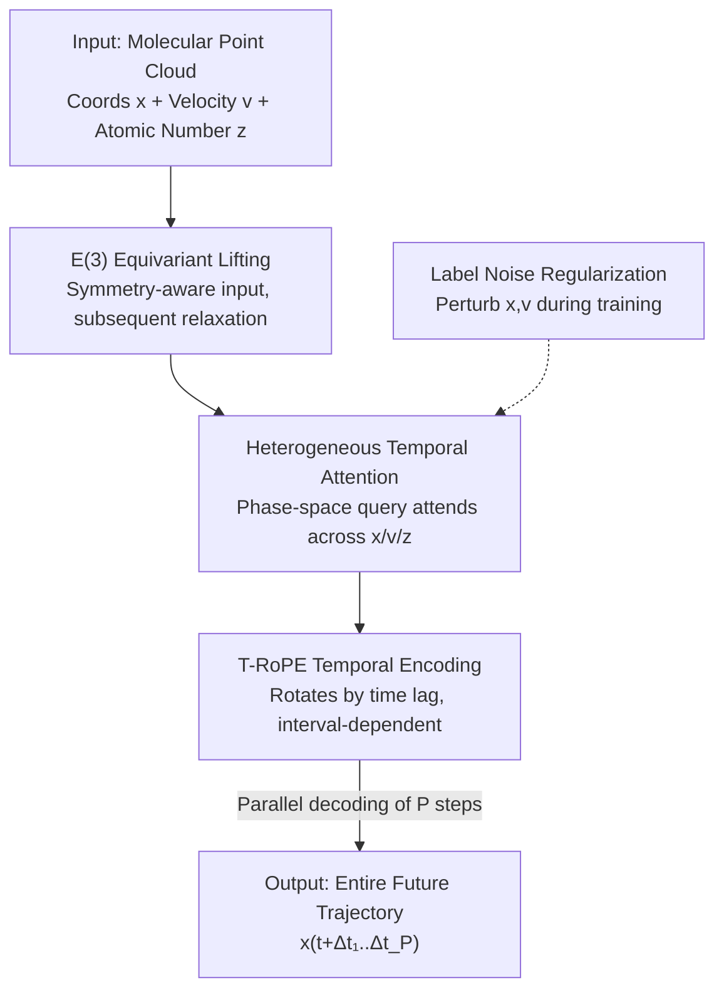

# ATOM: A Pretrained Neural Operator for Multitask Molecular Dynamics

**Conference**: ICLR2026  
**OpenReview**: [https://openreview.net/forum?id=e9cV4xSjbR](https://openreview.net/forum?id=e9cV4xSjbR)  
**Code**: TBD (Paper claims repository is open-sourced)  
**Area**: Molecular Dynamics / Neural Operator / Scientific Machine Learning  
**Keywords**: Molecular Dynamics, Neural Operator, Quasi-equivariant, Transformer, Zero-shot Generalization

## TL;DR
ATOM reformulates molecular dynamics (MD) prediction as "learning a trajectory operator." It utilizes a quasi-equivariant Transformer neural operator to parallelly decode future atomic coordinates across multiple timestamps. Combined with a self-constructed multi-molecule MD dataset, TG80, for multi-task pretraining, it achieves zero-shot generalization to unseen molecules and unseen time horizons for the first time.

## Background & Motivation
**Background**: Molecular dynamics (MD) serves as a "computational microscope" for drug discovery and materials science. Ab initio MD calculates atomic forces via DFT and integrates them to obtain trajectories. While highly accurate, DFT complexity grows at least cubically with the number of atoms and relies on double precision, making GPU acceleration difficult. Recent machine learning MD models (NequIP, MACE, EGNN, EGNO, etc.) approximate ab initio accuracy at significantly lower costs by learning interatomic forces or trajectories.

**Limitations of Prior Work**: The authors identify three specific issues: First, mainstream methods treat **strict equivariance** (precisely maintaining rotation/translation symmetry in every layer) as a mandatory physical prior, which increases computational overhead, limits model expressivity, and complicates optimization. Second, most methods are **autoregressive**—predicting the next step from the current state—which struggles to capture long-range temporal dependencies, suffers from error accumulation, and cannot exploit parallelization on modern hardware. Third, they are primarily **single-task**: models are trained specifically for one molecule and a fixed time window, showing almost no generalization to unseen compounds or different time steps.

**Key Challenge**: There is a trade-off between the generalization gains from equivariance and the resulting loss in expressivity/efficiency. Furthermore, the "one model per molecule" paradigm prevents neural methods from leveraging transfer learning—the ability to generalize to new molecules without numerical solutions. Even EGNO, which approaches "operator learning," remains strictly equivariant and single-task.

**Goal**: To address equivariant constraints, autoregressive error accumulation, and zero-shot generalization within a unified framework.

**Key Insight**: The authors hypothesize that **strict equivariance can be relaxed**. By using an equivariant lifting layer at the input to generate "symmetry-aware" features, subsequent Transformer blocks can be free of equivariant constraints while remaining robust to random rotations with higher accuracy. Simultaneously, the entire trajectory is treated as the operator's output and decoded in parallel rather than through step-by-step rollout.

**Core Idea**: Replace "strictly equivariant GNN + autoregressive + single-task" with a "quasi-equivariant Transformer neural operator + temporal rotary position embedding + multi-molecule pretraining." This directly learns the propagation operator from the initial state to the entire future trajectory, enabling zero-shot transfer across molecules and time scales.

## Method

### Overall Architecture
ATOM (Atomistic Transformer Operator for Molecules) models a molecule as a point cloud in $\mathbb{R}^3$, $G(t)=(x_i^{(t)}, v_i^{(t)})_{i=1}^N$ (coordinates + velocities). The goal is to learn a neural operator $F_\theta$ that approximates the true solution operator $F^\dagger: G(t)\to U$, where $U:[0,\Delta T]\to \mathbb{R}^{N\times3}$ is a trajectory function mapping time lag $\Delta t$ to future coordinates. During training, the time domain is discretely sampled $\{\Delta t_1,\dots,\Delta t_P\}$, and an L2 loss aligns predicted coordinates with ground truth:

$$\min_\theta \frac{1}{P}\sum_{p=1}^{P}\mathbb{E}_{G(t)}\left\|F_\theta(G(t))(\Delta t_p) - x^{(t+\Delta t_p)}\right\|_2^2$$

The pipeline is: Atomic coordinates/velocities/phase-space features pass through **E(3) equivariant lifting** to high-dimensional symmetry-aware embeddings → Enter multiple **heterogeneous temporal attention blocks** (using phase-space features as queries to attend to coordinates/velocities/phase-space key-values, with **T-RoPE** encoding time lag) → Project back to coordinate space to **parallelly** output $P$ future molecular states. **Label noise regularization** is injected during training to resist numerical noise in DFT trajectories. The operator can be expressed as $F_\theta := P\circ\sigma(K_L)\circ\cdots\circ\sigma(K_1)\circ Q$, where $Q, P$ are equivariant lifting/projection operators, and $K_l$ is a data-dependent kernel induced by attention. For multi-tasking, mini-batches contain multiple molecules, $\Delta t$ is sampled from $\text{LogUnif}(\Delta t_{\min},\Delta T)$, and random walk positional encodings based on radius graphs are added to phase-space features to distinguish molecules.

### Key Designs

**1. Quasi-equivariant Design: Equivariant at input, relaxed in Transformer**

To address the expressivity and optimization bottlenecks of strict equivariance, ATOM proposes $\varepsilon$-quasi-equivariance. A function only needs to satisfy $\mathbb{E}_{x}\|\int_G f(\phi(g)(x))d\mu(g) - \int_G \rho(g)(f(x))d\mu(g)\|\le\varepsilon$ (where $\mu$ is the normalized Haar measure, approximated by Monte Carlo sampling), rather than exact layer-wise equivariance. Specifically, coordinates and velocities are lifted via an **E(3) equivariant linear layer** (e3nn-style) into a feature space satisfying equivariant constraints. Crucially, **all subsequent Transformer blocks are no longer forced to be equivariant**. Ablations show this relaxation does not sacrifice rotational robustness (without lifting, S2T MSE under SO(3) rotation worsens from a factor of $10.80\times$ to $19.77\times$) but achieves higher accuracy than the "strictly equivariant" variant, especially in multi-task settings.

**2. All-to-all Point Cloud Attention: Eliminating predefined molecular graphs**

Targeting the limitation where MPNNs rely on fixed bond graphs and fail to model non-local interactions, ATOM **requires no predefined molecular graph**. It performs attention directly on the point cloud—equivalent to a fully connected graph—allowing information to propagate freely. This is critical for large, sparsely connected molecules (e.g., DHA or Stachyose in MD22), where long-range non-bonded steric and electrostatic interactions dominate dynamics. Ablation studies replacing ATOM's attention with GATv2 (ATOM-GATv2) on bond/radius graphs show significant performance drops, proving gains come from the **all-to-all interaction pattern itself**.

**3. Heterogeneous Temporal Attention + T-RoPE: Multi-feature fusion and time-interval encoding**

To solve autoregressive accumulation errors and enable parallelization/extrapolation, ATOM employs **heterogeneous attention**: phase-space embeddings $Z$ act as queries for $\{X,V,Z\}$ features, with learnable weights $\gamma_F$ scaling their relative importance:

$$\sum_{F\in\{X,V,Z\}}\gamma_F\,\text{softmax}\!\left(\frac{\text{T-RoPE}(Q(Z))\,\text{T-RoPE}(K(F))^\top}{\sqrt{d_h}}\right)V(F)$$

Additionally, **T-RoPE (Temporal Rotary Position Embedding)** adapts RoPE to depend only on time lag. Given increments $\{\Delta t_p\}$, timestamps $t_p=t+\sum_{r=1}^p\Delta t_r$ are used to apply a rotation matrix $R_p$ to all atoms at step $p$, with rotation angle $\theta_{p,k}=\frac{\omega_k}{\tau}(t_p-t_0)$. The resulting dot product $Q_pR_p(K_{p'}R_{p'})^\top$ **depends only on the time interval $t_{p'}-t_p$**, making attention translation-invariant in time and allowing interpolation/extrapolation on irregular increments.

**4. Label Noise Regularization: Turning DFT noise into regularization**

To prevent overfitting to the numerical noise inherent in DFT datasets, ATOM injects Gaussian noise $\xi_x,\xi_v\sim\mathcal{N}(0,\sigma^2 I)$ to the initial state $G_\xi^{(t)}$ and the prediction targets during training:

$$\min_\theta\frac{1}{P}\sum_{p=1}^P\mathbb{E}_{G(t),\xi,\xi_x^p}\left\|F_\theta(G_\xi^{(t)})(\Delta t_p)-(x^{(t+\Delta t_p)}+\xi_x^p)\right\|_2^2$$

This suppresses overfitting to DFT noise and enhances robustness. In ablations, removing this term degrades single-task S2T MSE.

### Loss & Training
Single-task: Uses uniform time discretization $t_p=t+\frac{p}{P}\Delta T$, with $\Delta T=3000$ fs, $P=8$, 6 Transformer blocks (dim 256). Training runs for 2500 epochs with early stopping based on S2S validation loss. Multi-task: Each mini-batch contains multiple molecules, $\Delta t\sim\text{LogUnif}(8\text{ fs}, 24000\text{ fs})$. Evaluation uses ECFP-4 fingerprints + UMAP + agglomerative clustering to split compounds into 10 disjoint clusters for five-fold cluster-level cross-validation, ensuring OOD generalization tests across chemical space.

## Key Experimental Results

### Main Results
Metrics include S2T (state-to-trajectory, average error $\frac{1}{P}\sum_p\|\hat x_p-x_p\|_2^2$) and S2S (state-to-state, final step error $\|\hat x_P-x_P\|_2^2$).

**Single-task MD17** (MSE $\times 10^{-2}$, selected S2S):

| Molecule | EGNO | MACE | ATOM |
|------|------|------|------|
| Aspirin | 9.64 | 6.95 | **6.82** |
| Salicylic | 0.89 | 1.05 | **0.88** |
| Toluene | 11.00 | 6.44 | **4.66** |
| Uracil | 0.58 | 0.75 | 0.63 |

ATOM reduces S2S MSE by 14.96% and S2T MSE by 8.3% on average across MD17.

**Single-task MD22 (Large Molecules)** (MSE $\times 10^{-2}$, S2S):

| Molecule (# Atoms) | EGNO | ATOM-GATv2 | ATOM | Gain vs. EGNO |
|------|------|------|------|------|
| Ac-Ala3-NHMe (20) | 357.89 | 223.57 | **9.65** | +97.30% |
| DHA (24) | 178.39 | 16.72 | **10.60** | +94.06% |
| Stachyose (45) | 42.11 | 41.40 | **21.25** | +49.54% |

**Zero-shot on Multi-task TG80** (S2T MSE $\times 10^{-2}$): In ID (same cluster) tests, ATOM outperforms baselines by 83.96%. In OOD (unseen clusters), ATOM nearly halves the S2T MSE of EGNO (39.74% average improvement). Notably, **in four out of five folds, ATOM's OOD performance exceeds EGNO's ID performance**.

### Ablation Study

| Configuration | Impact (S2T/S2S MSE $\times 10^{-2}$) | Note |
|------|------|------|
| Full ATOM | Baseline | Complete model |
| w/o Equivariant Lifting | S2T +22.48 | Robustness to rotation collapses |
| Strictly Equivariant | Worsened (more so in multi-task) | Constraint limits capacity |
| Heterogeneous → Standard Attn | S2S +0.47 | Loss of cross-feature interaction |
| w/o T-RoPE (NoPE) | MSE +1.07 | Loss of extrapolation capability |
| w/o Label Noise Reg | S2T Worsened | Overfitting to DFT noise |

### Key Findings
- **All-to-all connectivity** is the primary reason for OOD success on large molecules.
- **T-RoPE's value** is highly correlated with time settings; it enables discretization invariance, allowing the same $P$ and $\Delta T$ to be adjusted during inference without retraining.
- **Quasi-equivariance > Strict Equivariance**: Relaxing constraints provides higher capacity, aligning with recent geometric deep learning theories.

## Highlights & Insights
- **Optimal "Quasi-equivariance" Balance**: Retaining E(3) symmetry only at input lifting preserves rotational robustness while reclaiming the expressivity and optimization ease of standard Transformers.
- **T-RoPE Ingenuity**: By making attention relative to time lag, the model achieves the "discretization invariance" ideal of neural operators.
- **Dataset as Contribution**: The authors constructed TG80 (80 compounds, 2.5M fs trajectories) and employed cluster-level CV to rigorously test generalization.
- **MD as Operator Learning**: Rather than "force then integrate," ATOM performs "force-free deterministic coarse-graining," directly learning a time-advancement operator.

## Limitations & Future Work
- **Coordinates Only**: Unlike traditional force fields, it does not predict forces/energy, which may lead to a lack of energy conservation in long physical simulations.
- **TG80 Coverage**: Data was generated at fixed settings (vacuum, 300K, PBE/def2-SVP); generalization to solvents or varying temperatures remains unproven.
- **Approximation Errors**: $\varepsilon$-quasi-equivariance still allows error growth under rotation ($10.80\times$), which might be insufficient for tasks requiring strict conservation laws.
- **OOD Variance**: Certain OOD clusters show high variance, suggesting instability in specific chemical subspaces.

## Related Work & Insights
- **vs. EGNO**: Both treat MD as operator learning, but EGNO uses strictly equivariant EGNNs with Fourier time convolutions. ATOM switches to quasi-equivariant all-to-all attention with T-RoPE, leading in large-molecule and zero-shot scenarios.
- **vs. MACE/NequIP**: These are strictly equivariant force fields that integrate forces autoregressively. ATOM advocates for relaxed constraints and parallel force-free decoding.
- **vs. Generative/Random Coarse-Graining**: ATOM is deterministic, learning the evolution operator rather than a stochastic transition kernel or Boltzmann distribution.

## Rating
- Novelty: ⭐⭐⭐⭐⭐ 
- Experimental Thoroughness: ⭐⭐⭐⭐ 
- Writing Quality: ⭐⭐⭐⭐ 
- Value: ⭐⭐⭐⭐⭐ 

<!-- RELATED:START -->

1. **EGNO**: Equivariant Graph Neural Operator for Molecular Dynamics (NeurIPS 2023)
2. **MACE**: Higher-order Equivariant Message Passing Neural Networks for Fast and Accurate Force Fields (NeurIPS 2022)
3. **OFormer**: Overcoming the Discretization Bottleneck of Neural Operators (ICLR 2023)
4. **NequIP**: E(3)-equivariant Graph Neural Networks for Data-efficient and Accurate Interatomic Potentials (Nature Communications 2022)

<!-- RELATED:END -->

## Related Papers

- [\[ICML 2026\] Speculative Sampling for Faster Molecular Dynamics](../../ICML2026/physics/speculative_sampling_for_faster_molecular_dynamics.md)
- [\[ICML 2026\] Teaching Molecular Dynamics to a Non-Autoregressive Ionic Transport Predictor](../../ICML2026/physics/teaching_molecular_dynamics_to_a_non-autoregressive_ionic_transport_predictor.md)
- [\[ICLR 2026\] DRIFT-Net: A Spectral--Coupled Neural Operator for PDEs Learning](drift-net_a_spectral--coupled_neural_operator_for_pdes_learning.md)
- [\[ICLR 2026\] CFO: Learning Continuous-Time PDE Dynamics via Flow-Matched Neural Operators](cfo_learning_continuous-time_pde_dynamics_via_flow-matched_neural_operators.md)
- [\[ICLR 2026\] KANO: Kolmogorov–Arnold Neural Operator](kano_kolmogorov-arnold_neural_operator.md)

<!-- RELATED:END -->
