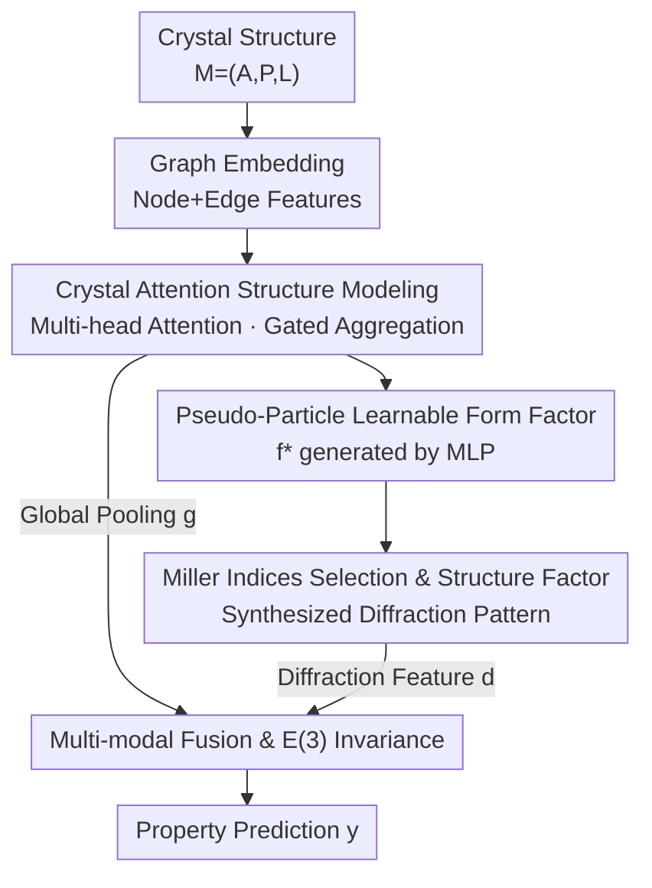

# Beyond Structure: Invariant Crystal Property Prediction with Pseudo-Particle Ray Diffraction

**Conference**: ICLR2026  
**OpenReview**: [https://openreview.net/forum?id=OfmurJrzlT](https://openreview.net/forum?id=OfmurJrzlT)  
**Code**: https://github.com/Bin-Cao/PRDNet  
**Area**: AI for Physical Sciences / Crystal Property Prediction / Materials Informatics  
**Keywords**: Crystal Property Prediction, Reciprocal Space, Diffraction Characterization, Pseudo-Particle, Multi-modal Fusion

## TL;DR
PRDNet introduces a **learnable "pseudo-particle"** to simulate crystal diffraction alongside traditional Graph Neural Networks. By synthesizing reciprocal space diffraction patterns using neural-network-generated form factors, it achieves modal-level fusion of graph representations (short-range) and diffraction representations (long-range). While strictly satisfying crystallographic symmetry invariance, it sets new SOTA benchmarks on Materials Project, JARVIS-DFT, and MatBench.

## Background & Motivation
**Background**: Crystal properties (formation energy, band gap, modulus, etc.) are fundamentally determined by quantum mechanical equations. Since exact solutions (DFT) are computationally prohibitive for large systems, machine learning serves as a "cost-effective surrogate." The accuracy of these models relies heavily on **how atomic systems are represented**. Current mainstream models treat crystals as graphs and use message-passing GNNs (CGCNN, MEGNet, Matformer, eComFormer, Crystalformer, etc.), increasingly incorporating bond angles, periodic vectors, and equivariant/invariant constraints for refinement.

**Limitations of Prior Work**: Principally, crystals are **infinite 3D periodic systems**, whereas real-space encoders have limited receptive fields and local encoding, making it difficult to characterize **long-range atomic interactions**. This leads to a critical issue—**different crystals being mapped to the same representation** (Figure 2 in the paper provides counterexamples where distinct structures share identical graph embeddings, bond angles, or periodic vectors). Once representation degeneracy occurs, downstream property prediction inevitably fails.

**Key Challenge**: Long-range interactions must either be calculated explicitly using supercells/boundary conditions like DFT (expensive) or by forcibly expanding the receptive field in real space (still limited and risks breaking symmetry invariance). The real-space approach is naturally constrained by the receptive field.

**Key Insight**: Shift to **reciprocal space (diffraction space)**. Due to the periodicity of crystals, a **complete diffraction pattern can be analytically derived from a single real-space unit cell** without constructing large supercells—this is naturally compact and encodes long-range information. Every atom contributes to diffraction along specific crystal planes. An ideal diffraction representation can losslessly embed complete real-space information (Figures 1 and 3 use optical diffraction analogies to illustrate how reciprocal space encodes long-range interactions).

**Why existing diffraction methods are insufficient**: Works like EwaldMP, PotNet, and ReGNet (ReciNet) introduce Ewald summation or Fourier transforms but implement them as "Fourier-style information fusion" within layer-wise message passing. They **ignore the physical fact that the form factor should be uniquely determined by the structure and the probe, rather than being a quantity that propagates through layer aggregation**. Furthermore, traditional X-ray diffraction uses **fixed form factors** from look-up tables based only on the scattering vector $|Q|$ and atomic species, failing to distinguish atoms of the same element in different local chemical environments—which is precisely what determines material properties.

**Core Idea**: Use a **data-driven "pseudo-particle"** as a probe instead of real X-rays/electrons/neutrons. Its form factor is learned by a neural network and explicitly depends on the local chemical environment, making it more sensitive to changes in elements and surroundings. This is used to synthesize diffraction patterns, which are then fused as a **modality** (rather than atom-level features) with graph representations, ensuring complete invariance to crystallographic symmetries (rotation/reflection/translation, E(3) group).

## Method

### Overall Architecture
PRDNet addresses the problem that graph representations fail to capture long-range info and may cause representation collisions. It adopts a **dual-modal** approach: one path uses graph attention to model short-range atomic environments, and the other uses pseudo-particle diffraction to model long-range periodic information, followed by modal-level fusion.

The workflow is: a crystal $M=(A,P,L)$ is converted into a graph and embedded. After several layers of **crystal attention** message passing, node representations $h_i^{(L)}$ are obtained. These representations are either globally pooled into short-range features $g$ or sent to a **form factor layer** $\mathrm{MLP_{form}}$ to generate **learnable form factors** $f_i^*$ for each atom. Then, **structure factors** are calculated based on a systemically selected set of **Miller indices** $\mathcal{H}$, resulting in a diffraction feature tensor $F_{\mathrm{concat}}$, which is mapped to long-range features $d$. Finally, $g$ and $d$ are concatenated and fused into $z_{\mathrm{fused}}$ to output property $y$. The entire pipeline is proven to be E(3) invariant.

### Key Designs

**1. Crystal Attention Structure Modeling: Capturing Short-range Environments via Multi-head Attention + Gating**

This is the "real-space" branch of the dual modalities, responsible for encoding the **local chemical environment** of each atom into node representations, providing the basis for environment-dependent form factors. The crystal is converted into a graph $G=(V,E)$, where nodes are one-hot embeddings $h_i^{(0)}$. Edge features concatenate radial basis functions, spherical basis functions (including bond angles $\theta_{ijk}$), and distances: $e_{ij}=\mathrm{RBF}(d_{ij})\oplus\mathrm{SBF}(\theta_{ijk})\oplus d_{ij}$. The message passing layer enhances standard graph attention in two ways: first, edge features $E_{ij}^{(h)}$ are projected into query/key/value, so the attention score $\alpha_{ij}^{(h)}=\frac{q_{ij}^{(h)}\odot k_{ij}^{(h)}}{\sqrt{3d_h}}$ explicitly consumes edge information; second, **gated aggregation** uses $g_{ij}^{(h)}=\sigma(\mathrm{LayerNorm}(\alpha_{ij}^{(h)}))$ as an adaptive filter to modulate each message $m_{ij}^{(h)}=W_{\mathrm{msg}}v_{ij}^{(h)}\odot g_{ij}^{(h)}$, followed by a residual update $h_i^{(l+1)}=\beta_i\odot h_i^{(l)}+(1-\beta_i)\odot\mathrm{SiLU}(\mathrm{BN}(W_{\mathrm{concat}}m_i^{\mathrm{agg}}))$.

**2. Pseudo-Particle Learnable Form Factor: Replacing "Fixed Table" with "Environment-Dependent Learnable"**

This is the core innovation, directly addressing the pain point where atoms of the same element in different environments are confused. Traditional X-ray form factors are fixed values from the *International Tables for Crystallography*, depending only on the scattering vector magnitude and atomic type: $f_i^{\text{X-ray}}=f_i^{\text{X-ray}}(|Q|,\,f_i^{\text{type}})$. PRDNet designs a **pseudo-particle** not bound by real physical laws, extending the form factor to:
$$f_i^{\text{Pseudo}}=f_i^{\text{Pseudo}}\big(|Q|,\,G_\theta(\mathcal{G}),\,f_i^{\text{type}}\big),$$
where $G_\theta(\mathcal{G})$ is the **local chemical environment encoding** learned by the graph network. Implementation-wise, a dedicated layer maps node representations to scattering intensities for each $(h,k,l)$ direction: $f_i^*(H)=\mathrm{MLP_{form}}(h_i^{(L)})\in\mathbb{R}^{N_{hkl}}$.

**3. Miller Indices Selection and Structure Factor Calculation: Systematic Reciprocal Space Coverage**

Each Miller index triplet $(h,k,l)$ corresponds to a crystal plane direction and a unique scattering vector $Q$. The paper first selects:
$$\mathcal{H}_0=\{(h,k,l)\in\mathbb{Z}^3:|h|,|k|,|l|\le C_{\max},\ \gcd(|h|,|k|,|l|)=1\},$$
using $\gcd=1$ to filter redundant higher-order reflections and keep only fundamental reflections. $C_{\max}=8$ controls the reciprocal space resolution. The set is closed under permutations and signs $\mathcal{H}=\{\pm\mathrm{perm}(h,k,l)\}$, **ensuring the index set is closed under all crystallographic operations**. Then, the real and imaginary parts of the structure factor are calculated for each index:
$$\mathrm{Re}(F_{hkl})=\sum_{i=1}^N f_i^*\cos(2\pi\,\mathbf{h}\cdot r_i^T),\quad \mathrm{Im}(F_{hkl})=\sum_{i=1}^N f_i^*\sin(2\pi\,\mathbf{h}\cdot r_i^T),$$
where $r_i$ are fractional coordinates. The flattened real and imaginary parts form the diffraction feature tensor $F_{\mathrm{concat}}=\mathrm{flatten}(\mathrm{Re}\oplus\mathrm{Im})\in\mathbb{R}^{2N_{hkl}}$.

**4. Multi-modal Fusion and E(3) Invariance: Modal-level Fusion with Strict Symmetry**

Diffraction is a **global property of the entire structure** and must be fused at the **modal level**. Fusion follows: $g=\mathrm{GlobalPool}(\{h_i^{(L)}\})$, $d=\mathrm{MLP_{diff}}(F_{\mathrm{concat}})$, and $z_{\mathrm{fused}}=\mathrm{MLP_{fusion}}([g\oplus d])$. Regarding invariance: under crystallographic operation $g:r\mapsto R_g r+t_g$ (where $R_g$ is an integer unimodular matrix), the structure factor acquires a phase $\phi(g,h)=(R_g h)\cdot t_g$:
$$F_{g\cdot h}(\{g\cdot r_i\})=e^{2\pi i\,\phi(g,h)}F_h(\{r_i\}),$$
Since $\phi(g,h)$ is always an integer, $e^{2\pi i\phi}=1$, making the diffraction representation naturally invariant. Combined with the E(3)-invariant geometric quantities $d_{ij}$ and $\theta_{ijk}$, the final $z_{\mathrm{fused}}$ is **completely invariant** to rotation, reflection, and translation.

### Loss & Training
MAE is used for regression and accuracy for classification. Implemented in PyTorch and trained on RTX 3090, using original open-source settings for all baselines without extra tuning. PRDNet has approximately 20.9M parameters.

## Key Experimental Results

### Main Results
On Materials Project (122,959 samples), PRDNet achieves the lowest errors and highest classification accuracy:

| Dataset/Task | Metric | PRDNet | Prev. SOTA |
|--------|------|------|----------|
| MP Formation Energy | MAE eV/atom ↓ | **0.028** | 0.030 (Crystalframer) |
| MP Band Gap | MAE eV ↓ | **0.151** | 0.153 (eComFormer) |
| MP Bulk Modulus | MAE log(GPa) ↓ | **0.035** | 0.047 (Crystalframer) |
| MP Shear Modulus | MAE log(GPa) ↓ | **0.108** | 0.111 (GATGNN) |
| MP Young's Modulus | MAE log(GPa) ↓ | **0.104** | 0.106 (Crystalframer) |
| MP Metal/Non-metal | Acc% ↑ | **93.3** | 92.7 (Matformer) |

PRDNet also leads on JARVIS-DFT and MatBench, e.g., JARVIS Formation Energy 0.032, Band Gap (OPT) 0.140, Total Energy 0.032; MatBench Formation Energy 0.019, Shear Modulus 0.058.

### Ablation Study (Materials Project)

| Configuration | Formation Energy | Band Gap | Bulk Modulus | Metal Class Acc | Description |
|------|---------|------|------|------|------|
| Default | 0.028 | 0.151 | 0.035 | 93.3 | Full Model |
| NoDiff | 0.041 | 0.361 | 0.081 | 81.9 | Remove diffraction, massive drop |
| SingleHead | 0.040 | 0.318 | 0.067 | 89.3 | Single-head attention |
| NoRes | 0.038 | 0.297 | 0.077 | 81.9 | Remove residual connections |
| NoEdge | 0.043 | 0.355 | 0.071 | 80.1 | Remove edge features |

### Key Findings
- **Diffraction module provides the greatest contribution**: Removing it (NoDiff) causes the Band Gap MAE to jump from 0.151 to 0.361 and Accuracy to drop from 93.3% to 81.9%, proving the long-range diffraction representation is the primary performance driver.
- Multi-head attention, residues, and edge features are all essential components for the short-range structural branch.
- Diffraction module is **plug-and-play** (Table 4): Adding it to other baselines (CGCNN, SchNet, Matformer, etc.) yields improvements in most tasks, showing the pseudo-particle diffraction is a portable enhancement module.

## Highlights & Insights
- **Transforming "fixed look-up form factors" into "learnable, environment-dependent pseudo-particle form factors"** is the most significant innovation. It bypasses physical constraints of real particles to distinguish identical elements in different environments.
- **Capturing long-range info via reciprocal space**: Leveraging crystal periodicity to derive full diffraction from a single unit cell avoids expensive supercells while maintaining a compact and lossless description.
- **Clean invariance proof**: By ensuring the Miller index set is symmetrically closed and structure factor phases are integer multiples of $2\pi$, E(3) invariance is directly achieved without relying on data augmentation.
- **High reuse value**: The paradigm of "learning environment-sensitive form factors → synthesizing structure factors → modal fusion" can be migrated to any material/crystal task requiring long-range periodic information.

## Limitations & Future Work
- **Large parameter count**: PRDNet has ~20.9M parameters, significantly higher than some lightweight baselines (<1M); the cost-performance ratio is not fully discussed.
- The Miller index cutoff $C_{\max}=8$ is a **hard hyperparameter** that determines reciprocal space resolution. Its sensitivity and trade-off between accuracy and cost across different systems require more exploration.
- Quantitative comparisons with ReGNet (ReciNet) involve self-reproduction due to missing official code, which should be viewed with some caution.
- Pseudo-particles lack direct physical interpretability—while strong for discrimination, the mapping of "learned form factors to physical quantities" needs further analysis.

## Related Work & Insights
- **vs. Real-space methods (CGCNN, ALIGNN, Matformer, etc.)**: These add structural info in real space but are limited by finite receptive fields; PRDNet shifts to reciprocal space to guarantee representation uniqueness via the global nature of diffraction.
- **vs. Reciprocal-space methods (EwaldMP, PotNet, ReGNet)**: These treat Fourier transforms as layer-wise "information fusion" and simplify or discard the physical dependencies of form factors ($G_\theta$, $|Q|$). PRDNet treats form factors as probe-unique invariants and performs modal-level fusion, resulting in more self-consistent representations and higher accuracy.

## Rating
- Novelty: ⭐⭐⭐⭐⭐ Unique use of learnable pseudo-particles and reciprocal space diffraction with solid physical motivation.
- Experimental Thoroughness: ⭐⭐⭐⭐⭐ Extensive multi-task benchmarks, systematic ablation, and cross-model portability validation.
- Writing Quality: ⭐⭐⭐⭐ Comprehensive physical background and formulas, though some key hyperparameters are relegated to the appendix.
- Value: ⭐⭐⭐⭐⭐ Sets new SOTA and provides a reusable paradigm for crystal representation.

<!-- RELATED:START -->

## Related Papers

- [\[ICLR 2026\] OXtal: An All-Atom Diffusion Model for Organic Crystal Structure Prediction](oxtal_an_all-atom_diffusion_model_for_organic_crystal_structure_prediction.md)
- [\[ICLR 2026\] MoMa: A Simple Modular Learning Framework for Material Property Prediction](moma_a_simple_modular_learning_framework_for_material_property_prediction.md)
- [\[ICLR 2026\] Advancing Universal Deep Learning for Electronic-Structure Hamiltonian Prediction of Materials](advancing_universal_deep_learning_for_electronic-structure_hamiltonian_predictio.md)
- [\[ICLR 2026\] FM4NPP: A Scaling Foundation Model for Nuclear and Particle Physics](fm4npp_a_scaling_foundation_model_for_nuclear_and_particle_physics.md)
- [\[ICLR 2026\] Learning from the Electronic Structure of Molecules across the Periodic Table](learning_from_the_electronic_structure_of_molecules_across_the_periodic_table.md)

<!-- RELATED:END -->
