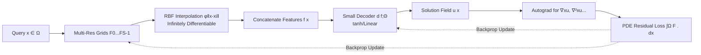

# $\partial^\infty$-Grid: A Neural Differential Equation Solver with Differentiable Feature Grids

**Conference**: ICLR 2026  
**OpenReview**: [https://openreview.net/forum?id=7G0L4cj452](https://openreview.net/forum?id=7G0L4cj452)  
**Code/Project Page**: [https://4dqv.mpi-inf.mpg.de/DInf-Grid/](https://4dqv.mpi-inf.mpg.de/DInf-Grid/)  
**Area**: Physics-Informed Machine Learning / Neural Fields / PDE Solving  
**Keywords**: Neural Differential Equation Solver, Feature Grid, Radial Basis Function Interpolation, High-Order Differentiability, Multi-Resolution Grid, PINN  

## TL;DR
By replacing the common linear interpolation in feature grids with infinitely differentiable Radial Basis Function (RBF) interpolation, fast grid representations—originally designed for "signal fitting"—can stably compute high-order derivatives for the first time. This reduces the training time for solving differential equations such as Poisson, Helmholtz, and Kirchhoff-Love from hours to seconds or minutes (5–20× acceleration) with accuracy comparable to Siren.

## Background & Motivation
**Background**: Using neural networks as alternatives to traditional numerical solvers for Partial Differential Equations (PDEs) has become a mainstream approach in physics-informed machine learning, represented by coordinate MLP-based PINNs and Siren with sinusoidal activations. Siren is a preferred representation for physical fields due to its infinite differentiability and ability to fit high-frequency signals.

**Limitations of Prior Work**: Coordinate MLP methods (including Siren) require backpropagation through the entire network for every sample point and completely ignore the spatial structure of physical fields, leading to extremely slow training that can take hours. To accelerate this, the vision and graphics fields have long shifted to grid-based representations (Instant-NGP, K-Planes), which leverage spatial locality to update only a few features near query points, speeding up training by an order of magnitude.

**Key Challenge**: However, these fast grid representations rely on **d-linear interpolation**, which is only $C^0$ continuous (non-differentiable) at grid nodes and at most $C^1$ within the grid. Their first-order derivatives are discontinuous at nodes, and their second-order derivatives are zero everywhere ($\nabla^2_x u = 0$), much like ReLU. This prevents them from computing the Jacobians and Laplacians essential for solving PDEs, making them architecturally unsuitable as DE solvers. Researchers were forced to choose between "slow but PDE-capable MLPs" and "fast but PDE-incapable grids."

**Goal**: To create a representation that possesses the training efficiency of feature grids while supporting arbitrary high-order derivatives, enabling direct implicit training via PDE residual losses to accurately model physical fields.

**Key Insight**: **Replace linear interpolation with Radial Basis Function interpolation**. RBFs (Gaussian kernels) are smooth and infinitely differentiable ($C^\infty$) over their entire neighborhood, allowing analytical calculations of derivatives via automatic differentiation. Furthermore, **multi-resolution co-located grids** enable rapid global gradient propagation to capture high frequencies. This allows grid representations to possess high-order differentiability for solving DEs for the first time.

## Method

### Overall Architecture
$\partial^\infty$-Grid is an "encoder-decoder" framework: it discretizes the input domain $\Omega\subset\mathbb{R}^d$ ($d=2,3$) into multi-resolution feature grids $\{F_s\}$. For a query coordinate $x$, RBF interpolation is used to extract smooth features $f(x)$ from each scale. These are concatenated and fed into a small decoder $d(\cdot;\Theta)$ to obtain the solution field $u(x)=d(f(x;F);\Theta)$. During training, $u$ is not supervised directly; instead, the residual of the governing equation $F(x,u,\nabla_x u,\nabla^2_x u,\dots)=0$ serves as the loss. Each derivative is calculated via autograd with respect to $x$ to optimize the grid $F$ and decoder $\Theta$.

### Key Designs

**1. Feature Grids + PDE Residual Loss: Transforming "Solving Equations" into "Local Grid Updates"**  
Unlike coordinate MLPs where each sample requires a full network backpropagation, this work parameterizes the field as $u(x)=d(f(x;F);\Theta)$, where the feature $f(x)=\sum_{i\in\mathcal{N}(x)} w(x,x_i)F(x_i)$ weights only a few learnable features from neighboring grid nodes. Thus, backpropagation only updates a small subset of parameters in the neighborhood, naturally leveraging spatial locality for massive speedups. The loss is the integral of the PDE residual: $L(F,\Theta)=\int_\Omega F(x,u,\nabla_x u,\nabla^2_x u,\dots;g(x))\,dx$, approximated by stratified random sampling. This form supports strong forms (Poisson), variational forms with boundaries (cloth), and data-driven terms (SDF). Boundary conditions are injected as hard constraints: $u(x)=d(f(x;F);\Theta)\,B(x)+h(x)\,(1-B(x))$, where $B(x)=1-e^{-\|x-x_{\partial\Omega}\|^2/\sigma}$ is a distance-weighted function ensuring $u(x)=h(x)$ at $x\in\partial\Omega$ to improve convergence and uniqueness.

**2. Radial Basis Function Interpolation: Infinite Differentiability via $C^\infty$ Weights**  
This is the core innovation. Linear interpolation weights $w(x,x_i)=\prod_{k=1}^d (1-|x_k-x_{ik}|/\sigma)$ are only $C^0/C^1$, causing all derivatives above the second order to be zero. This work instead uses normalized Gaussian RBF weights $w(x,x_i)=\frac{\phi(\|x-x_i\|)}{\sum_{j\in\mathcal{N}(x)}\phi(\|x-x_j\|)}$ with a kernel $\phi(r)=e^{-(\varepsilon r)^2}$, where $\varepsilon$ controls kernel width. It is smooth and $C^\infty$ over the neighborhood; Jacobians and Laplacians can be obtained analytically via autograd, supporting fourth-order PDEs (e.g., Kirchhoff–Love plates) that even cubic splines struggle with. To solve the computational cost of global RBF support, the authors **pre-calculate neighborhood indices** based on $\varepsilon$ to define an effective neighborhood $\mathcal{N}_\rho(x)$ (e.g., $\varepsilon=2$ needs a 1-ring, $\varepsilon=1$ needs a 2-ring), keeping costs close to linear interpolation.

**3. Multi-Resolution Co-located Grids: Enabling Global Gradient Flow**  
Single-resolution grids have small interpolation neighborhoods, meaning gradient information must traverse the domain step-by-step, leading to slow convergence. Borrowing from Instant-NGP/K-Planes, this work sets a hierarchy of grids $F_s\in\mathbb{R}^{(N+1)^d\times F}$ with resolutions $N=N_{\max}/2^s$. Coarse scales rapidly spread gradients across the domain, while fine scales capture high-frequency details. This combination captures complex signals stably without needing adaptive RBF shapes.

## Key Experimental Results
The method was tested on Poisson (image reconstruction), Helmholtz (wave fields), Kirchhoff-Love (cloth simulation), Eikonal (SDF), and Advection/Heat equations.

### Main Results
Image Reconstruction (Poisson, 512×512, supervised only by Gradient/Laplacian):

| Model | Supervision | PSNR ↑ | Training Time ↓ | Params |
|------|------|--------|-----------|--------|
| K-Planes | Gradient | 17.96 | 9.5 min | 8.4m |
| K-Planes | Laplacian | — (Failed) | — | — |
| Siren | Gradient | 32.12 | 10 min | 330k |
| Siren | Laplacian | 11.82 | **1h 56min** | 1.32m |
| **Ours** | Gradient | **32.24** | **25s** | 703k |
| **Ours** | Laplacian | **12.19** | **15 min** | 701k |

Under gradient supervision, it achieves ~ **20× acceleration** over Siren with slightly higher PSNR. K-Planes (linear interpolation) fails entirely under Laplacian supervision (second-order derivatives are zero). For Helmholtz wave fields, it is ~ **4× faster** than Siren with comparable accuracy.

### Ablation Study
RBF shape $\varepsilon$ and neighborhood rings $\rho$ (768×768 Gradient Image Reconstruction):

| Shape $\varepsilon$ | Rings $\rho$ | PSNR ↑ | SSIM ↑ | Training ↓ |
|------|------|--------|--------|--------|
| 0.6 | 4 | 28.74 | 0.87 | 15 min |
| 1 | 4 | 28.74 | 0.87 | 17 min |
| 1 | 3 | 28.73 | 0.87 | 12 min |
| 1 | 2 | **28.82** | 0.86 | 12 min |
| 1 | 1 | 27.50 | 0.82 | 15 min |
| 2 | 1 | 17.72 | 0.74 | **6 min** |

### Key Findings
- **Kernel width is the core hyperparameter**: Small $\varepsilon$ + large rings are smoother but more expensive; kernels that are too narrow ($\varepsilon=2,\rho=1$) degrade to linear interpolation, causing discontinuities and poor PSNR. $\varepsilon=1$ with 2–3 rings is the optimal sweet spot.
- **Value of Multi-Resolution**: Single-resolution grids confine Eikonal loss locally, producing artifacts; multi-resolution ensures domain-wide gradient propagation for faster convergence.
- **Differentiability is the watershed**: All linear/ReLU-based grids (K-Planes, Instant-NGP) systematically fail on high-order tasks, proving the necessity of RBF.

## Highlights & Insights
- **A minimal but precise modification solves a major problem**: Switching the grid interpolation kernel from "linear" to "$C^\infty$ RBF" fills the missing gap for using fast grids in PDE solving with a clean motivation.
- **Efficiency and differentiability are no longer a trade-off**: By utilizing neighborhood pre-calculation and stratified sampling, the cost of Gaussian RBFs is kept near that of linear interpolation while retaining infinite differentiability.
- **Unified Interface**: The same differentiable grid handles "direct signal fitting" and "solving fields from derivatives/PDEs" (Images, SDF, Wave fields, Cloth) without changing the architecture.

## Limitations & Future Work
- **Curse of Dimensionality**: Grid size grows exponentially with dimension; 3D SDF is slower than 2D. Future work may use plane-projection strategies to scale.
- **Sensitivity to RBF Hyperparameters**: Poorly chosen $\varepsilon$ can cause over-smoothing or Runge-phenomenon errors at boundaries.
- **Lack of Theoretical Guarantees**: While it converges experimentally with neighborhood truncation, the formal $C^\infty$ guarantee under truncation is not yet established.
- **Comparison with Numerical Solvers**: The authors admit this is a preliminary comparison; while faster than MLPs, it may not yet beat mature numerical solvers like multigrid.

## Related Work & Insights
- **vs. Siren/PINN (Coordinate MLPs)**: Inherits infinite differentiability but replaces global MLP backprop with local grid updates, gaining 5–20× speed.
- **vs. Instant-NGP / K-Planes (Fast Grids)**: Inherits training efficiency but fixes the fatal flaw of non-differentiability at grid nodes using RBF.
- **vs. NeuRBF**: While NeuRBF also uses RBF grids, it focuses on fitting known signals via RBF initialization. $\partial^\infty$-Grid solves PDEs where **only derivative supervision exists**, targeting a fundamentally different problem.
- **Insight**: When an efficient representation is blocked by a non-differentiable operator, replacing the interpolation or activation kernel to restore differentiability is a universal and powerful path to solving the problem.

## Rating
- **Novelty**: ⭐⭐⭐⭐ — Bringing RBF interpolation to multi-resolution grids specifically for PDE solving is a clear, missing piece of the puzzle.
- **Experimental Thoroughness**: ⭐⭐⭐⭐ — Covers Poisson, Helmholtz, Kirchhoff-Love, Eikonal, and Advection/Heat equations with strong baselines. Large-scale high-dimensional verification is still needed.
- **Writing Quality**: ⭐⭐⭐⭐ — The logic chain is clean, and the explanation of the "zero second-order derivative" pain point is intuitive.
- **Value**: ⭐⭐⭐⭐ — Compressing neural DE solving from hours to minutes is highly practical for physics-informed machine learning and graphics.

<!-- RELATED:START -->

## Related Papers

- [\[ICLR 2026\] Physics-Informed Inference Time Scaling for Solving High-Dimensional Partial Differential Equations via Defect Correction](physics-informed_inference_time_scaling_for_solving_high-dimensional_partial_dif.md)
- [\[ICLR 2026\] Disentangled Representation Learning for Parametric Partial Differential Equations](disentangled_representation_learning_for_parametric_partial_differential_equatio.md)
- [\[ICLR 2026\] OrthoSolver: A Neural Proper Orthogonal Decomposition Solver For PDEs](orthosolver_a_neural_proper_orthogonal_decomposition_solver_for_pdes.md)
- [\[ICLR 2026\] Neural Latent Arbitrary Lagrangian-Eulerian Grids for Fluid-Solid Interaction](neural_latent_arbitrary_lagrangian-eulerian_grids_for_fluid-solid_interaction.md)
- [\[AAAI 2026\] Towards a Foundation Model for Partial Differential Equations Across Physics Domains](../../AAAI2026/physics/towards_a_foundation_model_for_partial_differential_equations_across_physics_dom.md)

<!-- RELATED:END -->
