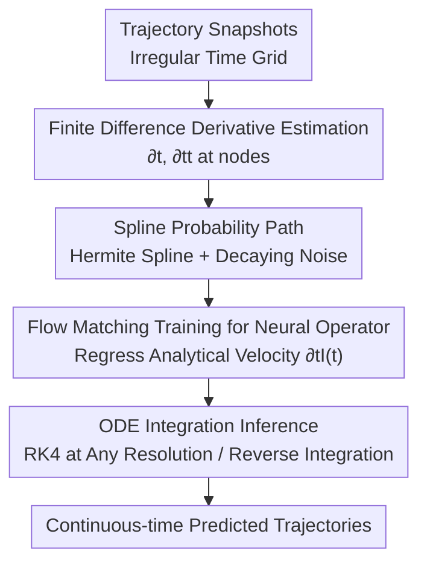

# CFO: Learning Continuous-Time PDE Dynamics via Flow-Matched Neural Operators

**Conference**: ICLR2026  
**OpenReview**: [https://openreview.net/forum?id=IQhaeSzyup](https://openreview.net/forum?id=IQhaeSzyup)  
**Code**: https://github.com/shannon-hou/CFO_official  
**Area**: PDE Neural Operators / Scientific Computing  
**Keywords**: Neural Operators, Flow Matching, Continuous-time Dynamics, PDE Surrogate Models, Time Resolution Invariance

## TL;DR
CFO "borrows" flow matching from generative modeling to learn the right-hand side (RHS) dynamics of time-varying PDEs. By fitting splines to trajectories and using finite differences to estimate temporal derivatives at nodes as velocity field labels, it trains a neural operator to regress this analytical velocity. This bypasses backpropagating through ODE solvers (unlike Neural ODEs), enables training on irregular time grids, and allows inference at arbitrary resolutions. Using only 25% irregularly sampled data, it reduces relative error by up to 87% compared to full-data autoregressive baselines.

## Background & Motivation
**Background**: Mainstream neural surrogate solvers for time-varying PDEs include autoregressive (AR) schemes (predicting the next frame), space-time methods (treating time as an extra spatial coordinate), and continuous-time Neural ODEs.

**Limitations of Prior Work**: Each approach has significant drawbacks. AR methods suffer from error accumulation (exposure bias) over long rollouts and require **uniform time grids**, failing to handle irregularly sampled data. Space-time methods scale poorly with space-time volume and struggle with causality. Neural ODEs are theoretically elegant but slow and memory-intensive due to the need to **backpropagate through ODE solvers** via the adjoint method.

**Key Challenge**: There is a tension between continuous-time modeling (flexibility, sampling robustness) and computational feasibility (training efficiency). Traditional continuous-time approaches typically require expensive solver-based backpropagation.

**Goal**: To develop a framework that maintains continuous-time flexibility (irregular grid training, arbitrary resolution inference, reversible integration) while matching the training efficiency of discrete methods (no solver backpropagation).

**Key Insight**: The authors observe a key property of **flow matching** in generative modeling: it learns a continuous-time vector field by regressing a neural network to the **analytical velocity** of a predefined probability path, requiring **no ODE integration** during training. If the "velocity of the probability path" can be aligned with the "true PDE dynamics," this integration-free training can be utilized.

**Core Idea**: Use flow matching to directly learn the PDE RHS. A temporal spline is fitted to each trajectory as a probability path. Temporal derivatives at nodes are estimated via finite differences to approximate true PDE dynamics. A neural operator is then trained to match this analytical velocity field, transforming "learning dynamics" into "regressing an analytically computable velocity," thereby bypassing ODE solver backpropagation.

## Method

### Overall Architecture
The goal of CFO (Continuous Flow Operator) is to learn the unknown spatial operator $\mathcal{N}$ in a time-varying PDE $\partial_t u(t,x) = \mathcal{N}(u(t,x))$, representing it as a time-varying neural operator $\mathcal{N}_\theta(t, u)$. It adopts the **Method of Lines (MOL)** perspective: by discretizing space, the PDE reduces to a system of ODEs $\frac{d}{dt}u_h(t) = \mathcal{N}_h(u_h(t))$. Instead of hand-crafting $\mathcal{N}_h$, CFO learns a continuous-time $\mathcal{N}_\theta$ to approximate the RHS, allowing integration with arbitrary step sizes during inference.

The breakthrough is reformulating the training objective as flow-matching-style velocity regression:

**Training Phase**: For snapshots $\{u(t_i)\}$ of a trajectory, temporal derivatives at nodes are estimated via finite differences. A spline $s(t)$ matching both values and derivatives is fitted. A stochastic interpolant $I(t)$ is formed by adding noise $\gamma(t)z$ (decaying to zero at nodes). Its analytical derivative $\partial_t I(t)$ serves as a "free" velocity label. Finally, $\mathcal{N}_\theta$ is trained to regress this velocity (flow matching loss).  
**Inference Phase**: The trained $\mathcal{N}_\theta(t,u)$ defines a continuous-time vector field $\dot u_\theta = \mathcal{N}_\theta(t, u_\theta)$. Given an initial condition, standard ODE solvers (e.g., RK4) are used to integrate to any time; forward integration predicts the future, while backward integration can recover the past.

### Key Designs

**1. Learning PDE RHS via Flow Matching: From "Learning Dynamics" to "Regressing Velocity"**  
Flow matching traditionally regresses a network $v_\theta$ to the analytical velocity $\frac{d}{dt}I_t$ of a path $p_t$ between distributions. CFO's insight: design the path to follow the true PDE solution trajectory. Thus, the analytical velocity approximates the PDE RHS $\mathcal{N}(u)$, and regressing it is equivalent to learning the dynamics. This avoids solver backpropagation during training. Unlike generative solvers requiring explicit PDE forms, CFO **implicitly** encodes dynamics through alignment.

**2. Spline Probability Paths + Finite Difference Supervision**  
Standard flow matching only interpolates endpoints. CFO uses **piecewise Hermite splines** $s(t;u)$ satisfying $s(t_i;u)=u(t_i)$ and derivative constraints at every snapshot. Derivatives are estimated via **finite differences**: a 3-point stencil provides second-order accuracy for first derivatives on irregular grids. Plugging these into Hermite interpolation ensures that $\partial_t s(t_i;u) = \mathcal{N}(u(t_i)) + O(\Delta t^\bullet)$. The interpolant is $I(t;u) = s(t;u) + \gamma(t)z$, where $\gamma(t_i)=0$.

**3. Quintic Splines as Default: Capturing Acceleration for Stability**  
Quintic splines ($C^2$) provide global smoothness and match values, first derivatives, and second derivatives (acceleration) at endpoints. Since many physical laws (Newton's 2nd Law, Wave Equation) fundamentally involve acceleration, quintic splines capture dynamics more naturally than linear splines ($C^0$). High-order splines improve long-range stability and data efficiency. The noise term $\gamma(t)$ also uses a spline form to ensure $C^2$ continuity matching the path.

**4. Continuous-time Inference: Resolution Invariance, Reversibility, and Solver Flexibility**  
The continuous formulation enables: (i) **Time Resolution Invariance**: Training accepts irregular timestamps; inference can query any moment. (ii) **Reverse Integration**: The learned vector field induces a reversible flow (under Lipschitz conditions), allowing the recovery of past states. (iii) **Solver Flexibility**: NFE (Number of Function Evaluations) can be adjusted by switching solvers (Euler vs. RK4) to balance accuracy and cost.

### Loss & Training
The objective is the velocity regression loss: $\mathcal{L}(\theta)=\mathbb{E}_{u,t,Z}\big[\|\mathcal{N}_\theta(t,I(t;u)) - \partial_t I(t;u)\|^2\big]$, where $t\sim\text{Unif}[0,1]$. CFO is backbone-agnostic (FNO, U-Net, DiT). Temporal continuity is handled by the framework, while spatial inductive bias is provided by the backbone.

## Key Experimental Results

### Main Results
Benchmarks: Lorenz (3D ODE), 1D Burgers, 2D Diffusion-Reaction (DR), 2D Shallow Water Equations (SWE). Training uses irregular random grids (100%/50%/25% retention); testing on full resolution.

| Dataset | Sampling Rate | Autoregressive | Linear CFO | Quintic CFO |
|---------|---------------|----------------|------------|-------------|
| Lorenz  | 100%          | $9.04\times10^{-2}$ | $6.42\times10^{-2}$ | **$4.53\times10^{-2}$** |
| Lorenz  | 25%           | –              | $9.39\times10^{-2}$ | **$6.82\times10^{-2}$** |
| Burgers | 100%          | $3.34\times10^{-2}$ | $5.75\times10^{-3}$ | $5.89\times10^{-3}$ |
| Burgers | 25%           | –              | $1.04\times10^{-2}$ | **$7.09\times10^{-3}$** |
| DR      | 100%          | $4.23\times10^{-1}$ | $4.35\times10^{-2}$ | $4.37\times10^{-2}$ |
| DR      | 25%           | –              | $7.25\times10^{-2}$ | **$5.32\times10^{-2}$** |
| SWE     | 100%          | $9.04\times10^{-2}$ | $5.93\times10^{-3}$ | **$4.56\times10^{-3}$** |
| SWE     | 25%           | –              | $1.69\times10^{-2}$ | **$1.55\times10^{-2}$** |

**Key Finding**: **Quintic CFO with 25% data outperforms AR with 100% data** across all benchmarks, reducing relative error by 24.6% to 87.4%.

### Ablation Study
| Configuration | Key Result | Explanation |
|---------------|------------|-------------|
| Quintic vs Linear Spline | Quintic has lower error and faster convergence | High-order captures acceleration; more stable long-term |
| NFE: 50% AR budget | CFO already beats AR | Superior even with half the rollout steps |
| vs Neural ODE | 0.0453 vs 0.101 error, 38x faster training | More accurate and significantly more efficient |
| vs PDE-Refiner | 0.044 vs 0.125 error, 3x faster training | More accurate and computationally cheaper |
| Extrapolation | Error remains stable | Learned dynamics rather than memorizing trajectories |

## Highlights & Insights
- **Repurposing Flow Matching**: CFO identifies the "integral-free velocity regression" essence of flow matching and maps it to PDE RHS learning, solving the efficiency bottleneck of Neural ODEs.
- **Spline + Finite Difference Trick**: Fitting splines and using analytical derivatives as regression targets is a powerful pattern for creating supervision signals for any continuous-time trajectory learning.
- **Resolution Invariance**: Directly addresses real-world scientific data pain points where measurements are often irregularly sampled.
- **Inherent Reversibility**: Continuous vector fields allow reverse integration for inverse problems, a feature naturally missing in AR "next-step" predictors.

## Limitations & Future Work
- **Spatial Grid Fixity**: CFO is time-agnostic but the spatial resolution is still tied to the backbone; coupling with mesh-agnostic operators is needed for full spatio-temporal invariance.
- **Numerical Integration Overhead**: While efficient, inference still requires iterative integration. Distillation into consistency models for single-step prediction is a future direction.
- **Ill-posedness of Dissipative PDEs**: Reversing dissipative processes is fundamentally ill-posed; backward integration is only reliable over short horizons.
- **Fixed Spline Order**: The current fixed-order spline could be improved with learnable splines that adapt smoothness to local dynamics.

## Related Work & Insights
- **vs Autoregressive (AR)**: AR requires uniform grids and accumulates error. CFO handles irregular sampling and yields 87% lower error with 25% data.
- **vs Neural ODE**: CFO achieves comparable or better accuracy while training ~38x faster by avoiding the adjoint state backpropagation.
- **vs Generative PDE Solvers**: Unlike diffusion-based solvers that treat fields as samples, CFO maintains temporal causality and dynamics without requiring explicit governing equations.

## Rating
- Novelty: ⭐⭐⭐⭐⭐ 
- Experimental Thoroughness: ⭐⭐⭐⭐ 
- Writing Quality: ⭐⭐⭐⭐⭐ 
- Value: ⭐⭐⭐⭐⭐

<!-- RELATED:START -->

## Related Papers

- [\[ICLR 2026\] Locally Subspace-Informed Neural Operators for Efficient Multiscale PDE Solving](locally_subspace-informed_neural_operators_for_efficient_multiscale_pde_solving.md)
- [\[ICLR 2026\] Adaptive Mamba Neural Operators](adaptive_mamba_neural_operators.md)
- [\[ICLR 2026\] Learning Data-Efficient and Generalizable Neural Operators via Fundamental Physics Knowledge](learning_data-efficient_and_generalizable_neural_operators_via_fundamental_physi.md)
- [\[AAAI 2026\] SVD-NO: Learning PDE Solution Operators with SVD Integral Kernels](../../AAAI2026/physics/svd-no_learning_pde_solution_operators_with_svd_integral_kernels.md)
- [\[NeurIPS 2025\] DeltaPhi: Physical States Residual Learning for Neural Operators in Data-Limited PDE Solving](../../NeurIPS2025/physics/deltaphi_physical_states_residual_learning_for_neural_operators_in_data-limited_.md)

<!-- RELATED:END -->
