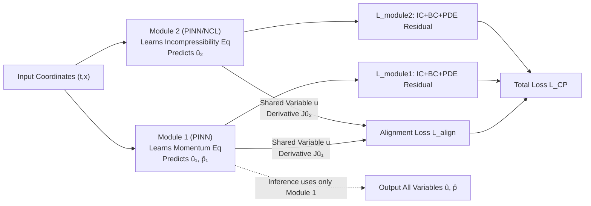

# ComPhy: Composing Physical Models with end-to-end Alignment

**Conference**: ICLR 2026  
**OpenReview**: [https://openreview.net/forum?id=ER7zDJXtRI](https://openreview.net/forum?id=ER7zDJXtRI)  
**Code**: [https://github.com/AlexThirty/ComPhy](https://github.com/AlexThirty/ComPhy)  
**Area**: AI for Science / Physical Modeling / PDE Solving  
**Keywords**: PDE systems, Physics-Informed Neural Networks, Neural Conservation Laws, Modularity, Alignment Loss, Knowledge Transfer  

## TL;DR
ComPhy decomposes "system-level PDE solving" into "one dedicated module per equation," and links modules sharing physical variables via an end-to-end alignment loss based on derivatives (Jacobian). This transforms the ill-conditioned optimization of single models with multiple losses into a collaborative optimization of simple sub-problems, consistently outperforming PINNs and NCLs on various real physical systems with 2, 3, or 5 equations.

## Background & Motivation
**Background**: Unsupervised partial differential equation (PDE) solving with neural networks is becoming a primary tool for AI for Science. Representative methods include Physics-Informed Neural Networks (PINNs, treating PDE residuals as soft constraints) and Neural Conservation Laws (NCLs, ensuring zero divergence via anti-symmetric matrix parameterization). These methods are applied in weather forecasting, fluid dynamics, quantum mechanics, and molecular dynamics.

**Limitations of Prior Work**: When dealing with **systems of PDEs** (e.g., Navier-Stokes, Magnetohydrodynamics) rather than single PDEs, the mainstream approach is to simply sum the residual losses of every equation and fit them using a **single network**. However, this approach suffers from massive scale differences between losses and competing objectives, leading to severe gradient norm imbalances and ill-conditioning. Consequently, PINNs often fail to converge or capture turbulence. Existing remedies (per-epoch reweighting, hard constraints for boundaries, domain decomposition) are mostly not designed for systems or target only specific equations.

**Key Challenge**: The solution to a system of PDEs is unique only when **all equations are satisfied simultaneously**; however, cramming all equations into one network makes the optimization uncontrollable. How can one keep each sub-problem simple without losing physical coupling across equations?

**Goal**: Propose the first general method **specifically for PDE systems** that can plug in any existing solver (PINN, NCL) as a sub-module and remain scalable to the number of equations.

**Core Idea**: **"Divide and Conquer + Derivative Alignment"** — Assign a dedicated learning module to each PDE (each optimizing its own IC/BC/single PDE residual), and transfer physical information between modules via an alignment loss acting on **derivatives of shared variables**. This allows multiple simple modules to collaboratively approximate the overall system solution. At inference, only the minimal subset of modules covering all variables is used (usually just one).

## Method

### Overall Architecture
For a PDE system with $N$ equations, ComPhy (CP) assigns an independent network module $i$ to each equation $F_i[u]=0$. Each module receives the same spatio-temporal coordinates $(t,x)$ and predicts only the variables involved in its assigned equation. Modules independently learn their own Initial Conditions (IC), Boundary Conditions (BC), and a single PDE residual. Modules are coupled via an alignment loss: for any two modules predicting the same physical variable, they are forced to maintain consistency on that variable (especially its derivatives). Training is performed end-to-end, and only the minimal module subset covering all target variables is activated during inference.

### Key Designs

**1. One Module per Equation: Reducing "System Multi-loss" to "Simple Sub-problems."** A single PINN solving $N$ equations must simultaneously optimize $N+2$ loss terms ($N$ residuals plus IC and BC), where the varied scales and gradient norms can suppress each other. CP reverses this: Module $i$ only handles its own equation, with a loss defined as:
$$L_{\text{module } i}=\lambda_{BC}L_{BC}+\lambda_{IC}L_{IC}+\lambda_{PDE\,i}L_{PDE\,i},$$
where the form of $L_{PDE\,i}$ depends on the chosen solver (e.g., $L_2$ of the residual for PINNs, or omitted for NCLs due to zero-divergence design). This simplifies the optimization landscape for each module. Cross-equation physical information is captured through alignment rather than a massive stack of losses. Gradient histogram analysis (3xPINN vs. single PINN) confirms that CP’s gradient distributions across layers are more "aligned" and similar in scale, providing an empirical explanation for its stability.

**2. Derivative-based Alignment Loss: Transferring Physics via Jacobians.** Let $\mathbf v$ be the subset of variables shared by two modules. Let $\hat v_i, \hat v_j$ be the predictions from modules $i$ and $j$. Three alignment types are considered:
$$\text{OUTL: }\|\hat v_i-\hat v_j\|_2^2,\quad \text{DERL: }\|J\hat v_i-J\hat v_j\|_2^2,\quad \text{SOB: }\|\hat v_i-\hat v_j\|_2^2+\|J\hat v_i-J\hat v_j\|_2^2,$$
where $J\hat v_i$ is the Jacobian of module $i$ relative to all inputs. SOB aligns the Sobolev norm, DERL aligns only derivatives, and OUTL aligns only output values. The core argument is: **physical evolution is determined by derivatives (dynamics)**; thus, aligning derivatives transfers physical constraints more effectively than aligning values—this also aligns with the importance of Sobolev distances in PDE uniqueness analysis. Experiments consistently show that OUTL is the weakest, while DERL/SOB are superior, with DERL often performing best.

**3. End-to-end Joint Training & Minimal Subset Inference.** The total loss combines all module losses with alignment terms for shared variables:
$$L_{CP}=\lambda_{\text{align}}\sum_{i,j}L_{\text{align }i,j}+\sum_{i=1}^N L_{\text{module }i}.$$
In practice, this can be simplified to alignment between the "inference module" and others. The key insight is that while all modules are needed during training to ensure solution uniqueness, **only the minimal module subset capable of predicting all target variables is required for inference**. For instance, in Navier-Stokes, since the momentum module outputs both $u$ and $p$, it alone suffices for inference, saving significant computation time.

**4. Module-agnostic Solver Support: Combining PINNs and NCLs.** CP does not restrict sub-module implementation. In experiments, systems are solved using various configurations such as 2xPINN, PINN+NCL, or 3xNCL. NCL modules ensure $\nabla\!\cdot u=0$ by outputting an anti-symmetric matrix $A$ and taking the divergence $u_i=\mathrm{div}(A_{i\cdot})$. The authors extend the original NCL to generate divergence-free fields for "arbitrary input-output subsets of the same size," allowing flexibility for different divergence structures within an equation system. This allows CP to inherit the hard constraints of NCL while remaining more versatile.

## Key Experimental Results

### Main Results (Case Studies, L2 Error, Lower is Better)

| Model | Taylor-Green L2(×10⁻⁵) | Kovasznay L2(×10⁻⁶) | Acoustics L2(×10⁻⁵) |
|---|---|---|---|
| PINN | 3.677 | 10.83 | 8.016 |
| PINN+RAR | 5.235 | 11.48 | 120.6 |
| PINN+Grad | 4.245 | 7.471 | 10.05 |
| NCL | 2.830 | 3.014 | 5.243 |
| **CP-PINN+NCL DERL+Grad** | **2.795** | 4.325 | — |
| **CP-PINN+NCL SOB+Grad** | 4.386 | **3.663** | — |
| **CP-3xNCL DERL+Grad** | — | — | **2.718** |

CP achieves optimal or near-optimal results in all cases. Notably, on Taylor-Green, CP-PINN+NCL (DERL+Grad) slightly outperformed NCL, which naturally satisfies the divergence equation, demonstrating that cross-module transfer of divergence constraints is effective.

### Real Systems + Ablation (Euler Gas 3 Eq / MHD 5 Eq, L2 Error)

| Model | Euler Gas L2(×10⁻³) | MHD L2(×10⁻⁴) |
|---|---|---|
| PINN | 1.712 | 1.967 |
| PINN+Grad | 3.319 | 1.657 |
| NCL | 1.690 | 1.975 |
| **CP-2xPINN SOB** | **1.296** | 1.599 |
| **CP-3xPINN SOB/DERL** | 1.382 | **1.535** |
| CP-2xNCL SOB (Control) | 2.029 | — |

Ablation on alignment types (OUTL vs. DERL/SOB) consistently shows that OUTL performs worst, validating the core hypothesis that "aligning derivatives is superior to aligning outputs."

### Key Findings
- **Derivative Alignment > Output Alignment**: OUTL lags significantly across all tasks; DERL/SOB consistently lead, with DERL often being the best.
- **Scalability**: CP outperforms PINN/NCL by a wide margin as the system grows from 2 to 5 equations (MHD), remaining robust with various module configurations (3xPINN, 4xPINN).
- **Optimization Mechanism**: Gradient histograms reveal that CP maintains a more balanced gradient distribution across modules and layers than a single PINN, empirically explaining the improved training stability.
- **Inference Efficiency**: While all modules are used for training, a single module often suffices to predict all variables at inference.

## Highlights & Insights
- **Precise problem localization**: Correct identifies "single model multi-loss" as the root cause for PDE system failure and proposes the first modular framework specifically for systems.
- **The insight that "derivatives carry the physics"** is supported by both theory (Sobolev distance) and clean ablation studies, making it the most persuasive part of the work.
- **Training/Inference Decoupling**: Full module mutual constraints during training ensure uniqueness, while minimal subset usage during inference saves computation—highly practical for engineering.
- **Orthogonal to existing methods**: PINNs, NCLs, and gradient reweighting can all be utilized as pluggable modules or additional techniques within this framework.

## Limitations & Future Work
- **Theoretical Gap**: Physical model convergence to the true solution remains an open problem; CP's advantages are primarily demonstrated empirically (gradient analysis, error tables) rather than via convergence guarantees.
- **Complexity of Alignment with More Equations**: As the number of equations and shared variables grows, the number of alignment terms and hyperparameter tuning ($\lambda$) may become cumbersome, a cost not systematically studied.
- **Dependency on Shared Variable Structure**: Alignment relies on shared variables between modules. Determining how to partition modules for systems with obscure coupling still requires manual design.
- **Benchmarking on Classical Solutions**: Most reference solutions are derived from analytical solutions or classical numerical solvers (Clawpack, FEM/FVM), with limited verification on purely real-world observational data lacking reference labels.

## Related Work & Insights
- **PINN (Raissi et al., 2019)** and its optimization variants (Gradient reweighting by Wang et al., RAR resampling by Wu et al., domain decomposition) are direct baselines; CP treats these as pluggable modules.
- **Neural Conservation Laws (Richter-Powell et al., 2022)** provides hard constraints for zero-divergence; CP generalizes this to arbitrary subsets.
- **Knowledge Distillation (Czarnecki et al., 2017)** which uses derivatives/Jacobians as transfer targets, is an inspiration for derivative alignment.
- **Insight**: Reconstructing "multi-objective coupled optimization" into "expert modules + consistency alignment" is a generalizable paradigm—potentially useful for multi-task learning, multi-physics coupling, or multi-modal consistency.

## Rating
- **Novelty**: ⭐⭐⭐⭐ First modular framework specifically for PDE systems; clear perspective on "derivative alignment for physics transfer" with theoretical intuition.
- **Experimental Thoroughness**: ⭐⭐⭐⭐ Covers multiple systems (2/3/5 equations), alignment ablations, and gradient mechanism analysis, though still focused on synthetic benchmarks.
- **Writing Quality**: ⭐⭐⭐⭐ Motivation-method-validation logic is smooth; Navier-Stokes examples make the abstract framework concrete.
- **Value**: ⭐⭐⭐⭐ Plug-and-play capability, inference efficiency, and scalability offer both practical and methodological value for AI for Science.

<!-- RELATED:START -->

## Related Papers

- [\[ICML 2025\] Sum-of-Parts: Self-Attributing Neural Networks with End-to-End Learning of Feature Groups](../../ICML2025/physics/sum-of-parts_self-attributing_neural_networks_with_end-to-end_learning_of_featur.md)
- [\[ICLR 2026\] Spectral-Guided Physical Dynamics Distillation](spectral-guided_physical_dynamics_distillation.md)
- [\[ICLR 2026\] RealPDEBench: A Benchmark for Complex Physical Systems with Real-World Data](realpdebench_a_benchmark_for_complex_physical_systems_with_real-world_data.md)
- [\[ICLR 2026\] Physics-Constrained Fine-Tuning of Flow-Matching Models for Generation and Inverse Problems](physics-constrained_fine-tuning_of_flow-matching_models_for_generation_and_inver.md)
- [\[ICLR 2026\] PRO-MOF: Policy Optimization with Universal Atomistic Models for Controllable MOF Generation](pro-mof_policy_optimization_with_universal_atomistic_models_for_controllable_mof.md)

<!-- RELATED:END -->
