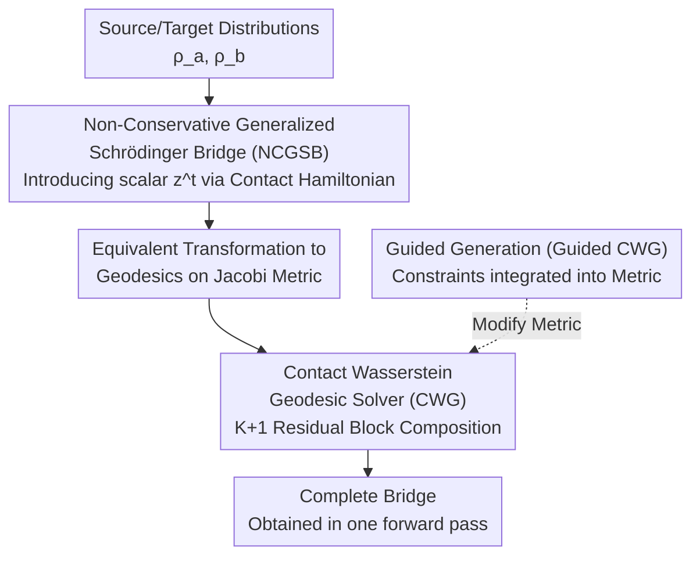

# Contact Wasserstein Geodesics for Non-Conservative Schrödinger Bridges

**Conference**: ICLR2026  
**arXiv**: [2511.06856](https://arxiv.org/abs/2511.06856)  
**Code**: [Project Homepage](https://sites.google.com/view/c-w-g)  
**Area**: Image Generation  
**Keywords**: Schrödinger bridge, contact Hamiltonian, Wasserstein geodesic, non-conservative dynamics, guided generation

## TL;DR
Proposes Non-Conservative Generalized Schrödinger Bridges (NCGSB)—based on contact Hamiltonian mechanics, which allows energy to change over time. It transforms the bridge problem into geodesic computation on a finite-dimensional Jacobi metric via Contact Wasserstein Geodesic (CWG). Parametrized with ResNet, it achieves near-linear complexity and supports guided generation, significantly outperforming iterative SB solvers on tasks such as manifold navigation, molecular dynamics, and image generation.

## Background & Motivation

**Background**: Schrödinger bridge (SB) provides a principled framework for modeling stochastic processes between two distributions, and is widely used in cell dynamics, weather forecasting, economic modeling, and image generation.

**Energy Conservation Constraint**: Existing SB methods assume the system's energy is conserved (kinetic + potential energy remains constant), which constrains the shape of the bridge and fails to describe dissipative systems (e.g., weakening storms, cell differentiation, and other non-conservative processes).

**Limitations of Prior Work**: Current SB solvers rely on forward-backward iterative simulations (IPF, matching methods, etc.), which are computationally expensive. GSBM assumes Gaussian probability paths, limiting its expressivity, while mmSB suffers from piecewise consistency issues.

**Limitations of Momentum SB**: Momentum SB models damping by adding velocity dimensions, but this doubles the state space and computational cost. Using OU processes as an alternative lacks the energy dissipation mechanism found in rotational dynamics.

**Key Insight**: Replace classical Hamiltonians with contact Hamiltonians, adding only a single scalar state $z^t$ to model energy changes. Simultaneously, adopt a geometric perspective to transform SB into geodesic computation to avoid iterations.

**Goal**: (1) NCGSB non-conservative formulation; (2) CWG near-linear time solver; (3) Guided generation by modifying the Riemannian metric.

## Method

### Overall Architecture
The core idea is to rewrite the infinite-dimensional Schrödinger bridge problem as a geodesic calculation on a finite-dimensional parameter space, thereby bypassing the forward-backward iterations of traditional SB solvers. Given source distribution $\rho_a$ and target distribution $\rho_b$, the pipeline consists of three steps: First, use contact Hamiltonian mechanics to augment the system with a scalar state $z^t$ (the NCGSB formulation), allowing total energy to dissipate or grow over time. Second, prove that this non-conservative optimality condition is equivalent to a geodesic on the extended space $\mathcal{P}^+(\mathcal{M}) \times \mathbb{R}$ under a Jacobi metric, transferring the bridge solution to the Jacobi metric space. Finally, use a sequence of residual blocks (the CWG solver) to discretely parametrize this geodesic. Each residual block is responsible for pushing the distribution forward a small step; the entire network provides the complete bridge in a single forward pass. For guided generation, constraints are incorporated into the metric and subsequently fine-tuned.

### Key Designs

**1. Non-Conservative Generalized Schrödinger Bridge (NCGSB): Allowing Time-Varying Energy**

Classical SB assumes energy conservation, which locks the shape of the bridge and fails to characterize dissipative processes such as storm decay or cell differentiation. NCGSB introduces a time-varying scalar $z^t$ via contact Hamiltonian mechanics, defining the cost functional as its evolution along the trajectory $\partial_t z^t = \int_\mathcal{M} (\frac{1}{2}\|v^t\|^2 + U(x))\rho^t \, dx - \gamma z^t$, where the damping factor $\gamma \in \mathbb{R}$ determines the energy trend: total energy decreases (dissipation) when $\gamma > 0$ and increases when $\gamma < 0$. This recursive definition of $z^t$ implicitly encodes the entire historical trajectory, effectively providing the system with "memory" to express path-dependent non-conservative forces—at the cost of only one additional scalar dimension, which is far more efficient than doubling the state space as in Momentum SB.

**2. Contact Wasserstein Geodesic (CWG) Solver: Turning the Bridge into Differentiable Geodesics**

Even with a non-conservative formulation, using iterative simulations would not provide a speedup. CWG transforms the optimality conditions of the contact Hamiltonian into an equivalent search for geodesics under the Jacobi metric $\tilde{g}_J = (H - \mathcal{F} - \mathcal{B})\, g^{\mathcal{W}_2}$. It directly parametrizes the discrete geodesic using a composite mapping of $(K+1)$ residual blocks $T_{\{\theta^k\}} = T_{\theta^K} \circ \cdots \circ T_{\theta^0}$. The entire bridge is obtained through a single forward pass, eliminating the need for outer forward-backward loops. Consequently, the total complexity is reduced to $\mathcal{O}(NK(T_{sh} + D(LW + \log N)))$, which is linear with respect to the data dimension $D$ and near-linear with respect to the batch size $N$. This explains why training is one to two orders of magnitude faster than iterative solvers in experiments.

**3. Guided Generation (Guided CWG): Encoding Constraints into the Metric**

To enforce constraints on the bridge (e.g., the endpoint must satisfy $y = f(x^{t_s})$), conventional methods superimpose classifier gradients during sampling, which is detached from the bridge's geometry. CWG directly incorporates a guidance term $\|y - f(x^{t_s})\|^2$ into the Lagrangian dynamics. This is equivalent to rewriting the Jacobi metric as $\tilde{g}'_J = (\Phi^{t_k} + \|y - f(x^{t_s})\|^2)\, g^{\mathcal{W}_2}$, such that geodesics deviating from the target condition are naturally penalized by the increased metric. Guidance thus evolves from a "sampling-time patch" to an endogenous constraint at the metric level. In practice, a hybrid strategy of unguided pre-training followed by fine-tuning with a guidance loss is employed to balance global optimality and local condition satisfaction.

### Loss & Training
The training objective consists of three Wasserstein-2 distance terms: $\ell = d_{\mathcal{W}_2}^2(\rho_\theta^{t_K}, \rho_b) + \sum_m d_{\mathcal{W}_2}^2(\rho_\theta^{t_{k_m}}, \rho_m) + \sum_k \Phi^{t_k} d_{\mathcal{W}_2}^2(\rho_\theta^{t_k}, \rho_\theta^{t_{k-1}})$. These terms respectively constrain terminal marginal alignment with the target distribution $\rho_b$, alignment of several intermediate steps with given marginals $\rho_m$, and minimization of the geodesic length between adjacent steps weighted by energy $\Phi^{t_k}$ (ensuring the bridge is truly the shortest path in the metric sense). Guided tasks incorporate a guidance loss for fine-tuning based on this foundation.

## Key Experimental Results

### LiDAR Manifold Navigation + Single-cell Sequencing

| Task/Metric | CWG (Ours) | GSBM | DSBM | SBIRR/DM-SB |
|-----------|-----------|------|------|-------------|
| LiDAR Optimality ↓ | **1.40** | 2.18 | 4.16 | — |
| LiDAR Feasibility ↓ | **0.06** | 0.83 | 0.97 | — |
| LiDAR Training Time (s) | **280** | 1570 | 1340 | — |
| Single-cell $d_{\mathcal{W}_2}(x^{t_3})$ ↓ | **0.33** | — | — | 1.64 / 1.86 |
| Single-cell Training Time (s) | **710** | — | — | 38120 / 1740 |

### Image Generation Tasks

| Task/Metric | CWG (Ours) | GSBM | DSBM | SB-Flow |
|-----------|-----------|------|------|---------|
| SST Prediction FID($x^{t_1}$) ↓ | **121** | 161 | 242 | 177 |
| Robot Reconstruction FID ↓ | **19** | 40 | 150 | 73 |
| Robot Training Time (h) | **0.5** | 25.3 | 7.6 | 1.4 |
| FFHQ Feasibility ↓ | **4.33** | 6.84 | 7.78 | 21.75 |
| FFHQ Training Time (s) | **930** | 2650 | 2530 | 1490 |

## Highlights & Insights
- **Contact Mechanics → Generative Models**: Breaking energy conservation limits by adding only a scalar $z^t$ via contact Hamiltonian mechanics is significantly more efficient than Momentum SB (which doubles the state space).
- **ResNet = Discrete Geodesic**: Each residual block is interpreted as a push-forward map on the probability manifold, providing a solid theoretical foundation and simple implementation.
- **Extreme Speed Advantage**: The method is **50×** faster than DM-SB on single-cell tasks and **50×** faster than GSBM on robot tasks.
- **Geometric Interpretation of Guided Generation**: Guidance terms modify the Riemannian metric directly rather than adding gradients during sampling, making it more intrinsic than classifier guidance.

## Limitations
- Empirical estimation of $d_{\mathcal{W}_2}$ is unstable in high-dimensional spaces; image experiments rely on VAE latent spaces.
- Guided generation requires pre-training an unguided model before fine-tuning, rather than being end-to-end.
- The choice of $\gamma$ depends on prior knowledge (e.g., whether the system is dissipative and the rate of dissipation) and lacks an adaptive regulation mechanism.
- The number of ResNet blocks $K$ determines temporal discretization precision; too few blocks lead to coarse geodesic approximations, while too many increase the parameter count.

## Related Work & Insights
- **vs GSBM (Liu et al., 2024)**: GSBM assumes Gaussian paths and uses iterative solvers; CWG has no such restrictions and is non-iterative—achieving 36% lower Optimality and over 5× faster training.
- **vs Momentum SB (Blessing et al., 2025)**: Momentum SB doubles the state space to model damping; NCGSB only adds a scalar—a more elegant approach to non-conservative modeling.
- **vs SB-Flow (Bortoli et al., 2024)**: SB-Flow uses iterative IPF and does not support GSB/mmSB, energy variation, or guided generation; CWG provides a comprehensive solution.
- **Insight**: Contact geometry is a mathematical tool that has not yet been fully utilized in deep learning. it holds broad prospects in fields requiring dissipation modeling, such as materials science and climate simulation.

## Rating
- Novelty: ⭐⭐⭐⭐⭐ Bringing contact Hamiltonian mechanics into SB is a fresh perspective with profound theoretical contributions.
- Experimental Thoroughness: ⭐⭐⭐⭐ Covers manifold navigation, molecular dynamics, and various image tasks with thorough ablation.
- Writing Quality: ⭐⭐⭐⭐ Mathematically rigorous, though the barrier to entry may be high for readers without a geometry background.
- Value: ⭐⭐⭐⭐⭐ Combines theoretical depth with practical speed advantages, representing a significant advancement in the direction of SB.

<!-- RELATED:START -->

## Related Papers

- [\[ICML 2025\] The Dark Side of the Forces: Assessing Non-Conservative Force Models for Atomistic Machine Learning](../../ICML2025/physics/the_dark_side_of_the_forces_assessing_non-conservative_force_models_for_atomisti.md)
- [\[ICLR 2026\] HSG-12M: A Large-Scale Benchmark of Spatial Multigraphs from the Energy Spectra of Non-Hermitian Crystals](hsg-12m_a_large-scale_benchmark_of_spatial_multigraphs_from_the_energy_spectra_o.md)
- [\[ICML 2026\] Teaching Molecular Dynamics to a Non-Autoregressive Ionic Transport Predictor](../../ICML2026/physics/teaching_molecular_dynamics_to_a_non-autoregressive_ionic_transport_predictor.md)
- [\[ICLR 2026\] AQER: A Scalable and Efficient Data Loader for Digital Quantum Computers](aqer_a_scalable_and_efficient_data_loader_for_digital_quantum_computers.md)
- [\[ICLR 2026\] ATOM: A Pretrained Neural Operator for Multitask Molecular Dynamics](atom_a_pretrained_neural_operator_for_multitask_molecular_dynamics.md)

<!-- RELATED:END -->
