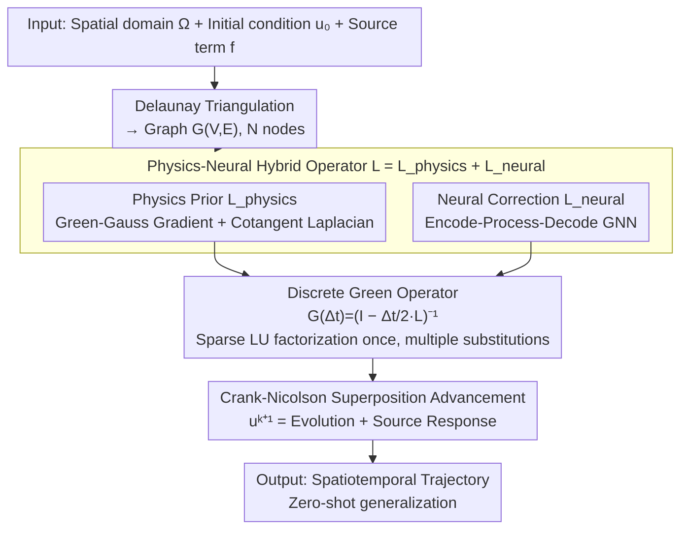

# DGNet: Discrete Green Networks for Data-Efficient Learning of Spatiotemporal PDEs

**Conference**: ICLR 2026  
**arXiv**: [2603.01762](https://arxiv.org/abs/2603.01762)  
**Code**: [Available](https://github.com/tanyingjie01/DGNet)  
**Area**: Scientific Computing  
**Keywords**: Neural PDE Solvers, Green's Function, Graph Neural Networks, Data-Efficient Learning, Spatiotemporal PDEs

## TL;DR

Based on Green's function theory, the superposition principle is embedded into a physics-neural hybrid architecture to construct Discrete Green Networks (DGNet). It achieves SOTA accuracy using only dozens of training trajectories and demonstrates robust zero-shot generalization to unseen source terms.

## Background & Motivation

Spatiotemporal partial differential equations (PDEs) are fundamental for modeling fluid dynamics, weather forecasting, and molecular dynamics. Traditional numerical solvers incur massive computational overhead, making neural PDE solvers an increasingly popular alternative. However, existing methods face a core bottleneck: **Limitations of Prior Work** — they typically require a large volume of training trajectories, while high-fidelity PDE data is extremely expensive to acquire.

The study indicates that the root cause of low data efficiency is that PDE dynamics contain strong structural inductive biases (locality, conservation laws, superposition, etc.), yet existing neural architectures do not explicitly encode these priors, forcing models to relearn fundamental physical structures from data. This issue is particularly prominent in the presence of **source terms** $f(x,t)$, where models struggle to extrapolate to unseen patterns of source terms.

**Key Insight**: This work revisits Green's function theory as a source of structural inductive bias. Green's functions decompose PDE solutions into a homogeneous evolution part and a forced response part, encoding the superposition principle to reduce the need to learn fundamental behaviors from scratch.

## Method

### Overall Architecture

DGNet transfers Green's function theory onto a graph. First, the spatial domain $\Omega$ is discretized into a graph $G=(V,E)$ with $N$ nodes using Delaunay triangulation. Then, a spatial operator $\mathbf{L}=\mathbf{L}_{\text{physics}}+\mathbf{L}_{\text{neural}}$ is constructed on the graph, combining a physics prior and a neural correction. Using the Crank-Nicolson midpoint scheme for implicit time integration of $\mathbf{L}$, the discrete Green operator $\mathbf{G}(\Delta t)=(\mathbf{I}-\tfrac{\Delta t}{2}\mathbf{L})^{-1}$ is derived as the state propagator. Finally, the entire trajectory is advanced step-by-step. The time advancement strictly follows the algebraic structure of the superposition principle (state evolution + source response) while using data to compensate for biases introduced by discretization and unmodeled dynamics.

### Key Designs

**1. Physics-Neural Hybrid Operator: Physics prior for skeleton, neural correction for discretization errors**

**Design Motivation**: General neural architectures must relearn basic physical structures like locality and conservation laws from data. DGNet splits the spatial operator into $\mathbf{L} = \mathbf{L}_{\text{physics}} + \mathbf{L}_{\text{neural}}$, where the handcrafted operator undertakes the reliable underlying structure and the GNN only compensates for discretization errors. The physics prior $\mathbf{L}_{\text{physics}}$ is constructed directly from grid geometry to ensure consistency with physical laws: the gradient operator is based on the Green-Gauss theorem, and the Laplacian operator is based on the discrete Laplace-Beltrami using cotangent weights $w_{ij}=\tfrac{1}{2}(\cot\alpha_{ij}+\cot\beta_{ij})$. The neural correction $\mathbf{L}_{\text{neural}}$ follows an Encode-Process-Decode GNN structure. **Experimental Thoroughness**: Ablation tests show that removing $\mathbf{L}_{\text{physics}}$ causes significantly more performance loss than removing $\mathbf{L}_{\text{neural}}$, confirming the "skeleton + fine-tuning" division of labor.

**2. Discrete Green Operator and Sparse Reuse: Applying superposition principle to the graph**

With the spatial operator $\mathbf{L}$, applying the Crank-Nicolson scheme for implicit time integration yields a single-step update:

$$\mathbf{u}^{k+1} = \mathbf{G}(\Delta t)\Big(\mathbf{I} + \tfrac{\Delta t}{2}\mathbf{L}\Big)\mathbf{u}^k + \mathbf{G}(\Delta t)\tfrac{\Delta t}{2}\big(\mathbf{f}^k + \mathbf{f}^{k+1}\big),$$

where $\mathbf{G}(\Delta t) = (\mathbf{I} - \tfrac{\Delta t}{2}\mathbf{L})^{-1}$ is the discrete Green operator acting as the state propagator. To avoid high costs of inversion for large grids, since the coefficient matrix $(\mathbf{I}-\tfrac{\Delta t}{2}\mathbf{L})$ is constant throughout the trajectory, a "factorize once, solve multiple times" strategy is used via pre-computed sparse LU decomposition.

**3. Superposition Principle Decomposition and Zero-shot Generalization: Decoupling system evolution and source response**

**Mechanism**: The update formula above consists of two terms corresponding to the continuous Green's function representation. The first term represents the propagation of initial conditions, and the second term represents the cumulative response to the source term. Since "how the system evolves" and "how the source drives it" are structurally separated, when facing an unseen source term, the model only needs to convolve the new $\mathbf{f}$ with the same Green operator without relearning the dynamics. This is the source of DGNet's zero-shot generalization.

### Loss & Training

Training is performed on short sub-sequences of length $Q \ll T$ to mitigate error accumulation. A pushforward trick is employed by injecting small noise into the initial state during training to improve robustness to prediction errors during inference. The loss is calculated as the L2 error of the first and last frames of the sub-sequence: $\mathcal{L} = \|\hat{\mathbf{u}}^{s_1} - \mathbf{u}^{s_1}\|^2 + \|\hat{\mathbf{u}}^{s_{Q-1}} - \mathbf{u}^{s_{Q-1}}\|^2$, optimized using Adam with learning rate decay.

## Key Experimental Results

### Main Results (Three types of PDE systems, dozens of trajectories)

**Classic PDEs** (Allen-Cahn / Fisher-KPP / FitzHugh-Nagumo):

| Scenario | Metric | DeepONet | MGN | MP-PDE | BENO | PhyMPGN | **DGNet (Ours)** |
|------|------|----------|-----|--------|------|---------|-----------|
| Allen-Cahn | MSE | 2.60e-1 | 2.70e-1 | 8.52e-1 | 2.52e+0 | 5.16e-1 | **8.75e-3** |
| Allen-Cahn | RNE | 0.669 | 0.681 | 1.211 | 2.081 | 0.942 | **0.019** |
| Fisher-KPP | MSE | 3.05e-2 | 3.66e-3 | 9.90e-2 | 6.26e-2 | 1.50e-2 | **2.59e-4** |
| FitzHugh-Nagumo | MSE | 2.49e-6 | 3.75e-5 | 6.46e-6 | 2.14e-4 | 1.69e-3 | **1.18e-7** |

**Complex Geometry** (Contaminant transport in channel flows with varied obstacles):

| Scenario | Metric | DeepONet | MGN | MP-PDE | BENO | PhyMPGN | **DGNet (Ours)** |
|------|------|----------|-----|--------|------|---------|-----------|
| Cylinder | MSE | 4.44e-2 | 6.38e-3 | 9.31e-2 | 6.76e-2 | 4.13e-1 | **1.00e-4** |
| Sediments | MSE | 3.61e-2 | 5.94e-3 | 7.10e-3 | 1.07e-1 | 2.00e-1 | **4.60e-4** |
| Complex Obstacles | MSE | 5.33e-2 | 7.79e-3 | 6.09e-3 | 7.66e-2 | 2.97e-1 | **6.69e-5** |

**Zero-shot Generalization** (Laser heating, unseen source terms):

| Scenario | Metric | DeepONet | MGN | MP-PDE | BENO | PhyMPGN | **DGNet (Ours)** |
|------|------|----------|-----|--------|------|---------|-----------|
| Laser Heat | MSE | 2.48e+3 | 4.98e+3 | 3.88e+3 | 1.95e+3 | 6.78e+3 | **1.76e+1** |
| Laser Heat | RNE | 0.121 | 0.171 | 0.151 | 0.107 | 0.200 | **0.010** |

### Ablation Study

Comparison of four variants on the Complex Obstacles scenario:
- **(A) w/o L_physics**: Removing physics prior operator → Severe performance degradation, indicating it provides critical structural knowledge.
- **(B) w/o L_neural**: Removing neural correction → Performance drop is less than (A), suggesting the GNN primarily fine-tunes discretization errors.
- **(C) w/o Residual GNN**: Removing residual GNN → Performance decrease, confirming its effectiveness in capturing additional dynamics.
- **(D) w/o Green**: Replacing with end-to-end GNN → **Largest performance drop**, highlighting the discrete Green solver as the core structural prior.

### Key Findings

1. DGNet achieves **1-2 orders of magnitude** lower MSE compared to baselines across all scenarios.
2. In the FitzHugh-Nagumo system, only DGNet successfully reproduces the long-term propagation of nonlinear spiral waves.
3. In laser heating zero-shot tests, baseline errors explode by orders of magnitude, whereas DGNet shows almost no decay.
4. The discrete Green solver is the most critical component for performance.

## Highlights & Insights

1. **Theory-driven inductive bias**: Converting Green's function—a classic PDE theory tool—into a computable discrete form on graphs is an exemplary "physics knowledge to network design" approach.
2. **Explicit encoding of superposition**: Decomposition into evolution and response terms achieves natural generalization to unseen sources without needing data coverage.
3. **Sparse computation optimization**: The "factorize once, solve multiple times" strategy makes discrete Green solvers practical for large grids.
4. **Complementary hybrid design**: Physics priors provide a reliable skeleton while neural corrections compensate for discretization errors.

## Limitations & Future Work

1. Primarily applicable to linear or weakly nonlinear PDEs; for **quasilinear PDEs** where superposition does not hold, the framework needs fundamental extension.
2. Validated on 2D domains; scaling to **large-scale 3D systems** remains a significant engineering challenge.
3. Construction of physics priors relies on gradient and Laplacian forms; more complex operators require additional design.
4. Hyperparameters like sub-sequence length $Q$ and noise injection magnitude require manual tuning.

## Related Work & Insights

- **PINNs**: Learn specific solutions rather than operator mappings; cannot generalize to different domains/parameters/sources.
- **Neural Operators (FNO/DeepONet)**: Learn mappings in function spaces but require massive data and lack physical structure.
- **Graph-based PDE solvers (GNS/PhyMPGN/BENO)**: Introduce partial physical bias but lack a principled foundation.
- **Insight**: Extensive structural priors in classical PDE theory (e.g., Fourier methods, variational principles) can further guide neural architecture design.

## Rating

- **Novelty**: ★★★★☆ — Innovative combination of Green's function discretization and hybrid operators.
- **Technical Depth**: ★★★★★ — Solid execution from continuous theory to discrete implementation.
- **Experimental Thoroughness**: ★★★★★ — Comprehensive coverage of PDE systems and baselines.
- **Value**: ★★★★☆ — Practical for scientific computing with open-source code.
- **Writing Quality**: ★★★★☆ — Clear derivation and informative visuals.

<!-- RELATED:START -->

## Related Papers

- [\[ICLR 2026\] Learning Data-Efficient and Generalizable Neural Operators via Fundamental Physics Knowledge](learning_data-efficient_and_generalizable_neural_operators_via_fundamental_physi.md)
- [\[ICLR 2026\] Generalized Spherical Neural Operators: Green's Function Formulation](generalized_spherical_neural_operators_greens_function_formulation.md)
- [\[ICLR 2026\] AQER: A Scalable and Efficient Data Loader for Digital Quantum Computers](aqer_a_scalable_and_efficient_data_loader_for_digital_quantum_computers.md)
- [\[ICLR 2026\] MatRIS: Toward Reliable and Efficient Pretrained Machine Learning Interatomic Potentials](matris_toward_reliable_and_efficient_pretrained_machine_learning_interatomic_pot.md)
- [\[CVPR 2025\] ATP: Adaptive Threshold Pruning for Efficient Data Encoding in Quantum Neural Networks](../../CVPR2025/physics/atp_adaptive_threshold_pruning_for_efficient_data_encoding_in_quantum_neural_net.md)

<!-- RELATED:END -->
