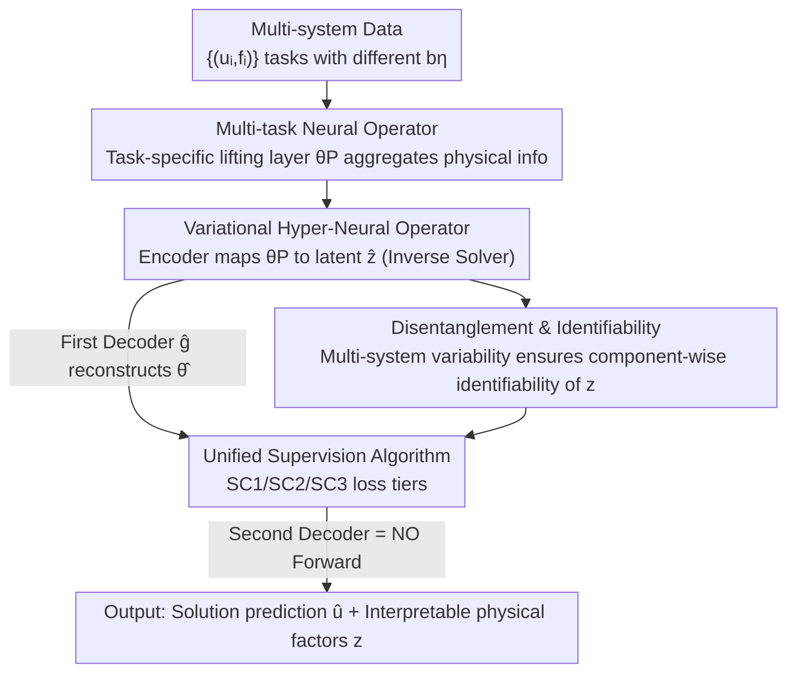

# Disentangled Representation Learning for Parametric Partial Differential Equations

**Conference**: ICLR2026  
**OpenReview**: [https://openreview.net/forum?id=xaTJAxZTvV](https://openreview.net/forum?id=xaTJAxZTvV)  
**Code**: https://github.com/ningliu-iga/DisentangO  
**Area**: Scientific Machine Learning / Neural Operator / Partial Differential Equations  
**Keywords**: Neural Operator, Disentangled Representation, Hypernetwork, Variational Autoencoder, Inverse Problem

## TL;DR
DisentangO proposes a "Variational Hyper-Neural Operator" architecture that treats the parameters of neural operators for multiple physical systems as signals. It uses a VAE to disentangle identifiable latent physical factors from these black-box parameters. This allows the model to **simultaneously** perform forward PDE solving (predicting solution fields) and inverse physical discovery (recovering hidden parameters of the driving system), while providing theoretical guarantees for component-wise identifiability.

## Background & Motivation
**Background**: Neural Operators (NO, e.g., FNO, DeepONet, MetaNO) excel at learning mappings between function spaces and serve as efficient forward surrogate solvers for PDE control systems—given a load $f$ and parameter field $b$, they quickly predict the solution $u$. They are fast and accurate for forward prediction.

**Limitations of Prior Work**: However, NO is a complete black box. It fits a system with a fixed parameter $b$ as a universal approximator but knows nothing about the underlying physical quantities driving the system, nor can it explain them. In other words, NO gives the answer but not the physical mechanism. This is critical in scientific scenarios where the value of physical modeling lies in understanding the governing laws.

**Key Challenge**: Recovering physical parameters is essentially an **inverse problem** $H:(u,f)\to b$, which is inherently ill-posed. A few $(u,f)$ pairs from a single system are often insufficient to uniquely determine $b$ (e.g., on a Dirichlet boundary where $u\equiv 0$, $b$ is unlearnable). Existing inverse methods either require prior knowledge of the PDE form or rely on regularization to inject priors, assumptions that often fail in real-world scenarios. Meanwhile, a tension exists between model expressivity and interpretability: models that are too complex obscure real physical relationships, while those that are too simple lose key details of system behavior.

**Goal**: Construct a unified framework that performs both forward prediction and inverse physical discovery without **requiring knowledge of the PDE form or supervision of $b$**, while **disentangling** the recovered physical factors into independent, interpretable dimensions.

**Key Insight**: The authors' key observation is that since the neural operator's parameters $\theta$ themselves encode all physical information of the system it fits, the "inverse problem" can be transformed from "inferring $b$ from data $(u,f)$" to "disentangling the latent representation $z$ of $b$ from NO parameters $\theta$." More importantly, learning **multiple** systems with different hidden parameters simultaneously allows the variability between systems to mitigate the ill-posedness of the inverse problem, leading to identifiability.

**Core Idea**: Use a combination of a hypernetwork and a VAE, taking the "task-specific parameters of a multi-task neural operator" as input signals for the VAE to disentangle identifiable physical factors from black-box parameters—essentially performing "disentangled representation learning on the neural network parameters themselves" rather than on the data.

## Method

### Overall Architecture
DisentangO aims to solve the following: given $S$ systems sharing the same class of PDE but with different hidden parameters $b^\eta$, where each system provides several function pairs $(u_i^\eta, f_i^\eta)$ (each system viewed as a "task"), the goal is to learn a model that performs both forward prediction for all tasks and disentangles physical factors.

The overall data flow works as follows: all tasks share a **multi-task neural operator** backbone, but each task has its own "lifting layer" parameters $\theta_P^\eta$, into which all physical information regarding $b^\eta$ is compressed. A VAE then takes $\theta_P^\eta$ as input: the **encoder** acts as the inverse mapping $H$, encoding $\theta_P^\eta$ into disentangled latent variables $\hat z^\eta$ (this is "physical discovery"); the **first decoder** $\hat g$ reconstructs $\hat z$ back into NO parameters $\hat\theta$; the **second decoder** is the neural operator forward mapping itself, using the reconstructed $\hat\theta$ and load $f$ to predict the solution $\hat u$ (this is "forward solving"). The entire system is trained end-to-end, constrained by data reconstruction loss, parameter reconstruction loss, and KL loss.

### Key Designs

**1. Multi-task Neural Operator: Squeezing physical info into a task-specific lifting layer**

The root of ill-posed inverse problems is insufficient information from a single system. This paper breaks through by learning $S$ systems simultaneously and forcing all "inter-system differences" into low-dimensional parameters. The authors use MetaNO (based on Implicit Fourier Neural Operator, IFNO) as the backbone, writing an $L$-layer network as:
$$G[f;\theta^\eta](x) = Q_{\theta_Q}\circ (J_{\theta_J})^L \circ P_{\theta_P^\eta}[f](x),$$
where $P, Q$ are shallow MLPs (lifting/projection), and the intermediate layer $J$ simulates fixed-point iteration. The key constraint is: **only the first-layer lifting parameters $\theta_P^\eta$ adapt to the task, while the iteration parameters $\theta_J$ and projection parameters $\theta_Q$ are shared across all tasks**. MetaNO's universal approximation analysis ensures different PDEs can share $\theta_J, \theta_Q$, thus "forcing" all information of $b$ into the low-dimensional vector $\theta_P^\eta$. Consequently, the inverse mapping only needs to be built on $\theta_P^\eta$: $H(\theta^\eta;\Theta):=\mathrm{MLP}(\theta_P^\eta)$, significantly reducing degrees of freedom and making the invertibility assumption realistic.

**2. Variational Hyper-Neural Operator: Disentangling NO parameters themselves, not data**

With the highly concentrated $\theta_P^\eta$, the authors treat it as an observation signal for a VAE—the fundamental difference from previous "disentanglement from data" works. DisentangO is the **first method to disentangle from black-box network parameters**. It assumes hidden parameters are generated as $b\sim P_b,\ z\sim p(z\mid b)$, maximizing the ELBO of the data log-likelihood:
$$\mathcal{L}_{\text{ELBO}}=\frac{1}{S}\sum_{\eta=1}^{S}\Big[\mathbb{E}_{q(z^\eta|\theta^\eta)}\log p(\theta^\eta|z^\eta)-D_{\mathrm{KL}}\big(q(z^\eta|\theta^\eta)\,\|\,p(z^\eta)\big)\Big].$$
The system is implemented as a Hierarchical VAE (HVAE): the encoder provides the posterior $q_{\mu_z,\Sigma_z}(\hat z^\eta|\theta^\eta)$ (the inverse map $H$); the first decoder $\hat\theta=\hat g(\hat z)$ reconstructs latents into NO parameters; the second decoder translates parameters back into the solution field via the NO forward mapping $\hat u=\hat G[f;\hat\theta]$. This pairing of "hypernetwork (one network generating parameters for another) + VAE" allows the architecture to **output both predicted solutions and interpretable latent factors in a single forward pass**.

**3. Component-wise Identifiability: Trading "multi-system variability" for "solvability"**

A major fear in disentanglement is that learned latents might lack physical meaning or remain entangled. This paper provides theoretical guarantees: under assumptions of smooth positive density, $z\to\theta$ invertibility, conditional independence, and "sufficient variability (linear independence)," two conclusions are proven—**Theorem 1**: As long as the learned model aligns the marginal data distributions $p_{\hat u|f}=p_{u|f}$, the latent $z$ is identifiable up to an invertible transform $h$ ($\hat z=h(z)$); **Theorem 2**: With additional conditional independence and cross-system data variability assumptions, **component-wise** identifiability is obtained—each true factor $z_i$ corresponds to some learned $\hat z_j$ via a 1D invertible function $z_i=h_i(\hat z_j)$. The core intuition here is Assumption 4, requiring $2d_z+1$ different $b$ to make certain gradient vectors linearly independent—i.e., "systems are sufficiently different"—which justifies multi-task learning as a remedy, drawing from the identifiable non-linear ICA framework. The authors claim this is the first discussion of component-wise identifiability in the context of multi-task NO learning.

**4. Universal Supervision Algorithm: One loss for supervised / semi-supervised / unsupervised tiers**

Real-world knowledge of $b$ varies. A unified loss adapts to three levels of supervision—SC1 (values of $b^\eta$ provided), SC2 (only labels $c(b^\eta)$ provided, e.g., classification), and SC3 (nothing provided). Under a Gaussian posterior, the KL term has a closed form: for unsupervised cases, $D_{\mathrm{KL}}=\frac12\sum_i\big((\Sigma_z)_i^2+(\mu_z)_i^2-2\log(\Sigma_z)_i-1\big)$; for supervised cases, the prior mean is anchored to $b$, replacing $(\mu_z)_i^2$ with $(\mu_z-b)_i^2$. The simplified unsupervised total loss is:
$$\mathcal{L}_{\text{loss}}=\frac1S\sum_\eta\Big(\beta_d\sum_{j}\big\|\hat G[f_j^\eta;\hat\theta^\eta]-u_j^\eta\big\|_{L^2}^2+\big\|\hat\theta^\eta-\mu_\theta^\eta\big\|^2+\beta_{\mathrm{KL}}\|\mu_z^\eta\|^2\Big),$$
with an additional classification constraint $\beta_{\mathrm{cls}}\mathcal{L}_c$ (e.g., cross-entropy) for semi-supervised cases. The weights manage competing goals: $\beta_{\mathrm{KL}}$ (the $\beta$-VAE disentanglement knob) encourages disentanglement but can compress the latent bottleneck, causing information loss; $\beta_d$ (data reconstruction strength) forces latent factors to participate in the global reconstruction of complex solution fields, thereby **mitigating** information loss. Balancing these two ensures both accuracy and disentanglement.

### Loss & Training
The total objective $\mathcal{L}_{\text{loss}}$ consists of four components: data reconstruction loss (forward $\hat u$ vs $u$), parameter reconstruction loss ($\hat\theta$ vs $\theta$), KL loss (disentanglement regularization), and (semi-)supervision loss. $\beta_d, \beta_{\mathrm{KL}}, \beta_{\mathrm{cls}}$, and noise standard deviation $\varpi$ are adjustable hyperparameters. To avoid over-parameterization, the first decoder's covariance is taken as $\Sigma_\theta=\sigma_\theta^2 I$.

## Key Experimental Results

### Main Results
The authors evaluate across three supervision scenarios and three physical datasets, comparing against 14 baselines (8 NO-based + 6 non-NO).

**Experiment 1 (SC1 Full Supervision, HGO Anisotropic Fiber-reinforced Hyperelastic Material)**:

| Model | Params | Forward Error (data) | Inverse Error z (SC1) |
|------|--------|---------------|------------------|
| **DisentangO** | 697k | 1.65% | **4.63%** |
| MetaNO (Forward only) | 296k | **1.59%** | - |
| FNO | 698k | 2.45% | 14.55% |
| NIO (Inverse only) | 709k | - | 15.16% |
| FUSE | 706k | - | 4.99% |
| InVAErt (Inverse only) | 707k | - | 5.16% |

In forward tasks, MetaNO serves as the upper bound, which DisentangO nearly matches, outperforming the third place by 32.7%. In inverse tasks, DisentangO is the **only** method to push error below 5%, outperforming the second-best joint solver by 25.2%.

### Ablation Study
**Experiment 2 (Semi-supervised Mechanical MNIST)**: Investigating impact of latent dimensions and data loss weight $\beta_d$.

| Config | DNO-2 | DNO-5 | DNO-10 | DNO-15 | MetaNO (Bound) |
|------|-------|-------|--------|--------|--------------|
| $\beta_d=1$ | 12.82% | 9.56% | 7.36% | 6.29% | 2.68% |
| $\beta_d=100$ | 11.49% | 8.43% | 6.65% | **5.48%** | - |
| $\beta_d=1000$ | 11.62% | 8.22% | 6.50% | 5.80% | - |

As latent dimensions increase from 2 to 15, the forward error drops from 11.49% to 5.48%, approaching the MetaNO bound. Increasing $\beta_d$ improves accuracy up to 100, after which gains diminish. Even the weakest DNO-2 ($\beta_d=1$) outperforms VARE/$\beta$-VAE by 21.5%/25.2%, while DNO-15 is 66.5%/68.0% better.

**Experiment 3 (Unsupervised Heterogeneous Material / Synthetic Tissue)**: DNO-30 with $\beta_d=100$ achieves 5.28% error, 90.7% better than the best baseline, converging toward MetaNO's 2.67% bound.

### Key Findings
- **Data loss $\beta_d$ is a hidden driver for disentanglement**: Increasing $\beta_d$ not only improves forward accuracy but also leads to a consistent decrease in Mutual Information (MI) scores between latent factors (better disentanglement). Conversely, classification loss $\beta_{\mathrm{cls}}$ increases MI and harms disentanglement because the classifier linearly combines latents.
- **Latent factors truly have physical meaning**: On MMNIST, latent traversal shows digits transitioning continuously (6 to 0, 2, 7, etc.), matching latent cluster distributions. On synthetic tissue, the three factors of DNO-3 control rotation at junctions, relative fiber orientation, and upper-segment fiber orientation—interpretability maps to real microstructure parameters.
- **Semi-supervised Trade-off**: Adding classification loss slightly reduces forward accuracy (extra regularization) but gains the ability to identify embedded digits and disentangle meaningful factors accordingly. The unsupervised version has slightly higher accuracy but cannot capture such partial label knowledge.

## Highlights & Insights
- **Novel Perspective of "Disentanglement on Network Parameters"**: While traditional disentanglement extracts factors from data, this paper treats NO parameters $\theta_P$ as signals. Since MetaNO already compresses physical info into these low-dimensional parameters, the method performs strong information concentration first, making subsequent disentanglement much more effective. This two-stage logic can be migrated to any multi-task model with highly separable parameters.
- **Multi-tasking as a Theoretical Remedy**: Multi-task learning is linked to non-linear ICA identifiability theory, providing component-wise guarantees for inverse problems rather than just empirical success.
- **Unified Architecture for Forward and Inverse**: Reusing the NO forward mapping as the second decoder allows both tasks to share parameters and be optimized end-to-end, rather than stitching two independent models together.
- **Antagonistic Relationship of $\beta_d$ and $\beta_{\mathrm{KL}}$**: The trade-off between disentanglement strength and reconstruction fidelity is explicitly split into two knobs, providing practical tuning intuition.

## Limitations & Future Work
- **Ours acknowledges**: The scalability of DisentangO is limited by the scalability of the chosen NO backbone. This paper focuses on "high latent dimension" experiments; demonstrations on **high-dimensional PDEs** are currently out of scope.
- **Reliance on System Variability**: Assumption 4 for identifiability requires $2d_z+1$ sufficiently different $b$. If available systems are too few or too similar, both theory and practical disentanglement will degrade.
- **Identifiability only up to Invertible Transforms**: Theorems guarantee 1D invertible mapping $z_i=h_i(\hat z_j)$; scales and permutations still require post-hoc alignment, and assigning physical units still requires human interpretation (e.g., via latent traversal).
- **Multiple Hyperparameters**: $\beta_d, \beta_{\mathrm{KL}}, \beta_{\mathrm{cls}}, \varpi, \sigma_\theta$ all require tuning, and the optimal $\beta_d$ varies by dataset, incurring a tuning cost.

## Related Work & Insights
- **vs MetaNO (Backbone)**: MetaNO provides the multi-task NO structure but is **forward-only**, and its parameters remain black boxes. DisentangO adds a VAE layer to disentangle $\theta_P$ into interpretable factors, adding inverse discovery.
- **vs Traditional Inverse PDE Methods (NIO / PDE Priors)**: These mostly require the PDE form or structural operators to combat ill-posedness, which is often unrealistic. DisentangO requires neither the PDE form nor $b$ supervision.
- **vs Data-side Disentanglement ($\beta$-VAE / FactorVAE / InfoGAN)**: These work on **data** (often visual/robotic). DisentangO is the first to disentangle **network parameters**, applied to physical system learning.
- **vs FUSE / InVAErt**: DisentangO is the only one to push SC1 inverse error below 5% while maintaining a forward accuracy near the MetaNO bound, achieving the best of forward accuracy, inverse strength, and interpretability.

## Rating
- Novelty: ⭐⭐⭐⭐⭐ First to "disentangle physical factors from black-box NO parameters," with component-wise identifiability theory in a multi-task NO context.
- Experimental Thoroughness: ⭐⭐⭐⭐ Covers supervised/semi-supervised/unsupervised scenarios across 14 baselines with latent traversal; however, high-dimensional PDEs are not addressed.
- Writing Quality: ⭐⭐⭐⭐ Clear logic from motivation to theory and experiments; formulas are complete, though assumptions are dense.
- Value: ⭐⭐⭐⭐⭐ Bridges forward solving, inverse discovery, and interpretability in Sciml with clear application prospects in materials/microstructures.

<!-- RELATED:START -->

## Related Papers

- [\[ICLR 2026\] Riesz Neural Operator for Solving Partial Differential Equations](riesz_neural_operator_for_solving_partial_differential_equations.md)
- [\[AAAI 2026\] Towards a Foundation Model for Partial Differential Equations Across Physics Domains](../../AAAI2026/physics/towards_a_foundation_model_for_partial_differential_equations_across_physics_dom.md)
- [\[ICLR 2026\] Physics-Informed Inference Time Scaling for Solving High-Dimensional Partial Differential Equations via Defect Correction](physics-informed_inference_time_scaling_for_solving_high-dimensional_partial_dif.md)
- [\[ICML 2025\] Closed-form Symbolic Solutions: A New Perspective on Solving Partial Differential Equations](../../ICML2025/physics/closed-form_solutions_a_new_perspective_on_solving_differential_equations.md)
- [\[ICLR 2026\] $\partial^\infty$-Grid: A Neural Differential Equation Solver with Differentiable Feature Grids](boldsymbolpartialinfty-grid_a_neural_differential_equation_solver_with_different.md)

<!-- RELATED:END -->
