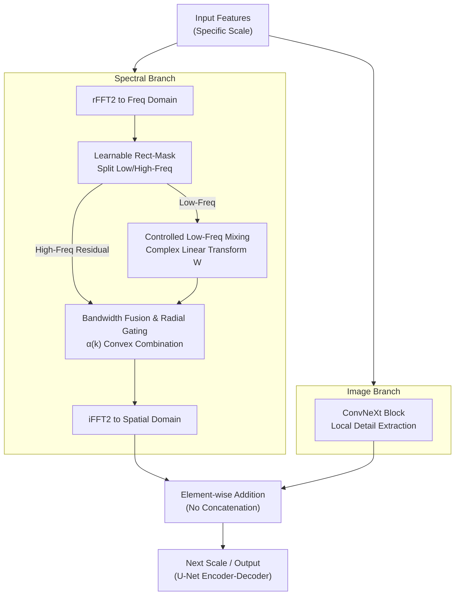

# DRIFT-Net: A Spectral--Coupled Neural Operator for PDEs Learning

**Conference**: ICLR2026  
**arXiv**: [2509.24868](https://arxiv.org/abs/2509.24868)  
**Code**: None  
**Area**: Scientific Computing  
**Keywords**: neural operator, PDE, spectral coupling, dual-branch, Navier-Stokes

## TL;DR
The authors propose DRIFT-Net, a dual-branch neural operator that resolves the autoregressive drift issue caused by insufficient global spectral coupling in windowed attention. By combining controlled low-frequency mixing (spectral branch) with local detail fidelity (image branch) via radial gating bandwidth fusion, it reduces errors on Navier-Stokes benchmarks by 7%-54%.

## Background & Motivation

**Background**: Most PDE foundation models employ multi-scale windowed self-attention. While computationally efficient, global dependencies must propagate incrementally through deep stacking and window shifting.

**Limitations of Prior Work**: The locality of windowed attention weakens spectral coupling, leading to error accumulation and drift during closed-loop autoregressive rollouts. Conversely, pure spectral operators (like FNO) are global but overemphasize low frequencies, thus underfitting non-stationary local details. Naive cross-branch concatenation tends to inflate channel widths and cause training instability.

**Key Challenge**: The trade-off between global coupling and local detail fidelity—requiring large-scale information propagation across the entire domain in a single layer without blurring high-frequency details or destabilizing training.

**Goal**: To enhance global spectral coupling while maintaining high-frequency details without increasing feature width.

**Core Idea**: A spectral branch completes global coupling via learnable linear mixing of low frequencies, while an image branch preserves local details. These two branches are fused using radial gating based on frequency radius and summed. A frequency-weighted loss is further employed to counteract spectral bias.

## Method

### Overall Architecture

DRIFT-Net addresses the weakness of global spectral coupling in windowed attention, which causes drift during rollouts. The architecture is a U-Net-shaped multi-scale encoder-decoder. At each scale, two complementary branches are placed in parallel: the **Spectral Branch** completes global coupling in the frequency domain, and the **Image Branch** preserves local details in the spatial domain. Their outputs are element-wise summed before proceeding to the next scale.

**Mechanism**: Input features enter both branches simultaneously. The spectral branch uses rFFT2 to transform features into the frequency domain, then applies a learnable rectangular mask to split the spectrum into low-frequency and high-frequency residual segments. The low-frequency segment undergoes **Controlled Low-Frequency Mixing** (a cross-domain learnable linear transformation), while the high-frequency segment is preserved. Subsequently, **Bandwidth Fusion and Radial Gating** reconstruct the spectrum using a convex combination $\alpha(k)$ based on frequency radius, followed by an iFFT2. The image branch utilizes a standard ConvNeXt block to extract local, non-stationary structures. The outputs are summed (not concatenated) to maintain feature width.

### Key Designs

**1. Controlled Low-Frequency Mixing: Global propagation without deep stacking**  
In windowed attention, global dependencies spread slowly through layers. This "slow propagation" accumulates into drift during rollouts. DRIFT-Net applies a learnable complex linear transformation $W$ (per-frequency, per-channel) only to the low-frequency coefficients $\hat{X}_{low}$. Since low frequencies correspond to large-scale structures and global dynamics in PDE solutions, a single global linear mixing achieves domain-wide information exchange in one layer. High frequencies are excluded to prevent global mixing from amplifying noise or blurring sharp boundaries.

**2. Bandwidth Fusion and Radial Gating: Preventing overshooting via convex combination**  
To merge the modified low frequencies and the original high frequencies without introducing discontinuities or magnitude overshooting at band boundaries, DRIFT-Net uses soft fusion indexed by frequency radius $k$:

$$\hat{Y}(k) = \alpha(k)\,\hat{V}_{low}(k) + \big(1-\alpha(k)\big)\,\hat{X}_{high}(k)$$

The gating $\alpha(k)\in[0,1]$ is computed from the radial frequency. Since this is a convex combination, the energy at any frequency is bounded, ensuring training stability.

**3. Frequency-Weighted Loss: Overcoming spectral bias**  
Neural networks exhibit a spectral bias toward low frequencies. Standard MSE can lead to underfitting of high-frequency details, which are a major source of long-term rollout drift. DRIFT-Net weights errors by frequency radius, forcing the optimizer to focus on high-frequency sharp structures.

### Loss & Training

The model learns a single-step operator $F_\theta: u_t \mapsto u_{t+1}$. Training uses single-step teacher forcing with a goal to minimize relative $L_p$ error ($p\in\{1,2\}$) plus the frequency-weighted term. Evaluation uses autoregressive closed-loop rollouts (up to 100 steps).

## Key Experimental Results

### Main Results: 7 PDE Benchmarks

| Task | scOT | FNO | **DRIFT-Net** |
|------|------|-----|------|
| NS-SL | 3.96% | 3.69% | **3.40%** |
| NS-PwC | 2.35% | 4.57% | **Ours Best** |
| Poisson-Gauss | - | - | **Ours Best** |
| Allen-Cahn | - | - | **Ours Best** |
| Wave-Gauss | - | - | **Ours Best** |

### Efficiency
DRIFT-Net uses ~15% fewer parameters than scOT, offers higher throughput, and reduces Navier-Stokes (NS) errors by 7%-54%.

### Ablation Study

| Configuration | Effect |
|------|------|
| W/o Low-Freq Mixing | Significant error increase |
| Hard mask instead of Radial Gating | Unstable training |
| W/o Frequency-Weighted Loss | Insufficient high-freq fitting |
| Full DRIFT-Net | Best performance |

### Key Findings
- Controlled low-frequency mixing is critical for performance.
- Maintains low drift during 100-step long-range rollouts.
- Effective across elliptic, parabolic, and hyperbolic PDEs.

## Highlights & Insights
- Decouples global structure and local details via spectral-spatial branches with strong physical intuition.
- Non-expansive convex combination ensures training stability.
- Modular design: DRIFT blocks can replace existing attention blocks.

## Limitations & Future Work
- Low-frequency mask size requires manual tuning.
- Primarily validated on 2D PDEs; 3D extension is pending.
- Comparison with some PDE foundation models (e.g., DPOT) is limited.

## Related Work & Insights
- **vs scOT/POSEIDON**: Achieves global coupling using spectral branches without needing extreme depth.
- **vs FNO**: FNO operates on all frequencies but lacks local capacity; DRIFT-Net provides complementary branches.
- **vs PDE-Refiner**: Refiner relies on iterative refinement, whereas DRIFT-Net relies on architectural design.

## Rating
- Novelty: ⭐⭐⭐⭐ (Elegant combination of mixing, gating, and loss)
- Experimental Thoroughness: ⭐⭐⭐⭐⭐ (7 benchmarks + ablation + long-range rollouts)
- Writing Quality: ⭐⭐⭐⭐ (Strong physical intuition)
- Value: ⭐⭐⭐⭐ (Improved backbone for PDE foundation models)

<!-- RELATED:START -->

## Related Papers

- [\[ICML 2026\] Topology-Preserving Neural Operator Learning via Hodge Decomposition](../../ICML2026/physics/topology-preserving_neural_operator_learning_via_hodge_decomposition.md)
- [\[AAAI 2026\] SAOT: An Enhanced Locality-Aware Spectral Transformer for Solving PDEs](../../AAAI2026/physics/saot_an_enhanced_locality-aware_spectral_transformer_for_solving_pdes.md)
- [\[CVPR 2026\] Spatial-Spectral Residuals Informed Diffusion Neural Operator for Pan-sharpening](../../CVPR2026/physics/spatial-spectral_residuals_informed_diffusion_neural_operator_for_pan-sharpening.md)
- [\[ICLR 2026\] KANO: Kolmogorov–Arnold Neural Operator](kano_kolmogorov-arnold_neural_operator.md)
- [\[ICLR 2026\] ATOM: A Pretrained Neural Operator for Multitask Molecular Dynamics](atom_a_pretrained_neural_operator_for_multitask_molecular_dynamics.md)

<!-- RELATED:END -->
