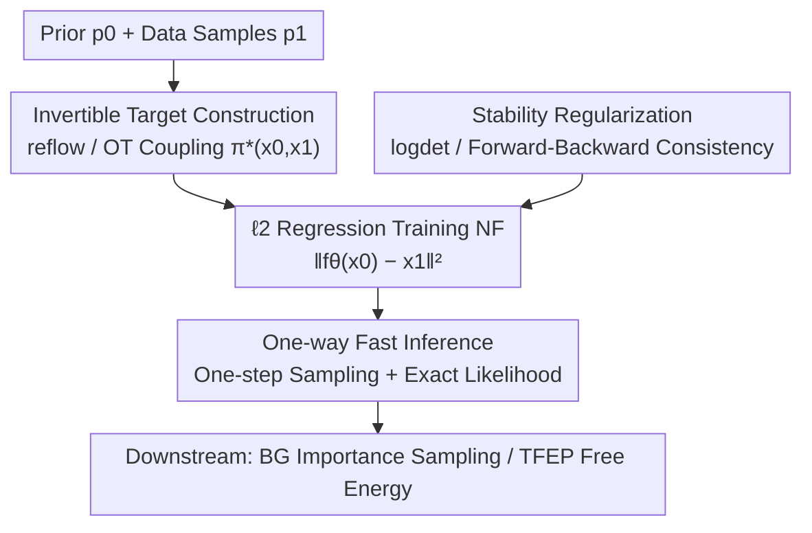

# Efficient Regression-based Training of Normalizing Flows for Boltzmann Generators

**Conference**: ICLR 2026  
**OpenReview**: [https://openreview.net/forum?id=ctdnzPxDI3](https://openreview.net/forum?id=ctdnzPxDI3)  
**Code**: https://github.com/danyalrehman/RegFlow  
**Area**: Scientific Computing / Molecular Sampling / Normalizing Flows / Boltzmann Generator  
**Keywords**: Normalizing Flows, Regression-based Training, Boltzmann Generator, Optimal Transport, reflow

## TL;DR
This paper proposes REGFLOW, which replaces the classic Maximum Likelihood Estimation (MLE) training typically used for Normalizing Flows (NF) with a simple $\ell_2$ regression objective. By allowing the NF to directly fit noise-data pairs from "known invertible mappings" provided by reflow (pre-trained CNF) or Optimal Transport, REGFLOW bypasses the numerical instability and Jacobian overhead of MLE. For molecular conformational equilibrium sampling, it maintains "one-step sampling + exact likelihood" while significantly outperforming the same NF architectures trained via MLE.

## Background & Motivation
**Background**: In molecular simulation, a Boltzmann Generator (BG) consists of a Normalizing Flow (providing a computable proposal distribution $p_\theta$) plus importance sampling correction, used to draw i.i.d. samples from a target Boltzmann distribution $p_{\text{target}}\propto e^{-E(x)/k_BT}$ and estimate physical quantities like free energy differences. A hard constraint for such applications is the need for fast and **exact likelihoods**: one must be able to compute $p_\theta(x)$ cheaply and precisely for the importance weights $w(x)=e^{-E(x)/k_BT}/p_\theta(x)$.

**Limitations of Prior Work**: Current generative models do not satisfy this constraint. Continuous Normalizing Flows (CNF) like Diffusion or Flow Matching provide high generation quality and exact likelihoods but have extremely high inference costs—calculating exact likelihood requires integrating the divergence of the velocity field (a second-order derivative), involving hundreds of model calls. Experiments show CNF likelihood calculation is ~450x more expensive than the slowest NF and ~7700x more than the fastest. Classic discrete NFs provide one-step exact likelihoods but must be trained via MLE, which is prone to numerical instability in expressive architectures. This forces a compromise between "optimization" and "expressivity," often resulting in underfitting. Furthermore, one-step image models like Shortcut or IMM are proven by the authors' checkerboard experiments to be **non-invertible**, making their likelihoods untrustworthy. Convergence in point values $f_\theta\to f^\star$ does not imply convergence in gradients $\nabla f_\theta\to\nabla f^\star$ (e.g., $f_m(x)=\tfrac1m\sin(mx)+x$ converges, but its derivative $\cos(mx)$ does not).

**Key Challenge**: The difficulty of MLE training for NFs stems from the need to simultaneously learn the forward mapping $f_\theta$ and inverse $f_\theta^{-1}$ without **pre-existing noise-data pairs** $\pi(x_0,x_1)$. The coupling $\pi$ evolves during training alongside the flow, making optimization difficult when the pairing is suboptimal. Conversely, Flow Matching is easy to train because it fixes a target coupling before regression.

**Goal / Key Insight**: Can the benefits of "regression-based training" from Flow Matching be transferred to classic NFs to gain "one-step exact likelihood"? The key observation is that **obtaining paired samples from any invertible mapping $f^\star$ is sufficient to train a generative model using a regression objective**.

**Core Idea**: Select an invertible solution $f^\star\in\mathcal F$ and a fixed coupling $\pi^\star(x_0,x_1)$ induced by it, then let the classic NF perform $\ell_2$ regression on these noise-target pairs, replacing MLE with regression.

## Method

### Overall Architecture
REGFLOW reformulates the task of "training a one-step invertible mapping with exact likelihood" from a difficult MLE optimization into a regression problem of **matching a known invertible function**. The pipeline consists of three stages: First, offline construction of noise-data pairs from an invertible mapping $f^\star$ (using reflow from a pre-trained CNF or Optimal Transport). Second, training a classic NF via $\ell_2$ regression to fit these pairs, supplemented by stability regularization. Finally, performing one-step inference from noise to data while computing the exact likelihood using the change-of-variables formula for downstream BG importance sampling or free energy prediction.

Theoretical support is provided by Proposition 1: As the regression loss $L(\theta)\to0$, then $\big((f^\star_t)^{-1}\circ f_{t,\theta}\big)(x)\to x$ (almost everywhere under $p_0$), meaning the learned flow behaves identically to $f^\star$ on the support of $p_0$. This demonstrates that the generation problem can be safely rewritten as a matching problem for a known invertible function.

### Key Designs

**1. Invertible Target Construction: Reflow and OT**

Regression training requires a **truly invertible** $f^\star$ to provide noise-target pairs $\pi^\star(x_0,x_1)$. If the pairs are non-invertible, the model suffers from untrustworthy likelihoods. Two constructions are provided. First, **reflow**: use a pre-trained CNF (velocity field $v^\star_t$) to integrate noise to data, $f^\star_{\text{reflow}}(x_0)=x_0+\int_0^1 v^\star_t(x_t)\,dt=x_1$, collecting pairs $(x_0,x_1)$ offline. Proposition 2 provides theoretical guarantees: the NF trained via reflow satisfies $W_2(p_1,p_\theta)\le K\exp\!\big(\int_0^1 L_t\,dt\big)+\epsilon$, where the first term is the approximation error of the pre-trained CNF and $\epsilon$ is the regression gap—clearly separating "teacher accuracy" from "student learning." Second, **Optimal Transport (OT)**: The OT map in continuous space is the gradient of a convex function and thus naturally invertible, $f^\star_{\text{ot}}=\arg\min_T\int T(x)\,c(x,T(x))\,dp_0(x)$ where $T_\#(p_0)=p_1$. It requires no training but is computationally intensive ($O(n^3)$ time); however, it remains viable as a one-time offline preprocessing step for manageable scales.

**2. ℓ2 Regression Objective: Fixed Coupling instead of MLE**

With a fixed coupling, the classic NF objective simplifies to its most basic form:

$$L(\theta)=\mathbb E_{x_0,x_1}\big[\|f_{1,\theta}(x_0)-f^\star_1(x_0)\|^2\big]+\lambda_r R=\mathbb E_{x_0,x_1}\big[\|\hat x_1-x_1\|^2\big]+\lambda_r R$$

This forces the NF to map noise $x_0$ to target $x_1$ in one step, aligning with the $\ell_2$ distance. This is the core benefit: it avoids the coupling problem in MLE (where the model learns the flow and pairing simultaneously) and removes the need to compute Jacobians during training iterates. Unlike flow matching, it regresses the **one-step endpoint target** $x_1=f^\star_1(x_0)$ rather than time-dependent velocity fields, allowing inference via a single forward pass without ODE integration.

**3. Stability Regularization: Logdet and Forward-Backward Consistency**

Pure regression can damage the numerical invertibility of NFs (similar to observations in MLE training). Two regularizations are used. First, **Logdet Regularization**:

$$\mathcal L_{\text{log-det}}=\|f_\theta(x_0)-x_1\|_2^2+\lambda_r\big(\log|\det(J_\theta(x))|\big)^2$$

This penalizes the log-determinant already calculated in the change-of-variables formula, resulting in **zero extra overhead** for the architectures used. Geometrically, it prevents the flow from collapsing mass into sharp peaks. Second, **Forward-Backward Consistency**:

$$\mathcal L_{\text{fwd-bwd}}=\|f_\theta(x_0)-x_1\|_2^2+\lambda_r\|f_\theta^{-1}(f_\theta(x_0))-x_0\|_2^2$$

This requires a forward then backward pass to reconstruct the original prior. It is a form of cycle-consistency that ensures invertibility at the output level. It doubles the cost but **requires no Jacobian calculations**, opening doors for more flexible, unconstrained architectures. In experiments, logdet is the default choice due to its efficiency.

**4. One-way Fast Inference: Aligning Training and Inference**

Classic MLE-trained NFs run data-to-noise during training and noise-to-data during generation. For Autoregressive Flows (like NSF), the forward $f(x)$ is much faster than the inverse $f^{-1}(x)$, making generation slow. REGFLOW performs **both training and inference from noise to data**, aligning the fast direction of autoregressive flows with the generation process. For NSF, this yields a ~34x speedup in likelihood computation.

### Loss & Training
The final loss is the regression term plus $\lambda_r R$. Algorithmically (Algorithm 1), for each step, a batch of pairs $(x_0,x_1)$ is sampled from the dataset. Targets are augmented with scaled noise $x_1\leftarrow x_1+\lambda_n\cdot\varepsilon,\ \varepsilon\sim\mathcal N(0,I)$, then the regularized $\ell_2$ loss is computed to update $\theta$. The optimal regularization strength is typically $10^{-6}\le\lambda_r\le10^{-5}$.

## Key Experimental Results

Evaluations were performed on three molecular systems—Alanine Dipeptide (ALDP), Tripeptide (AL3), and Tetrapeptide (AL4)—covering RealNVP (Res-NVP), Neural Spline Flows (NSF), and Jet. Metrics include Effective Sample Size (ESS ↑), 1-Wasserstein distance of energy distribution (E-W1 ↓), and 2-Wasserstein distance of principal dihedral angles (T-W2 ↓).

### Main Results
| System | Architecture | Metric | MLE | REGFLOW |
|------|------|------|-----|---------|
| ALDP | NSF | E-W1 ↓ | 13.797 | **0.501** |
| ALDP | NSF | T-W2 ↓ | 1.243 | **0.951** |
| ALDP | Res-NVP | E-W1 ↓ | >1e3 (failed) | **2.104** |
| AL3 | NSF | E-W1 ↓ | 17.596 | **0.853** |
| AL4 | NSF | E-W1 ↓ | 20.886 | **3.277** |

REGFLOW (reflow target) consistently outperforms MLE across all architectures. While ESS is slightly lower, the authors note this is because MLE often suffers from mode collapse (visible in Ramachandran plots), which artificially inflates ESS. REGFLOW shows better alignment with the true energy histograms. Crucially, architectures like Res-NVP and Jet that **failed to train under MLE** become usable with REGFLOW.

In terms of inference efficiency (ALDP, 200k points likelihood): NSF dropped from 277.0s to 8.18s (~**33.8x** speedup). Analytic inverse architectures like Res-NVP and Jet saw smaller gains. CNF (DiT) took 26969.8s, ~7700x more expensive than the fastest NF. In total training time, REGFLOW saved ~27% on E-W1 and ~35% on T-W2 (including CNF training/OT computation costs).

### Ablation Study
| Config (ALDP, NSF) | E-W1 ↓ | T-W2 ↓ | Note |
|------|--------|--------|------|
| MLE | 13.797 | 1.243 | Baseline |
| REGFLOW w/o reg | 0.604 | 1.083 | Already far exceeds MLE |
| REGFLOW w/ logdet | 0.519 | 0.958 | Zero overhead, best value |
| REGFLOW w/ fwd-bwd | 0.501 | 0.951 | Slightly better, ~2x cost |
| REGFLOW @ 10.4M CNF | 0.501 | 0.951 | Performance scales with reflow samples |

### Key Findings
- **Sample size is the main lever**: Increasing reflow pairs from 100k to 10.4M reduced E-W1 from 17.39 to 0.501, showing that performance improves monotonically with more pairings—a distinct advantage over OT.
- **Lightweight regularization is sufficient**: All three regularizations outperformed MLE. Logdet is the default as it reuses existing calculations.
- **New application: Energy-free TFEP**: Since REGFLOW only needs samples from two metastable states (A, B) and an OT target, it can train **without calling the energy function**. In ALDP, free energy difference predictions approached true MD results, while the DiT CNF was nearly three orders of magnitude slower.

## Highlights & Insights
- **Core Perspective**: MLE is difficult because it tries to learn the flow and pairing simultaneously. By fixing the target coupling, the task reduces to simple $\ell_2$ regression.
- **Combining "One-step" and "Exact Likelihood"**: While image models prioritize quality, scientific applications need exact likelihoods. REGFLOW uses strictly invertible NFs to ensure likelihood validity where shortcut models fail.
- **Zero-overhead Regularization**: Logdet regularization penalizes a value already computed for the likelihood, providing stability essentially "for free."
- **Theoretical Decomposability**: Proposition 2 decomposes $W_2$ error into CNF teacher error and NF student learning gap, guiding resource allocation.

## Limitations & Future Work
- The upper bound of REGFLOW is constrained by the **proposal distribution quality**; it cannot exceed the accuracy of the pre-trained CNF teacher.
- Reflow requires an auxiliary CNF and large-scale sampling (10.4M pairs in experiments), while OT is limited by $O(n^3)$ complexity.
- Experiments focused on short peptides and Cartesian coordinates; larger proteins or explicit solvents have not yet been verified.
- The forward-backward regularization's ability to bypass Jacobians suggests potential for exploring more flexible, non-traditional invertible architectures.

## Related Work & Insights
- **vs. Classic MLE NF**: Both provide exact likelihoods, but REGFLOW bypasses Jacobian calculations during training and uses a fixed coupling, making it more stable and faster.
- **vs. Flow Matching / CNF**: Both use fixed couplings for regression, but Flow Matching regresses time-dependent velocity fields requiring ODE integration. REGFLOW regresses endpoint targets for one-step inference.
- **vs. Shortcut / IMM**: These are non-invertible, rendering their likelihoods unreliable. REGFLOW ensures strictly invertible architectures.

## Rating
- Novelty: ⭐⭐⭐⭐⭐ Clear reformulation of NF training as regression with theoretical backing.
- Experimental Thoroughness: ⭐⭐⭐⭐ Extensive architectures and peptides, though limited to small systems.
- Writing Quality: ⭐⭐⭐⭐⭐ Excellent motivation and intuitive explanations of why previous approaches fail.
- Value: ⭐⭐⭐⭐⭐ Restores the utility of classic NFs for Boltzmann Generators with significant speedups.
<!-- RELATED:END -->

## Related Papers

- [\[ICLR 2026\] Learning Boltzmann Generators via Constrained Mass Transport](learning_boltzmann_generators_via_constrained_mass_transport.md)
- [\[ICLR 2026\] GenSR: Symbolic Regression based on Equation Generative Space](gensr_symbolic_regression_based_on_equation_generative_space.md)
- [\[NeurIPS 2025\] From Images to Physics: Probabilistic Inference of Galaxy Parameters and Emission Lines via VAE & Normalizing Flows](../../NeurIPS2025/physics/from_images_to_physics_probabilistic_inference_of_galaxy_parameters_and_emission.md)
- [\[ICLR 2026\] Deep Learning for Subspace Regression](deep_learning_for_subspace_regression.md)
- [\[ICLR 2026\] MatRIS: Toward Reliable and Efficient Pretrained Machine Learning Interatomic Potentials](matris_toward_reliable_and_efficient_pretrained_machine_learning_interatomic_pot.md)

<!-- RELATED:END -->

<!-- RELATED:START -->

## Related Papers

- [\[ICLR 2026\] Learning Boltzmann Generators via Constrained Mass Transport](learning_boltzmann_generators_via_constrained_mass_transport.md)
- [\[ICLR 2026\] AQER: A Scalable and Efficient Data Loader for Digital Quantum Computers](aqer_a_scalable_and_efficient_data_loader_for_digital_quantum_computers.md)
- [\[ICLR 2026\] DGNet: Discrete Green Networks for Data-Efficient Learning of Spatiotemporal PDEs](dgnet_discrete_green_networks_for_data-efficient_learning_of_spatiotemporal_pdes.md)
- [\[ICLR 2026\] Overtone: Cyclic Patch Modulation for Clean, Efficient, and Flexible Physics Emulators](overtone_cyclic_patch_modulation_for_clean_efficient_and_flexible_physics_emulat.md)
- [\[ICLR 2026\] Fast training of accurate physics-informed neural networks without gradient descent](fast_training_of_accurate_physics-informed_neural_networks_without_gradient_desc.md)

<!-- RELATED:END -->
