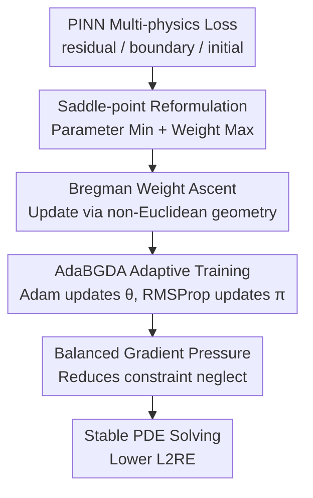

# Enhancing Stability of Physics-Informed Neural Network Training Through Saddle-Point Reformulation

**Conference**: ICLR 2026  
**OpenReview**: [https://openreview.net/forum?id=EQNp3sFrY3](https://openreview.net/forum?id=EQNp3sFrY3)  
**Code**: https://anonymous.4open.science/r/pinns-bgda-00D6  
**Area**: PINN Training / Scientific ML  
**Keywords**: Physics-Informed Neural Networks, Saddle-Point Optimization, Loss Reweighting, Bregman Divergence, Scientific Machine Learning  

## TL;DR

This paper reformulates the multi-objective loss reweighting of residual and boundary terms in PINN training as a non-Euclidean non-convex strongly-concave saddle-point problem. By utilizing AdaBGDA to dynamically update network parameters and loss weights, the approach significantly improves training stability and $L_2$ relative error across 22 PDE benchmarks in PINNacle and 3D Navier-Stokes challenge experiments.

## Background & Motivation

**Background**: The fundamental idea of Physics-Informed Neural Networks (PINNs) is to approximate the solution of a PDE using a neural network $u(\theta)$, incorporating equation residuals, boundary conditions, and initial conditions into the training loss. Compared to traditional numerical methods like finite difference, finite element, or finite volume, PINNs are attractive because they provide approximate solutions rapidly during the inference phase, making them particularly suitable for scientific computing scenarios requiring repeated queries, fast interpolation, or integration with learning systems.

**Limitations of Prior Work**: PINN training is inherently unstable. Standard practice usually involves minimizing a weighted sum of all physical constraint terms, such as the total sum of interior PDE residual loss and boundary loss. However, a decrease in total loss does not guarantee that every term is solved equally. In practice, the gradient norms of different loss terms can differ by several orders of magnitude, causing the optimizer to be dominated by terms with large gradients. This leads to models that may only fit boundaries while ignoring interior equations, or vice versa.

**Key Challenge**: PINN training requires maintaining "fair" optimization pressure across multiple physical constraints rather than fixing a set of weights in advance. Existing methods like LRA, NTK, RAR, MultiAdam, and augmented Lagrangian attempt to adjust loss weights or sampling strategies. However, the loss landscapes vary significantly across different PDEs; a method suitable for the Poisson equation may fail when applied to Heat, Wave, or Navier-Stokes equations. Consequently, optimizer selection itself becomes a problem-specific tuning burden.

**Goal**: The authors aim to solve two issues through a unified training reformulation: first, automatically elevating undervalued physical constraint terms to ensure all residual/boundary objectives receive sufficient updates; second, providing a clear optimization interpretation and convergence guarantees for this dynamic reweighting, rather than relying solely on empirical rules.

**Key Insight**: The paper observes that the weights of PINN loss terms naturally reside within a constrained set, most typically the unit simplex: each weight is non-negative, and their sum equals 1. Such a space is ill-suited for simple Euclidean gradient steps, as the relative change in weights is more important than the absolute change. Thus, the authors treat network parameters $\theta$ as minimization variables and loss weights $\pi$ as maximization variables, using Bregman divergence (primarily corresponding to KL geometry in experiments) to describe the weight space.

**Core Idea**: Replace fixed-weighted ERM with a non-Euclidean saddle-point optimization involving "parameter descent + weight ascent," enabling the training process to automatically focus on the physical constraints that are currently most difficult to satisfy or most easily ignored.

## Method

### Overall Architecture

Rather than proposing a new PDE discretization format or a larger PINN architecture, this paper reformulates the PINN training objective. Traditional PINNs minimize $\sum_m L_m(\theta)$ or manually weighted $\sum_m \pi_m L_m(\theta)$; Ours updates $\theta$ and $\pi$ simultaneously during training, letting model parameters reduce weighted physical errors while weight variables identify constraints that are currently harder to satisfy.

Formally, the authors denote the $M$ loss components (residuals and boundary terms) as $L_m(\theta)$ and solve the following saddle-point objective:

$$
\min_{\theta \in \mathbb{R}^d}\max_{\pi \in S}
L(\theta, \pi)
= \sum_{m=1}^{M}\pi_m L_m(\theta) - \lambda D_\psi(\pi\|\hat{\pi}).
$$

Here, $S$ is typically the unit simplex, $\hat{\pi}$ is a reference distribution (usually uniform), $D_\psi$ is the Bregman divergence, and $\lambda$ controls how far weights can deviate from the uniform distribution. Intuitively, if a PDE residual or boundary condition has not yet been suppressed, its corresponding loss term receives a larger weight in the maximization step; if weights become too concentrated, the Bregman regularization pulls them back to a reasonable range.

### Key Designs

**1. Saddle-point Reformulation: Turning Loss Balancing into Training Variables**

The instability of PINNs stems from the competition between multiple physical constraint terms: each $L_m(\theta)$ represents an equation or boundary condition that must be satisfied, but an ordinary weighted sum only provides a global direction. When one term has a massive gradient, the optimizer prioritizes it; when another has a small gradient but remains important, it may be ignored long-term. The first step in this work is to transform weights $\pi$ from manual hyperparameters into adversarial variables, making the training objective $\min_\theta \max_\pi L(\theta,\pi)$.

This maximization does not aim to make training harder but rather to bring undervalued loss terms back into the optimization field of view. If a constraint currently has a large error, $\nabla_\pi L$ will push its weight up; subsequently, the $\theta$ descent step will optimize this term more aggressively. Thus, the training process no longer relies on problem-specific empirical choices (e.g., "LRA for Poisson, NTK for Wave"), but adaptively adjusts weights in every iteration based on the status of each physical constraint.

**2. Bregman Weight Ascent: Avoiding Weight Update Distortion via Simplex Geometry**

Weights $\pi$ are typically located on a simplex (non-negative, sum to 1). If Euclidean ascent or standard projection is used, updates easily ignore the fact of "relative proportions": an absolute change from $0.01$ to $0.02$ is similar to one from $0.40$ to $0.41$, but their optimization meanings are entirely different. Therefore, the authors use Bregman proximal mapping to update weights:

$$
\pi_{t+1}=\arg\min_{\pi\in S}
\left\{-\gamma_\pi\langle \nabla_\pi L(\theta_t,\pi_t),\pi\rangle + D_\psi(\pi,\pi_t)\right\}.
$$

When $D_\psi$ is the KL divergence, this step yields a closed-form update similar to softmax. Its benefits are twofold: first, weights always remain within the valid simplex; second, the update respects the geometry of probability distributions, making it particularly suitable for expressing the relative redistribution among multiple loss terms. The paper also adds $-\lambda D_\psi(\pi\|\hat{\pi})$ to prevent the maximization step from pushing all weight onto a single loss term, maintaining a stable balance between "focusing on difficult terms" and "avoiding over-specialization."

**3. Non-convex Strongly-concave Theory: Explanatory Training Dynamics**

The loss landscape for neural network parameters $\theta$ remains non-convex; the authors do not attempt to frame PINN training as convex optimization. The key is that, given $\theta$, the objective with respect to $\pi$ becomes $\lambda$-strongly concave due to Bregman regularization. Therefore, each $\theta$ has a unique optimal weight response $\pi^*(\theta)$. The paper analyzes the problem as a nonconvex-strongly concave saddle-point problem.

Theoretically, the authors define $\Phi(\theta)=L(\theta,\pi^*(\theta))$ and use $\|\nabla\Phi(\theta)\|\le \epsilon$ to denote convergence to an approximate stationary point in the saddle-point sense. A core lemma proves that the Bregman distance from the current weight $\pi_t$ to the optimal response $\pi^*(\theta_t)$ contracts with iterations, provided the parameter step size is small enough and the weight step size is chosen appropriately. The final iteration complexity for BGDA to reach an $\epsilon$-stationary point is:

$$
O\left(\frac{\kappa^4L\Delta + \kappa^2L^2D_\psi(\pi^*(\theta_0),\pi_0)}{\epsilon^2}\right),
$$

where $\kappa=L/\lambda$. This conclusion serves not to provide a perfectly tight bound for actual deep network training but to demonstrate that the reformulation is not a pure heuristic: the weight ascent step does not pursue noise indefinitely but follows the optimal weight response under non-Euclidean geometry.

**4. AdaBGDA Implementation: Adam for Parameters, RMSProp for Weights**

The theoretical algorithm BGDA is simple: gradient descent for $\theta$ and Bregman ascent for $\pi$. However, given the complex loss landscapes of deep networks, the practical version AdaBGDA introduces adaptive statistics. The authors use Adam-style first and second moments to smooth $\nabla_\theta L$ because the non-convex landscape of $\theta$ requires stable directions. For weights, they use RMSProp-style second-order scaling to handle $\nabla_\pi L$, as the $\pi$ side is already constrained by a strongly concave structure, making it more appropriate to update directly along the current gradient.

This combination is intentional. In Poisson 2d-C experiments, the authors compared three adaptive combinations: Adam+RMSProp, Adam+Adam, and RMSProp+RMSProp. Adam+RMSProp achieved an L2RE of $8.15\times10^{-3}$, significantly outperforming Adam+Adam ($4.45\times10^{-2}$) and RMSProp+RMSProp ($6.02\times10^{-1}$). This indicates that the practical version of AdaBGDA correctly distinguishes between the "complex non-convexity of parameters" and the "strongly concave simplex of weights."

### Mechanism Example

Consider the training of Poisson 2d-C as a tension between two primary constraints: the interior PDE residual $L_r(\theta)$ and the boundary condition $L_b(\theta)$. When using standard NTK reweighting, the paper observes that the gradient norm ratio $\chi=\|\nabla L_r(\theta)\|/\|\nabla L_b(\theta)\|$ reaches a massive scale early on, averaging approximately $2487$ in the first $10,000$ epochs. This means training updates are almost entirely dominated by the interior term, preventing the boundary term from being optimized fairly.

With AdaBGDA, the same ratio averages approximately $7$, $25$, and $45$ across three training stages. Training does not force all gradients to be exactly equal but prevents one type of physical constraint from overwhelming the others long-term. The weight variable $\pi$ shifts attention to undervalued terms, and the parameter variable $\theta$ then updates based on the new weighted loss. Ultimately, in the Poisson 2d-C error heatmap, NTK models show regions of high error in the interior, while AdaBGDA produces a more uniform error distribution—a visual confirmation of the weight maximization step in action.

### Loss & Training

The basic PINN loss in this paper still consists of PDE residual terms and boundary/initial condition terms, but the training objective changes from a static sum to a dynamic saddle-point form. For each equation residual term, the loss is the mean squared residual over sampled points:

$$
L_{r,i}(\theta)=\frac{1}{N_r}\sum_{n=1}^{N_r}\left(R_i[u(\theta)](x_r^n)-f_i(x_r^n)\right)^2.
$$

Boundary terms follow similarly:

$$
L_{b,j}(\theta)=\frac{1}{N_b}\sum_{n=1}^{N_b}\left(B_j[u(\theta)](x_b^n)-g_j(x_b^n)\right)^2.
$$

In training, vanilla PINN experiments use a 5-layer network with a hidden size of 100 per layer. The primary initial hyperparameters for AdaBGDA are $\gamma_\pi^0=0.1$, $\gamma_\theta^0=0.008$, $\alpha_1^0=0.9$, $\alpha_2^0=0.999$, $\beta^0=0.999$, and $\lambda=0.01$, with $\gamma_\theta$ linearly decayed to $0.0004$. In the 3D Navier-Stokes DoMINO challenge, the authors used $\gamma_\theta^0=0.002$ and $\lambda=0.1$, training for 500 epochs with $\gamma_\theta$ linearly decayed to approximately $0.001$.

## Key Experimental Results

### Main Results

The paper evaluates AdaBGDA against Adam, LBFGS, LRA, NTK, RAR, and MultiAdam across 22 PDE benchmarks in PINNacle, using the mean $L_2$ relative error (L2RE) over 3 runs. Overall, AdaBGDA achieves the best results on $77.3\%$ of the PDEs, while the second-best method dominates only $27.3\%$.

| PDE Category | Representative Task | Prev. SOTA L2RE | Ours L2RE | Main Conclusion |
|----------|----------|---------------|--------------|----------|
| Poisson | 2d-C | $1.14\times10^{-2}$ | $8.15\times10^{-3}$ | Continues to reduce error where NTK is already strong |
| Heat | 2d-MS | $1.74\times10^{-2}$ | $1.40\times10^{-2}$ | Slightly outperforms LBFGS on multi-scale heat equations |
| Navier-Stokes | 2d-C | $4.67\times10^{-2}$ | $2.35\times10^{-2}$ | Error nearly halved, showing benefit for fluid equations |
| Wave | 1d-C | $9.20\times10^{-2}$ | $1.63\times10^{-2}$ | Most significant gain, far outperforming NTK |
| High dim | PNd | $4.69\times10^{-4}$ | $1.31\times10^{-4}$ | Improved stability on high-dimensional problems |

Full data illustrates that AdaBGDA is not the winner for every PDE. For tasks like Burgers 2d-C, Heat 2d-VC, and Heat 2d-LT, it is either not optimal or total error remains high. The authors explain that in some difficult tasks, the vanilla PINN architecture lacks expressivity; the optimizer can mitigate training bias but cannot compensate for fundamental limitations in model capacity or representation.

### Ablation Study

Ablation focuses on three categories: adaptive combinations, gradient conflict, and computational overhead. Adaptive combination tests verify the necessity of Adam for parameters and RMSProp for weights. Gradient conflict experiments explain why AdaBGDA is more stable. Computational overhead tests show that extra weight updates do not turn the method into a heavy second-order optimizer.

| Setup | Key Metric | Result | Explanation |
|----------|----------|------|------|
| Adam+RMSProp | Poisson 2d-C L2RE | $8.15\times10^{-3}$ | Best combo: param-side smoothing, weight-side gradient adjustment |
| Adam+Adam | Poisson 2d-C L2RE | $4.45\times10^{-2}$ | Performance degrades with Adam on weight side |
| RMSProp+RMSProp | Poisson 2d-C L2RE | $6.02\times10^{-1}$ | Training fails without Adam's momentum on parameters |
| NTK Gradient Ratio $\chi$ | $I_1/I_2/I_3$ Mean | $2487/2342/1998$ | Severe imbalance between residual and boundary gradients |
| AdaBGDA Ratio $\chi$ | $I_1/I_2/I_3$ Mean | $7/25/45$ | Imbalance significantly mitigated; fairer training |
| Burgers 1d-C Time | Per 1000 iter | $7.64$s | Slightly lower than Adam ($8.24$s), much lower than NTK/LRA/LBFGS |
| Burgers 1d-C Memory | Optimizer states | $0.37$GB | Higher than Adam ($0.23$GB), but much lower than SSBroyden/NNCG |

Scalability was also tested: on the DrivAerML single-car geometry, using a 38M parameter DoMINO model for 3D incompressible Navier-Stokes. AdaBGDA outperformed Adam and LBFGS significantly in x/y/z velocity and volume pressure; surface pressure was comparable to Adam. This indicates that saddle-point reweighting is effective not just for small MLP PINNs but also for larger scientific ML models.

| 3D Navier-Stokes Metric | Adam L2RE | LBFGS L2RE | Ours L2RE | Observation |
|-----------------------|-----------|------------|--------------|------|
| x-velocity | $3.39\times10^{-1}$ | $3.62\times10^{-1}$ | $2.78\times10^{-1}$ | Ours is optimal |
| y-velocity | $8.60\times10^{-1}$ | $9.56\times10^{-1}$ | $5.99\times10^{-1}$ | Significant gain |
| z-velocity | $7.16\times10^{-1}$ | $8.23\times10^{-1}$ | $5.34\times10^{-1}$ | Significant gain |
| volume pressure | $4.55\times10^{-1}$ | $4.88\times10^{-1}$ | $2.89\times10^{-1}$ | Pressure field benefits |
| surface pressure | $2.71\times10^{-1}$ | $3.42\times10^{-1}$ | $2.69\times10^{-1}$ | Parity with Adam, slightly better |

### Key Findings

- The main benefit of AdaBGDA comes from more stable training dynamics rather than architectural complexity; it ensures balanced optimization pressure across multiple PDE constraints within the same vanilla PINN architecture.
- Gradient conflict analysis is the most persuasive experimental evidence: while NTK refers to $\chi$ ratios in the thousands, AdaBGDA reduces them to dozens, directly addressing a core failure mode of PINN training.
- Computational overhead is well-controlled. Because the KL-Bregman ascent step on the simplex often has a closed-form solution and the number of weights is small (usually several to a dozen), the additional optimizer states are negligible compared to network parameters.
- The method is not a panacea. For long-term, multi-scale, or complex dynamical systems that are difficult for vanilla PINNs to express, AdaBGDA may still yield high errors; it addresses training fairness, not all PDE representation challenges.

## Highlights & Insights

- The paper explains PINN loss balancing as a natural minimax problem rather than an empirical formula for weight updates. This is crucial because PINN loss terms are constituent constraints of a single physical solution, not loosely coupled tasks in multi-task learning.
- Non-Euclidean geometry is applied aptly. Weights on a simplex are effectively a distribution; KL/Bregman updates align better with the intuition of "relative weight adjustment" than Euclidean projections, explaining why it is more stable than Euclidean saddle-point versions like dual-dimer.
- Experiments go beyond benchmark tables, using gradient ratios and error heatmaps to explain performance sources. For the PINN community, this is more valuable than just listing L2RE across 22 PDEs as it directly corresponds to the known "gradient pathology."
- AdaBGDA has low engineering costs. It does not require computing full NTK Jacobians, second-order approximations, or complex inner-outer loops; if loss components are already logged separately, adding a weight variable and Bregman update is straightforward.

## Limitations & Future Work

- Theoretical analysis assumes smoothness and strong concavity, which only hold approximately in real deep networks. While empirical curves follow theoretical trends, they do not strictly cover all non-smooth and automatic differentiation issues in practical PINNs.
- Experiments on weight sets and Bregman divergence are centered on simplex/KL geometry. How to select $S$ and $D_\psi$ for more complex hierarchical constraints or scenarios requiring minimum weights remains for further study.
- AdaBGDA mitigates loss term imbalance but does not solve issues like insufficient sampling coverage, PDE stiffness, long-term integration errors, or architectural incapacity.
- The challenge test was fixed on one DrivAerML vehicle geometry. Proving general utility in engineering CFD requires tests across more geometries, boundary conditions, and Reynolds numbers.
- Future work could combine AdaBGDA with residual-based adaptive refinement, domain decomposition, or operator learning architectures, allowing "where to sample" and "which constraint to prioritize" to adapt simultaneously.

## Related Work & Insights

- **vs LRA / NTK weighting**: LRA and NTK adjust weights based on gradient statistics or kernel info but are empirical mechanisms. This work incorporates reweighting into a saddle-point objective with Bregman geometry, yielding a more stable and cheaper solution, though it still requires tuning $\lambda$ and $\gamma_\pi$.
- **vs RAR**: RAR changes point distribution ("where to sample"), whereas AdaBGDA adjusts constraint importance ("which term to value"). They are complementary and could be combined to adapt over both space/time and constraint weights.
- **vs AL-PINN**: AL-PINN treats boundaries as constraints in a saddle-point formulation. Ours maximizes weights across all loss terms on a simplex and emphasizes non-Euclidean updates; AdaBGDA outperforms AL-PINN in most PINNacle tasks.
- **vs dual-dimer**: dual-dimer uses minimax in Euclidean space. The comparison suggests that the geometry of the weight space is not a minor detail; when $\pi$ is a distribution, KL/Bregman updates prevent sparse or distorted weight jumps.
- **Inspiration for Scientific ML**: Conflicts between loss terms are common in multi-physics and multi-task PDE learning. Treating loss balancing as a structured optimization problem, rather than manual tuning, is a more transferable path for the field.

## Rating

- Novelty: ⭐⭐⭐⭐☆ Reframing loss balancing as a non-Euclidean nonconvex-strongly concave SPP is elegant and matches simplex geometry, though the general direction of adaptive weighting/minimax exists in previous work.
- Experimental Thoroughness: ⭐⭐⭐⭐⭐ Comprehensive coverage of 22 PINNacle PDEs, multiple baselines, gradient conflicts, overhead, and 3D Navier-Stokes test cases provide a complete evidence chain.
- Writing Quality: ⭐⭐⭐⭐☆ Logical flow from motivation and theory to experiments is smooth. The theoretical appendix is long; more implementation details for AdaBGDA in the main body would improve reproducibility.
- Value: ⭐⭐⭐⭐⭐ Provides a low-overhead, interpretable, and scalable optimization solution for the persistent problem of PINN training instability. Highly suitable as a general loss balancing baseline for Scientific ML libraries.

<!-- RELATED:START -->

## Related Papers

- [\[ICLR 2026\] Fast training of accurate physics-informed neural networks without gradient descent](fast_training_of_accurate_physics-informed_neural_networks_without_gradient_desc.md)
- [\[ICLR 2026\] Iterative Training of Physics-Informed Neural Networks with Fourier-enhanced Features](iterative_training_of_physics-informed_neural_networks_with_fourier-enhanced_fea.md)
- [\[NeurIPS 2025\] Score-informed Neural Operator for Enhancing Ordering-based Causal Discovery](../../NeurIPS2025/physics/score-informed_neural_operator_for_enhancing_ordering-based_causal_discovery.md)
- [\[ICLR 2026\] A Function-Centric Graph Neural Network Approach for Predicting Electron Densities](a_function-centric_graph_neural_network_approach_for_predicting_electron_densiti.md)
- [\[ICLR 2026\] Feedback-driven Recurrent Quantum Neural Network Universality](feedback-driven_recurrent_quantum_neural_network_universality.md)

<!-- RELATED:END -->
