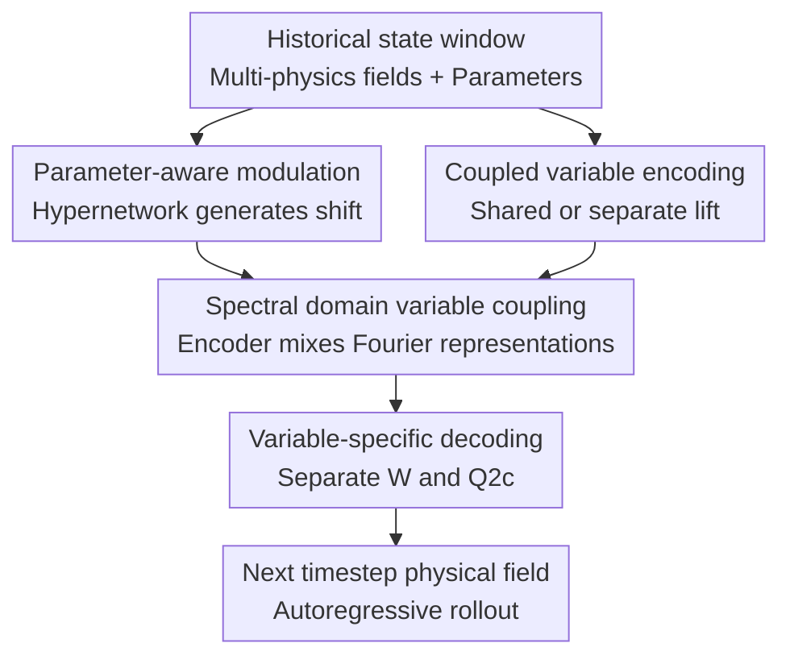

# Extending Fourier Neural Operators for Modeling Parameterized and Coupled PDEs

**Conference**: ICLR2026  
**OpenReview**: [https://openreview.net/forum?id=rtUT5Wic10](https://openreview.net/forum?id=rtUT5Wic10)  
**Code**: None  
**Area**: Physical Sciences / Neural Operators / Parameterized PDEs  
**Keywords**: Fourier Neural Operator, Parameterized PDE, Coupled Systems, Spectral Domain Coupling, Plasma Simulation  

## TL;DR

This paper introduces two restrained structural extensions to the Fourier Neural Operator (FNO): a lightweight hypernetwork to inject physical parameters into each layer's hidden representation, and a Fourier-domain encoder-decoder to mix multiple physical fields. These modifications significantly reduce errors in parameterized and coupled PDE predictions while largely preserving the model scale and training efficiency of the original FNO.

## Background & Motivation

**Background**: Neural Operators have become a mainstream approach for PDE surrogate modeling. They learn mappings from function spaces to function spaces rather than mappings between fixed-dimensional samples and labels. This makes them ideal replacements for expensive numerical solvers in scenarios like parameter sweeps, real-time prediction, engineering design, and uncertainty analysis. The Fourier Neural Operator (FNO) is particularly common as it captures long-range interactions via spectral convolutions in the Fourier domain, balancing accuracy and efficiency for many time-dependent PDEs.

**Limitations of Prior Work**: Many neural operator studies assume varying initial conditions, boundary conditions, or physical parameters, allowing the model to "guess" system state differences from an input trajectory window. However, a common and more difficult engineering scenario involves fixed initial conditions where the dynamics are driven by changes in physical parameters such as material properties, reaction rates, driving voltages, or diffusion coefficients. If only a few past frames are fed into a standard FNO, the model may implicitly infer parameters given a long enough window; however, if the available history is short, parameter information becomes sparse, and non-parameterized FNOs degenerate.

**Key Challenge**: Parameterized PDEs require the model to explicitly perceive physical parameters, while coupled PDEs require interactions between different physical quantities. Directly generating a full set of FNO weights for each parameter or maintaining complex branches for each physical quantity would rapidly increase parameter counts, training overhead, and implementation complexity. The core tension is how to allow the model to perceive "the current set of physical parameters" and "how multiple physical fields interact" without sacrificing FNO's simplicity.

**Goal**: The authors decompose the goal into two questions. First, given physical parameters $\mu$, how should the internal states of the FNO be conditioned, rather than just concatenating parameters at the input? Second, for coupled variables (e.g., electron density/potential, chemical concentrations, temperature/composition), where should the FNO exchange cross-variable information to capture coupling without significantly increasing structural weight?

**Key Insight**: The authors choose to start from the three core components of FNO: the lift operator $P$, the Fourier layers, and the projection operator $Q$. This pragmatic starting point examines whether input projection, spectral updates, and output projection should be shared, separated, or mixed. For parameterization, they adopt a hypernetwork/modulation approach, where a small network generates intra-layer shifts rather than full weight matrices.

**Core Idea**: Replace "simple parameter concatenation or multi-branch stacking" with "intra-layer parameter modulation + Fourier-domain variable coupling." This places parameter dependency and cross-quantity interactions at the most expressive yet parameter-efficient positions within the FNO.

## Method

### Overall Architecture

The proposed model family, termed extended FNOs (FNOx), consists of two extension lines layered onto standard FNO. The parameterization line feeds physical parameters $\mu$ into a lightweight hypernetwork to obtain a shift $s_\ell(x, \mu)$ for each Fourier layer, added as a parameter-dependent bias during hidden representation updates. The coupling line takes multiple variables, performs separate Fourier transforms, mixes them in the spectral domain using an encoder-decoder, and then decomposes them back into spectral coefficients for each variable. The combination is called pFNOx when using input concatenation and hpFNOx when using hypernetwork shift modulation.

A standard FNO layer is typically written as $v_{\ell+1}(x)=\sigma(Wv_\ell(x)+(K(a;\phi)v_\ell)(x))$. The hpFNO in this work adds a parameter-dependent term to this update: $v_{\ell+1}(x)=\sigma(Wv_\ell(x)+(K(a;\phi)v_\ell)(x)+s_\ell(x,\mu))$. For coupled variables, FNOx aggregates spectral representations of multiple variables in Fourier space rather than repeatedly exchanging hidden states in the spatial domain, then redistributes them through shared spectral convolutions and a decoder.

In the experimental configuration, the default FNOx combination derived from ablation includes: a shared lift operator, variable-separated point-wise linear maps, coupled global spectral convolution, and variable-separated bases and coefficients at the projection end, with layer norm applied to activations before projection. This is denoted as $P1+L2+\mathcal{G}+Q2c$. Implementation details specify that all FNO baselines are fixed with 4 Fourier layers, modes $k=12$, and width $d_v=20$, ensuring performance differences stem from structural design rather than capacity.

### Key Designs

**1. Parameter-aware modulation: Letting physical parameters influence each layer's dynamics without generating full FNO weights**

The most direct parameterization method is pFNO, which concatenates $\mu$ as an extra channel to the input: $[a(x);\mu(x)]$. While simple and effective for some tasks, parameters only enter the network at the lift stage, making subsequent layers dependent on the hidden representation's ability to retain that information. For systems with fixed initial conditions where dynamics are parameter-driven, this one-time injection is often insufficient.

hpFNO uses conditional modulation: a lightweight hypernetwork receives $(x, \mu)$ and historical window information to output layer-related shifts $s_\ell(x, \mu)$, used as additive biases in each Fourier layer. Core FNO weights remain shared, allowing the model to learn a "base physics operator" across parameters, while small intra-layer perturbations account for parameter-specific evolution. Unlike HyperFNO, which generates large subsets of weights (lift/projection, spectral kernels), this method only modulates activations, offering better parameter efficiency and training stability.

**2. Spectral domain variable coupling: Performing cross-quantity interactions in Fourier space**

Key to coupled PDEs is information exchange at long-term, global scales rather than simple concatenation. For two variables $\alpha, \beta$, FNOx first obtains $\tilde v^\alpha(k)=\mathcal{F}v^\alpha_\ell(k)$ and $\tilde v^\beta(k)=\mathcal{F}v^\beta_\ell(k)$, then uses a shallow encoder $f_{enc}(\tilde v^\alpha(k),\tilde v^\beta(k))$ to aggregate them into a coupled spectral representation. After updates via a mode-wise kernel $R_\phi(k)$, a decoder $f_{dec}$ splits the representation back for each variable before the inverse Fourier transform.

This choice is critical. Frequent hidden state exchange in the spatial domain increases model weight and leads to specialized branches; simple input concatenation might treat cross-field interactions as standard multi-channel features, lacking explicit inductive bias for physical coupling. Since Fourier domains naturally carry long-range correlations, and many global PDE patterns are more easily expressed in spectral space, the authors place the variable mixing before and after spectral convolution.

**3. Variable-specific decoding: Shared encoding for compactness, separate local evolution and output bases for physical differences**

FNOx does not separate or share all components. After systematically comparing shared/separate options for lift $P$, point-wise map $W$, and projection $Q$, the authors identified an economical combination: shared lift $P1$, variable-separated point-wise linear map $L2$, and projection $Q2c$ (where both basis functions $\Psi$ and coefficients $\Xi$ are variable-separated).

The rationale is that shared input projection reduces parameters and maps physical quantities into a unified latent space. However, in the local linear transform of Fourier layers and the output projection, different variables may have distinct evolution laws and physical scales, requiring variable-specific channels. Using an adaptive basis perspective for $Q$, where $Qv_T(x)=W_2\sigma(W_1v_T(x)+b_1)+b_2$, they treat $\Psi(a(x))=\sigma(W_1v_T(x)+b_1)$ as adaptive bases and $\Xi=W_2$ as coefficients. $Q2c$ allows both to be separate, preserving independent output representation for each field.

**4. New CCP benchmark: Testing parameterized neural operators with plasma dynamics under fixed initial conditions**

The paper validates its approach on a 1D capacitively coupled plasma (CCP) benchmark. This system describes low-temperature plasma driven by alternating voltage. Target variables include electron density $n_e(x,t)$ and potential $\phi(x,t)$, governed by electron continuity and Poisson equations. The authors fix the geometry and initial conditions while varying physical parameters like reaction coefficient $R_0$, driving voltage $V_0$, and ion mass $m_i$, forcing the model to learn how parameters change dynamics rather than relying on initial state variance.

This benchmark is crucial as it combines "parameterization" and "coupling" in an engineering-relevant problem. Data is generated using a finite difference solver with 128 cells, 100,000 steps per cycle, and sampling every 1,000 steps to obtain 100 temporal indices. 100 trajectories are sampled per parameter scenario, with a 9:1 random split for training/testing.

### Loss & Training

All models are trained as one-step time-stepping operators: given a window of $T_{in}$ past states $\{u(t-\tau)\}_{\tau=0}^{T_{in}-1}$, predict the next state $u(t+1)$. Multi-step predictions use autoregressive rollout. The evaluation metric is relative $\ell_2$ error / nRMSE, reporting the mean and standard deviation across five random seeds.

The implementation is based on PyTorch and the original FNO code, with experiments conducted on NVIDIA A100 80GB GPUs. For fair comparison, FNOx variants maintain the same number of layers, modes, and width as baselines like FNOc, FNOm, DeepONet, U-Net, and HyperFNO.

## Key Experimental Results

### Main Results

The 1D CCP benchmark highlights the model's strengths. Lower values are better; hpFNOx is the top performer across variations in reaction rate, driving voltage, and ion mass.

| Task / Parameter Change | Best Baseline nRMSE | FNOx | pFNOx | hpFNOx | Main Conclusion |
|--------|------|------|------|------|------|
| CCP: reaction rate $R_0$ | CMWNO 0.0312 | 0.0193 | 0.0194 | **0.0154** | Spectral coupling significantly outperforms coupled NO baselines; hypernetwork shift further reduces error. |
| CCP: driving voltage $V_0$ | HyperFNOc 0.0355 | 0.0345 | 0.0278 | **0.0192** | Parameter modulation yields the most gain under boundary-driven changes; hpFNOx is more stable than HyperFNOc. |
| CCP: ion mass $m_i$ | CMWNO 0.0241 | 0.0212 | 0.0142 | **0.0128** | Input concatenation is effective, but intra-layer modulation remains the most accurate. |
| Gray-Scott: feed rate $F$ | MWTc 0.0092 | 0.0075 | 0.0041 | **0.0022** | On reaction-diffusion systems, hpFNOx reduces error by more than half compared to the strongest baseline. |

Short history window experiments demonstrate the importance of explicit parameter injection. Non-parameterized models can implicitly recover parameters at $T_{in}=10$ but fail significantly when the window is reduced to 2 or 1. hpFNOx remains stable at around 0.13 error.

| Model | $T_{in}=10$ | $T_{in}=5$ | $T_{in}=2$ | $T_{in}=1$ | Explanation |
|------|------|------|------|------|------|
| FNOc | 0.0375 | 0.1324 | 1.0048† | 1.4484† | Fails to learn stability with short windows. |
| hpFNOc | 0.0196 | 0.0804 | 0.1515‡ | 0.1609‡ | Parameter modulation significantly mitigates short-window degradation. |
| hpFNOx | **0.0154** | **0.0317** | **0.1324‡** | **0.1372‡** | Performs best across all window sizes. |

### Ablation Study

Structural ablation shows that FNOx's performance comes from the combination of specific design choices. A fully shared setup yields an error of 0.0341; separating the point-wise map reduces it to 0.0281; introducing variable-specific basis/coefficients with layer norm at the projection end reaches 0.0193.

| Config | Key Metric | Explanation |
|------|---------|------|
| $P1+L1+Q1$ | 0.0341 | Lift, point-wise map, and projection are shared (naive coupling). |
| $P1+L2+Q1$ | 0.0281 | Separating point-wise maps starts to model local evolution differences. |
| $P1+L2+Q2c$ + layer norm | **0.0193** | Final FNOx; variable-specific projection requires stable normalization. |

Parameter modulation ablation shows that "shift-only" is a robust trade-off. Simple multiplicative scales were highly unstable (errors up to 0.8550). While limited scaling (scale-0.1) can beat shift-only in some cases, it requires per-task hyperparameter tuning, making shift-only the more reliable default.

### Key Findings

- **Gains are most significant in short history windows**: Non-parameterized NOs can implicitly infer parameters from long histories, but explicit modulation is critical when histories are short.
- **Spectral domain coupling is more effective than spatial concatenation**: FNOx without parameterization already outperforms various coupled baselines like CMWNO, validating the coupling location.
- **Efficiency**: FNOx/hpFNOx does not significantly sacrifice model size or training time per epoch, which is vital for surrogate modeling tools.
- **OOD Performance**: Errors increase as parameters move away from the training interval, but FNOx variants maintain lower errors compared to others, supporting smooth parameter extrapolation.

## Highlights & Insights

- **Lightweight modulation over heavy hypernetworks**: hpFNO avoids generating full weight sets, choosing instead to modulate activations via shifts. This "minimalist" parameterization is more stable and efficient for engineering scenarios where models are called repeatedly across parameter points.
- **Spectral domain coupling as a good inductive bias**: Coupling in multi-physics PDEs (e.g., Poisson or diffusion patterns) is often global rather than local. Mixing variables in the spectral space aligns cross-field interactions with FNO’s core strength in capturing long-range patterns.
- **Transferable Design Experience**: The ablation results (shared lift, separated point-wise map, separated projection with layer norm) provide a high-value template for future multi-variable neural operator designs.
- **Identifying the "Short History" Constraint**: Real-world deployment often lacks long historical trajectories (e.g., real-time control). Highlighting that parameter conditioning is a necessity for short-window "cold starts" is a valuable practical insight.

## Limitations & Future Work

- **Architecture Scope**: The study focuses on FNO. While the ideas are conceptually transferable, the paper lacks validation on models like Galerkin Transformers, UNO, or foundation PDE models.
- **Modulation Expressivity**: Shift-only modulation is robust but restricted. Future work could investigate automatic magnitude control for multiplicative gating to avoid per-task tuning of $\eta$.
- **Data Scale**: The CCP dataset is relatively small (100 trajectories per scenario). Performance on large-scale, high-noise, or 3D engineering simulations remains to be proven.
- **OOD Generalization**: "Extrapolation" here refers to local parameter shifts, not necessarily crossing physical regimes or handling strong non-linear bifurcations/phase changes.

## Related Work & Insights

- **vs. Standard FNO**: Adds explicit structures for physical parameters and multi-variable coupling, acting as a "plug-in" for parameterized systems.
- **vs. HyperFNO**: More parameter-efficient and stable than generating full weights, outperforming HyperFNOc in the CCP experiments.
- **vs. CFNO / CMWNO**: FNOx centralizes coupling in the Fourier encoder-decoder rather than maintaining multiple full FNO branches or relying on multiwavelet structures.
- **Insight**: When building parameterized ML models for physics, one should ask: Should parameters modulate every layer's dynamics? Should variable coupling happen in the spatial or spectral/modal domain? This paper answers "yes" to spectral domain mixing and layer-wise shifts.

## Rating

- Novelty: ⭐⭐⭐⭐ While modulation and coupling aren't new individually, their lightweight integration into FNO and the specific design space exploration are insightful.
- Experimental Thoroughness: ⭐⭐⭐⭐ Detailed ablations and window-length tests are strong, though some ADR results are presented primarily as percentages.
- Writing Quality: ⭐⭐⭐⭐ Clear methodological flow, though the variety of variant names ($Q2a$, $Q2b$, etc.) requires careful reading.
- Value: ⭐⭐⭐⭐⭐ Highly practical for surrogate modeling in engineering, particularly for parameter sweeps and multi-physics coupling.

<!-- RELATED:START -->

## Related Papers

- [\[ICLR 2026\] DRIFT-Net: A Spectral--Coupled Neural Operator for PDEs Learning](drift-net_a_spectral--coupled_neural_operator_for_pdes_learning.md)
- [\[ICML 2026\] EqGINO: Equivariant Geometry-Informed Fourier Neural Operators for 3D PDEs](../../ICML2026/physics/eqgino_equivariant_geometry-informed_fourier_neural_operators_for_3d_pdes.md)
- [\[ICLR 2026\] Adaptive Mamba Neural Operators](adaptive_mamba_neural_operators.md)
- [\[ICLR 2026\] Iterative Training of Physics-Informed Neural Networks with Fourier-enhanced Features](iterative_training_of_physics-informed_neural_networks_with_fourier-enhanced_fea.md)
- [\[ICLR 2026\] Tucker-FNO: Tensor Tucker-Fourier Neural Operator and its Universal Approximation Theory](tucker-fno_tensor_tucker-fourier_neural_operator_and_its_universal_approximation.md)

<!-- RELATED:END -->
## Related Papers

- [\[ICLR 2026\] DRIFT-Net: A Spectral--Coupled Neural Operator for PDEs Learning](drift-net_a_spectral--coupled_neural_operator_for_pdes_learning.md)
- [\[ICML 2026\] EqGINO: Equivariant Geometry-Informed Fourier Neural Operators for 3D PDEs](../../ICML2026/physics/eqgino_equivariant_geometry-informed_fourier_neural_operators_for_3d_pdes.md)
- [\[ICLR 2026\] Adaptive Mamba Neural Operators](adaptive_mamba_neural_operators.md)
- [\[ICLR 2026\] CFO: Learning Continuous-Time PDE Dynamics via Flow-Matched Neural Operators](cfo_learning_continuous-time_pde_dynamics_via_flow-matched_neural_operators.md)
- [\[ICLR 2026\] Iterative Training of Physics-Informed Neural Networks with Fourier-enhanced Features](iterative_training_of_physics-informed_neural_networks_with_fourier-enhanced_fea.md)

<!-- RELATED:END -->
