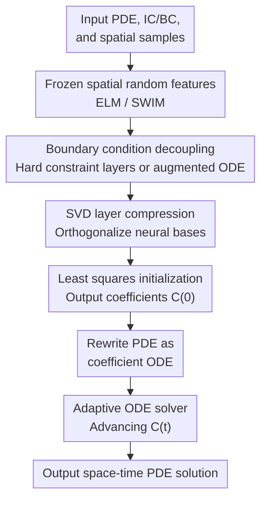

# Fast training of accurate physics-informed neural networks without gradient descent

**Conference**: ICLR 2026  
**OpenReview**: [https://openreview.net/forum?id=3VdSuh3sie](https://openreview.net/forum?id=3VdSuh3sie)  
**Code**: https://gitlab.com/felix.dietrich/swimpde-paper; https://gitlab.com/fd-research/swimpde  
**Area**: Physics-informed Machine Learning / PINNs / Neural PDE Solvers  
**Keywords**: Physics-Informed Neural Networks, PDE Solving, Gradient-Free Training, Random Features, Space-Time Separation

## TL;DR

This paper proposes Frozen-PINN, which freezes randomly sampled spatial basis functions and utilizes least squares and adaptive ODE solvers to advance time-varying output layer coefficients. By fundamentally bypassing gradient descent training, it achieves faster training, higher accuracy, and explicit temporal causality across various time-dependent PDEs.

## Background & Motivation

**Background**: The appeal of PINNs lies in their ability to approximate PDE solutions using neural networks while incorporating PDE residuals, initial conditions, and boundary conditions into the training objective. Compared to traditional mesh-based methods, they are naturally mesh-free, operate on point clouds, and easily handle complex operators using automatic differentiation. Consequently, they are widely used in scientific machine learning, surrogate modeling for physical simulations, and high-dimensional PDEs.

**Limitations of Prior Work**: The primary issue is that the "training" of classical PINNs is often more difficult than solving the PDE itself. High parameter counts, coupled PDE/initial/boundary losses, and non-convex, ill-conditioned loss landscapes force gradient descent to struggle for a balance among multiple competing objectives. For PDEs involving high-order derivatives, high-frequency temporal variations, shock waves, or long-term propagation, such training is often slow, inaccurate, or fails entirely.

**Key Challenge**: PINNs treat time as an additional spatial dimension, resulting in basis functions that span the entire space-time domain. However, the physical structure of initial value problems is causal; a subsequent time step evolves from the previous state. Traditional PINNs fail to exploit this, attempting to fit global space-time functions while simultaneously satisfying local temporal evolution, which artificially inflates the optimization problem and loses the Markov structure inherent to standard time-stepping algorithms.

**Goal**: The authors seek not to find a "better optimizer" for training PINNs, but to determine whether PINNs can be made independent of gradient descent training. Specifically, the method must retain the mesh-free and high-dimensional expressive advantages of neural bases while decoupling initial conditions, boundaries, and PDE residuals, allowing temporal advancement to be handled by explicit ODE systems.

**Key Insight**: Frozen-PINN observes that while a PDE solution may not be strictly separable into a single spatial function and a single temporal function, it can be represented as a linear combination of spatial-only basis functions with time-varying coefficients. As long as the spatial basis functions are sufficiently expressive, the parameters requiring temporal evolution are not the entire network weights, but a small set of output layer coefficients.

**Core Idea**: By replacing "gradient descent of all network parameters" with "frozen spatial random features + ODE for temporal coefficients," the paper reformulates the PINN from a large-scale non-convex multi-objective optimization problem into a combination of sampling, least squares, and classical ODE solving.

## Method

### Overall Architecture

Frozen-PINN constructs a single-hidden-layer network for time-dependent PDEs $u_t + Lu + \gamma N(u)=f$, where only the output layer coefficients vary with time. Given spatial sampling points and the PDE, the method first samples spatial basis functions, adds boundary constraint layers as needed, compresses/orthogonalizes these bases via SVD, initializes output coefficients $C(0)$ through least squares, and then derives an ODE for $C(t)$ by substituting the ansatz into the PDE. Adaptive ODE solvers (e.g., RK45, LSODA) are then used to advance to the target time.

Formally, the paper utilizes the ansatz:

$$
\hat u(x,t)=C(t)[\Phi(x),1]=c(t)\sigma(Wx^\top+b)+c_0(t),
$$

where $W,b$ are frozen hidden layer parameters dependent only on space, and $C(t)=[c(t),c_0(t)]$ are time-varying output parameters. The fundamental difference from standard PINNs is that training does not iteratively update $W,b,C$; instead, $C(t)$ is treated as a state variable evolved by an ODE system derived from the PDE.

### Key Designs

**1. Spatio-temporally separated Frozen-PINN ansatz: Reducing the training target to temporal coefficients**

In traditional PINNs, the network input is $(x,t)$, and hidden layer basis functions cover the entire space-time domain. When the PDE exhibits high-frequency oscillations or long-term evolution, the network struggles to learn spatial shapes and temporal propagation simultaneously. Frozen-PINN instead constructs spatial basis functions $\phi_m(x)=\sigma(w_mx^\top+b_m)$, representing the solution as a time-varying linear combination of these bases. This assumes not strict separability, but that a set of spatial bases can span an adequate approximation space, with temporal dynamics carried by the coefficient trajectory $C(t)$.

**2. ELM / SWIM frozen spatial random features: Using sampling instead of backpropagation**

Frozen-PINN provides two sampling methods for spatial bases. ELM is data-agnostic: weights are sampled from a Gaussian distribution and biases from the interval $[-\eta,\eta]$, suitable for smooth PDEs. SWIM is data-dependent: it uses pairs of spatial sampling points $x^{(1)},x^{(2)}$ to construct directions and biases, ensuring the tanh basis function transition regions fall within the domain and vary along the $x^{(1)}\to x^{(2)}$ direction. SWIM is particularly effective for problems with shocks, like the Burgers equation.

**3. Decoupling losses with coefficient ODEs: Replacing multi-objective PINN loss**

Classical PINNs combine $L_{PDE}$, $L_{IC}$, and $L_{BC}$ into a weighted sum, necessitating tedious loss weight tuning. Frozen-PINN solves the initial condition separately: on spatial collocation points $X$, $C(0)=u(X,0)^\top[\Phi(X),1]^+$ is computed via least squares. Substituting the ansatz into the PDE yields:

$$
C_t(t)=R(X,C(t))[\Phi(X),1]^+.
$$

This step eliminates gradient descent: the PDE residual is no longer a loss to be minimized but an explicit evolution equation for the temporal coefficients.

**4. Boundary handling and SVD layer: Balancing constraint satisfaction and system conditioning**

To avoid the coupling issues of soft boundary losses, the paper offers two approaches: boundary-compliant layers that transform bases to satisfy conditions (e.g., periodic, zero Dirichlet) by construction, or augmented ODEs (e.g., $\hat u_t(x)=-\kappa(\hat u(x)-g(x))$) that pull boundary values toward targets. Finally, an SVD layer performs truncated SVD on the feature matrix to obtain orthogonalized, compressed neural bases $A_r=V_r^\top A$, significantly reducing the dimensionality of the ODE system (up to 20x) and accelerating training (up to 75x).

## Loss & Training

Frozen-PINN lacks backpropagation training loss in the traditional sense. Its "training strategy" comprises three numerical steps: (1) sampling and freezing hidden layer parameters; (2) fitting initial conditions via least squares; (3) advancing $C(t)$ using an ODE solver, with accuracy and speed controlled by the SVD cutoff $\epsilon_{SVD}$. Typical experiments set the least squares `rcond` and SVD cutoff to $10^{-12}$ for a robust trade-off between speed and precision.

## Key Experimental Results

### Main Results

Frozen-PINN was compared against standard PINNs, Causal PINNs, and traditional methods like IGA/FEM across various benchmarks.

| PDE / Scenario | Metric | Ours | Comparison | Conclusion |
|--------|------|------|----------|------|
| Advection, $\beta=40$ | Rel. $L_2$ / Time | Frozen-PINN-swim: $8.42\times10^{-9}$, 0.7s | Causal PINN: $2.90$, 357.63s | Standard PINNs fail at high transport speeds; Ours is accurate and hundredfold faster |
| Euler-Bernoulli beam | Rel. $L_2$ / Time | High-acc: $9.33\times10^{-9}$, 6.90s | PINN(L-BFGS): $4.21\times10^{-3}$, 2303.71s | Speed gap reaches 4-5 orders of magnitude without backprop for high-order derivatives |
| Wave equation (multiscale) | Rel. $L_2$ / Time | Frozen-PINN-elm: $1.81\times10^{-6}$, 0.56s | FBPINN: $5.91\times10^{-1}$, 3090s+ | Hundreds to thousands of times faster than GPU-trained PINN variants |
| Burgers shock | Rel. $L_2$ / Time | Frozen-PINN-swim: $1.00\times10^{-3}$, 0.52s | Causal PINN: $1.60\times10^{-2}$, 1531.79s | SWIM resampling places steep bases near shocks; much faster than strong optimizers |
| 100-d heat equation | Rel. $L_2$ / Time | Frozen-PINN-elm: $4.12\times10^{-4}$, 0.13s | PINN(Adam+L-BFGS): $4.98\times10^{-3}$, 26.25s+ | Approx. 200x faster than GPU PINNs in high dimensions with lower error |

### Ablation Study

- **SVD Layer**: In the Burgers equation, SVD compression reduced the ODE dimension from 500 to 316, accelerating the process from 989s to 141s with negligible accuracy loss.
- **SWIM Projection**: In reaction-diffusion problems, using initial condition gradient projection improved accuracy by two orders of magnitude ($1.67\times10^{-2}$ to $9.99\times10^{-5}$) compared to ELM.
- **SVD Cutoff**: Acts as a speed-accuracy dial; values below $10^{-10}$ generally provide stability, while larger cutoffs increase speed at the risk of error or blow-up.

### Key Findings

- Frozen-PINN gains efficiency by reformulating training as numerical time-stepping. High-order derivatives and multi-loss weights no longer impose the same backpropagation burden.
- ELM is suitable for smooth/high-dimensional problems, while SWIM is better for shocks and steep gradients.
- The SVD layer is a critical engineering component for acceleration, orthogonalizing redundant random bases to improve ODE system conditioning.

## Highlights & Insights

- **Optimization to Evolution**: The most significant contribution is the elimination of non-convex training. By reformulating the problem, it addresses the fundamental flaw of treating IVPs as global space-time fitting tasks.
- **Structural Causality**: Unlike Causal PINNs which use soft weighting, Frozen-PINN achieves causality through the structure of the $C(t)$ ODE evolution.
- **Randomized Features as Spectral Bases**: ELM/SWIM are utilized as mechanisms to construct mesh-free trial functions. Combined with ODE solvers and SVD, the approach acts as a hybrid of mesh-free Galerkin methods and PINNs.

## Limitations & Future Work

- Currently focused on forward solves; inverse problems would require additional mechanisms for system identification.
- Spatial complexity remains a challenge; complex 3D flows or turbulence may require domain decomposition or advanced adaptive sampling.
- Dependency on numerical hyperparameters such as hidden width, SVD cutoff, and ODE tolerance, which require tuning per PDE.

## Related Work & Insights

- **vs. PINN/Causal PINN**: Standard PINNs minimize weighted loss via backprop. Frozen-PINN replaces this with least squares and time integration, resolving causality issues by design.
- **vs. Neural Galerkin**: Neural Galerkin evolves more parameters. Frozen-PINN is more lightweight by evolving only the output layer, relying on SVD and SWIM to maintain expressivity.
- **vs. FEM/IGA**: While traditional methods excel in low-dimensional accuracy, Frozen-PINN maintains mesh-free advantages and better handles high dimensions.

## Rating

- **Novelty**: ⭐⭐⭐⭐⭐ Substantial reconstruction of the PINN paradigm.
- **Experimental Thoroughness**: ⭐⭐⭐⭐⭐ Broad coverage of PDE types and extensive hyperparameter ablations.
- **Writing Quality**: ⭐⭐⭐⭐ Clear logic, though dense results require numerical PDE familiarity.
- **Value**: ⭐⭐⭐⭐⭐ High impact potential for scientific computing by bypassing the non-convex optimization hurdle.

<!-- RELATED:START -->

## Related Papers

- [\[ICLR 2026\] Enhancing Stability of Physics-Informed Neural Network Training Through Saddle-Point Reformulation](enhancing_stability_of_physics-informed_neural_network_training_through_saddle-p.md)
- [\[ICLR 2026\] Iterative Training of Physics-Informed Neural Networks with Fourier-enhanced Features](iterative_training_of_physics-informed_neural_networks_with_fourier-enhanced_fea.md)
- [\[ICML 2025\] Differentiable Stellar Atmospheres with Physics-Informed Neural Networks](../../ICML2025/physics/differentiable_stellar_atmospheres_with_physics-informed_neural_networks.md)
- [\[ICLR 2026\] Uncertainty-Aware Diagnostics for Physics-Informed Machine Learning](uncertainty-aware_diagnostics_for_physics-informed_machine_learning.md)
- [\[NeurIPS 2025\] Physics-Informed Neural Networks with Fourier Features and Attention-Driven Decoding](../../NeurIPS2025/physics/physics-informed_neural_networks_with_fourier_features_and_attention-driven_deco.md)

<!-- RELATED:END -->
