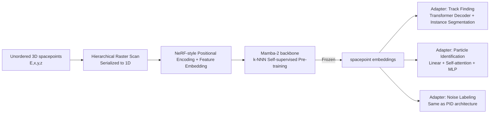

# FM4NPP: A Scaling Foundation Model for Nuclear and Particle Physics

**Conference**: ICLR 2026  
**OpenReview**: [https://openreview.net/forum?id=qaI3cLFsiX](https://openreview.net/forum?id=qaI3cLFsiX)  
**Code**: To be confirmed  
**Area**: AI for Science / Particle Detector Data / Foundation Models  
**Keywords**: Foundation Model, Self-supervised Learning, Particle Physics, Mamba/SSM, Neural Scaling Law, Track Finding  

## TL;DR
This work successfully transfers the "large-scale self-supervised pre-training + frozen weights + lightweight adapter" paradigm to sparse, 3D point-cloud-like collider detector data for the first time. Using Mamba, a foundation model FM4NPP with up to 188M parameters was pre-trained on 10 million collision events. With frozen weights and small adapters, it outperforms specialized models across track finding, particle identification (PID), and noise labeling, while demonstrating clear neural scaling laws.

## Background & Motivation

**Background**: Large language and vision models have demonstrated that "massive unlabeled data + self-supervised learning + scalable architectures" can learn universal representations. This has sparked a surge in "Science Foundation Models." However, progress has been concentrated in fields with data structures resembling language or images (e.g., continuous spatiotemporal fields in meteorology or jets aggregated into dense matrices in high-energy physics).

**Limitations of Prior Work**: Raw detector data in experimental nuclear and particle physics (NPP) is inherently unsuited for this paradigm—it consists of **sparse, unordered, 3D spacepoints**. A single collision produces hundreds to thousands of points with energy and coordinates $(E, x, y, z)$, lacking a natural sequence or established self-supervised tasks. Traditionally, GNNs are suitable for sparse data but are limited by oversmoothing when scaled; Transformer's self-attention has quadratic complexity, making it computationally prohibitive for ultra-long point sequences.

**Key Challenge**: On one hand, NPP experiments (such as sPHENIX at RHIC, where the TPC alone has 41.6 million voxels and generates 85% of the data) easily produce massive amounts of unlabeled data. On the other hand, it remains unknown how to design self-supervised objectives for such sparse data, which architectures to use, what the scaling laws look like, and whether frozen representations can truly generalize and outperform specialized algorithms.

**Goal**: This paper aims to answer two questions: (a) Can NPP foundation models **scale** (i.e., do larger models/data consistently improve performance)? (b) Can frozen representations **generalize** across diverse downstream tasks?

**Core Idea**:
- **Serialization is the Key**: A Hierarchical Raster Scan is proposed to serialize unordered 3D points into 1D sequences. This method preserves both local track continuity and global outward propagation structure, enabling the use of linear-complexity Mamba.
- **Geometry-Aware Self-Supervision**: Instead of "next-token prediction," a k-Next-Nearest-Neighbor (k-NNN) prediction task is used to align the objective with particle propagation directions and avoid information leakage in autoregulation.
- **Frozen FM + Lightweight Adapter**: The model is pre-trained once; downstream tasks only require training small adapters with hundreds of thousands to a few million parameters.

## Method

### Overall Architecture
FM4NPP follows a two-stage paradigm: **Stage 1** involves self-supervised pre-training of a Mamba backbone (up to 188M parameters) on 10 million collision events using k-NNN. **Stage 2** freezes the backbone and attaches lightweight adapters for three tasks: Track Finding, Particle Identification (PID), and Noise Labeling. The prerequisite for the entire pipeline is serializing the unordered 3D point cloud into 1D sequences compatible with Mamba.

### Key Designs

**1. Hierarchical Raster Scan: Balancing Global Outward Flow and Local Track Continuity.** This is the physical prior entry point. The challenge is that a good serialization must satisfy two conflicting goals: particle tracks radiate outward from the collision point (global structure), yet points on the same track should be adjacent in the sequence (local continuity). Space-filling curves like Hilbert or Z-order focus only on spatial locality, often interleaving points from different tracks. Sorting purely by radius preserves the outward flow but scatters points from the same track. The authors' solution converts Cartesian coordinates to cylindrical coordinates $(r, \phi, \eta)$, better fitting collider symmetry, followed by two-level sorting: **inter-box** sorting partitions space into a $6\times8\times8$ 3D grid, sorted by $(r, \phi, \eta)$ of box centers; **intra-box** sorting sorts points within each box by radius $r$. This ensures local continuity while maintaining global progression. Ablations show that Hilbert serialization degrades performance across all tasks (e.g., a 9.1% relative gap in Track ARI), proving that "track consistency" is more vital than "pure spatial locality."

**2. Mamba-2 Backbone + NeRF-style Input Embedding: Handling long sequences with linear complexity.** Given the large number of points per event, the authors replaced quadratic self-attention with Mamba-2, a selective State Space Model (SSM). Mamba-2 dynamically focuses on relevant information and filters noise via its selection mechanism and achieves hardware-friendly linear time scaling through Structured State Space Duality (SSD). Each spacepoint is treated as a token. Input mapping uses a dual-path approach: energy features $E$ are projected into $d_{model}$ dimensions, and spatial coordinates $(r, \phi, \eta)$ are passed through high-frequency sinusoidal positional encoding $\gamma(\cdot)$ before projection. Model widths scale from 64 to 1536, corresponding to 0.34M to 188M parameters.

**3. k-Next-Nearest-Neighbor (k-NNN) Self-Supervised Objective: Decoupling prediction from "sequence next" to "geometric next."** Self-supervised tasks must be decoupled from sequence order to prevent the model from learning artifacts of the serialization. Directly predicting the nearest neighbor in an autoregressive framework leaks information about seen points. k-NNN predicts the $k$ nearest points for a query $s_i$ only within its "next neighborhood" $N_c(s_i)=\{s_j\in E \mid r_j>r_i\}$ (points with larger radii that appear later or not at all in the sequence). This naturally aligns with outward particle propagation. Given predicted $\hat Y_i$ and ground truth $Y_i$ (both sorted by distance), the loss is:

$$L_i = \frac{1}{k}\sum_{m=1}^{k}\lVert \hat y_{i,m}-y_{i,m}\rVert_2^2$$

Larger $k$ provides a wider geometric field of view. Ablations show $k=30$ outperforms $k=1$ or $5$ and standard next-token prediction, confirming that geometry-aware neighborhoods yield more transferable representations.

**4. Lightweight Downstream Adapters: Frozen representations + single-layer linear "probes."** FM point-level features are first compressed via a **single linear layer**. Track Finding adopts a panoptic segmentation approach: initializing $N$ learnable track queries, passing them through $L$ Transformer decoder layers (cross-attention with point embeddings), and outputting track embeddings and classification scores $\hat y_n$. The point-to-query assignment probability $\hat p_{in}$ is the sigmoid of the inner product of point and track embeddings. Training utilizes Hungarian matching with a composite loss $L_{match}^{(j,n)}=\lambda_{dice}L_{dice}+\lambda_{focal}L_{focal}+\lambda_{cls}L_{cls}$. PID and Noise Labeling use a simpler "linear projection + single-layer self-attention + MLP" structure with only ~0.74M parameters.

## Key Experimental Results

### Main Results

**Track Finding** (FM4NPP uses the largest m6 model, average of 10 seeds; frozen FM + 2.39M adapter):

| Model | Trainable Params | ARI↑ | Efficiency↑ | Purity↑ |
|------|-----------|------|-------------|---------|
| EggNet | 0.16M | 0.726 | 74.2% | 75.1% |
| Exa.TrkX | 3.86M | 0.877 | 91.8% | 66.4% |
| HEPT | 0.31M | 0.831 | 81.2% | 78.0% |
| AdapterOnly (No Pre-train) | 2.39M | 0.724 | 78.0% | 64.5% |
| **Ours (FM4NPP-m6)** | 2.39M | **0.945** | **96.1%** | **93.1%** |

Compared to the official sPHENIX reconstruction pipeline (Cellular Automaton seeding + Kalman Filter, limited to $p_T>1$ GeV, $|\eta|<1.1$, and long tracks with $\ge 20$ points in TPC): FM4NPP achieves a track efficiency of **99.6%** vs. sPHENIX's **94.6%**.

**Particle Identification (PID) and Noise Labeling** (FM4NPP adapter only 0.74M parameters):

| Model | Params | PID acc.↑ | PID recall↑ | PID pre.↑ | Noise acc.↑ | Noise recall↑ | Noise pre.↑ |
|------|------|-----------|-------------|-----------|-------------|---------------|-------------|
| SAGEConv (Best GNN) | 0.91M | 0.726 | 0.456 | 0.650 | 0.917 | 0.723 | 0.817 |
| OneFormer3D | 44.95M | 0.770 | 0.490 | 0.577 | 0.965 | **0.940** | 0.895 |
| AdapterOnly | 0.74M | 0.663 | 0.339 | 0.611 | 0.911 | 0.622 | 0.836 |
| **Ours (FM4NPP-m6)** | 0.74M | **0.904** | **0.765** | **0.878** | **0.971** | 0.937 | **0.919** |

FM4NPP dominates in PID; in noise labeling, it matches the 45M OneFormer3D using only 0.74M parameters.

### Ablation Study

(Using the second-largest model m5; percentages in parentheses indicate relative increase in the "gap to perfect performance")

| Ablation Component | Noise (Acc.) | PID (Acc.) | Track (ARI) |
|--------|-------------|-----------|------------|
| Next-token (vs. k-NNN) | −0.0010 (4.6%) | −0.0023 (2.5%) | −0.0009 (1.6%) |
| k=1 (vs. k=30) | −0.0012 (5.7%) | −0.0049 (5.3%) | −0.0019 (3.3%) |
| k=5 (vs. k=30) | −0.0007 (3.6%) | −0.0016 (1.7%) | −0.0003 (0.5%) |
| Hilbert (vs. Raster Scan) | −0.0014 (7.0%) | −0.0075 (8.0%) | −0.0051 (9.1%) |

All three design choices (k-NNN, large k, Hierarchical Raster Scan) are validated, with **serialization strategy having the most significant impact**.

### Key Findings
- **Clear Neural Scaling Laws**: Validated that MSE follows a power-law decay (linear in log-log space) with respect to model parameters, training data volume, and compute FLOPs, consistent with Kaplan/Chinchilla laws. m6 (188M) shows signs of potential saturation.
- **Monotonic Downstream Improvement**: For the same frozen representation, larger FMs consistently yield better results across all three downstream tasks.
- **Data Efficiency**: The fewer the labels, the greater the pre-training gain. Track ARI gain was **2.9×** in the low-label regime compared to 1.3× in the high-label regime relative to AdapterOnly.
- **Task-Agnostic Representations**: The representations are truly task-agnostic and can be specialized via a single linear mapping.
- µ-parameterization allowed a learning rate of $2\times10^{-4}$ tuned on m3 to transfer zero-shot to all model sizes.

## Highlights & Insights
- **Solid "First Step" in Paradigm Shift**: Rather than simply copying LLMs, the authors address three pain points of sparse 3D point clouds (unordered → serialization, long sequences → Mamba, unlabeled data → k-NNN) with physics-prior-driven solutions, each backed by ablation studies.
- **Outperforming Official Physical Pipelines**: A track efficiency of 99.6% vs. 94.6% is compelling evidence of "AI surpassing handcrafted algorithms," especially as it operates directly on low-level spacepoints without high-level track or calorimeter inputs.
- **Exceptional Parameter Efficiency**: A 0.74M adapter matching a 45M OneFormer3D indicates that the intrinsic value is stored within the frozen representations.
- **Contribution of Open Benchmarks**: By providing 10 million events across three labeled downstream tasks, the paper establishes the necessary infrastructure for foundation model scaling research in NPP.

## Limitations & Future Work
- **Single Detector Validation**: Evaluation was limited to sPHENIX; achieving a "Universal FM" across different detectors (e.g., LHC) remains a future goal.
- **Scaling Saturation at m6**: Performance plateaus at 188M parameters; whether larger models can still yield benefits or the root cause of saturation requires further investigation.
- **Downstream Tasks Biased Toward Segmentation**: Track finding, PID, and noise labeling are essentially point-level classification/segmentation. Regression or event-level physical property prediction has not yet been validated.
- **Incomplete Leakage Mitigation**: The authors describe k-NNN as "partially" alleviating information leakage; the self-supervised objective design could be further refined.
- Engineering challenges for actual deployment in high-throughput online trigger environments (latency, compute budget) are left for future work.

## Related Work & Insights
- **Science Foundation Models**: Aurora for meteorology, OmniJet-α / OmniLearned for high-energy physics jets—but these largely handle dense/structured data. This work tackles the "hard nut" of low-level sparse detector data.
- **Scalable Architectures**: While Transformers face quadratic complexity and MoE faces expert imbalance, Mamba-2 was chosen for its linear complexity efficiency for long sequences.
- **NPP Task Methods**: Traditional Kalman Filter based reconstruction and GNN-based methods like Exa.TrkX/EggNet typically operate at the O(1M) parameter scale; this work scales up by two orders of magnitude while systematically studying scaling.
- **Mechanism**: For any "unordered, sparse, geometrically-constrained" scientific data (materials science, single-cell omics, general point clouds), the route of "physics-prior-driven serialization + geometry-aware self-supervision + frozen representation + lightweight probes" is a reproducible methodology.

## Rating
- Novelty: ⭐⭐⭐⭐ Systematic transfer of scaling self-supervised foundation model paradigms to sparse low-level detector data. Serialization and k-NNN are tailored for this data form.
- Experimental Thoroughness: ⭐⭐⭐⭐ Tri-axial scaling laws, multi-baseline results across three tasks, comparison with official physical pipelines, data efficiency, and complete ablations. Slightly docked for single-detector focus and missing regression tasks.
- Writing Quality: ⭐⭐⭐⭐ Clear chain of logic from motivation to challenge to design to evidence. Excellent visualizations of scaling curves and architecture.
- Value: ⭐⭐⭐⭐ Provides an open benchmark for NPP, a practical model outperforming official pipelines, and a methodology extensible to other sparse scientific data.

<!-- RELATED:START -->

## Related Papers

- [\[AAAI 2026\] Towards a Foundation Model for Partial Differential Equations Across Physics Domains](../../AAAI2026/physics/towards_a_foundation_model_for_partial_differential_equations_across_physics_dom.md)
- [\[ICML 2025\] OmniArch: Building Foundation Model For Scientific Computing](../../ICML2025/physics/omniarch_building_foundation_model_for_scientific_computing.md)
- [\[ICLR 2026\] Physics-Informed Inference Time Scaling for Solving High-Dimensional Partial Differential Equations via Defect Correction](physics-informed_inference_time_scaling_for_solving_high-dimensional_partial_dif.md)
- [\[ICLR 2026\] Scaling Laws and Symmetry, Evidence from Neural Force Fields](scaling_laws_and_symmetry_evidence_from_neural_force_fields.md)
- [\[ICLR 2026\] OXtal: An All-Atom Diffusion Model for Organic Crystal Structure Prediction](oxtal_an_all-atom_diffusion_model_for_organic_crystal_structure_prediction.md)

<!-- RELATED:END -->
