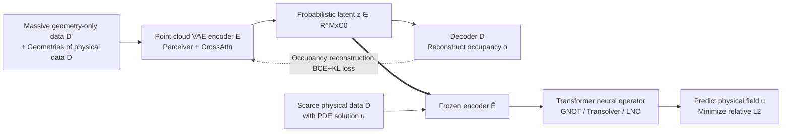

# From Cheap Geometry to Expensive Physics: A Physics-agnostic Pretraining Framework for Neural Operators

**Conference**: ICLR 2026  
**OpenReview**: [https://openreview.net/forum?id=iCprPzyrRp](https://openreview.net/forum?id=iCprPzyrRp)  
**Code**: [https://github.com/zzzwoniu/Physics-agnostic-Operator-Pretraining](https://github.com/zzzwoniu/Physics-agnostic-Operator-Pretraining)  
**Area**: Scientific Computing / Neural Operators / Self-supervised Pretraining  
**Keywords**: Neural Operator, PDE Surrogate, Physics-agnostic Pretraining, Occupancy Field, Point Cloud VAE  

## TL;DR
Utilizing a large amount of "geometry-only, physics-label-free" cheap mesh data, a point cloud VAE is pretrained through the physics-agnostic proxy task of occupancy field reconstruction. The learned latent geometric representations are then fed into Transformer neural operators, significantly improving solution accuracy under scarce PDE labels.

## Background & Motivation
- **Background**: Industrial design evaluation relies on high-fidelity simulation of partial differential equations (PDEs), which is accurate but extremely expensive. Neural operators (DeepONet, FNO, GNOT, Transolver, LNO, etc.) serve as surrogate models to quickly predict PDE solutions and have become the mainstream path for accelerating design space exploration.
- **Limitations of Prior Work**: The accuracy of neural operators highly depends on labeled PDE solutions, which must be generated by expensive numerical solvers. Most existing efficiency enhancement methods are **physics-aware**—either reconstructing PDE solution fields to inject inductive bias or performing large-scale autoregressive pretraining on related PDE families—yet they still consume PDE solution labels and do not address the real computational bottleneck of "expensive solving."
- **Key Challenge**: In industrial scenarios, candidate geometries (meshes/point clouds) are extremely abundant and generated at almost zero cost. However, because solvers are not run, they lack physical field labels and are thus completely ignored by standard operator learning pipelines—**the cheapest and most abundant resources are precisely those being wasted**.
- **Goal**: Design a **physics-agnostic pretraining framework** that requires PDE labels only during the supervised training phase. It transforms massive geometry-only data $D'$ ($|D'|\gg|D|$) into geometric representations useful for scarce physical data $D$, alleviating the long-standing label scarcity bottleneck in operator learning.
- **Core Idea**: **Decouple the "learning geometry" and "learning physics" stages using occupancy field reconstruction as a proxy task**. Pretraining focuses only on geometry to produce latent representations in function space; operator learning simply switches the input (replacing original point clouds with latent representations), allowing the frozen encoder to be integrated as a plug-and-play component into any Transformer operator.

## Method

### Overall Architecture
The framework consists of two stages: **Stage 1** pretrains a point cloud VAE on all geometries in $D\cup D'$, using a proxy field (defaulting to the occupancy field $o$) that can be calculated from the mesh at zero cost as the reconstruction target to learn latent geometric representations. **Stage 2** freezes the encoder and feeds the latent representations as input into a Transformer neural operator, learning to predict PDE solutions in a standard supervised manner on the scarce physical data $D$. Crucially, the proxy task does not touch the solver, enabling the consumption of massive cheap geometry.

### Key Designs

**1. Three selection criteria for physics-agnostic proxy tasks: Translating "geometry" into a "language the operator understands" using occupancy fields.** The authors explicitly propose that a proxy task must satisfy three points: *computational efficiency* (low-cost calculation from mesh/point cloud without solvers), *consistency with operator learning* (the task itself is an operator task from input function to a certain field, naturally bridging to physical field prediction), and *sampling invariance* (different point cloud discretizations of the same underlying geometry should be treated equivalently). After comprehensive consideration, the **occupancy field** $o(z)\in\{0,1\}$ was selected: $o(z)=1$ if the query point $z$ falls inside the object, and 0 otherwise. It expresses geometric information as a field defined on query coordinates (isomorphic to the physical solution $u$), allowing "geometry reconstruction" and "physics prediction" to reside in the same function space, avoiding information loss from directly feeding discrete point clouds.

**2. Point cloud VAE: Compressing irregular geometry into latent representations in function space.** The encoder adopts a Perceiver architecture, utilizing a fixed number $M$ of learnable tokens $L$ to perform cross-attention aggregation on input point clouds $m_k=\mathrm{CrossAttn}(L,\mathrm{PosEmb}(X_k))$. It then projects these via two MLPs into a probabilistic latent space to obtain mean/variance, sampling latent variables $z\in\mathbb R^{M\times C_0}$ via reparameterization $h_k^i=(h_\mu)_k^i+(h_\sigma)_k^i\cdot\epsilon,\ \epsilon\sim\mathcal N(0,1)$. The decoder predicts occupancy values $o_k(z^i)=D(h_k)(z^i)$ at any query point; thus, the latent representation **resides in function space** rather than on a fixed grid. The training objective is the BCE of occupancy reconstruction plus KL regularization:
$$\min_{\phi,\eta}\frac{1}{|D\cup D'|}\sum_{k}\Big(\mathbb E_{z\sim p}\,\mathrm{BCE}(\tilde D_\eta(\tilde E_\phi(a_k))(z),o_k(z))+\lambda\cdot \mathrm{KL}(\mathcal N(h_\mu,h_\sigma)\,\|\,\mathcal N(0,1))\Big)$$
Query point sampling integrates two paths: uniform sampling $U(\Omega)$ over the computational domain and adding small perturbations to mesh points $z^i=x^i+\varepsilon^i,\ \varepsilon\sim\mathcal N(0,\zeta I)$. The former covers the entire domain, while the latter refines the area near the boundary—the most critical region for geometry. Unlike MAE designed for regular grids/pixels, the Transformer architecture used here allows for arbitrary query coordinates, naturally adapting to irregular geometries.

**3. Frozen encoder for plug-and-play operator integration: Only changing inputs without modifying the operator.** During operator learning, the neural operator is expressed as $\tilde F_\theta(\tilde E_\phi(a_k))=u_k$. **Only the operator parameters $\theta$ are updated, while the encoder $\tilde E_\phi$ remains frozen throughout**, with the goal of minimizing the relative L2 error on the normalized physical field:
$$\min_\theta \frac{1}{|D|}\sum_k \frac{\sqrt{\sum_i(\tilde F_\theta^i(\tilde E_\phi(a_k))-\hat u_k^i)^2}}{\sqrt{\sum_i(\hat u_k^i)^2}}$$
Since the pretrained encoder outputs a set of latent tokens, it can be seamlessly inserted into GNOT's branch net, replace the first layer of Transolver's physics-attention, or connect to the branch of LNO, requiring almost no structural changes to the operator. Furthermore, occupancy values $o_k^i$ are concatenated with query coordinates as input (occupancy is constant 1 during mesh query), supporting both "mesh point query" and "uniform random point query" physical field query strategies.

**4. Error decomposition perspective on efficacy (and support for interchangeable proxy tasks).** Error decomposition analysis (Appendix B) is provided, splitting the operator's prediction error into a **representation error** term that can be suppressed as the number of unlabeled geometries increases. This serves as the theoretical basis for the observation in ablations that "more geometric data leads to stronger latent representations and more accurate operators." Based on the principle that "a proxy task only needs to be cheap, expressible as a field, and independent of a specific PDE," the framework is **plug-and-play**: occupancy is the most general and intuitive choice, while for boundary-dominated problems like CFD, it can be replaced with Signed Distance Fields (SDF) or Shortest Vector fields (SV).

## Key Experimental Results

### Main Results
Four datasets (Stress 2D, AirfRans near 2D, Inductor 3D, Electrostatics 2D) × three Transformer operators (GNOT / Transolver / LNO). Relative L2 error on normalized data is reported ($\times10^{-2}$, brackets show standard deviation of three independent experiments), with KL weight fixed at 0.001:

| Dataset | Query | GNOT | G+VAE | Trans | T+VAE | LNO | L+VAE |
|---|---|---|---|---|---|---|---|
| Stress | Mesh | 9.8 | **9.0** | 11.5 | **11.2** | 26.5 | **13.6** |
| Stress | Random | 10.3 | **8.3** | 11.5 | **9.7** | 20.0 | **11.6** |
| AirfR(near) | Mesh | 6.8 | **5.6** | 13.4 | **12.7** | 27.4 | **27.1** |
| AirfR(near) | Random | 7.8 | **5.9** | 15.0 | **10.8** | 25.3 | **10.0** |
| Inductor(3D) | Mesh | 7.0 | 7.1 | 11.4 | **8.4** | 24.9 | **9.2** |
| Inductor(3D) | Random | 12.5 | **11.8** | 16.8 | **13.2** | 20.3 | **13.0** |
| Electrostat | Mesh | 4.2 | **3.3** | 5.0 | **3.8** | 13.5 | **4.6** |
| Electrostat | Random | 4.6 | **3.4** | 5.6 | **3.9** | 13.5 | **4.7** |

The data cost comparison is extreme: for AirfRans, physical data $D$ requires 7680 CPU·hr, while geometry-only data $D'$ requires only 0.14 CPU·hr. The weak LNO baseline (e.g., Stress mesh 26.5) is nearly halved (13.6) after pretraining, showing the largest gain.

### Ablation Study
**Geometric Data Volume** (Stress, GNOT): VAE1 sees only physical data geometry; VAE2/VAE3 add more geometry (including different distributions):

| Encoder | VAE1 | VAE2 | VAE3 |
|---|---|---|---|
| GNOT Random | 9.1 | 8.6 | **8.3** |
| Trans Random | 10.4 | 9.8 | **9.7** |

**KL Weight** (GNOT, Relative L2):

| Dataset | Query | base | VAE(0.01) | VAE(0.001) | VAE(0.0001) | AE |
|---|---|---|---|---|---|---|
| Stress | Random | 10.3 | 9.7 | 8.3 | **8.0** | 8.9 |
| Airf | Random | 7.8 | 6.2 | 5.9 | **5.2** | 5.9 |

**Alternative Proxy Tasks** (GNOT, AirfRans): SV as a proxy task achieves the best performance, with Random query dropping from 7.8 to 4.9:

| Query | base | SDF | SV | OCC-VAE | SDF-VAE | SV-VAE |
|---|---|---|---|---|---|---|
| Mesh | 6.8 | 5.2 | 5.4 | 5.6 | 5.3 | **4.8** |
| Random | 7.8 | 6.5 | 5.1 | 5.9 | 5.4 | **4.9** |

### Key Findings
- Pretraining consistently reduces error under almost all settings and is stable across datasets and operators, indicating that latent representations are stronger than original point clouds.
- **Improvements for random queries are generally greater than for mesh queries**: mesh sampling is denser near boundaries where baselines already capture key geometric details, leaving less room for pretraining; this is most evident in 3D Inductor, where 3D uniform sampling is particularly inefficient.
- More geometric data leads to stronger latent representations; even if part of the data comes from different distributions, there is a gain, verifying the hypothesis that "representation error decreases as unlabeled geometry increases."
- Probabilistic latent space + smaller KL weights (0.001 or 0.0001) are more robust than deterministic AE; while all autoencoders achieved IOU >99.5%, high reconstruction accuracy does not guarantee downstream optimality.

## Highlights & Insights
- **Paradigm Shift**: Pushing pretraining from "physics-aware" to "physics-agnostic," systematically turning massive but ignored geometry-only industrial data into free fuel for operator learning for the first time, targeting the "expensive solving" bottleneck.
- **Function Space Representation is Key**: Using occupancy reconstruction forces latent representations to reside in function space, which is closer to true geometry than directly feeding discrete point clouds. This is the root cause of accuracy gains and the essential difference from MAE-type methods.
- **Decoupling Enables Plug-and-Play**: The design of freezing the encoder and only changing inputs makes the framework nearly zero-intrusivity for GNOT/Transolver/LNO, making it friendly for engineering deployment.
- **Theoretical Support for Replaceable Proxy Tasks**: Occupancy/SDF/SV have different strengths (SV is best in CFD); combined with error decomposition analysis, it explains "why it works" rather than just "that it works."

## Limitations & Future Work
- **Multi-geometry Interaction Unexplored**: Under scenarios with multiple interacting objects, occupancy reconstruction might require replacing BCE with multi-class cross-entropy, which the authors admit is yet to be validated.
- **Empirical Proxy Task Selection**: Occupancy is an intuitive default, while SDF/SV are only analyzed in small ablations. A methodology for systematically selecting the optimal proxy task based on target PDEs, geometric formats, and data availability is lacking.
- **Shallow Two-stage Integration**: Currently, latent representations are simply fed in. The authors point out that joint/sequential fine-tuning, hybrid losses for reconstruction and PDE supervision, and adapter-style conditional injection could be explored for deeper coupling.
- **No Exhaustive Hyperparameter Optimization**: The authors intentionally did not tune model/training hyperparameters, so results should not be interpreted as a definitive ranking between operators; there is room to further reduce absolute values.

## Related Work & Insights
- **Neural Operator Lineage**: From the foundation of DeepONet to GNO/FNO handling resolution invariance and irregular geometry, to Transformer-based GNOT (heterogeneous cross-attention), Transolver (physics-attention slicing), and LNO (invertible physics-cross-attention for token reduction), this work performs general enhancement on this SOTA frontier.
- **Operator Pretraining**: Compared to Serrano/Rahman (reconstructing solution fields) and McCabe/Hao/Herde (autoregressive pretraining across PDE families) as physics-aware routes, this work differentiates itself by "not touching PDE labels." Compared to a few physics-agnostic MAE attempts (mostly for regular grids/pixels), this work operates directly on unstructured geometry.
- **Key Insight**: Self-supervised pretraining has been repeatedly verified in NLP/CV. This paper accurately migrates the idea of "pretraining representations with cheap unlabeled data" to PDE surrogate modeling. A general suggestion for scientific computing is that **determining which cheap signal can be organized into a function/field isomorphic to the downstream task is often more cost-effective than piling up more expensive labels**.

## Rating
- **Novelty**: ⭐⭐⭐⭐ —— The combination of physics-agnostic pretraining and occupancy field proxy tasks is a clear new perspective in operator learning, hitting the industrial data bottleneck; however, point cloud VAE and occupancy reconstruction are migrations of existing components.
- **Experimental Thoroughness**: ⭐⭐⭐⭐ —— Covers 4 2D/3D datasets, 3 SOTA operators, multiple ablations (data volume/KL weight/proxy tasks) with error decomposition theory; solid. Multi-geometry interaction and systematic proxy task searching are still missing.
- **Writing Quality**: ⭐⭐⭐⭐ —— Clear motivational narrative, good correspondence between methodology and diagrams, and well-extracted proxy task criteria; some formulas and sampling details are slightly dense.
- **Value**: ⭐⭐⭐⭐ —— Directly addresses the industrial simulation pain point of "expensive labels, abundant geometry," is plug-and-play with stable gains, and has high potential for practical application.

<!-- RELATED:START -->

## Related Papers

- [\[ICLR 2026\] Learning Data-Efficient and Generalizable Neural Operators via Fundamental Physics Knowledge](learning_data-efficient_and_generalizable_neural_operators_via_fundamental_physi.md)
- [\[NeurIPS 2025\] Towards Universal Neural Operators through Multiphysics Pretraining](../../NeurIPS2025/physics/towards_universal_neural_operators_through_multiphysics_pretraining.md)
- [\[ICLR 2026\] Physics vs Distributions: Pareto Optimal Flow Matching with Physics Constraints](physics_vs_distributions_pareto_optimal_flow_matching_with_physics_constraints.md)
- [\[ICLR 2026\] Operator Learning with Domain Decomposition for Geometry Generalization in PDE Solving](operator_learning_with_domain_decomposition_for_geometry_generalization_in_pde_s.md)
- [\[ICLR 2026\] Fast training of accurate physics-informed neural networks without gradient descent](fast_training_of_accurate_physics-informed_neural_networks_without_gradient_desc.md)

<!-- RELATED:END -->
