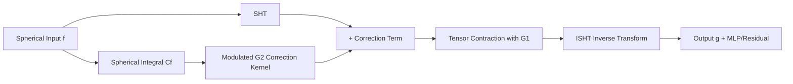

# Generalized Spherical Neural Operators: Green's Function Formulation

**Conference**: ICLR 2026  
**OpenReview**: [https://openreview.net/forum?id=XkGjzSDTnm](https://openreview.net/forum?id=XkGjzSDTnm)  
**Code**: [https://github.com/haot2025/GSNO](https://github.com/haot2025/GSNO)  
**Area**: Neural Operators / Spherical PDE Solving / Scientific Machine Learning  
**Keywords**: Green's function, Spherical Neural Operator, Spherical Harmonic Transform, Equivariance and Invariance, Multi-scale modeling  

## TL;DR
This paper reformulates spherical neural operators using "designable spherical Green's functions," interpreting the existing SFNO as a special case of relative-position Green's functions. By introducing absolute-position dependent terms, the authors derive the GSNO operator and the multi-scale SHNet, which flexible balance equivariance and invariance, significantly outperforming SOTA models in diffusion MRI, shallow water equations, and global weather forecasting.

## Background & Motivation

**Background**: Solving parametric partial differential equations (PDEs) is a core task in science and engineering. Neural operators (e.g., FNO) learn mappings between function spaces in the frequency domain, bypassing expensive numerical solvers. However, FNO is based on standard Fourier transforms and assumes Euclidean geometry; when applied to spheres, small displacements near the poles are mapped to large Cartesian displacements, breaking spatial continuity. Consequently, SFNO replaces the FFT with the Spherical Harmonic Transform (SHT) to project functions onto spherical harmonic bases, maintaining rotational equivariance and achieving good results in tasks like weather forecasting.

**Limitations of Prior Work**: The authors identify three levels of issues. First is the **weak theoretical foundation**: most existing spherical operators "port FNO to the sphere" via SHT and the spherical convolution theorem rather than deriving them from the integral solutions of native spherical PDEs, leading to integral kernels with unclear physical meaning. Second is that **operator blocks are excessively equivariant**: real physical systems are full of non-equivariant and asymmetric constraints (boundary effects, position-dependent patterns, anisotropic media), but SFNO imposes strict rotational equivariance for frequency-domain efficiency. Third is the **single-scale network**: most existing spherical operator networks use ResNet-like single-scale structures, struggling to represent the multi-scale features of climate dynamics.

**Key Challenge**: Spherical modeling requires a balance between "rotational equivariance demanded by spherical geometry and spectral efficiency" and "non-equivariant constraints inherent in real systems," yet existing methods treat equivariance as a hard constraint with no room for non-equivariance.

**Goal**: Establish a unified spherical operator theoretical framework starting from Green's functions, and design an operator capable of flexibly reconciling equivariance and invariance, paired with a multi-scale network.

**Key Insight**: **[Designable Green's Functions]** The solution of a spherical PDE can be written in an integral form involving a convolution with a Green's function. The Green's function becomes a "designable inductive bias"—designed as purely relative-position dependent, it simplifies to SFNO; by adding an absolute-position dependent correction term, it yields GSNO for modeling non-equivariant constraints.

## Method

### Overall Architecture
The method progresses through three layers: first, a general operator design framework is derived from spherical Green's functions (4.1), proving that SFNO is a special case of "relative-position Green's functions." Next, a Green's function dependent on both absolute and relative positions is designed to derive the GSNO operator block (4.2). Finally, GSNO is embedded into a U-Net-style multi-scale network called SHNet (4.3), using up/downsampling in the spherical harmonic domain instead of traditional sampling to avoid distortion.

### Key Designs

**1. Deriving the Spherical Operator Framework from Green's Functions: Establishing the PDE Origin.** The authors define a linear differential operator $D$ and a PDE $D(g(u))=f(u)$ on the sphere. By introducing a spherical Green's function $G$ satisfying $D(G(u,R))=\delta(R^{-1}u)$, the solution is naturally written as the convolution integral $g(u)=\int_{S^2} G(u,R)f(Rn)\,dR$. When $G$ depends only on relative position $G(R^{-1}u)$, applying the spherical convolution theorem yields $\mathrm{SHT}[g](l,m)=G_\theta(l)\cdot\mathrm{SHT}[f](l,m)$, followed by an ISHT—which is exactly the frequency-domain parameterization of SFNO. This proves the consistency of the framework and uses the "designability" of Green's functions to accommodate different systems.

**2. Absolute + Relative Position Dependent Green's Function (GSNO Operator): Patching Equivariant Operators.** The strict equivariance assumption $G(R,u)=G(R^{-1}u)$ ignores real-world anisotropy and local heterogeneity. The authors extend the Green's function as the sum of a relative term and an absolute term:

$$G(R,u)=\underbrace{\sum_{l',m'}\mathrm{SHT}[G_1]_{l'}^{m'} Y_{l'}^{m'}(R^{-1}u)}_{T_{\text{orig}}}+\underbrace{\sum_{l',m'}\mathrm{SHT}[G_1]_{l'}^{m'}\mathrm{SHT}[G_2]_{l'}^{m'} Y_{l'}^{m'}(u)}_{T_{\text{corr}}}$$

Where $T_{\text{orig}}$ is the original rotation-equivariant term and $T_{\text{corr}}$ is the learnable non-equivariant correction term. The target SHT is split into two paths: the equivariant path $I(T_{\text{orig}})=G^1_{\theta_1}(l)\cdot\mathrm{SHT}[f](l,m)$ and the correction path $I(T_{\text{corr}})=G^1_{\theta_1}(l)\cdot C_f\cdot G^2_{\theta_2}(l,m)$, where $C_f$ is the spherical integral of the input. The combined output is $g(u)=\mathrm{ISHT}[G^1_{\theta_1}(l)\cdot(\mathrm{SHT}[f](l,m)+C_f\cdot G^2_{\theta_2}(l,m))]$. Intuitively, $G_1$ encodes dynamic features while $G_2$ provides pattern-level spectral embeddings for terrain or boundaries. This **relaxes strict SO(3) equivariance while maintaining the spectral efficiency of SFNO** without damaging spherical geometry or grid invariance.

**3. SHNet Multi-scale Spherical Network: Sampling in the Spherical Harmonic Domain.** Spectral convolutions excel at global dependencies but are weak at multi-scale features. SHNet adopts a U-Net structure. The core trick is that scale transformations are implemented by modifying the number of sampling points along latitude $\theta$ and longitude $\phi$, as well as the spherical harmonic degree $l$ during SHT/ISHT. This "geometry-adaptive" sampling avoids aliasing and distortion caused by traditional interpolation on the sphere.

## Key Experimental Results

Evaluations were conducted on diffusion MRI, the Spherical Shallow Water Equations (SSWE), and global weather forecasting against ClimaX, FourCastNet, and SFNONet using 16GB A5000 GPUs.

### Main Results

MRE (×10⁻³, lower is better) on SSWE for 3 variables (H/V/D):

| Method | 5h Average | 10h Average |
|------|-----------|-------------|
| ClimaX | 409 | 443 |
| Prev. SOTA (SFNONet) | 147 | 195 |
| **SHNet (Ours)** | **136** | **176** |

Ours achieves a gain of ~7.5% at 5h and ~9.7% at 10h.

WeatherBench ACC (%, higher is better) 6-variable average:

| Method (Operator) | Params | 1 Day | 3 Days | 5 Days |
|------|--------|------|------|------|
| ClimaX | 5.4M | 93.1 | 68.7 | 41.6 |
| FourCastNet (FNO) | 5.3M | 92.3 | 67.1 | 41.5 |
| SFNONet (SFNO) | 5.3M | 87.3 | 68.8 | 49.2 |
| **SHNet (GSNO)** | **4.0M** | 91.5 | **72.4** | **52.5** |

GSNO shows the most significant advantage in 3/5-day long-term predictions with fewer parameters.

### Ablation Study

5-day ACC on WeatherBench cross-replacing operators/networks:

| Model | Channels | Params | Training Time | ACC@120h |
|------|------|--------|----------|----------|
| SFNO | 64 | 3.69M | 981s | 50.9% |
| SFNO (96 ch) | 96 | 8.30M | 1267s | 50.7% |
| Spatial Pos. Emb. SNO | 64 | 4.31M | 1037s | 50.3% |
| **GSNO (Ours)** | 64 | 4.00M | 1024s | **52.5%** |

Even with increased capacity (96 channels) or spatial position embeddings, SFNO does not match GSNO, indicating the advantage comes from the correction term design.

### Key Findings
- **Interpretability of Correction Terms**: Freezing the equivariant term and using only the correction term $I(T_{\text{corr}})$ reveals a temperature distribution coupled with Earth's topography, proving that $T_{\text{corr}}$ explicitly encodes terrain constraints.
- **Larger Long-term Gains**: GSNO's improvement is more pronounced over longer prediction horizons, suggesting non-equivariant terms are crucial for long-term dynamics.

## Highlights & Insights
- **SFNO as a Special Case**: Deriving existing methods as a special case of "relative-position Green's functions" provides a theoretical PDE foundation for empirical operators.
- **Controllable Equivariance/Invariance Knob**: The correction term is essentially a learnable non-equivariant bias with almost zero extra computational cost, delivering better results with fewer parameters.
- **Geometry-Adaptive Sampling**: Multi-scale modeling via SHT/ISHT sampling points avoids aliasing distortions, providing a clean engineering solution.

## Limitations & Future Work
- Experiments primarily focus on H/V/D and six meteorological variables; validation on higher resolutions (e.g., 0.25°) or operational-level long-term forecasts (>5 days) is pending.
- The "absolute position" modeling relies on the spherical integral $C_f$ as a global scalar modulator; whether this suffices for highly localized, strongly nonlinear boundary constraints remains an open question.
- While the framework is "designable," the paper only instantiates one design; a methodology for other systems (e.g., anisotropic diffusion) is yet to be established.

## Related Work & Insights
- **Geometric Equivariance**: Follows the line of work (e.g., Finzi et al.) that relaxes strict equivariance to improve real-world modeling, but provides theoretical grounding via Green's functions.
- **Neural Operator Lineage**: Contextualizes the FNO → SFNO progression by providing a unified perspective through the lens of Green's functions.
- **Multi-scale Operators**: Offers a distortion-free alternative to traditional spherical interpolation/sampling.

## Rating
- **Novelty**: ⭐⭐⭐⭐⭐ — Unifies and extends spherical operators via designable Green's functions; interprets SFNO as a special case.
- **Experimental Thoroughness**: ⭐⭐⭐⭐ — Covers heterogeneous tasks; include comprehensive ablations and interpretability. Lacks operational high-res baselines.
- **Writing Quality**: ⭐⭐⭐⭐ — Clear derivations and well-coordinated figures.
- **Value**: ⭐⭐⭐⭐⭐ — Provides a unified theoretical framework and efficient operator blocks for real-world spherical systems.

<!-- RELATED:START -->

## Related Papers

- [\[ICLR 2026\] DGNet: Discrete Green Networks for Data-Efficient Learning of Spatiotemporal PDEs](dgnet_discrete_green_networks_for_data-efficient_learning_of_spatiotemporal_pdes.md)
- [\[ICLR 2026\] A Function-Centric Graph Neural Network Approach for Predicting Electron Densities](a_function-centric_graph_neural_network_approach_for_predicting_electron_densiti.md)
- [\[NeurIPS 2025\] Neural Green's Functions](../../NeurIPS2025/physics/neural_greens_functions.md)
- [\[ICLR 2026\] Adaptive Mamba Neural Operators](adaptive_mamba_neural_operators.md)
- [\[ICLR 2026\] Locally Subspace-Informed Neural Operators for Efficient Multiscale PDE Solving](locally_subspace-informed_neural_operators_for_efficient_multiscale_pde_solving.md)

<!-- RELATED:END -->
