# GenSR: Symbolic Regression based on Equation Generative Space

**Conference**: ICLR 2026  
**OpenReview**: [https://openreview.net/forum?id=8emIjwUQZg](https://openreview.net/forum?id=8emIjwUQZg)  
**Code**: [https://github.com/tokaka22/ICLR26-GENSR](https://github.com/tokaka22/ICLR26-GENSR)  
**Area**: Symbolic Regression / AI for Science / Generative Latent Space Search  
**Keywords**: Symbolic Regression, CVAE, Generative Latent Space, CMA-ES, ELBO, Bayesian Inference  

## TL;DR
GenSR utilizes a dual-branch CVAE to reparameterize the discrete equation space into a generative latent space (a "map" of the equation world) that is "globally symbolic-continuous and locally numerical-smooth." Following an "architecture of map construction $\rightarrow$ coarse localization $\rightarrow$ fine search," it employs a degenerate CMA-ES to efficiently find equations in the latent space, reformulating symbolic regression as an ELBO optimization to maximize $p(\text{Equ.}\mid\text{Num.})$ from a Bayesian perspective.

## Background & Motivation
**Background**: Symbolic Regression (SR) aims to infer interpretable mathematical expressions $f:x\mapsto y$ from observed data $\{x_i,y_i\}_{i=1}^N$. It is a core task in scientific discovery and engineering modeling because it requires both fitting accuracy and expression readability. Mainstream approaches search in a **discrete symbolic space**: Genetic Programming (GP) relies on crossover and mutation, Monte Carlo Tree Search (MCTS) relies on tree expansion, and neural-guided methods like Reinforcement Learning, Transformers, RAG, and LLM prompting have emerged.

**Limitations of Prior Work**: Measuring similarity between two equations in discrete space uses "edit distance," but **edit distance is fundamentally uncorrelated with numerical behavior**—equations with similar structures may exhibit vastly different numerical performance, and vice versa. Consequently, the fitting error, which should guide the search, becomes noise: it neither corresponds to edit distance nor provides a reliable search direction. Search processes thus rely on random mutation, recombination, and backtracking, leading to unstable trajectories and high time complexity.

**Key Challenge**: Transitioning equations to a continuous latent space to obtain "direction" faces a dilemma. The space must be **generative** (any latent vector can be decoded into a valid equation, supporting smooth interpolation and fine-grained search). However, discriminative pre-training methods (SNIP, E2ESR) learn discriminative embeddings where the latent space is fragmented and filled with non-decodable dead zones. Furthermore, the space must be **well-organized** (equations with similar numerical behavior should be close in latent space), yet existing generative schemes often have Euclidean distances that only reflect edit distance. Crucially, $\cos^2 x$, $1-\sin^2 x$, and their Taylor expansions have identical numerical behavior but different symbolic forms—forcing them together would compel the decoder to map adjacent vectors to drastically different expressions, causing decoding collapse. **Symbolic continuity** and **numerical smoothness** are thus naturally in conflict.

**Goal / Core Idea**: Inspired by the human intuition of "coarse localization followed by precise aiming," this work **constructs a generative latent space that is "globally symbolic-continuous + locally numerical-smooth."** The former ensures decoding stability and structural clustering for coarse localization, while the latter allows the fitting error to provide directional signals locally for fine search. Building on this, **GenSR** is proposed, following a "map construction $\rightarrow$ coarse localization $\rightarrow$ fine search" paradigm. Symbolic regression is unified as an ELBO optimization to maximize $p(\text{Equ.}\mid\text{Num.})$ from a **Bayesian perspective**, providing theoretical guarantees for the method.

## Method

### Overall Architecture
GenSR consists of two phases: The **training phase** uses a dual-branch Conditional VAE pre-trained on approximately 5 million synthetic "equation-sample" pairs to reparameterize the discrete equation space into a generative latent space (the "map"). The **inference phase** uses only the prior branch to encode input data into an initial localization distribution in the latent space, followed by a degenerate CMA-ES to shrink the distribution along smooth numerical gradients and decode candidate equations. The entire process corresponds to an ELBO estimation and approximate optimization of $p(\text{Equ.}\mid\text{Num.})$.

```mermaid
flowchart LR
    subgraph TrainingPick[Training: Map Construction]
        F[Symbolic Equation F<br/>Prefix Sequence] --> ENC[8-layer Transformer Encoder]
        X1[Numerical Samples X] --> ENC
        ENC --> POST[Posterior Network<br/>q&#40;z&#124;X,F&#41;]
        X1 --> PRIOR[Prior Network<br/>p&#40;z&#124;X&#41;]
        POST --> FUSE[Feature Fusion MLP] --> DEC[8-layer Transformer Decoder] --> REC[Reconstruction Loss L_rec<br/>→Symbolic Continuity]
        POST -. KL Divergence Alignment .-> PRIOR
        PRIOR --> KL[KL Loss<br/>→Numerical Smoothness]
    end
    subgraph InferencePick[Inference: Coarse Localization + Fine Search]
        XN[New Data X] --> PR2[Prior Branch Only] --> DIST[Initial Distribution N&#40;μ0,σ0²&#41;<br/>Coarse Localization]
        DIST --> CMA[Degenerate CMA-ES<br/>Sample→Decode→BFGS Constant Refine→Eval R²-ω·Complex]
        CMA --> OUT[Optimal Equation f&#770;]
    end
    TrainingPick -.Freeze Decoder.-> InferencePick
```

### Key Designs

**1. Dual-branch CVAE: Using "Posterior for Symbols, Prior for Numbers" to lock mutually exclusive targets.** The core of GenSR is ensuring a single map satisfies both symbolic continuity and numerical smoothness by assigning distinct roles to two branches. The **posterior branch** (8-layer Transformer encoder + posterior network + feature fusion MLP + 8-layer decoder) receives both numerical samples $X$ and symbolic equations $F$ to learn the posterior distribution $q(z\mid X,F)=\mathcal N(\mu_1,\sigma_1^2 I)$. After reparameterized sampling of $n$ latent vectors, the decoder reconstructs the original equation—the reconstruction loss $L_{rec}$ forces the latent space to maintain symbolic structural continuity. The **prior branch** shares all modules except using a prior network instead of a posterior one. it receives only numerical samples $X$ to learn the prior distribution $p(z\mid X)=\mathcal N(\mu_2,\sigma_2^2 I)$, specifically capturing numerical behavior. The branches are jointly trained on pairs $(F,X)$ using KL divergence $D_{KL}\big(q(z\mid X,F)\,\|\,p(z\mid X)\big)$ to align the posterior with the prior—enabling reliable localization via the prior branch during inference when only numerical data is available. KL annealing is used during training to prevent posterior collapse.

**2. Distribution-level Alignment + Repeated Sampling Fusion: Moving "Symbolic Continuity" and "Numerical Smoothness" to high-confidence regions rather than single points.** This is a subtle distinction from standard VAE/SNIP. **Symbolic continuity** is achieved via repeated sampling: unlike traditional VAEs that sample one $z$, GenSR samples $n$ vectors $Z^{(j)}=\{\mu^{(j)}+\sigma^{(j)}\odot\epsilon\}$ for each distribution. Feature fusion ensures the reconstruction loss acts on the entire high-confidence region $R_\alpha^{(i)}$ (the ellipsoid defined by Chi-square quantiles). If high-confidence regions of two equations $f^{(1)},f^{(2)}$ intersect at $z^*\in R_\alpha^{(1)}\cap R_\alpha^{(2)}$, this point is shaped by both reconstruction targets to decode a structure between them, forming smooth symbolic transitions and clustering structurally similar equations globally. **Numerical smoothness** is achieved via distribution-level KL alignment—unlike SNIP's contrastive learning which aligns "single points," GenSR aligns **entire distributions**. For independent Gaussians ($\Sigma_1=\sigma_1^2 I,\Sigma_2=\sigma_2^2 I$), the KL simplifies to:
$$D_{KL}(q\|p)=\frac12\sum_{j=1}^d\!\left(\frac{(\mu_{1,j}-\mu_{2,j})^2}{\sigma_{2,j}^2}+\frac{\sigma_{1,j}^2}{\sigma_{2,j}^2}-\ln\frac{\sigma_{1,j}^2}{\sigma_{2,j}^2}-1\right),$$
minimizing this aligns both means and variances, ensuring high-confidence regions match rather than isolated points, thus yielding local numerical smoothness. Additionally, expression lengths are controlled during pre-training to push complex equations to the periphery of the latent space, mitigating overfitting to complex solutions during search.

**3. Degenerate CMA-ES: Distribution shrinkage from coarse localization to fine search on a smooth map.** During inference, the true equation is unknown. The prior branch encodes data into an initial Gaussian $\mathcal N(\mu_0, \sigma_0^2 I)$ for **coarse localization** (aligning high-confidence regions with symbolic families like trig/exp and input dimensions). Since the prior/posterior are only approximations, decoding $\mu_0$ directly may not be optimal. A modified **CMA-ES** is used for **fine search**: each generation samples latent vectors from $\mathcal N(\mu_i, \sigma_i^2 I) \rightarrow$ decodes them using the frozen decoder into candidate equations $\rightarrow$ refines constants via BFGS $\rightarrow$ evaluates via $\text{Fitness}=R^2-\omega\cdot\text{complexity} \rightarrow$ selects top-$p$ to update $\mu,\sigma$. To counter the overhead of high-dimensional CMA-ES, two degenerations are applied: a **diagonal covariance hypothesis** restricts $\Sigma$ to $\sigma^2 I$ to update variances independently per dimension (fitting the VAE's Gaussian assumption), and a **Top-$k$ variance update** only updates the $k$ dimensions with the largest variance (zeroing others), focusing search on the most uncertain and relevant directions while accelerating convergence.

**4. Bayesian Perspective: Interpreting the framework as ELBO optimization of $p(\text{Equ.}\mid\text{Num.})$.** GenSR reformulates SR as a Bayesian problem—given numerical $X$, infer the equation posterior $p(F\mid X)$ and maximize it, allowing uncertainty quantification and probabilistic comparison across the candidate distribution. Introducing the variational distribution $q(z\mid X,F)$ yields the Evidence Lower Bound:
$$\log p(F\mid X)\ge \mathbb E_{q(z\mid X,F)}\big[\log p(F\mid X,z)\big]-D_{KL}\big(q(z\mid X,F)\,\|\,p(z\mid X)\big),$$
where the first term maximizes the probability of reconstructing $F$ (corresponding to minimizing $L_{rec}$) and the second term corresponds to the KL loss mentioned in point 2. Thus, "training a dual-branch CVAE = maximizing ELBO" and "CMA-ES refinement = approximate optimization of the variational distribution." This is claimed to be the first SR framework based on estimating and optimizing the ELBO of $p(\text{Equ.}\mid\text{Num.})$, providing both theoretical grounding and a new technical route for SR.

## Key Experimental Results

### Main Results
Evaluated on the **SRBench** benchmark: 119 Feynman equations, 14 ODE-Strogatz challenges, and 57 black-box regression tasks. Comparison with **18 baselines** (including pre-trained and heuristic models like GP-GOMEA, Operon, DSR, RAG-SR, E2ESR, SNIP, TPSR, AIFeynman2, etc.). Metrics include accuracy $R^2$, time complexity, and equation complexity, shown via Pareto front trade-offs.

| Dimension | GenSR Performance |
|------|-----------|
| Feynman / $R^2$ vs complexity | Consistently on the **rank-1 Pareto front**, overall superior to all baselines |
| Feynman / $R^2$ vs time complexity | Also located on the rank-1 Pareto front, more efficient search |
| Strogatz (Noise 0.000 to 0.1) | **Highest $R^2$ and lowest variance** across all noise levels; significantly shorter runtime and simpler equations |

### Ablation Study (Latent Space Visualization)
t-SNE comparisons of GenSR, E2ESR, and SNIP latent space structures (3 function families: exp/trig/log × 2D/5D inputs, 6 categories total):

| Method | Latent Space Structure |
|------|-----------|
| E2ESR | Fails to distinguish function types and dimensions; trig and exp are highly entangled |
| SNIP | Slightly better at operator level but lacks intra-class compactness; exp-5D cluster splits and overlaps across classes |
| **GenSR** | Function types and input dimensions are **clearly decoupled**; best structural separability |

Further coloring by "normalized $y$ mean" shows that within each GenSR structural cluster, numerical features transition **smoothly**, validating the design hypothesis that local refinement can converge along smooth numerical directions after localizing to a high-probability region.

### Key Findings
- Generative continuous latent spaces provide stable directional signals; compared to discrete symbolic spaces relying on heuristic mutations/backtracking, the search is more efficient and less prone to overfitting.
- GenSR achieves **joint optimization** across accuracy, expression simplicity, and computational efficiency, maintaining robustness under noise.
- The latent space naturally clusters different equation families into different regions, supporting downstream tasks like equation classification.

## Highlights & Insights
- **Accurate Diagnosis & New Lever**: Precisely identifies the inefficiency of SR as "edit distance $\neq$ numerical behavior" and solves it directly with a "symbolic-continuous + numerical-smooth" latent space rather than patching discrete search.
- **Elegant Dual-branch Division**: The posterior branch handles symbolic reconstruction, the prior branch handles numerical localization, and KL divergence welds them together—inference works with only the prior branch.
- **Distribution Alignment over Point Alignment**: Aligning entire high-confidence regions rather than single points is key to maintaining numerical smoothness and stable decoding compared to SNIP's contrastive approach.
- **Theoretical Closure**: Maps "training = maximizing ELBO" and "CMA-ES = approximate optimization of the variational distribution," providing theoretical insurance for the engineering components.

## Limitations & Future Work
- **Dependence on Large-scale Synthetic Pre-training**: Pre-training on 5 million synthetic pairs is costly; the latent space coverage is limited by the synthetic data distribution, leaving questions about extrapolation to exotic equations.
- **Intentional Equation Shortening**: Pushing complex equations to the periphery to prevent overfitting might sacrifice the ability to discover naturally complex real-world equations.
- **CMA-ES is still an Approximation**: Prior/posterior are only approximations; refinement relies on BFGS and top-$k$ variance updates, with convergence guarantees in high dimensions remaining empirical.
- **Future Work**: Incorporating richer generative priors and physical constraints, and using stronger generative models to construct more universal equation spaces for domain-aware scientific discovery.

## Related Work & Insights
- **Discrete Symbolic Search**: GP (Operon, PySR), MCTS, RL (DSR), Transformer planning (TPSR), RAG (RAG-SR), MDL, LLM prompting—common flaw is structural similarity $\neq$ numerical behavior, rendering error feedback uninformative.
- **Non-discrete Search Routes**: seq2seq equation generation (E2ESR, NeSymReS) without forced symbolic-numerical alignment; SNIP uses contrastive learning for shared latent spaces but is discriminative, containing many non-decodable points. GenSR upgrades the latent space from "discriminative/fragmented" to a "generative/structured manifold."
- **Insight**: Reparameterizing combinatorial scientific search problems into a "well-organized generative latent space + continuous optimization" is a general strategy applicable to molecule design, program synthesis, and other combinatorial search scenarios.

## Rating
- **Novelty** ⭐⭐⭐⭐⭐: First framework to use the ELBO of $p(\text{Equ.}\mid\text{Num.})$ for SR; the dual-property latent space + distribution alignment + degenerate CMA-ES is a self-consistent new paradigm.
- **Experimental Thoroughness** ⭐⭐⭐⭐: Full SRBench suite against 18 baselines, including noise robustness and t-SNE visualization; however, the main text focuses on Pareto rank plots, with detailed numerical tables relegated to the appendix.
- **Writing Quality** ⭐⭐⭐⭐⭐: Logical flow from pain points to design requirements to dual-branch implementation and Bayesian theory is seamless.
- **Value** ⭐⭐⭐⭐: Provides a practical new technical route for symbolic regression with high transferability for combinatorial scientific discovery.

<!-- RELATED:START -->

## Related Papers

- [\[NeurIPS 2025\] Symbolic Regression Is All You Need: From Simulations to Scaling Laws in Binary Neutron Star Mergers](../../NeurIPS2025/physics/symbolic_regression_is_all_you_need_from_simulations_to_scaling_laws_in_binary_n.md)
- [\[ICLR 2026\] Deep Learning for Subspace Regression](deep_learning_for_subspace_regression.md)
- [\[ICLR 2026\] $\partial^\infty$-Grid: A Neural Differential Equation Solver with Differentiable Feature Grids](boldsymbolpartialinfty-grid_a_neural_differential_equation_solver_with_different.md)
- [\[ICML 2026\] Quantum latent distributions in deep generative models](../../ICML2026/physics/quantum_latent_distributions_in_deep_generative_models.md)
- [\[ICML 2026\] Generative Neural Operators Through Diffusion Last Layer](../../ICML2026/physics/generative_neural_operators_through_diffusion_last_layer.md)

<!-- RELATED:END -->
