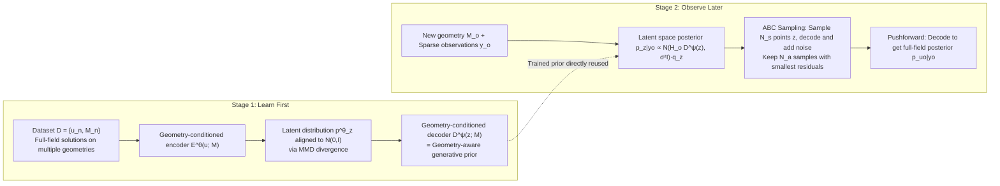

# Geometric Autoencoder Priors for Bayesian Inversion: Learn First Observe Later

**Conference**: ICLR 2026  
**OpenReview**: [https://openreview.net/forum?id=QMMlaI9VbR](https://openreview.net/forum?id=QMMlaI9VbR)  
**Code**: [https://github.com/gduthe/GABI](https://github.com/gduthe/GABI)  
**Area**: Scientific Computing / Bayesian Inverse Problems / Uncertainty Quantification / Graph Neural Network Generative Models  
**Keywords**: Bayesian inversion, geometry-aware prior, graph autoencoder, uncertainty quantification, pushforward prior, ABC sampling  

## TL;DR
GABI utilizes graph autoencoders to distill a geometry-conditioned latent space prior from a large-scale dataset of "geometrically diverse" physical fields. This achieves a "learn first, observe later" paradigm—training requires no knowledge of PDEs, boundary conditions, or observation processes. At inference, this prior is combined with arbitrary observation likelihoods, enabling efficient solution of full-field reconstruction Bayesian inverse problems with well-calibrated uncertainty via ABC sampling.

## Background & Motivation
**Background**: Numerous engineering tasks involve inferring an entire physical field (e.g., temperature fields, flow fields, resonance modes) from sparse, noisy sensor readings, which is a typically highly ill-posed inverse problem. The Bayesian paradigm provides principled regularization and uncertainty quantification (UQ). However, the success of this approach hinges on the **prior setting**—a prior that is too vague results in a diffused posterior, with predictive accuracy significantly lower than that of deterministic supervised methods.

**Limitations of Prior Work**: A natural instinct is to "learn a prior from a dataset of related physical systems." Yet, a defining characteristic of engineering systems is **varying geometry**: every airfoil has a different shape, every vehicle body is unique, and every terrain is distinct. Since fields are tied to their respective function/probability spaces defined by the geometry, a unified prior cannot be directly learned in the "field space." Standard multi-system Bayesian UQ fails under such geometric variation.

**Key Challenge**: One must either use a supervised direct map (high accuracy, but the **observation process must be fixed during training**—any change in sensor count, location, or noise type necessitates retraining) or use GP/physical priors (flexible but often too weak or requiring explicit PDE knowledge). Neither approach achieves the "train once, use everywhere" capability.

**Goal**: To learn a geometry-aware, data-driven prior that is **completely independent of the observation process**, allowing the same prior to serve inverse problems with arbitrary sensor configurations, noise models, and observation operators.

**Key Insight**: **"Learn first, observe later" decoupling**—completely decoupling "prior learning" from "inference with observations." By using a graph autoencoder to jointly embed (geometry, full-field solution) into a fixed-dimensional latent Gaussian prior, one can prove that "solving the inverse problem in latent space is equivalent to solving it in the original field space using a pushforward prior." Consequently, inference only requires sampling the posterior in a low-dimensional latent space and decoding it back to the field on any given geometry.

## Method

### Overall Architecture
GABI is a two-stage framework: **Stage 1 (Learn Prior)** utilizes a geometry-conditioned graph autoencoder to compress solutions from a dataset $D=\{u_n, M_n\}_{n=1}^N$ (field + mesh) into a unified latent Gaussian distribution $q_z=\mathcal{N}(0,I)$. The decoder $D^\psi$ thus serves as a "geometry-conditioned generative prior." **Stage 2 (Observe Later)** handles sparse noisy observations $y_o$ on a new geometry $M_o$. Leveraging a core pushforward equivalence theorem, the Bayesian inverse problem is solved in the low-dimensional latent space, and posterior samples are then pushed back to the full field on the target geometry via the decoder. The inference is implemented using ABC sampling, which is naturally suited for large-scale GPU parallelism.

### Key Designs

**1. Pushforward Prior Equivalence Theorem: Legitimately moving the inverse problem to latent space.** This is the theoretical foundation of the method. Suppose the decoder $g=D^\psi$ pushes forward the latent prior $P_z$ to a field-space prior $P_u := g_\# P_z$. Lemma 2.1 in the paper proves that a field-space posterior with a likelihood proportional to $\exp(-\Phi(u;y))$ is exactly equal to the pushforward of the latent-space posterior, i.e., $P_{u|y} = g_\# P_{z|y}$, where $dP_{z|y}(z) \propto \exp(-\Phi(g(z);y))\,dP_z(z)$. In simpler terms: **performing Bayesian inference on $z$ in the low-dimensional space $Z$ and then decoding is identical to performing inference directly in the high-dimensional field space using the generative prior.** Theorem 2.2 extends this to geometric inverse problems—a unified latent prior $q_z$ combined with a geometry-conditioned decoder $D^\psi_o$ serves inverse problems for any in-distribution geometry $M_o$, with the posterior being $p^\psi_{u_o|y_o} = D^\psi_o{}_\# p_{z|y_o}$. Because the inverse problem occurs only in the low-dimensional latent space, sampling becomes computationally inexpensive, and the prior is completely decoupled from the observation process.

**2. Geometry-Conditioned Statistical Autoencoder: Compressing fields from arbitrary geometries into a unified Gaussian prior via MMD.** Both the encoder $E^\theta_n(u_n):=E^\theta(u_n;M_n)$ and the decoder $D^\psi_n(z):=D^\psi(z;M_n)$ are graph neural networks (GNNs) conditioned on the mesh $M_n$, mapping fields on varying geometries to and from fixed-dimensional latent vectors. The training objective minimizes reconstruction error while aligning the latent distribution with the standard Gaussian:

$$\theta^\star,\psi^\star = \arg\min_{\theta,\psi}\ \widehat{\mathbb{E}}_D\big[\|u_n - (D^\psi_n\circ E^\theta_n)(u_n)\|_2^2\big] + d(p^\theta_z,\, q_z)$$

where $p^\theta_z=\widehat{\mathbb{E}}_D[\delta_{E^\theta_n(u_n)}]$ is the empirical distribution of encoded solutions, $q_z=\mathcal{N}(0,I)$, and the divergence $d$ is the **Maximum Mean Discrepancy (MMD)**. A statistical autoencoder is chosen over a VAE because it aligns the "point cloud" of all geometries' encodings to the Gaussian at a distribution level, ensuring the mathematical consistency of setting the prior of $z$ to $\mathcal{N}(0,I)$. The architecture requires geometry-awareness, fixed-dimensional mapping, and non-locality (implemented using GCNs with non-local mean layers or GEN GNNs for large-scale problems).

**3. ABC Sampling Implementation: Replacing serial MCMC bottlenecks with GPU parallelism.** The data generation model is rewritten in latent variable form as $y_o = H_o D^\psi_o(z) + \xi_o,\ \xi_o\sim\mathcal{N}(0,\sigma^2 I)$, corresponding to the latent space posterior $p^\psi_{z|y_o}(z) \propto \mathcal{N}(H_o D^\psi_o(z), \sigma^2 I)\cdot q_z(z)$. During solving (Algorithm 1 GABI-ABC): $N_s$ samples of $z^{(i)}$ are drawn from $q_z$ in batch, decoded to $u'^{(i)}_o=D^\psi(z^{(i)};M_o)$, and noise is added via the observation operator to obtain $y'^{(i)}_o=H_o u'^{(i)}_o+\xi'^{(i)}_o$. The residuals $r_i=\|y_o-y'^{(i)}_o\|_2$ are calculated, and **the $N_a$ samples with the smallest residuals are kept** as the posterior. ABC is chosen over MCMC because: (i) neural networks allow for massive parallelism while MCMC is inherently serial; (ii) the learned prior is already well-aligned, ensuring decent acceptance rates; and (iii) the observation dimension is low, avoiding the need for summary statistics. Additionally, ABC **does not require likelihood computation**, making it applicable to intractable observation processes.

**4. Joint Estimation of Observation Noise: Incorporating noise into inference without retraining.** The Bayesian framework naturally allows for the joint estimation of the observation noise standard deviation $\sigma_o$, which may vary across systems, via the joint posterior $p^\psi_{z,\sigma_o|y_o}(z,\sigma_o) \propto p^\psi_{y_o|z,\sigma_o}(y_o)\,q_z(z)\,p_{\sigma_o}(\sigma_o)$. A key advantage is that **this extension is completely independent of the autoencoder training**—whereas direct map methods must fix all observation variables (including noise) during training, GABI only introduces the noise prior at test time.

## Key Experimental Results

Tests were conducted on four engineering physics problems: steady-state heat conduction in rectangular domains, RANS flow around airfoils, 3D Helmholtz resonance and acoustic source localization in car bodies, and RANS airflow over terrain. Comparisons were made against direct map (supervised GNN regression) and GP regression on graphs (Matérn 1/2, 3/2, and RBF kernels). Metrics include MAE, coverage within $1/2$ standard deviations (calibration), and training vs. single-geometry prediction time.

### Main Results (Steady-state heat conduction, known noise, 10 observation points)

| Method | MAE | % 1 std | % 2 std | Training | Prediction |
|---|---|---|---|---|---|
| GABI-ABC | $1.58\times10^{-2}$ | 80.91% | 95.59% | 2.62hr | 0.908s |
| GABI-NUTS | $1.11\times10^{-2}$ | 66.66% | 96.18% | Same | 410.31s |
| Direct Map (Supervised) | $1.25\times10^{-2}$ | – | – | 1.47hr | 0.0029s |
| GP (Matérn 1/2) | $8.46\times10^{-2}$ | 66.36% | 89.45% | – | 0.65s |
| GP (RBF) | $1.39\times10^{-1}$ | 14.88% | 29.36% | – | 0.64s |

GABI's accuracy is on the same order as the deterministic supervised Direct Map and is significantly better than GP. The $2\sigma$ coverage reaches 95.59%, indicating good calibration. ABC is ~450x faster than NUTS (0.9s vs. 410s).

### Airfoil flow field reconstruction (Known noise, random number of observation points 5–50)

| Method | Field | MAE | % 1 std | % 2 std |
|---|---|---|---|---|
| GABI-ABC | Pressure $p$ | $6.92\times10^{-2}$ | 78.77% | 97.28% |
| Direct Map | Pressure $p$ | $5.35\times10^{-2}$ | – | – |
| GABI-ABC | $v_x$ | $1.31\times10^{-1}$ | 80.36% | 97.28% |
| GABI-ABC | $v_y$ | $3.94\times10^{-2}$ | 75.87% | 96.08% |

Using only a few pressure sensors on the airfoil surface, GABI can reconstruct the entire flow field (a highly ill-posed problem) with accuracy close to the supervised Direct Map while providing reliable UQ; conversely, the Direct Map must know the observation point distribution during training.

### Ablation Study / Noise Estimation (Steady-state heat conduction, unknown noise)

| Method | QoI | MAE | % 1 std | % 2 std |
|---|---|---|---|---|
| GABI-ABC | Field $u$ | $2.09\times10^{-2}$ | 75.74% | 94.76% |
| Direct Map | Field $u$ | $2.13\times10^{-2}$ | – | – |
| GABI-ABC | Noise $\sigma$ | $7.96\times10^{-1}$ | 42.10% | 69.11% |
| GP (M 1/2) | Noise $\sigma$ | $1.08\times10^{0}$ | – | – |

When noise is unknown, GABI still jointly estimates the field and $\sigma$. Field reconstruction MAE remains comparable to Direct Map and superior to all GPs, and noise estimation is also better than GP—whereas Direct Map cannot estimate noise at all.

### Key Findings
- **Accuracy parity with supervision plus UQ**: In scenarios where supervised learning is applicable, GABI's accuracy matches deterministic methods while providing well-calibrated uncertainty.
- **UQ value in complex geometries**: UQ is robust and properly calibrated in complex geometries; the posterior automatically widens in regions with high data variability and narrows near constant boundaries.
- **ABC as a critical engineering choice**: It is two orders of magnitude faster than MCMC and does not require likelihood calculations, making it suitable for intractable observation processes.
- **Scalability**: Multi-GPU implementation for terrain flow problems demonstrates the potential for training GABI "foundation models."

## Highlights & Insights
- **The "learn first, observe later" decoupling is the primary selling point**: Separating the prior from the observation process enables a "train-once-use-everywhere" capability. Changing sensors, noise levels, or operators does not require retraining, which is highly attractive for industrial applications and structurally impossible for supervised direct maps.
- **Clean Theoretical Foundation**: The pushforward equivalence theorem rigorously reduces high-dimensional Bayesian inversion to the latent space, providing both legitimacy and a reason for the computational efficiency.
- **Synergy of ABC and Neural Networks**: High-performance GPU parallelism offsets the traditional inefficiency of ABC, while the method bypasses likelihood computations and the need for summary statistics.
- **Architecture Agnostic**: The approach only requires geometry-awareness, fixed mapping, and non-locality, allowing GCNs, GEN GNNs, or Transformers to be utilized interchangeably.

## Limitations & Future Work
- **ABC Accuracy-Budget Trade-off**: ABC approximates the posterior by keeping samples with the smallest residuals, which relies on prior-posterior overlap. If the prior does not align well with a new geometry, it may require a much larger sampling budget $N_s$.
- **Higher Prediction Latency than Supervision**: GABI-ABC takes ~0.9s per geometry (~35s for airfoils), whereas Direct Map takes only ~3ms, presenting a gap for real-time applications.
- **Dependence on "In-Distribution Geometry" Assumption**: Theoretical guarantees target in-distribution geometries; extrapolation to entirely new shapes has not been fully verified.
- **Limited Noise Estimation Accuracy**: The coverage for $\sigma$ estimation (42% @1std) is significantly lower than for the field, indicating that joint noise inversion remains relatively coarse.
- **Future Work**: The authors have demonstrated multi-GPU scalability; the next step is to train a true GABI "foundation model" that shares a prior across multiple physical and geometric domains.

## Related Work & Insights
- **Direct Map Inversion** (Duthé et al. 2025, Arridge et al. 2019): Source of inspiration for supervised baselines, though these require fixed observation processes during training.
- **Graph Forward/Inverse Problems and Graph GPs** (Borovitskiy et al. 2021): GP baselines originate from these; Physics-Informed Graph ML (Raissi et al. 2019) requires PDE knowledge, distinguishing them from GABI's data-driven approach.
- **Statistical Autoencoders** (MMD/WAE, Tolstikhin et al. 2018): GABI adopts MMD variants over VAEs and conditions them on geometry.
- **Insight**: Combining "generative models as priors," "pushforward dimensionality reduction," and "likelihood-free sampling" creates a general paradigm for scientific inverse problems where the observation process is unknown at training time. This logic is transferable to tasks like tomography, PIV, and EIT.

## Rating
- **Novelty**: ⭐⭐⭐⭐ — The combination of the pushforward equivalence theorem, geometry-conditioned statistical autoencoders, and ABC creates a useful "learn first observe later" paradigm that practically decouples priors from observations.
- **Experimental Thoroughness**: ⭐⭐⭐⭐ — Covers four heterogeneous geometric problems (heat, flow, resonance, terrain), compares against supervision and multiple GPs, and includes unknown noise and multi-GPU scalability.
- **Writing Quality**: ⭐⭐⭐⭐ — Theoretical discourse (lemmas/theorems) and methodology are clear; contribution points are well-defined.
- **Value**: ⭐⭐⭐⭐ — "Train-once-use-everywhere" is highly valuable for industrial UQ deployment. Both theory and implementation are highly transferable, representing a solid step in prior learning for scientific machine learning.

<!-- RELATED:START -->

## Related Papers

- [\[AAAI 2026\] Knowledge-Guided Masked Autoencoder with Linear Spectral Mixing and Spectral-Angle-Aware Reconstruction](../../AAAI2026/physics/knowledge-guided_masked_autoencoder_with_linear_spectral_mixing_and_spectral-ang.md)
- [\[CVPR 2025\] Improve Representation for Imbalanced Regression through Geometric Constraints](../../CVPR2025/physics/improve_representation_for_imbalanced_regression_through_geometric_constraints.md)
- [\[ICML 2026\] From Geometry to Dynamics: Learning Overdamped Langevin Dynamics from Sparse Observations with Geometric Constraints](../../ICML2026/physics/from_geometry_to_dynamics_learning_overdamped_langevin_dynamics_from_sparse_obse.md)
- [\[ICML 2026\] Distribution Transformers: Fast Approximate Bayesian Inference With On-The-Fly Prior Adaptation](../../ICML2026/physics/distribution_transformers_fast_approximate_bayesian_inference_with_on-the-fly_pr.md)
- [\[ICML 2026\] Loss Landscape Diagnosis for Gradient-Based Gray-Scott System Inversion: Disentangling the Roles of PINN Components](../../ICML2026/physics/loss_landscape_diagnosis_for_gradient-based_gray-scott_system_inversion_disentan.md)

<!-- RELATED:END -->
