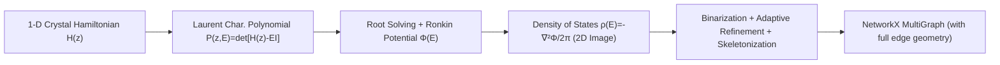

# HSG-12M: A Large-Scale Benchmark of Spatial Multigraphs from the Energy Spectra of Non-Hermitian Crystals

**Conference**: ICLR 2026  
**OpenReview**: [https://openreview.net/forum?id=YxuKCME576](https://openreview.net/forum?id=YxuKCME576)  
**Code**: [Poly2Graph](https://github.com/sarinstein-yan/Poly2Graph) / [HSG-12M](https://github.com/sarinstein-yan/HSG-12M)  
**Area**: Scientific Computing / Graph Representation Learning / Datasets & Benchmarks  
**Keywords**: spatial multigraph, non-Hermitian physics, Hamiltonian spectral graph, graph benchmark, GNN, condensed matter physics  

## TL;DR
This paper "draws" the energy spectra of non-Hermitian crystals as graphs, proposing the automated pipeline Poly2Graph to map 1D crystalline Hamiltonians to spectral graphs on the complex energy plane. Based on this, HSG-12M is constructed: the first large-scale "spatial multigraph" benchmark (11.6M static + 5.1M dynamic graphs across 1401 classes), exposing new challenges for existing GNNs in learning from multigraph edges that preserve geometric information.

## Background & Motivation
**Background**: The success of AI for Science (protein folding, materials discovery, many-body physics) relies heavily on large-scale, high-quality domain datasets, yet the physical sciences face a shortage of such data. Simultaneously, recent discoveries in non-Hermitian physics reveal that energy spectra of 1D crystals under open boundary conditions cluster into arcs and loops on the complex energy plane. These form "Hamiltonian spectral graphs," which possess much richer structures than traditional topological invariants like Chern numbers or $\mathbb{Z}/\mathbb{Z}_2$, serving as natural fingerprints of electronic behavior.

**Limitations of Prior Work**: Previously, spectral graphs could only be plotted manually and inspected visually, limited to toy scales without automated workflows or large-scale datasets, precluding systematic research. Furthermore, almost all public benchmarks in graph representation learning treat data as **simple graphs** (at most one edge between any two nodes). Even when multiedges exist in raw data, they are typically collapsed into a single attribute edge, discarding critical geometric information.

**Key Challenge**: Many real-world networks (urban streets, biological neural networks, protein structures) are essentially **spatial multigraphs**—embedded in metric spaces with multiple geometrically distinct connection paths between two points. When both connection topology and geometry are of interest, collapsing multiedges into one results in irreversible information loss. However, due to a lack of data, methodology for spatial multigraphs remains largely vacant.

**Goal**: To simultaneously fill the gap for both communities—providing physicists with a tool for automated batch extraction of spectral graphs and providing the graph learning community with a genuine large-scale spatial multigraph benchmark.

**Core Idea**: **[Algorithm]** Use a "non-Bloch band theory + algebraic geometry + morphological image processing" triad to automatically convert Hamiltonians into spectral graphs (Poly2Graph); **[Data]** Distill 177 TB of spectral potential data into 12 million spatial multigraphs (HSG-12M); **[Insight]** Further denote that spectral graphs are "universal topological fingerprints" of polynomials/vectors/matrices, building a new bridge for algebra-to-graph translation.

## Method

### Overall Architecture
Poly2Graph is the first end-to-end, high-performance pipeline capable of converting arbitrary 1D crystalline Hamiltonians into spectral graphs, operating approximately $10^5$ times faster than existing optimal code. Its key observation is that spectral graphs are essentially the "ridge lines" of the "spectral potential landscape," which can be calculated directly from the roots of the characteristic polynomial. The pipeline is organized into four steps: "Hamiltonian → Characteristic Polynomial → Spectral Potential/DOS Image → Skeletonized Extraction of Graph."

### Key Designs

**1. From Hamiltonians to Spectral Potentials: Solving Polynomial Roots.** For an $s$-band tight-binding crystal chain, the Bloch Hamiltonian is written as $H(z)=\sum_{j=-p}^{q} T_j z^j, z=e^{ik}$. Its open boundary spectrum is entirely determined by the roots of the Laurent characteristic polynomial $P(z,E)=\det[H(z)-E I_s]=\sum_{n=-p}^{q} a_n(E)z^n$. A minimal bounding region $\Omega$ is defined on the complex energy plane (estimated by diagonalizing a small real-space Hamiltonian with $L=40$) and discretized into a grid. For each energy $E$, the roots of $P(z,E)=0$ are solved and sorted by magnitude. This is the bottleneck for naive methods—solving polynomial roots for $10^6$ grid points. The authors utilize Frobenius companion matrices + parallel eigenvalue solvers (with GPU backend auto-detection) to compress single root-solving from hours to milliseconds, providing the $10^5$ speedup.

**2. Ronkin Potential and Density of States (DOS): Making "Graphs" Computable Images.** Once roots are obtained, follow non-Bloch band theory to calculate the spectral potential (the Ronkin function in algebraic geometry) as $\Phi(E)=-\log|a_q(E)|-\sum_{i=p+1}^{p+q}\log|z_i(E)|$, then take its Laplacian to get the density of states $\rho(E)=-\frac{1}{2\pi}\nabla^2\Phi(E)$. Physically, $\rho(E)$ represents the number of eigenstates per unit area in the complex plane, where regions with $\rho(E)>0$ exactly outline the spectral graph. Geometrically, the DOS is the second-order curvature of the spectral potential, so the spectral graph is the "ridge" of the potential landscape. The authors also exploit symmetries of the characteristic polynomial (real coefficients $\Rightarrow$ symmetric about the real axis; purely imaginary $\Rightarrow$ symmetric about the imaginary axis) to compute only half the plane and mirror it, saving up to 50% computation for qualified polynomials.

**3. Adaptive Resolution + Morphological Extraction: Solving the Resolution-Computation Dilemma.** Spectral graphs typically occupy a very small area of $\Omega$. High resolution everywhere is too expensive, while low resolution loses topological features like small loops or adjacent nodes. The solution involves two stages: first, compute DOS on a coarse 256×256 grid, binarize, and apply a 2×2 disk morphological dilation to get a conservative mask covering the spectral graph, excluding ~95–99% of irrelevant areas. Then, only within the mask, each pixel is subdivided into $m\times m$ (default 4) subgrids for recalculation, effectively reaching 1024×1024 resolution while computing only 1–5% of points. Subsequently, morphological thinning is iteratively applied to the high-resolution DOS until a single-pixel skeleton is achieved. Three types of points are identified: intersection nodes ($\ge 3$ paths), leaf nodes (path ends), and edge points (points on continuous segments), outputting a NetworkX MultiGraph. **Crucially, every edge stores complete geometric information**: an ordered sequence of $(\mathrm{Re}\,E,\mathrm{Im}\,E)$ coordinates, preserving both connectivity and the precise shape of every spectral curve, which is the essence of "spatial multigraphs."

**4. Physics-Driven Category Sampling: Avoiding Redundancy and Covering Real Crystals.** The dataset is categorized by Hamiltonian families (characteristic polynomial classes). Sampling respects mathematical symmetries to avoid redundant entries—e.g., if a polynomial satisfies $z$-reciprocity $P(z)=z^{p+q}P(1/z)$ (physically corresponding to flipping the crystal chain, which leaves the spectrum invariant), only one instance is kept. Starting from a base polynomial $\hat P(z,E)=-E^s+z^{-p}+z^q$, two free complex coefficients $(a,b)$ are assigned to chosen monomials. All combinations for 1–3 bands and hopping ranges 4–6 are traversed, covering realistic 1D tight-binding crystals. After deduplication, 1401 classes are obtained (24 one-band, 275 two-band, 1102 three-band). For each class, the two free coefficients are sampled between $-10-5i$ and $10+5i$ with 13 real $\times$ 7 imaginary values per coefficient, yielding $(13\times7)^2=8281$ samples per class. Continuous variation along a single coefficient's real/imaginary part yields the temporal spectral graphs of T-HSG-5M (where topology jumps at phase transition points).

## Key Experimental Results

### Dataset Statistics
All variants originate from HSG-12M and are thus spatial and irreducible multigraphs.

| Dataset | #Graphs | #Classes | Max/Min Ratio | Temporal |
|---|---|---|---|---|
| HSG-one-band | 198,744 | 24 | 1.0 | - |
| HSG-two-band | 2,277,275 | 275 | 1.0 | - |
| HSG-three-band | 9,125,662 | 1102 | 1.0 | - |
| HSG-topology (isomorphism filtered) | 1,812,325 | 1401 | 660.2 | - |
| T-HSG-5M (Temporal) | 5,099,640 | 1401 | 1.0 | ✓ |
| **HSG-12M (Full)** | **11,601,681** | **1401** | **1.0** | - |

### Main Results: Graph Classification with 8 Mainstream GNNs
Learnable parameters were aligned and a fixed training budget was used (max epochs=100, max steps=1000) across 3 random seeds. Top-1 Accuracy / Macro F1 / Top-10 Acc (excerpts):

| Model | Metric | one-band | three-band | topology | HSG-12M |
|---|---|---|---|---|---|
| GCN | Acc / Top-10 | .711 / .999 | .337 / .816 | .397 / .825 | .365 / .841 |
| GAT | Acc / Top-10 | .677 / .998 | .344 / .825 | .434 / .855 | .365 / .846 |
| GIN | Acc / Top-10 | .799 / 1.000 | .050 / .295 | .095 / .390 | .063 / .339 |
| **GINE** | Acc / Top-10 | .764 / 1.000 | **.379 / .872** | **.533 / .927** | **.460 / .921** |
| MF | Acc | .589 | .271 | .348 | .295 |

(GraphSAGE performed best overall under the given parameters and budget, reaching 95.2% Top-10 Accuracy on HSG-12M; CGCNN reached 94.8%.)

### Key Findings
- **Difficulty scales monotonically with complexity**: From one-band to HSG-12M, all metrics decline steadily as graphs become larger, multiedge geometry becomes richer, isomorphism becomes more complex, and classes increase; memory usage grows accordingly (SAGE 0.067 $\rightarrow$ 0.511 MB/graph).
- **Edge attributes are critical**: The edge-aware GINE vastly outperforms the edge-agnostic GIN (0.460 vs 0.063 on HSG-12M), proving that the spatial geometry of multiedges (length, straight-line distance, midpoint, average potential/DOS) carries irreducible signals.
- **High Top-k favors inverse design**: Although Top-1 accuracy is moderate, Top-10 accuracy reaches 94–95% on the full set and saturates at 99%+ on easy subsets (one-band). This implies that a small pool of candidate Hamiltonian families can be retrieved for expert screening, supporting inverse material design.
- **GraphSAGE is optimal under tight budgets**: It leads across the board under identical parameters and budgets, suggesting it possesses a stronger inductive bias or better sample/computational efficiency for spatial multigraphs.

## Highlights & Insights
- **Translating physical problems into graph problems**: The geometric perspective of spectral graphs as potential ridges transforms energy spectrum research—which previously required precise diagonalization and manual plotting—into a high-throughput GPU-accelerated image-to-graph pipeline. The $10^5$ speedup is the watershed for large-scale feasibility.
- **First large-scale deployment of spatial multigraphs**: By simultaneously preserving both the **topology (edge count)** and **geometry (edge shape)** of multiedges, it directly addresses the "simple graph assumption" blind spot of existing benchmarks, providing a realistic and physics-rich arena for geometry-aware graph learning.
- **A universal bridge for algebra-to-graph**: The authors further argue that spectral graphs are universal topological fingerprints of polynomials/vectors/matrices (real or complex), extending the applicability of these tools from condensed matter physics to broader algebraic objects.
- **Rich attributes without enforced featurization**: Raw data preserves full node/edge geometry. While the authors provide fixed-length edge summary features for the PyG baseline, the community is encouraged to explore stronger representations like curve sequences, curvature, or spline encoding.

## Limitations & Future Work
- **Numerical Instability**: Occasional numerical instability occurs near intersection nodes with extremely low DOS, mitigated by merging nearby nodes and contracting short edges, though complex cases may still fail.
- **Limited to 1D**: Currently covers only 1D tight-binding crystals (hopping range $\le 6$, $\le 3$ bands). 2D/3D crystals and long-range hopping are not yet included.
- **Featurization remains an open problem**: The reference scheme uses orientation-independent fixed-length edge summaries. The gap between Top-1 and Top-10 performance suggests room for stronger edge geometric encodings (curvature/torsion, higher-order moments, Bézier/polyline sequences), especially on high-diversity subsets.
- **Relatively single task**: The current benchmark focuses on graph-level classification. Extrapolation/early-sequence classification on temporal sets and "spectral graph $\rightarrow$ Hamiltonian" inverse design tasks remain at the promising stage.

## Related Work & Insights
- **Non-Hermitian Band Theory**: Built upon recent advances in Ronkin functions / non-Bloch bands (Tai & Lee 2023; Xiong & Hu 2023; Wang et al. 2024), mapping the "spectral potential = Ronkin function" algebraic tool to a computable pipeline.
- **Graph Classification Benchmarks**: Compared to MUTAG, PROTEINS, OGB (ppa/molpcba), and MALNET, HSG-12M ranks first in both graph and class counts and is the only large-scale spatial multigraph benchmark; nearest neighbor OpenStreetMap is smaller and lacks ML tasks.
- **Temporal Graphs**: Existing temporal graph data mostly focus on node/edge-level tasks; T-HSG-5M is the first large-scale dynamic graph collection for graph-level tasks.
- **Insight**: When physical quantities in a domain can be geometrizsed into graphs (ridges, skeletons), large-scale discovery via graph learning becomes possible; conversely, structured physical data forces graph learning to confront long-simplified dimensions like "geometry + multiedges."

## Rating
- **Novelty**: ⭐⭐⭐⭐⭐ First large-scale spatial multigraph benchmark + first large-scale graph-level dynamic graph set + new algebra-to-graph perspective, filling a genuine gap between condensed matter physics and graph learning.
- **Experimental Thoroughness**: ⭐⭐⭐⭐ 8 mainstream GNNs $\times$ 5 scale variants with multiple metrics + memory/throughput analysis. Strong conclusions (edge attribute importance, high Top-k, reasonable difficulty gradients); however, lacks new methods specifically for spatial multiedges, as the benchmark primarily "exposes problems."
- **Writing Quality**: ⭐⭐⭐⭐ Explains both physics and ML contexts clearly. Figures 1 and 2 are intuitive. Pipeline and sampling schemes are well-documented; however, some formulas and appendices are heavy.
- **Value**: ⭐⭐⭐⭐⭐ Open-sourced tools (MIT) + data (CC BY 4.0). Serves both inverse material design and provides a long-term benchmark for geometry-aware graph learning with significant potential impact.

<!-- RELATED:START -->

## Related Papers

- [\[ICLR 2026\] RealPDEBench: A Benchmark for Complex Physical Systems with Real-World Data](realpdebench_a_benchmark_for_complex_physical_systems_with_real-world_data.md)
- [\[ICML 2025\] Erwin: A Tree-based Hierarchical Transformer for Large-scale Physical Systems](../../ICML2025/physics/erwin_a_tree-based_hierarchical_transformer_for_large-scale_physical_systems.md)
- [\[ICML 2025\] Rethink the Role of Deep Learning towards Large-scale Quantum Systems](../../ICML2025/physics/rethink_the_role_of_deep_learning_towards_large-scale_quantum_systems.md)
- [\[ICLR 2026\] PINFDiT: Energy-Based Physics-Informed Diffusion Transformers for General-purpose Time Series Tasks](pinfdit_energy-based_physics-informed_diffusion_transformers_for_general-purpose.md)
- [\[NeurIPS 2025\] TITAN: A Trajectory-Informed Technique for Adaptive Parameter Freezing in Large-Scale VQE](../../NeurIPS2025/physics/titan_a_trajectory-informed_technique_for_adaptive_parameter_freezing_in_large-s.md)

<!-- RELATED:END -->
