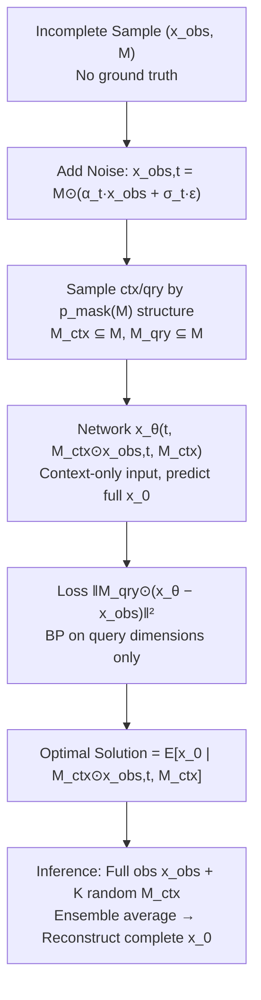

# Incomplete Data, Complete Dynamics: A Diffusion Approach

**Conference**: ICLR 2026  
**OpenReview**: [https://openreview.net/forum?id=NYvvkBlSX2](https://openreview.net/forum?id=NYvvkBlSX2)  
**Code**: To be confirmed  
**Area**: Scientific Computing / Physical Dynamics / Diffusion Models  
**Keywords**: Diffusion Models, Missing Data, Physical Dynamics, Data Imputation, Conditional Generation, Convergence Guarantees  

## TL;DR
A conditional diffusion framework **trainable using only incomplete observations** is proposed. By employing a "context-query" partitioning strategy designed according to the observation distribution structure, the diffusion model approximates the conditional expectation of the true complete data without ever seeing full samples. Theoretical guarantees for asymptotic convergence are provided, and the method significantly outperforms existing imputation techniques on sparse physical observations such as fluids and meteorology.

## Background & Motivation

**Background**: Learning physical dynamics (weather forecasting, fluid dynamics, biological systems) from observational data is a core problem in machine learning and scientific computing. Unlike pixel-dense natural images, physical measurements are inherently sparse—sensors sample at discrete locations, satellites are obscured by clouds, and experiments are limited by instrumentation. This incompleteness is an **intrinsic property** of observing physical systems rather than a temporary issue solvable by better collection.

**Limitations of Prior Work**:

- **Oversimplified observation patterns**: Most missing data generation methods assume pixel-level i.i.d. random missingness, where each spatial location is observed with equal probability. However, real observations have strong spatial structures—weather stations cover local continuous regions, satellites sweep in orbital strips, and underwater sensor arrays are limited by acoustic propagation ranges. Existing methods apply the same training strategy to all missing patterns, failing to exploit specific mask distribution characteristics.
- **Lack of theoretical foundation**: Existing generative methods for handling missing data are mostly heuristically designed, lacking convergence guarantees or understanding of learning dynamics. The few theoretically motivated methods are computationally expensive due to the need for multiple full re-trainings or complex importance weighting, limiting them to low-dimensional toy problems.

**Key Challenge**: Given there are **no complete samples in the training set** (only $\{(x^{(i)}_\text{obs}, M^{(i)})\}$), how can a diffusion model learn to predict dimensions that have "never been observed"? This is the fundamental tension in learning a complete distribution from incomplete data.

**Goal**: Construct a diffusion framework with theoretical convergence guarantees and the ability to efficiently process high-dimensional physical dynamics. It aims to answer three questions: Can a diffusion model trained only on incomplete data recover the full distribution? How do observation patterns affect training efficiency? Under what conditions is the reconstruction of unobserved regions guaranteed?

**Core Idea**: **[Hierarchical Masking]** Treat each incomplete sample $x_\text{obs}$ as "locally complete," then further partition a context mask $M_\text{ctx}$ (fed to the model) and a query mask $M_\text{qry}$ (used for loss calculation). The sampling of $M_\text{ctx}$ **mimics the structure of the true observation mask $p_\text{mask}(M)$**, ensuring every dimension (including original missing dimensions) has a positive query probability. This is combined with ensemble sampling to bridge the distribution gap between training and inference.

## Method

### Overall Architecture
The approach decomposes the training of an imputation model from incomplete data into three parts: (1) **Denoising data-matching on incomplete data**—constructing a training objective using only context masks as input and query masks for loss, proving its optimal solution is the conditional expectation; (2) **Strategic context-query partitioning**—sampling context masks based on the structural properties of true observation masks (pixel-level or block-level) to ensure non-zero query probability for all dimensions; (3) **Ensemble sampling reconstruction**—utilizing full observations during inference and performing ensemble averaging over multiple random context masks to eliminate variance and converge to the true conditional expectation.

### Key Designs

**1. Denoising data-matching loss on incomplete data: Turning "missingness" into "active hiding".** The key insight is to treat the observed part $x_\text{obs}$ as the "complete data" within that sample's scope, and then artificially partition it into context and query sets. Given a noisy sample at time $t$, $x_{\text{obs},t}=M\odot(\alpha_t x_\text{obs}+\sigma_t\epsilon)$, the network only sees the noisy observation under the context mask $M_\text{ctx}\odot x_{\text{obs},t}$ and the mask $M_\text{ctx}$ itself to predict the full clean data $x_0$. The loss is calculated only on the query dimensions:

$$L(t, x_\text{obs}, M_\text{ctx}, M_\text{qry}) = \big\|M_\text{qry}\odot\big(x_\theta(t, M_\text{ctx}\odot x_{\text{obs},t}, M_\text{ctx}) - x_\text{obs}\big)\big\|^2$$

This design of "actively hiding a part of the observed values and requiring the model to restore them" forces the model to learn the inductive capability of inferring other locations from a local context, which is exactly the capability required for imputation.

**2. Optimal Solution Theorem: Revealing "which dimensions can be learned and which cannot."** Theorem 1 proves the optimal solution for the aforementioned loss is:

$$(x_\theta)_i = \begin{cases} \mathbb{E}[(x_0)_i\mid M_\text{ctx}\odot x_{\text{obs},t}, M_\text{ctx}], & P((M_\text{qry})_i=1\mid M_\text{ctx})>0\\ \text{Arbitrary}, & P((M_\text{qry})_i=1\mid M_\text{ctx})=0\end{cases}$$

That is, the model learns a meaningful conditional expectation for dimension $i$ only if it has a **positive query probability**. Otherwise, it receives no gradient and produces arbitrary output. Furthermore, the gradient magnitude and parameter update frequency are proportional to the query probability $p_i=P((M_\text{qry})_i=1\mid M_\text{ctx})$. This theorem reduces the ability to learn reconstruction for a dimension to whether it has a positive query probability, providing precise design criteria for the partitioning strategy—it must ensure every dimension outside the context (including original missing dimensions) has a chance to be selected as a query point.

**3. Sampling context masks by observation distribution structure: Matching partitioning to true missing patterns.** Principle 1 requires non-zero and approximately uniform query probability for all unobserved dimensions. The paper decomposes query probability using the law of total probability: $P((M_\text{qry})_i=1\mid M_\text{ctx})=\sum_M P((M_\text{qry})_i=1\mid M_\text{ctx},M)\cdot P(M\mid M_\text{ctx})$. The key insight is that the context mask must be sampled "blurred enough" so that **multiple** possible observation masks $M$ contain it. For example, in a 3x3 grid with 2 random missing blocks: if context is sampled uniformly by pixels (Fig.1 top), a given $M_\text{ctx}$ corresponds to only one unique $M$, and the original missing dimensions always have zero query probability; if **context is sampled based on block structure** (Fig.1 bottom, typically containing 4 complete blocks), the same $M_\text{ctx}$ corresponds to multiple possible $M$, ensuring positive query probability for all dimensions. This translates the abstract theoretical condition into an actionable criterion: "Context sampling must replicate the structure of the observation mask."

**4. Ensemble sampling to bridge training-inference distribution gaps.** During training, the model learns the conditional expectation under a random context mask $\mathbb{E}[x_0\mid M_\text{ctx}\odot x_{\text{obs},t}, M_\text{ctx}]$, whereas inference seeks $\mathbb{E}[x_0\mid x_{\text{obs},t}, M]$ based on full observations. The paper uses single-step sampling (taking minimal noise $t=\delta\approx0$ so $M\odot x_\delta\approx x_\text{obs}$) combined with ensemble averaging over $K$ random context masks:

$$x^* = \mathbb{E}[x_0\mid x_\text{obs}, M] \approx \frac{1}{K}\sum_{k=1}^{K} x_\theta\big(\delta, M^{(k)}_\text{ctx}\odot x_{\text{obs},\delta}, M^{(k)}_\text{ctx}\big)$$

Theorem 2 proves that ensemble averaging eliminates the variance term (error converges at a rate of $1/K$), leaving only the residual "information gap between context and full observation" plus systematic model bias. The paper also identifies two training trade-offs: too few context points lead to a large information gap and slow convergence (Theorem 2), while too many context points lead to small query probabilities $p_i$ and sparse updates for missing dimensions (Eq. 5). Thus, a **moderate context ratio** is optimal, and a multi-step sampling variant is provided for scenarios requiring diversity.

## Key Experimental Results

Datasets: Synthetic PDEs (Shallow Water, Advection, Navier-Stokes) + real climate data ERA5. The observation rate ranges from 80% to as low as 1%. A critical setting is that the training set **never contains full ground truth**, distinguishing it from traditional imputation tasks where full data is artificially masked.

### Main Results (Pixel-level masks, lower is better)

| Method | Navier-Stokes 80% (×10⁻³) | NS 60% | NS 20% | ERA5 20% (×10⁻²) | ERA5 10% | ERA5 1% |
|---|---|---|---|---|---|---|
| Temporal Consistency | 1.341 | 2.709 | 5.709 | 0.967 | 1.179 | 9.735 |
| Fast Marching | 0.486 | 1.220 | 3.737 | 0.710 | 0.978 | 3.053 |
| Navier-Stokes inpaint | 0.263 | 0.656 | 2.989 | 0.600 | 0.942 | 3.074 |
| MissDiff | 0.251 | 0.611 | 3.077 | 0.416 | 0.676 | 1.653 |
| AmbientDiff | 0.238 | 0.538 | 2.043 | 0.256 | 0.414 | 1.234 |
| **Ours** | **0.223** | **0.507** | **1.931** | **0.250** | **0.408** | **1.229** |

Optimal performance is achieved across most sparsity levels. As sparsity increases (e.g., ERA5 1%), the relative advantage over traditional methods becomes more significant.

### Ablation Study (Block-level masks, validating partitioning strategy necessity)

| Method | Shallow Water 8/9 | SW 5/9 | Advection 8/9 | Adv 5/9 | NS 8/9 |
|---|---|---|---|---|---|
| MissDiff | 0.0285 | 0.1166 | 0.1202 | 0.1979 | 1.4357 |
| AmbientDiff | 0.0217 | 0.0925 | 0.1077 | 0.1524 | 1.4954 |
| Ours **Pixel-level (Incorrect)** | 0.0215 | 0.0989 | 0.1171 | 0.1894 | 1.4925 |
| Ours **Block-level (Correct)** | **0.0203** | **0.0865** | **0.1065** | **0.1407** | **0.7592** |

Using the same model, simply changing the context-query partitioning strategy from "incorrect pixel-level" to "observation-matching block-level" causes the Navier-Stokes 8/9 error to drop from 1.49 to 0.76 (nearly halved), directly validating the theory: **partitioning must match the observation structure.**

### Key Findings
- **Superiority in extreme sparsity**: The margin over heuristic and existing diffusion methods is largest in the 1%–20% extremely sparse range.
- **Partition matching is critical**: Under block observations, pixel-level partitioning degrades to baseline levels, whereas block-level partitioning unlocks the model's power.
- **Graceful degradation in out-of-distribution generalization**: When training/test observation rates are inconsistent (Tab. 3), performance declines smoothly rather than collapsing, thanks to adaptive context sampling that maintains the effective input ratio.

## Highlights & Insights
- **Formalizing "unlearnable dimensions"**: Theorem 1 precisely characterizes learnable dimensions via "positive query probability," providing a verifiable criterion for learning full distributions from incomplete data.
- **Isomorphism between partitioning and observation distribution**: The core innovation is not a new network architecture but a strategy ensuring that "one context corresponds to multiple possible observation masks"—the key to granting positive query probability to originally missing dimensions.
- **Closed loop of Theory-Method-Experiment**: Trade-offs between information gap and update frequency predict an "optimal moderate context ratio," and the $1/K$ convergence of ensemble variance reduction is both theoretically supported and empirically verified.

## Limitations & Future Work
- **Reliance on known mask distribution priors**: The method requires a reasonable estimate of $p_\text{mask}(M)$ (sensor layouts, measurement protocols). Robustness when the observation process is unknown or drifts has not been fully explored.
- **Preconditions for single-step sampling**: Single-step reconstruction relies on the assumption of a "highly concentrated posterior with a unique solution." Scenarios with high uncertainty/multimodal posteriors may require multi-step sampling, which accumulates errors.
- **Ensemble cost**: Inference requires $K$ forward passes for $K$ context masks. The trade-off between $K$ and accuracy in high-dimensional, large-scale scenarios warrants attention.
- **Evaluation domain biased towards physical PDEs/weather**: Generalization to more irregular, non-grid, and highly coupled multivariate scientific observations remains to be verified.

## Related Work & Insights
- **Missing Data Diffusion**: MissDiff and AmbientDiff train diffusion directly on incomplete data but use uniform masking strategies and lack convergence guarantees. This paper unifies them under the data-matching paradigm for fair comparison and provides missing theoretical foundations.
- **Inverse Problems/Imputation**: Traditional methods like Fast Marching and Navier-Stokes inpainting lack learned priors and degrade severely under high sparsity.
- **Insight**: For any generative task where training data itself is missing or has structured noise, rather than pursuing larger models, one should first determine if the "self-supervised partitioning covers all dimensions needing prediction." Dimensions with zero query probability cannot be learned regardless of training. This criterion is transferable to masked modeling, sparse reconstruction, and sensor fusion.

## Rating
- Novelty: ⭐⭐⭐⭐ Combining "context sampling mimicking observation structure" with learnability criteria (query probability > 0) is a clear and theoretically novel perspective for learning full distributions from incomplete data.
- Experimental Thoroughness: ⭐⭐⭐⭐ Covers synthetic PDEs + real ERA5, pixel/block masks, 80%–1% sparsity, cross-distribution generalization, and multiple ablations.
- Writing Quality: ⭐⭐⭐⭐ Logic flows from problem motivation to theory, partitioning criteria, sampling, and experiments. Theorems correspond directly to design choices with intuitive illustrations.
- Value: ⭐⭐⭐⭐ Addresses the real-world pain point of sparse scientific measurements with a theoretically grounded and scalable imputation framework, holding practical potential for earth sciences and fluid dynamics.

<!-- RELATED:START -->

## Related Papers

- [\[ICLR 2026\] LD-EnSF: Synergizing Latent Dynamics with Ensemble Score Filters for Fast Data Assimilation with Sparse Observations](ld-ensf_synergizing_latent_dynamics_with_ensemble_score_filters_for_fast_data_as.md)
- [\[ICLR 2026\] Proximal Diffusion Neural Sampler](proximal_diffusion_neural_sampler.md)
- [\[ICLR 2026\] A Function-Centric Graph Neural Network Approach for Predicting Electron Densities](a_function-centric_graph_neural_network_approach_for_predicting_electron_densiti.md)
- [\[ICLR 2026\] Spectral-Guided Physical Dynamics Distillation](spectral-guided_physical_dynamics_distillation.md)
- [\[ICLR 2026\] OXtal: An All-Atom Diffusion Model for Organic Crystal Structure Prediction](oxtal_an_all-atom_diffusion_model_for_organic_crystal_structure_prediction.md)

<!-- RELATED:END -->
