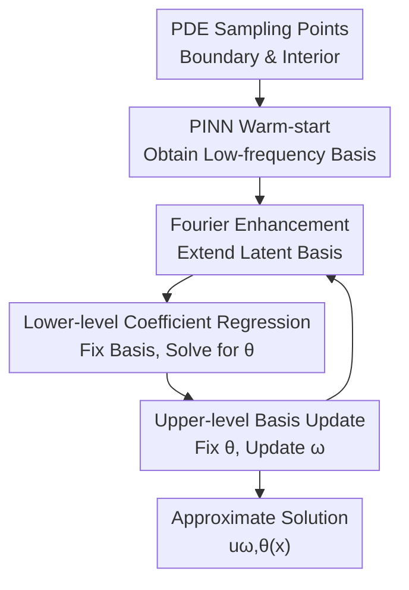

# Iterative Training of Physics-Informed Neural Networks with Fourier-enhanced Features

**Conference**: ICLR2026  
**OpenReview**: [https://openreview.net/forum?id=ybffyf7LE7](https://openreview.net/forum?id=ybffyf7LE7)  
**Code**: https://github.com/CyberAltrumi/IFeF-PINN  
**Area**: PINN / Scientific ML / Physics-Informed Learning  
**Keywords**: PINN, Spectral Bias, Random Fourier Features, Bi-level Optimization, High-frequency PDEs  

## TL;DR
IFeF-PINN extends the hidden layer features of PINNs into random Fourier bases and alternates between "basis function generation" and "linear coefficient regression," significantly mitigating the spectral bias of standard PINNs on high-frequency and multi-scale PDEs.

## Background & Motivation
**Background**: Physics-Informed Neural Networks (PINNs) incorporate PDE residuals, boundary conditions, and limited observational data into a loss function to directly approximate the unknown solution $u(x)$ using a neural network. This mesh-free approach is attractive for complex geometries and high-dimensional problems, making deep learning a universal route for solving numerical PDEs.

**Limitations of Prior Work**: Standard PINN training is susceptible to spectral bias: the network fits low-frequency components first, while high-frequency oscillatory components are learned slowly or remain underfit. For systems such as wave propagation, turbulence, and quantum dynamics that contain fast oscillations, this low-frequency-first behavior is not just a small error but can drive the solution toward incorrect steady states or aliased versions. Gradient imbalances between boundary terms and interior residuals further amplify this failure mode.

**Key Challenge**: Standard PINNs bundle two roles that should ideally be separated into a single non-convex optimization: the hidden layers are responsible for generating usable feature bases, while the final layer fits coefficients on these bases. When features are poorly learned, coefficient regression is hindered; conversely, if the coefficients fail to find a suitable projection, backpropagation signals to the hidden layers are biased toward low frequencies and local residuals. Thus, the questions of "what bases to learn" and "how to combine them" interfere with each other.

**Goal**: The authors aim to retain the universal physics-constrained training form of PINNs while making the model behave more like classical numerical methods that construct basis functions first and then solve for coefficients. Specifically, this work addresses three questions: how to supplement high-frequency expressive power onto existing PINN latent features; how to transform coefficient solving under linear PDEs into a controllable convex problem; and how to form an iterative training algorithm without completely overturning the PINN training workflow.

**Key Insight**: The authors observe that the final layer of a PINN is essentially a linear readout on hidden layer features $h_\omega(x)$. By applying Random Fourier Features (RFF) directly to $h_\omega(x)$, the original dot-product kernel can be replaced with a stationary kernel better suited for expressing high-frequency variations. In this way, high-frequency enhancement is applied not to the raw input, but to the latent basis already adaptively learned by the network.

**Core Idea**: Extend the hidden layer basis functions of the PINN using Random Fourier Features and decompose training into an iterative bi-level optimization that alternates between "solving for optimal linear coefficients with fixed bases" and "updating the basis generator with fixed coefficients."

## Method

### Overall Architecture
The workflow of IFeF-PINN can be understood as "warm-starting a low-frequency latent basis using a standard PINN, extending this basis to a richer high-frequency space using RFF, and iteratively performing coefficient regression and basis updates on the extended basis." The inputs remain space/time coordinates and sampling points, and the output is an approximate solution $u_{\omega,\theta}(x)$ satisfying boundary conditions and physical residual constraints.

In linear PDEs, after fixing the hidden layer parameters $\omega$, the lower-level problem for the output coefficients $\theta$ is a quadratic optimization that can be solved directly for a unique global optimum. Subsequently, by fixing $\theta$, a gradient descent step is performed on $\omega$ to allow the hidden layers to generate bases better suited for the current PDE. For non-linear PDEs, where the lower-level problem is no longer convex, the authors use periodic gradient descent to approximate local minima.

### Key Designs
**1. Fourier-enhanced Latent Basis: Supplementing High-frequency Expression in Adaptive Feature Space**

While standard Fourier Feature PINNs often apply random mapping directly to the input coordinates $x$, this work applies the mapping to the final hidden layer features $h_\omega(x)$. A standard PINN $\tilde u_{\omega,W}(x)=Wh_\omega(x)$ is used for warm-up to capture the low-frequency structure; then, $\psi_D(x)=\gamma_D(h_\omega(x))$ is defined, where

$$
\gamma_D(z)=\frac{1}{\sqrt D}\begin{bmatrix}\cos(2\pi B_Dz)\\ \sin(2\pi B_Dz)\end{bmatrix}, \quad B_D\sim \mathcal N(0,\sigma^2).
$$

The key is not simply "adding more features," but treating the deformed coordinate system learned by the low-frequency PINN as the input for RFF. If the warm-start model captures the low-frequency contour of the true solution, RFF generates a large number of sine/cosine bases within this contour space, providing candidate directions that may cover high-frequency oscillations. Since $D$ can be chosen independently of network width, the model extends the number of basis functions without deepening the hidden network.

**2. Lower-level Coefficient Regression: Transforming PINN Fitting into a Solvable Quadratic Problem**

On the extended basis, the approximate solution is written as $u_{\omega,\theta}(x)=\psi_D(x)^\top\theta$. When the PDE operator $F$ and boundary/initial condition operator $B$ are linear, the physical residuals and boundary errors are also linear with respect to $\theta$. Thus, the sampling loss $\hat L_\lambda(u_{\omega,\theta})$ becomes quadratic in $\theta$:

$$
L_{lower}(\theta\mid\omega)=\frac{1}{2}\theta^\top Q(\omega)\theta+c(\omega)^\top\theta+b.
$$

Given regularization weight $\lambda>0$ and satisfied rank conditions, $Q(\omega)$ is positive definite, and the lower-level optimal coefficient has a closed-form solution $\theta^\star(\omega)=-Q(\omega)^{-1}c(\omega)$. This step isolates the "final linear combination," which is most easily disrupted by non-convex training in PINNs, and solves it optimally. This differs significantly from end-to-end training, where $\theta$ is initialized randomly and learned slowly alongside $\omega$; IFeF-PINN ensures $\theta$ is optimal for the current basis at every iteration.

**3. Iterative Bi-level Training: Alternating Basis Generation and Coefficient Solving**

A single pass of "warm-start + RFF + closed-form regression" is insufficient because the $h_\omega$ obtained from warm-starting may still favor low-frequency bases. IFeF-PINN therefore adopts iterative training: in round $k$, $\psi_D$ is constructed based on $\omega_k$ to solve for $\theta_{k+1}=\theta^\star(\omega_k)$. Then, fixing $\theta_{k+1}$, a gradient descent step is performed on the upper-level loss $L_{upper}(\omega\mid\theta_{k+1})$ to obtain $\omega_{k+1}$. The updated hidden layers are used to reconstruct the RFF basis in the next round.

The intuition is that lower-level regression tells the model "how to best combine current candidates to satisfy the PDE," while the upper-level update adjusts the hidden layers based on this optimal combination to make the next batch of candidates more useful. Theoretical analysis proves that under standard assumptions (strongly convex lower problem, smooth hypergradients, lower bounds), $\theta^\star(\omega)$ is locally Lipschitz with respect to $\omega$, leading upper-level gradient descent to converge to a stationary point. For non-linear PDEs, the authors acknowledge the loss of global convexity and rely on local minima near SOSC and periodic lower-level updates.

**4. Pluggable Weight Balancing: IFeF as a PINN Training Wrapper**

The paper also tests IFeF-PD, which integrates primal-dual weight balancing into the IFeF workflow. This demonstrates that IFeF-PINN is not dependent on a specific fixed loss weight but acts as a framework that can be combined with existing PINN techniques. While boundary terms and residuals often suppress each other when $\lambda$ is fixed in standard PINNs, the inclusion of primal-dual allows adaptive adjustment of constraint strengths during upper-level training.

This explains the complementary relationship between IFeF and IFeF-PD in experiments: for some low-frequency problems, pure IFeF is sufficient; for harder linear PDEs like high-frequency Helmholtz, IFeF-PD further reduces the relative $L_2$ error from $0.0156$ to $0.0092$. In other words, RFF enhancement addresses whether high-frequency bases are available, bi-level training ensures coefficients are optimal for the basis, and weight balancing ensures gradients from different physical constraints are reasonable.

### A Concrete Example
Using the high-frequency Helmholtz equation as an example, standard PINNs typically learn a smooth low-frequency approximation first, leaving fast oscillatory parts in the error map indefinitely. IFeF-PINN uses this standard PINN as a warm-up; even if it is an incomplete low-frequency solution, it provides an initial set of hidden layer features $h_\omega(x)$.

Next, $h_\omega(x)$ for each sampling point is projected onto a random matrix $B_D$ to generate $2D$-dimensional sine/cosine extended bases $\psi_D(x)$. With these bases fixed, the residuals and boundary terms for the linear Helmholtz become a quadratic objective for $\theta$, which is solved directly for the current optimal $\theta$. If the current basis cannot cover certain ripples, upper-level gradients continue to adjust $h_\omega$, and the subsequent RFF mapping changes, equivalent to providing a new, more suitable set of high-frequency candidate bases.

In the high-frequency Helmholtz experiment ($a_1=a_2=100$), Vanilla PINN, PINNsformer, and NTK failed to converge. PIG achieved a relative $L_2$ error of approximately $1.6884$. Ours (IFeF) reached $0.0156$, and IFeF-PD reached $0.0092$. This example illustrates the main benefit: not just "training harder," but changing the representation space and coefficient solving method to allow high-frequency modes to enter the solution space.

### Loss & Training
The basic PINN loss includes boundary/initial condition errors and interior PDE residuals:

$$
\hat L_\lambda(u_\omega)=\frac{1}{N_u}\sum_i\|g(x_u^i)-B[u_\omega](x_u^i)\|^2+\lambda\frac{1}{N_f}\sum_i\|F[u_\omega](x_f^i)\|^2.
$$

IFeF-PINN first pre-trains for several epochs to obtain $\omega_0$. This warm start is crucial for homogeneous PDEs, as random initialization might lead to near-zero outputs, causing the lower-level problem to degenerate into a meaningless $u\equiv 0$ solution. In linear PDEs, precise lower-level updates are performed at every round. In non-linear PDEs, $\theta$ is updated approximately via gradient descent every $N_{lower}$ epochs, while $\theta$ remains fixed in intermediate rounds to save computation. The primary evaluation metric is the relative $L_2$ error $\|u_{pred}-u_{real}\|_2/\|u_{real}\|_2$, averaged over 5 random seeds.

## Key Experimental Results

### Main Results
The paper covers low-frequency benchmarks, high-frequency/multi-scale PDEs, spectral analysis, and several ablations. Baselines include Vanilla PINNs, NTK, PINNsformer, and Physics-Informed Gaussians (PIG). Multiple Fourier Features are compared in the appendix. Both IFeF and IFeF-PD (with primal-dual weight balancing) are reported.

| Task | Metric | Best Result (Ours) | Main Comparison | Conclusion |
|------|------|--------------|----------|------|
| Low-freq 2D Helmholtz | relative $L_2$ error | IFeF-PD: $3.5\times10^{-5}$ | Multiple PINN variants | Lowest error even on low-freq linear PDEs |
| Low-freq 1D convection | relative $L_2$ error | IFeF: $4.3\times10^{-5}$ | Vanilla / NTK / PINNsformer / PIG | IFeF is stable on standard benchmarks |
| Viscous Burgers | relative $L_2$ error | IFeF (lowest median error) | Non-linear PDE baselines | Benefits persist in non-linear scenarios |
| High-freq Helmholtz $(a_1=a_2=100)$ | relative $L_2$ error | IFeF-PD: $0.0092\pm0.0031$ | PIG: $1.6884\pm0.2775$ (others failed) | Most significant advantage in high-freq linear PDEs |
| High-freq convection $(\beta=200)$ | relative $L_2$ error | IFeF-PD: $0.0025\pm0.0005$ | Vanilla: $0.9024\pm0.0239$ | Significant mitigation of spectral bias |
| Multi-scale convection-diffusion | relative $L_2$ error | IFeF: $0.0009\pm0.0003$ | Vanilla: $0.0501\pm0.0030$ | Simultaneous fit of low/high frequency |

### Ablation Study
| Configuration | Key Metric | Description |
|------|----------|------|
| Remove RFF, keep two-step optimization | Low-freq convection: $\approx 1.4923\times10^{-2}$ | Slightly better than Vanilla, but much worse than full IFeF; failed on high-freq |
| End-to-End vs IFeF (Low-freq Helmholtz) | E2E: $0.0088$; IFeF: $0.0003$; IFeF-PD: $0.00005$ | Co-optimizing $\omega, \theta$ loses lower-level optimality; large gap in linear PDEs |
| End-to-End vs IFeF (High-freq Helmholtz) | E2E failed; IFeF: $0.0156$; IFeF-PD: $0.0092$ | Two-stage training is key for high-freq success |
| End-to-End vs IFeF (Burgers) | E2E: $0.0049$; IFeF: $0.0024$; IFeF-PD: $0.0033$ | Advantage remains in non-linear PDEs but is less dominant |
| Varying $D$ (Low-freq Helmholtz) | $D=400$: $2.1\times10^{-4}$; $D=3000$: $4.5\times10^{-4}$ | More features aren't always better; risk of overfitting or rank issues |
| Varying $\sigma$ (High-freq Helmholtz) | $\sigma=10$: $3.0\times10^{-3}$; $\sigma=0.2$: $1.05\times10^{-1}$ | High-freq tasks are very sensitive to $\sigma$, requiring wider bandwidth |

### Key Findings
- RFF extension and bi-level training are both indispensable. Keeping bi-level but removing RFF results in failure at high frequencies. End-to-end training using the $u_{\omega,\theta}=\psi_D(x)^\top\theta$ formulation without solving for optimal $\theta$ in each round is significantly weaker than IFeF in linear PDEs.
- High-frequency tasks provide the strongest evidence. IFeF-PD achieved $0.0092$ where others failed in Helmholtz ($a_1=a_2=100$). For high-frequency convection, Vanilla error was $\approx 0.9$ while IFeF-PD was $0.0025$.
- Spectral analysis supports the explanation of spectral bias. In a convection task with 10 superimposed sine frequencies, Vanilla PINN failed to recover high-frequency amplitudes. Increasing RFF features improved normalized amplitude recovery even before full bi-level training.
- Hyperparameters $D$ and $\sigma$ are critical. Low-frequency problems are robust, but high-frequency problems depend heavily on $\sigma$; higher $\sigma$ covers higher frequencies, but excessive features or the wrong scale introduce numerical risks.

## Highlights & Insights
- The greatest highlight is localizing the last layer of the PINN as "regression on basis functions." This perspective bridges neural network training with classical numerical PDE methods, allowing the use of global optimal coefficients for linear PDEs instead of just empirical tuning.
- Applying RFF to latent features instead of raw coordinates is clever. Raw coordinate Fourier features provide a fixed frequency dictionary, whereas latent feature RFF follows the adaptive deformation of $h_\omega$, effectively supplementing high frequencies onto the "learned coarse solution coordinate system."
- The paper explains spectral bias not just as an experimental phenomenon but through frequency domain analysis. This is more explanatory than simple error plots and proves that RFF's role is not just accidental tuning.
- IFeF-PINN functions as a wrapper for existing PINN tricks. IFeF-PD shows that basis expansion/bi-level solving is compatible with weight balancing; future work could integrate adaptive sampling, domain decomposition, or curriculum strategies.
- For Scientific ML, the insight is that some PINN failure modes might not require larger networks but a separation of "representation space" and "solver." For linear or near-linear physical systems, this separation should be prioritized.

## Limitations & Future Work
- The core limitation is non-linear PDEs. In linear PDEs, the lower-level problem is a strongly convex quadratic program with a closed-form solution. In non-linear PDEs, it becomes non-convex, requiring approximation via gradient descent, which reduces theoretical guarantees and stability.
- RFF extension introduces higher memory overhead. The feature dimension is $2D$, and high-frequency problems require larger $D$ and $\sigma$, increasing the cost of constructing linear systems, matrix solving, and automatic differentiation.
- The method still relies on a warm start and hyperparameter selection. In homogeneous PDEs, forgoing pre-training can lead to a zero solution. High-frequency Helmholtz results also show sensitivity to $\sigma$, requiring tuning based on the frequency range.
- Experiments focus on classic benchmark PDEs. Performance on complex geometries, high-dimensional stochastic PDEs, strongly non-linear chaotic systems, and noisy real-world observations requires further validation.
- Future work could replace the non-linear lower-level solver with implicit differentiation, trust-region bi-level optimization, or low-rank linear algebra solvers to reduce the cost of solving for $\theta$.

## Related Work & Insights
- **vs Vanilla PINN**: Vanilla PINN minimizes residuals end-to-end; ours separates basis generation from coefficient regression. Ours guarantees global optimal coefficients for fixed bases in linear PDEs at the cost of maintaining larger RFF bases.
- **vs Fourier Feature PINN / MFF**: These usually apply features to input coordinates; ours applies RFF to the latent features $h_\omega(x)$ and uses bi-level optimization. Our Fourier basis is built in an adaptive latent space rather than a fixed encoding.
- **vs NTK / Weight Balancing PINN**: These adjust training dynamics or loss weighting; ours expands the basis space and changes the solver. IFeF-PD shows they are complementary.
- **vs Adaptive Resampling**: Resampling methods improve collocation point selection; IFeF-PINN addresses spectral bias and representation capacity. A natural direction is dynamically adjusting sampling based on the RFF basis spectral error.
- **vs Operator Learning**: FNO/DeepONet learn operator mappings requiring data distributions; IFeF-PINN remains a physics-informed solver for single instances. It is an enhanced PINN rather than a surrogate model.

## Rating
- Novelty: ⭐⭐⭐⭐☆ Combines RFF latent basis with bi-level regression naturally; the convex lower-level perspective on linear PDEs is distinctive.
- Experimental Thoroughness: ⭐⭐⭐⭐☆ Covers low-freq, high-freq, multi-scale, and spectral analysis, though large-scale computational cost and complex real-world PDEs could be deeper.
- Writing Quality: ⭐⭐⭐⭐☆ Clear structure; theory and experiments support each other. Some implementation details for non-linear extensions are clearer in the appendix.
- Value: ⭐⭐⭐⭐☆ Provides an interpretable and combinable direction for high-frequency PINN failure modes, particularly suited for linear and weakly non-linear Scientific ML.

<!-- RELATED:START -->

## Related Papers

- [\[NeurIPS 2025\] Physics-Informed Neural Networks with Fourier Features and Attention-Driven Decoding](../../NeurIPS2025/physics/physics-informed_neural_networks_with_fourier_features_and_attention-driven_deco.md)
- [\[ICLR 2026\] Fast training of accurate physics-informed neural networks without gradient descent](fast_training_of_accurate_physics-informed_neural_networks_without_gradient_desc.md)
- [\[ICLR 2026\] Uncertainty-Aware Diagnostics for Physics-Informed Machine Learning](uncertainty-aware_diagnostics_for_physics-informed_machine_learning.md)
- [\[ICLR 2026\] Extending Fourier Neural Operators for Modeling Parameterized and Coupled PDEs](extending_fourier_neural_operators_for_modeling_parameterized_and_coupled_pdes.md)
- [\[ICLR 2026\] Enhancing Stability of Physics-Informed Neural Network Training Through Saddle-Point Reformulation](enhancing_stability_of_physics-informed_neural_network_training_through_saddle-p.md)

<!-- RELATED:END -->
