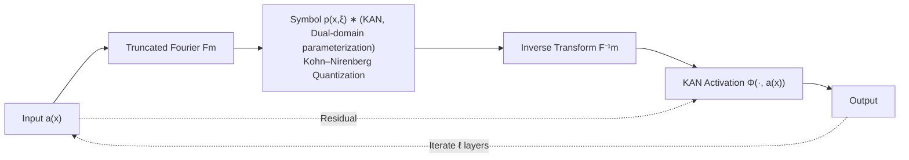

# KANO: Kolmogorov–Arnold Neural Operator

**Conference**: ICLR 2026  
**OpenReview**: [https://openreview.net/forum?id=2QmiKXfsIr](https://openreview.net/forum?id=2QmiKXfsIr)  
**Code**: TBD  
**Area**: Applied to Physical Sciences / Neural Operators  
**Keywords**: Neural Operators, KAN, Pseudo-differential operators, Symbolic Interpretability, Variable-coefficient PDEs, Quantum Hamiltonian Learning  

## TL;DR
KANO embeds KAN sub-networks into the pseudo-differential operator framework, jointly parameterizing the operator in both frequency and spatial bases. This breaks the pure spectral bottleneck of the Fourier Neural Operator (FNO), enabling robust generalization on variable-coefficient PDEs and allowing the learned operator to be read as closed-form symbolic formulas (coefficient accuracy up to four decimal places).

## Background & Motivation
**Background**: Operator learning utilizes neural networks to approximate mappings between infinite-dimensional function spaces $G:\mathcal{A}\to\mathcal{U}$, serving as a primary tool for data-driven modeling of physical dynamics (PDEs). FNO hard-codes the encoder as a truncated Fourier transform and learns latent mappings using diagonal kernels in the spectral domain; it has become a de facto standard for its speed and accuracy when target operators are sparse in the spectral domain.

**Limitations of Prior Work**: A major class of real-world problems involves **variable-coefficient PDEs**—where at least one coefficient varies with variables (especially position), referred to here as "position-dependent dynamics" (e.g., spatially varying viscous fluids, Schrödinger equations with position-dependent potentials). Such operators are **dense** in the spectral domain: for example, in the quantum harmonic oscillator $Ha=-\partial_{xx}a + x^2 a$, the differential term $-\partial_{xx}$ is a diagonal multiplier $\xi^2$ (sparse), but the multiplier term $x^2$ becomes a dense Toeplitz matrix in the spectral domain. Since FNO's spectral kernels are diagonal and cannot mix modes, it relies on non-linear activations to approximate these off-diagonal terms, which are tied to the training input distribution—this is the **pure spectral bottleneck of FNO**. Consequently, the model only converges on in-distribution mappings and fails outside the training distribution.

**Key Challenge**: Prior FNO variants (factorized/multi-scale spectral kernels, U-FNO/AM-FNO with local spatial kernels, etc.) still treat the **spectral basis as privileged**, failing to achieve optimal sparsity in the spatial basis. On the other hand, KAN-based operator networks (like DeepOKAN) have shown performance gains but have never reported **symbolic recovery** of the learned operators. There is a lack of an operator network that can simultaneously generalize robustly on variable-coefficient PDEs and provide symbolic interpretability.

**Goal**: To fill this gap by constructing an operator network with practical parameter complexity for general position-dependent dynamics and inherent symbolic interpretability.

**Core Idea**: Use **dual-domain parameterization where "each term is represented in its sparse basis"**—differential terms in the spectral domain and local multiplier terms in the spatial domain. This is integrated into a pseudo-differential operator framework using KAN sub-networks to carry readable univariate function edges, achieving both sparsity and symbolic readout.

## Method

### Overall Architecture
KANO follows the iterative layer structure of FNO $G_\theta^{\text{KANO}}=L^{(\ell)}_{\text{KANO}}\circ\cdots\circ L^{(1)}_{\text{KANO}}$, but **removes the signature wide lift-up/projection networks of FNO** (as wide KANs hinder symbolic recovery). Each KANO layer uses a KAN sub-network $p(x,\xi)$ as a **pseudo-differential symbol**, parameterized by both spatial $x$ and frequency $\xi$ bases; another KAN sub-network $\Phi$ serves as the learnable nonlinear activation. All computations perform symbolic calculus on the dual domains using Kohn–Nirenberg quantization.

### Key Designs

**1. Dual-domain Pseudo-differential Symbol $p(x,\xi)$: Placing each term in its sparse basis**. The KANO layer is defined as $L_{\text{KANO}}(a)(x)=\Phi\big(F^{-1}_m[\,p(x,\xi)*F_m(a)(\xi)\,](x),\,a(x)\big)$; note the convolution "$*$" instead of the diagonal multiplication "$\cdot$" in FNO. The key is that symbol $p(x,\xi)$ accepts both space and frequency: by Fourier duality, spatial terms manifest as differentials (convolutions) in the spectral domain, while spectral terms manifest as multipliers. Thus, the same $p$ can represent differential terms as $\xi^2$-type diagonals and multiplier terms as spatially sparse shift matrices $S^{(2)}_n$. For the quantum harmonic oscillator, KANO can precisely represent $H$ by taking $p(x,\xi)\approx x^2+\xi^2$, fundamentally bypassing the FNO dilemma where "dense Toeplitz must be approximated by activations and tied to training distributions."

**2. Kohn–Nirenberg Quantization: Rigorous symbolic calculus on dual domains**. Since $p(x,\xi)$ is joint in space and frequency, it cannot be simply multiplied pointwise in the frequency domain; it must be quantized across both domains. KANO employs Kohn–Nirenberg quantization to transform symbols into operators $\text{Op}_m(p):=F^{-1}_m[p(x,\xi)*F_m]$, calculated as the double sum $\frac{h}{L^d}\sum_{\xi\in\Xi}\sum_{y\in Y}e^{i(x-y)\cdot\xi}\,p(x,\xi)\,a(y)$. Although this introduces computational overhead from double summation, it is compensated by proven parameter efficiency for target operator classes (variable-coefficient PDEs). The reward is **theoretical independence from input constraints**: according to the Demanet–Ying quadrature bound, the projection error satisfies $\|G-\text{Op}_m(p_G)\|\le C\,B\,m^{-s}$. As long as the input has finite energy, the width $m$ scales polynomially with $\epsilon_{\text{proj}}$, whereas FNO requires rapid decay of Fourier tails and faces **superexponential** explosion of network size $N_{\text{net}}\sim O(\epsilon_{\text{net}}^{-\epsilon_{\text{proj}}^{-d/s}})$ for dense operators.

**3. Symbolic Interpretability via KAN Edges**. Because the symbol $p(x,\xi)$ and activation $\Phi$ are carried by compact KANs (where each edge is a visualizable univariate B-spline curve), the entire network can be inspected edge-by-edge. Symbolic regression can then be applied to the learned edges to extract closed-form formulas. After training convergence, these symbolic edges are frozen for fine-tuning, resulting in the **KANO symbolic** variant. It recovers the coefficients of the ground truth operator to the fourth decimal place on synthetic operators (e.g., $\tilde{G}_1 f=(x^2+0.0003)f-\partial_{xx}f$), with KANO and KANO symbolic showing comparable losses, proving KANO converges to solutions near the true operator.

**4. Q-KANO: Adaptation for Quantum State Evolution**. To learn long-term quantum dynamics, the symbol is parameterized in unitary form $p_\theta=\exp(-i\Delta T\,\phi_\theta(x,\xi))$, and the activation is changed to a complex exponential with a learnable phase. The full layer is $G^{\text{Q-KANO}}_\theta[\psi]=\text{Op}_m(\exp(-i\Delta T\,\phi_\theta(x,\xi)))\psi\cdot e^{-i\Delta T\vartheta}$, enabling Hamiltonian learning from projective measurement data while preserving physical structure (unitarity).

## Key Experimental Results

### Main Results (Synthetic Position-Dependent Operators, Relative $\ell_2$ Loss $\times10^{-4}$)

| Model (Params) | G1 A | G1 B | G1 B/A | G2 B/A | G3 B/A |
|---|---|---|---|---|---|
| FNO (566k) | 6.36 | 98.8 | 15.53 | 8.21 | 7.14 |
| U-FNO (579k) | 2.79 | 22.9 | 8.21 | 41.65 | 3.16 |
| AM-FNO (548k) | 1.08 | 20.9 | 19.35 | 13.75 | 25.69 |
| PDNO (538k) | 1.41 | 6.31 | 4.5 | 6.3 | 6.7 |
| **KANO (152)** | 1.04 | 1.44 | **1.38** | **1.19** | **1.03** |
| KANO symbolic | 0.512 | 0.526 | 1.03 | 1.00 | 1.03 |

*A=In-distribution training family, B=Unseen test family. B/A closer to 1 indicates steadier generalization.* Three operators: $G_1 f=x^2 f-\partial_{xx}f$, $G_2 f=x\partial_x f+\partial_{xx}f$, $G_3 f=f^3+x\partial_x f+\partial_{xx}f$. **KANO uses only 152 parameters (0.03% of FNO)** to achieve losses an order of magnitude lower and B/A near 1 (robust generalization), while FNO losses explode over 10x when exiting the training distribution.

### Ablation Study

| Variant | Description | Result |
|---|---|---|
| KANO MLP (2k) | Replace KAN sub-networks with compact MLPs | B/A≈1.8–2.0, still robustly generalizes → Generalization stems mainly from dual-domain architecture rather than KAN itself |
| PDNO | Pseudo-differential framework but uses MLP + retains wide networks | Most robust in the FNO family, but still inferior to KANO |
| U-FNO / AM-FNO | Spectral kernel + local enhancement | Counter-productively worse |

### Key Findings
- **Generalization stems from dual-domain architecture**: KANO MLP remains robust, indicating generalization is rooted in the pseudo-differential dual-domain design; symbolic interpretability is the "bonus" from KAN.
- **Symbolic Recovery**: KANO symbolic recovers true operator coefficients to the fourth decimal place (e.g., $\tilde{G}_3 f=1.0001 f^3+0.99997\,x\partial_x f+0.99997\,\partial_{xx}f-\dots$).
- **Interpolation tests confirm theory**: When interpolating between training family A and test family B over 100 steps, FNO loss increases slowly at first (indicating in-sample mapping is near truth) then spikes sharply (as it leaves the training distribution), consistent with Theorem 1/2. KANO remains stable throughout.
- **Quantum Long-term Benchmark** (Double-Well DW / Cubic Nonlinear Schrödinger Equation NLSE): Q-KANO trained on true wavefunctions achieves state infidelity $\approx 6.3\times10^{-6}$, four orders of magnitude lower than FNO ($\approx1.5\times10^{-2}$) trained on **ideal full wavefunctions**. Even using physically available position+momentum PMF (incomplete information) yields $\approx6.3\times10^{-6}$, whereas using only position PMF degrades to $4.7\times10^{-3}$ (DW), highlighting the importance of momentum for observable reconstruction.

## Highlights & Insights
- **"Representing each term in its sparse basis" is the core insight**: FNO's failure is not in approximation capacity (universal approximation still holds) but in **generalization**—forcing dense Toeplitz matrices into diagonal spectral kernels ties off-diagonal terms to the training distribution. Dual-domain sparsity decouples projection error $\epsilon_{\text{proj}}$ from network error $\epsilon_{\text{net}}$, breaking the superexponential scaling.
- **Solid Theory**: Lemma 1 + Theorem 1 prove that position operators stretch Fourier tails, leading to FNO's curse of dimensionality; Theorem 2 proves that for smooth KANO symbols, model size scales polynomially with precision.
- **Extreme Parameter Efficiency**: On synthetic benchmarks, KANO outperforms the FNO family (hundreds of thousands of parameters) with only 152 parameters. This "small and accurate" nature is critical for interpretable scientific modeling.
- **Paradigm Shift**: A shift from "universal approximation" to "universal generalization" in operator learning, quantifying for the first time symbolic recovery in operator learning via KAN.
- **Practical Value**: Quantum Hamiltonian learning can reconstruct closed-form Hamiltonians from projective measurements (physically measurable) rather than ideal full wavefunctions, which is highly attractive for experimental physics.

## Limitations & Future Work
- **Computational Cost**: Kohn–Nirenberg quantization requires double summation, making the layer computation-heavy. While authors claim this is offset by parameter efficiency for variable-coefficient PDEs, the cost remains an issue for general scenarios.
- **Removal of wide lift-up/projection networks** sacrifices performance on high-dimensional large-scale benchmarks. The authors explicitly position KANO as prioritizing "symbolic recovery + robust generalization" as a complement to FNO, leaving high-dimensional scaling for future work.
- **Symbolic recovery depends on smooth symbol assumptions**: For highly irregular coefficients, recent advances in KAN for non-smooth/discontinuous targets need to be integrated.

## Related Work & Insights
- **FNO and its variants** (U-FNO, AM-FNO, factorized/multi-scale FNO): All still privilege the spectral basis; KANO identifies the fundamental issue as the dense Toeplitz nature within a single spectral basis.
- **PDNO** (Shin et al. 2022): The first to use a pseudo-differential operator framework for neural operators, but assumed separable symbols $p(x,\xi)=p_x(x)\cdot p_\xi(\xi)$, used MLPs, and retained wide networks. KANO uses joint non-separable KAN symbols and eliminates wide networks to achieve symbolic recovery.
- **KAN Series** (Liu et al. 2024, DeepOKAN): Introduced KAN to scientific modeling/operator networks but did not report operator-level symbolic recovery; KANO is the first to quantify this.
- **Theoretical Foundations**: The polynomial scaling guarantee of KANO is synthesized from Fourier tail-determined projection errors (Kovachki et al. 2021), Kohn–Nirenberg quadrature bounds (Demanet–Ying 2011), and KAN expressivity bounds (Wang et al. 2024).

## Rating
- **Novelty**: ⭐⭐⭐⭐⭐ First to embed KAN into a pseudo-differential framework for dual-domain sparsity + operator-level symbolic recovery; theoretically resolves the pure spectral bottleneck of FNO.
- **Experimental Thoroughness**: ⭐⭐⭐⭐ Includes synthetic operators (with generalization/interpolation tests), quantum benchmarks, and multiple ablations; however, high-dimensional real-world PDEs and computational costs are not systematically evaluated.
- **Writing Quality**: ⭐⭐⭐⭐ Rigorous theoretical derivation; logic from motivation to bottleneck to method is smooth, though high formula density is demanding for readers.
- **Value**: ⭐⭐⭐⭐⭐ Robust and interpretable for variable-coefficient PDEs/Quantum Hamiltonian learning; parameter reduction to 0.03% of FNO is methodologically significant for Scientific AI.

<!-- RELATED:START -->

## Related Papers

- [\[ICLR 2026\] Initialization Schemes for Kolmogorov-Arnold Networks: An Empirical Study](initialization_schemes_for_kolmogorov-arnold_networks_an_empirical_study.md)
- [\[AAAI 2026\] Catastrophic Forgetting in Kolmogorov-Arnold Networks](../../AAAI2026/physics/catastrophic_forgetting_in_kolmogorov-arnold_networks.md)
- [\[AAAI 2026\] FlashKAT: Understanding and Addressing Performance Bottlenecks in the Kolmogorov-Arnold Transformer](../../AAAI2026/physics/flashkat_understanding_and_addressing_performance_bottlenecks_in_the_kolmogorov-.md)
- [\[AAAI 2026\] Learning Fair Representations with Kolmogorov-Arnold Networks](../../AAAI2026/physics/learning_fair_representations_with_kolmogorov-arnold_networks.md)
- [\[CVPR 2025\] KAC: Kolmogorov-Arnold Classifier for Continual Learning](../../CVPR2025/physics/kac_kolmogorov-arnold_classifier_for_continual_learning.md)

<!-- RELATED:END -->
