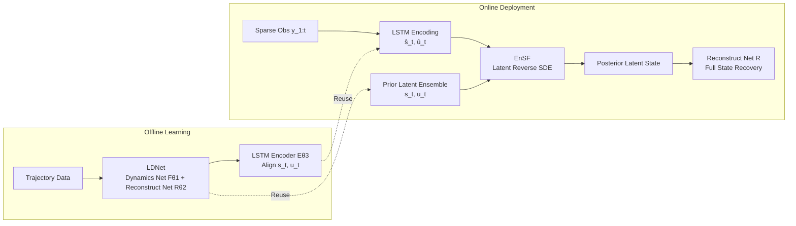

# LD-EnSF: Synergizing Latent Dynamics with Ensemble Score Filters for Fast Data Assimilation with Sparse Observations

**Conference**: ICLR 2026  
**OpenReview**: [https://openreview.net/forum?id=AWSVzzhbr7](https://openreview.net/forum?id=AWSVzzhbr7)  
**Code**: [https://github.com/pengpeng-xiao/ld-ensf](https://github.com/pengpeng-xiao/ld-ensf)  
**Area**: Data Assimilation / Scientific Computing / Score-based Filtering  
**Keywords**: Data Assimilation, Ensemble Score Filter, Latent Dynamics, LDNet, Sparse Observations, LSTM Encoder  

## TL;DR
LD-EnSF replaces expensive full-space numerical forward simulations with a learnable latent dynamics network (LDNet), migrates the Ensemble Score Filter (EnSF) entirely into an extremely low-dimensional latent space, and aligns sparse irregular observations using a history-aware LSTM encoder. This synergistically accelerates data assimilation by several orders of magnitude while maintaining high precision.

## Background & Motivation
**Background**: Data Assimilation (DA) tracks complex dynamical systems by integrating observational data into numerical models, widely used in weather forecasting, computational fluid dynamics, and sea ice modeling. Classical Bayesian filtering methods like Kalman Filter and Ensemble Kalman Filter (EnKF) are efficient but suffer from quadratic complexity and linear posterior assumptions in high-dimensional nonlinear systems. The score-based Ensemble Score Filter (EnSF) encodes probability density with linear complexity and no linearity assumptions, performing excellently on high-dimensional nonlinear problems like Lorenz 96 and quasi-geostrophic dynamics by solving reverse-time SDEs for posterior sampling.

**Limitations of Prior Work**: EnSF fails significantly under **sparse observations**—the likelihood gradient in unobserved regions is zero, causing score information to vanish. Latent-EnSF addresses this by projecting states and observations into a shared latent space via a coupled VAE, providing more informative gradients for the score filter even with only 0.44% of state components. However, after assimilation, **full-space numerical methods are still required to propagate the complete dynamics**, which is computationally expensive and difficult for real-time applications. Furthermore, the latent states of VAE are often oscillatory and non-smooth, making it hard to build stable surrogate dynamics models in the latent space.

**Key Challenge**: The tension lies between using full-space forward simulation (accurate but too slow for real-time) or surrogate models (fast but insufficient in accuracy and stability). The central problem is how to avoid full-space simulation while maintaining high precision under sparse noisy observations.

**Goal**: Construct a fast, robust, and accurate data assimilation method that operates entirely within a low-dimensional latent space without calling the original numerical simulator.

**Core Idea**: Use an improved **LDNet** to learn smooth, low-dimensional surrogate latent dynamics to replace full-space forward propagation, and an **LSTM encoder** to align historical sparse observations into this latent space. Then, perform Bayesian filtering by running EnSF in this unified latent space—a synergy of **Latent Dynamics (LD) + Ensemble Score Filter (EnSF)**.

## Method

### Overall Architecture
LD-EnSF consists of two phases: offline learning and online deployment. In the offline phase, LDNet is trained to capture latent dynamics (Phase 1), followed by training an LSTM encoder to map observation history $y_{1:t}$ to latent variables aligned with the latent state $s_t$ and parameter $u_t$ of LDNet (Phase 2). During the online phase, ensembles of prior latent pairs $\{s_t, u_t\}$ and latent observations $(\hat{s}_t, \hat{u}_t)$ encoded by the LSTM are fed into EnSF. The posterior latent states are obtained by solving the reverse SDE in the latent space, and the full state is finally reconstructed at any spatio-temporal point using the reconstruction network.

### Key Designs
**1. Improved LDNet as a Smooth Surrogate Latent Dynamics:** LDNet consists of a dynamics network $F_{\theta_1}$ (evolving latent states) and a reconstruction network $R_{\theta_2}$ (mapping latent states back to full states at arbitrary spatial points). Compared to VAE, it requires no separate encoder, has fewer parameters, and produces smoother latent states. The dynamics network outputs the time derivative of the latent state $\dot{s}_{t-1} = F_{\theta_1}(s_{t-1}, u_t)$, updated via a forward Euler step $s_t = s_{t-1} + \Delta t\, \dot{s}_{t-1}$. Three specific improvements were made: first, **shifting the initial latent state** by changing initialization from $s_0=0$ to $s_{-1}=0$ to accommodate varying initial conditions; second, **two-stage training**, where $F_{\theta_1}$ and $R_{\theta_2}$ are jointly trained to minimize reconstruction loss $L = \frac{1}{NMn}\sum_j\sum_t\sum_\xi \|\tilde{x}_j(t,\xi)-x_j(t,\xi)\|^2$, followed by fine-tuning the reconstruction net while fixing the latent representation; third, a **ResNet + Fourier encoding architecture** for the reconstruction net using $\xi \mapsto [\cos B\xi, \sin B\xi]$ ($B$ is trainable) to capture high-frequency spatial components, specifically for high-frequency dynamics like Kolmogorov turbulence. These updates allow LDNet to achieve lower relative RMSE than the original LDNet and VAE across all cases, while ensuring latent state smoothness—a prerequisite for latent observation alignment and temporal interpolation.

**2. History-Aware LSTM Observation Encoder:** The VAE encoder in Latent-EnSF can only handle single-step $t$ observations on regular grids and fails to exploit temporal correlations. This work utilizes a single-layer LSTM $E_{\theta_3}: \mathbb{R}^{d_y \times t} \to \mathbb{R}^{d_u+d_s}$ that takes historical observation sequences $y_{1:t}$ as input to output pairs $(\hat{s}_t, \hat{u}_t) = E_{\theta_3}(y_{1:t})$ that **simultaneously** approximate latent states and system parameters. This essentially learns a nonlinear delay embedding (Takens embedding) to compensate for extreme sparsity in single-step information using historical data. Furthermore, LSTMs naturally handle observations at arbitrary/irregular spatial locations. The training objective aligns the encoder output with the true latent states and parameters from LDNet: $L(\theta_3) = \frac{1}{Nn}\sum_j\sum_t (\|\hat{s}_t^{(j)} - s_t^{(j)}\|^2 + \|\hat{u}_t^{(j)} - u_t^{(j)}\|^2)$. This design enables the DA process to **jointly estimate uncertain parameters** $u_t$ (e.g., Reynolds number, earthquake location, forcing magnitude) alongside states, which is critical for error correction given LDNet's high sensitivity to parameters.

**3. Bayesian Filtering with EnSF in Latent Space:** Denoting the augmented latent state as $\kappa_t = (s_t, u_t)$ and the LSTM-encoded latent observation as $\phi_t = (\hat{s}_t, \hat{u}_t)$, the latent observation model is approximated as an identity mapping plus noise $\phi_t = \kappa_t + \hat{\gamma}_t$. The Bayesian filter proceeds in two steps: Prediction $P(\kappa_t|\phi_{1:t-1}) = \int P(\kappa_t|\kappa_{t-1}) P(\kappa_{t-1}|\phi_{1:t-1}) d\kappa_{t-1}$, where transition probabilities are given by the LDNet latent dynamics; and Update $P(\kappa_t|\phi_{1:t}) \propto P(\phi_t|\kappa_t) P(\kappa_t|\phi_{1:t-1})$. Since the entire pipeline remains in the latent space, the reverse-time SDE for EnSF is also solved there. **No mapping back to the full space is required during assimilation**—it only occurs in the final step for reconstruction. Combined with smooth latent trajectories, this also allows for interpolation and reconstruction at any continuous time point, not limited to observation timestamps.

## Key Experimental Results
Three high-dimensional examples of increasing complexity were tested: Kolmogorov flow ($150\times150$, uncertain Reynolds number), Tsunami shallow water waves ($150\times150$, uncertain initial bump position), and atmospheric modeling ($512\times256$, uncertain forcing term, spatial sparsity ~0.1%, temporal sparsity ~0.2%).

### Surrogate Model Accuracy (Relative RMSE, Time-Averaged)

| Case | VAE | VAE-dyn | LDNet (Original) | LDNet (Ours) |
|------|-----|---------|--------------|--------------|
| Kolmogorov | 0.0131 | 0.964 | 0.0349 | **0.0123** |
| Tsunami | 0.0309 | 1.33 | 0.1837 | **0.0168** |
| Atmospheric | 0.0856 | 0.483 | 0.1042 | **0.0656** |

VAE-dyn (VAE+LSTM for latent dynamics) shows instability and rapid error accumulation in long-term predictions. The original LDNet fails to capture varying initial conditions in the tsunami case and has high errors for Kolmogorov high-frequency components. Ours is superior across all three cases.

### DA Accuracy and Computational Cost
- **Accuracy**: Under 10% observation noise, full-space methods like EnSF and LETKF fail in high-dimensional sparse scenarios (EnSF due to uninformative gradients, LETKF due to CFL numerical instability). Latent-EnSF-dyn degrades due to limited forward accuracy. **LD-EnSF achieves the smallest assimilation error**, maintaining approximately **5% relative RMSE** even in the extreme atmospheric sparsity scenario.
- **Acceleration**: Compared to method involving full dynamical evolution, LD-EnSF evolves only surrogate latent dynamics, achieving speedups of approximately $2\times10^5$, $4\times10^3$, and $5\times10^5$ times ($T_d$). Latent dimensions are only **10 / 12 / 52**, significantly lower than Latent-EnSF's **400 / 400 / 512**, further reducing assimilation time. Since it does not require step-by-step decoding back to the full state, it also saves additional reconstruction time $T_r$.

## Key Findings
- Latent states of LDNet are **significantly smoother** than VAE, which is the fundamental reason latent observations can be accurately matched and why temporal interpolation is supported.
- Joint estimation of parameters $u_t$ is necessary: LDNet is highly sensitive to parameters, and correcting them during assimilation is required to maintain long-term accuracy.

## Highlights & Insights
- **Synergetic Loop of "Surrogate Dynamics + Score Filter"**: Previous latent space assimilation (Latent-EnSF) only moved "sampling" to the latent space while keeping "forward propagation" in the full space. This work unifies both in the same low-dimensional space, fundamentally eliminating full-space simulation, which is the true source of multi-order magnitude acceleration.
- **Smoothness is an Underestimated Critical Variable**: The true advantage of LDNet over VAE is not just low dimensionality, but the smoothness of latent trajectories—smoothness directly determines whether sparse observations can be aligned and whether temporal interpolation is feasible.
- **Turning "Parameter Sensitivity" into a Lever**: While LDNet's sensitivity to parameters is normally a liability, the authors leverage online parameter estimation during DA to turn it into a corrective mechanism, making it highly suitable for assimilation tasks.

## Limitations & Future Work
- Experiments primarily used static or slowly varying parameters $u(t)$. If parameters change abruptly, explicit parameter dynamics $u_{t+1}=F_u(u_t)$ may need to be learned, which was not fully validated.
- The method relies on offline training of LDNet and LSTM, requiring sufficient high-quality trajectory data. Offline costs and generalization to out-of-distribution initial conditions/parameters require further investigation.
- Latent observation noise $\hat{\gamma}_t$ is estimated via LSTM encoding of real noise; the effectiveness of this approximation under more complex noise structures remains to be tested.

## Related Work & Insights
- **EnSF** (Bao et al., 2024): Score-based ensemble filter with linear complexity but vanishing gradients under sparse observations—the direct predecessor this work addresses.
- **Latent-EnSF** (Si & Chen, 2025): Uses coupled VAE to alleviate sparsity, but forward propagation remains in full space and latent states are non-smooth—the direct baseline and target for improvement.
- **LDNet** (Regazzoni et al., 2024): Surrogate model that jointly learns smooth latent representations and temporal evolution without an independent encoder. This work improves it in initialization, training strategies, and architecture.
- **Insight**: When "sampling/inference" and "dynamical propagation" are decoupled into different spaces, it usually creates a computational bottleneck. Unifying the entire Bayesian filtering pipeline into a smooth, low-dimensional, learnable latent space is an effective paradigm for balancing speed and accuracy, transferable to other scientific computing scenarios requiring real-time inversion.

## Rating
- **Novelty**: ⭐⭐⭐⭐ — Unifying LDNet surrogate dynamics with latent-space EnSF and using LSTM for joint state-parameter estimation represents a substantial improvement over Latent-EnSF.
- **Experimental Thoroughness**: ⭐⭐⭐⭐ — Evaluated on three physical systems of increasing complexity against EnSF/Latent-EnSF/LETKF/4DEnVar, covering both accuracy and computational cost, with extensive ablations.
- **Writing Quality**: ⭐⭐⭐⭐ — Clear motivation, well-structured framework diagrams, and complete presentation of algorithms and logic.
- **Value**: ⭐⭐⭐⭐ — The orders of magnitude acceleration make real-time DA under high-dimensional sparse observations possible, with significant implications for weather, ocean, and atmospheric sciences.

<!-- RELATED:START -->

## Related Papers

- [\[ICML 2026\] From Geometry to Dynamics: Learning Overdamped Langevin Dynamics from Sparse Observations with Geometric Constraints](../../ICML2026/physics/from_geometry_to_dynamics_learning_overdamped_langevin_dynamics_from_sparse_obse.md)
- [\[ICLR 2026\] VisionLaw: Inferring Interpretable Intrinsic Dynamics from Visual Observations via Bilevel Optimization](visionlaw_inferring_interpretable_intrinsic_dynamics_from_visual_observations_vi.md)
- [\[ICLR 2026\] Incomplete Data, Complete Dynamics: A Diffusion Approach](incomplete_data_complete_dynamics_a_diffusion_approach.md)
- [\[AAAI 2026\] Fast 3D Surrogate Modeling for Data Center Thermal Management](../../AAAI2026/physics/fast_3d_surrogate_modeling_for_data_center_thermal_management.md)
- [\[ICLR 2026\] Fast training of accurate physics-informed neural networks without gradient descent](fast_training_of_accurate_physics-informed_neural_networks_without_gradient_desc.md)

<!-- RELATED:END -->
