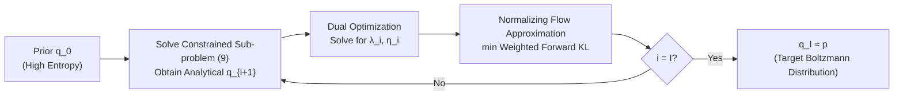

# Learning Boltzmann Generators via Constrained Mass Transport

**Conference**: ICLR 2026  
**OpenReview**: [https://openreview.net/forum?id=MQmrcX5jnk](https://openreview.net/forum?id=MQmrcX5jnk)  
**Code**: To be confirmed  
**Area**: Probabilistic Methods / Sampling / Boltzmann Generators / Molecular Simulation  
**Keywords**: Boltzmann generator, variational sampling, annealing path, trust-region constraint, entropy constraint, normalizing flows  

## TL;DR
Addressing the common issues of "mass teleportation" and mode collapse in geometric annealing paths during Boltzmann generator training, this work proposes **Constrained Mass Transport (CMT)**. By decomposing direct reverse KL minimization into a sequence of sub-optimization problems that constrain both the KL divergence between adjacent distributions and the entropy decay rate, CMT automatically induces smoother annealing paths. This results in an effective sample size (ESS) over 2.5x higher than SOTA methods without mode collapse.

## Background & Motivation
**Background**: Sampling from high-dimensional, multi-modal unnormalized distributions $p(x)=\tilde p(x)/Z$ is a core challenge in scientific computing and machine learning, where the normalization constant $Z=\int \tilde p(x)\,\mathrm dx$ is intractable. Molecular Boltzmann Generators (BGs) are typical examples, targeting the distribution $\tilde p(x)=\exp(-E(x)/k_BT)$ to efficiently sample thermodynamic ensembles and bypass expensive Molecular Dynamics (MD) simulations.

**Limitations of Prior Work**: Direct minimization of the reverse KL divergence $D_{\mathrm{KL}}(q\|p)$ prone to **mode collapse**, where low-probability modes of the target distribution are ignored. To alleviate this, common practices involve constructing a sequence of intermediate distributions from a prior $q_0$ to the target $p$, typically via geometric annealing paths $q_i\propto q_0^{1-\beta_i}\tilde p^{\beta_i}$. However, geometric annealing suffers from two persistent issues: (1) **mass teleportation**—where large probability mass suddenly shifts between steps to regions where the current density is nearly zero, blocking effective transport; (2) performance is highly dependent on labor-intensive manual tuning of the annealing schedule.

**Key Challenge**: Fixed geometric annealing paths have a rigid shape, failing to simultaneously ensure "sufficient overlap between adjacent distributions" and "avoidance of premature convergence," while schedules remain difficult to tune.

**Goal**: Design a variational framework capable of **automatic scheduling** and active control of the path shape to train large-molecule BGs using only energy evaluations (without MD samples).

**Key Insight** (**Constrained Annealing**): Inspired by trust-region ideas in reinforcement learning, this work splits a single reverse KL minimization into a sequence of constrained sub-problems. By using trust-region constraints to limit the KL between adjacent distributions (ensuring overlap and enabling auto-scheduling) and entropy constraints to limit the rate of entropy decay (preventing mass teleportation and premature convergence), a family of controllable annealing paths between "geometric" and "temperature" types is derived.

## Method

### Overall Architecture
CMT replaces the direct jump "from $q_0$ to $p$" with a sequence of constrained variational sub-problems. Each step yields an intermediate density $q_{i+1}$ in analytical form, where the sequence $(q_i)$ naturally forms an annealing path from the prior to the target. Since the analytical $q_{i+1}$ cannot be sampled directly, a normalizing flow $\hat q_i$ approximates it via weighted forward KL minimization, leveraging samples from the previous step via a replay buffer to iteratively approach $q_I\approx p$.

### Key Designs

**1. Trust-Region Constraint: Auto-scheduled Geometric Annealing Paths** The first component decomposes the global $\min_q D_{\mathrm{KL}}(q\|p)$ into iterative sub-problems $q_{i+1}=\arg\min_q D_{\mathrm{KL}}(q\|p)\ \text{s.t.}\ D_{\mathrm{KL}}(q\|q_i)\le\varepsilon_{\mathrm{tr}}$, requiring the KL divergence between the new and previous distributions to stay within the trust-region radius $\varepsilon_{\mathrm{tr}}$. Due to the convexity of KL, the constraint is active for all but the final step, ensuring $q_I=p$ in finite steps $I$. Solving the Lagrangian relaxation $L_{\mathrm{tr}}=D_{\mathrm{KL}}(q\|p)+\lambda(D_{\mathrm{KL}}(q\|q_i)-\varepsilon_{\mathrm{tr}})$ yields the analytical optimal density $q_{i+1}(x)\propto q_i(x)^{\frac{\lambda}{1+\lambda}}\tilde p(x)^{\frac{1}{1+\lambda}}$. This recovers the geometric annealing path, but the exponent $\beta_i$ is determined automatically by the trust region—**the schedule is no longer manually tuned** but derived from the physical constraint of "maintaining fixed overlap." The optimal multiplier $\lambda_i$ is obtained by maximizing the concave dual function $g_{\mathrm{tr}}(\lambda)=-(1+\lambda)\log Z_{i+1}(\lambda)-\lambda\varepsilon_{\mathrm{tr}}$.

**2. Entropy Constraint: Suppressing Premature Convergence** Trust regions alone still exhibit the mass teleportation of geometric paths. The second component constrains the entropy decay rate: $q_{i+1}=\arg\min_q D_{\mathrm{KL}}(q\|p)\ \text{s.t.}\ H(q_i)-H(q)\le\varepsilon_{\mathrm{ent}}$, where $H(q)=-\int q\log q$. The analytical solution is a temperature annealing path $q_{i+1}(x)\propto\tilde p(x)^{\frac{1}{1+\eta}}$, equivalent to "cooling" along the temperature direction where each step's entropy drop is capped by $\varepsilon_{\mathrm{ent}}$, preventing collapse into a single mode. Unlike RL which constrains **absolute entropy**, CMT constrains **relative entropy change**, requiring no prior knowledge of the target entropy—crucial for sampling tasks. However, it lacks overlap control; if $H(q_0)\gg H(p)$, the KL between $q_0$ and $q_1$ could be arbitrarily large, leading to instability.

**3. Mixed Constraints: Balancing Overlap and Anti-Collapse** Combining both into a single sub-problem $q_{i+1}=\arg\min_q D_{\mathrm{KL}}(q\|p)\ \text{s.t.}\ D_{\mathrm{KL}}(q\|q_i)\le\varepsilon_{\mathrm{tr}},\ H(q_i)-H(q)\le\varepsilon_{\mathrm{ent}}$ introduces two multipliers $\lambda,\eta$. The analytical optimal density becomes a geometric-temperature hybrid: $q_{i+1}(x)\propto q_i(x)^{\frac{\lambda}{1+\lambda+\eta}}\tilde p(x)^{\frac{1}{1+\lambda+\eta}}$. The trust-region component ensures the KL between $q_0$ and $q_1$ remains within $\varepsilon_{\mathrm{tr}}$ even when $H(q_0)\gg H(p)$, while the entropy component suppresses mass teleportation and premature convergence. Solving for $\lambda_i, \eta_i$ requires convex optimization over a concave 2D dual $g_{\mathrm{tr\text-ent}}(\lambda,\eta)=-(1+\lambda+\eta)\log Z_{i+1}(\lambda,\eta)-\lambda\varepsilon_{\mathrm{tr}}-\eta(H(q_i)-\varepsilon_{\mathrm{ent}})$, which is extremely efficient (taking ~0.01% of total training time for alanine dipeptide).

**4. NF Approximation + Importance Weighted Forward KL** Since the analytical $q_{i+1}$ cannot be directly sampled, it is approximated by a normalizing flow family $Q_{\mathrm{NF}}=\{f_\#q_z\}$. Crucially, **importance-weighted forward KL** is used: $D_{\mathrm{KL}}(q_{i+1}\|q)=\mathbb E_{x\sim q_i}\big[\tfrac{q_{i+1}(x)}{q_i(x)}\log\tfrac{q_{i+1}(x)}{q(x)}\big]$. Forward KL strongly penalizes underestimating the support, mechanically **encouraging mode coverage and suppressing collapse**. Because $q_{i+1}$ has a closed-form solution, the importance weights $q_{i+1}/q_i$ depend only on $q_i$ and $\tilde p$, allowing reuse of samples from $q_i$ via a replay buffer to improve sample efficiency. Furthermore, the trust-region constraint keeps the variance of importance weights nearly constant and **independent of dimension $d$**. The normalization constant $Z_{i+1}$ is estimated via low-variance Monte Carlo under $q_i$: $Z_{i+1}(\lambda,\eta)=\mathbb E_{x\sim q_i}\big[(\tilde p(x)/q_i(x)^{1+\eta})^{\frac{1}{1+\lambda+\eta}}\big]$, making the algorithm highly scalable.

## Key Experimental Results

### Main Results
Comparing SOTA variational sampling methods (FAB, TA-BG) across four molecular systems. Metrics include Target energy evaluations (Target evals↓), Evidence Upper Bound (EUBO↓, lower is better to detect collapse), Reverse Effective Sample Size (ESS↑), and Total Variation distance of Ramachandran plots vs. MD (Ram TV↓). Forward KL represents a baseline trained with ground-truth MD samples.

| System | Method | Target evals↓ | EUBO↓ | ESS [%]↑ | Ram TV↓ |
|------|------|---------------|-------|----------|---------|
| Alanine dipeptide (d=60) | FAB | 2.13×10⁸ | −174.98 | 94.80 | 1.03×10⁻² |
|  | TA-BG | 1×10⁸ | −174.99 | 95.76 | 1.24×10⁻² |
|  | **CMT (Ours)** | 1×10⁸ | **−175.00** | **97.69** | **9.43×10⁻³** |
| Alanine tetrapeptide (d=120) | FAB | 2.13×10⁸ | −333.93 | 63.59 | 3.10×10⁻² |
|  | TA-BG | 1×10⁸ | −333.99 | 65.81 | 1.53×10⁻² |
|  | **CMT (Ours)** | 1×10⁸ | **−334.00** | **68.60** | **1.43×10⁻²** |
| Alanine hexapeptide (d=180) | FAB | 4.2×10⁸ | −532.98 | 14.55 | 6.43×10⁻² |
|  | TA-BG | 4×10⁸ | −533.43 | 18.22 | 2.59×10⁻² |
|  | **CMT (Ours)** | 4×10⁸ | **−533.51** | **29.63** | **2.48×10⁻²** |
| ELIL tetrapeptide (d=219) | FAB | 8.43×10⁸ | −276.67 | 7.21 | 7.54×10⁻² |
|  | TA-BG | 8×10⁸ | −277.40 | 13.75 | 2.54×10⁻² |
|  | **CMT (Ours)** | 8×10⁸ | **−277.83** | **26.06** | 3.13×10⁻² |

### Ablation Study
The paper analyzes the two types of constraints and the impact of the trust-region radius $\varepsilon_{\mathrm{tr}}$ across dimensions in Appendix B. Core conclusions:

| Constraint Config | Annealing Path | Observation |
|----------|----------|------|
| Linear schedule only | Geometric (Naive) | Irregular scheduling |
| Trust-region only (2) | Geometric (Auto) | Fixes scheduling, but still exhibits **mass teleportation** |
| Entropy only (7) | Temperature | Prevents teleportation, but insufficient overlap with $q_0$ |
| **Trust-region + Entropy (9)** | Geometric-Temperature | **Maintains overlap while preventing teleportation** |

### Key Findings
- **Substantial ESS Lead**: ESS increased from 13.75% (TA-BG) to 26.06% (~1.9x) on ELIL and from 18.22% to 29.63% (~1.6x) on hexapeptide, overall yielding "2.5x+ higher ESS" relative to SOTA.
- **No Mode Collapse**: Lowest EUBO across all systems and Ramachandran distributions closest to MD ground truth, validating the efficacy of forward KL + constrained paths.
- **Scalability to Large Systems**: The new ELIL tetrapeptide (d=219) benchmark represents the largest and most complex side-chain interaction system studied under the "energy-evaluation-only" setting to date.
- **Efficiency**: CMT outperforms baselines with equal or fewer target energy evaluations (e.g., dipeptide 1×10⁸ vs FAB 2.13×10⁸).

## Highlights & Insights
- **Endogenizing Annealing Paths**: Rather than being external hyperparameters, annealing schedules in CMT arise as a byproduct of satisfying local distribution constraints. Theorem 2.4 provides a unified characterization of geometric, temperature, and hybrid paths.
- **Relative Entropy Decay**: Using relative instead of absolute entropy decay sidesteps the problem of unknown target entropy in sampling tasks, a key adaptation from RL.
- **Variance Control via Trust Regions**: Constraining adjacent KL not only ensure overlap but also stabilizes importance weight variance at a dimension-independent level, naturally extending to high-dimensional molecules.
- **Analytical Intermediate Densities as Engineering Pivot**: Closed-form solutions for $q_{i+1}$ make importance weights, normalization constants, and replay buffers computationally cheap to evaluate.

## Limitations & Future Work
- **NF Expressivity Bottleneck**: Regardless of the quality of $q_{i+1}$, the final approximation is limited by the normalizing flow's capacity; insufficient capacity still leads to mode loss.
- **Hyperparameter Shift**: While scheduling is automatic, $\varepsilon_{\mathrm{tr}}$ and $\varepsilon_{\mathrm{ent}}$ still require selection based on system dimensionality (analyzed in Appendix).
- **Fixed Steps vs. Stopping Criteria**: Theoretically, $\lambda=\eta=0$ signifies convergence, but experiments used fixed steps for fair budget comparison; the practical utility of adaptive stopping remains unverified.
- **Energy Evaluation Cost**: For DFT-level accuracy, $E(x)$ evaluations are expensive; while CMT reduces the number of evaluations, absolute costs remain constrained by the energy function's properties.
- **Outlook**: The framework is open to different approximation families $Q$ (e.g., diffusion models) and divergences $D$. Extension to larger proteins and temperature-transfer settings are natural next steps.

## Related Work & Insights
- **Boltzmann Generators**: Founded by Noé et al. (2019). Energy-only training includes flow-based (FAB, TA-BG) and diffusion-based methods, the latter currently trailing flows in molecular tasks due to collapse. CMT leads the flow-based camp.
- **Constrained Optimization / Trust Region**: Originates from RL trust-region ideas (TRPO, Schulman 2015). Blessing et al. (2025) first linked trust regions to geometric annealing in path-space measures for stochastic optimal control; CMT generalizes this to sampling with added entropy constraints.
- **Improved Annealing Paths**: Compared to AIS/SMC geometric paths, moment-averaging, or deformed-log paths, CMT offers a new perspective through constraint-induced paths.
- **Inspiration**: Decomposing "hard-to-optimize global divergences" into "locally constrained sub-problem sequences" is a general paradigm applicable to variational inference and other generative modeling scenarios with difficult scheduling.

## Rating
- **Novelty**: ⭐⭐⭐⭐⭐ Unifies trust-region and entropy constraints into annealing path theory (Theorem 2.4) and solves the target entropy knowledge requirement.
- **Experimental Thoroughness**: ⭐⭐⭐⭐ Solid results across four systems plus ELIL, multiple metrics, and ablation studies. Some details are relegated to appendices.
- **Writing Quality**: ⭐⭐⭐⭐ Logical progression from motivation to analytical solutions; Figure 1 effectively visualizes path differences.
- **Value**: ⭐⭐⭐⭐⭐ Training large-molecule BGs via energy evaluation alone is high-value; 2.5x+ ESS improvement has significant implications for molecular simulation and drug discovery.

<!-- RELATED:START -->

## Related Papers

- [\[ICLR 2026\] Physics-Constrained Fine-Tuning of Flow-Matching Models for Generation and Inverse Problems](physics-constrained_fine-tuning_of_flow-matching_models_for_generation_and_inver.md)
- [\[ICML 2025\] Universal Neural Optimal Transport](../../ICML2025/physics/universal_neural_optimal_transport.md)
- [\[NeurIPS 2025\] Neural Deprojection of Galaxy Stellar Mass Profiles](../../NeurIPS2025/physics/neural_deprojection_of_galaxy_stellar_mass_profiles.md)
- [\[ICML 2026\] Teaching Molecular Dynamics to a Non-Autoregressive Ionic Transport Predictor](../../ICML2026/physics/teaching_molecular_dynamics_to_a_non-autoregressive_ionic_transport_predictor.md)
- [\[NeurIPS 2025\] FEAT: Free Energy Estimators with Adaptive Transport](../../NeurIPS2025/physics/feat_free_energy_estimators_with_adaptive_transport.md)

<!-- RELATED:END -->
